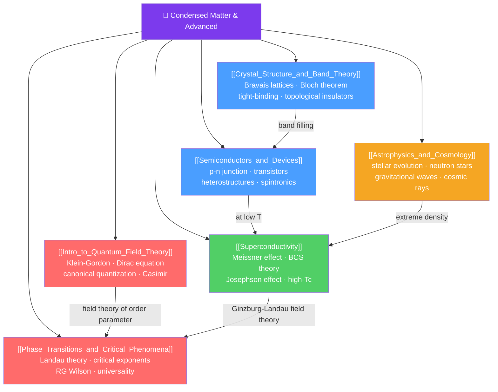

# 💎 Condensed Matter and Advanced Physics — Map of Content

> [!abstract] What This Section Covers
> Condensed matter physics studies the collective behavior of many-body quantum systems — solids, liquids, and exotic states like superconductors and topological insulators. This section opens with crystal structure and band theory (why some materials conduct and others don't), moves through semiconductors and superconductivity, then ascends to quantum field theory, phase transitions, and astrophysics. These are the deepest and most modern topics in the vault: from the band theory that underlies your smartphone's transistors to the renormalization group that underlies our understanding of critical phenomena, and from Hawking radiation to neutron star physics.

## Concept Map

## Learning Path
1. [[Crystal_Structure_and_Band_Theory]] — How atoms arrange in solids (lattices, Brillouin zones), and how quantum mechanics produces energy bands and gaps (Bloch's theorem, tight-binding).
2. [[Semiconductors_and_Devices]] — How band filling determines conductivity; the physics of p-n junctions, transistors, and modern quantum devices.
3. [[Superconductivity]] — Zero resistance below $T_c$; Meissner effect; BCS pairing theory; Josephson junctions and applications.
4. [[Intro_to_Quantum_Field_Theory]] — QM + SR = QFT; fields as fundamental; Klein-Gordon and Dirac equations; canonical quantization.
5. [[Phase_Transitions_and_Critical_Phenomena]] — Order parameters, universality, critical exponents, the renormalization group.
6. [[Astrophysics_and_Cosmology]] — Stellar physics, compact objects (white dwarfs, neutron stars, black holes), gravitational waves, cosmic rays.

## All Notes at a Glance
| Note | Difficulty | What You'll Learn |
|------|------------|-------------------|
| [[Crystal_Structure_and_Band_Theory]] | Secondary → PhD | Bravais lattices, reciprocal lattice, Bloch theorem, tight-binding, DFT band calculations, topological insulators |
| [[Semiconductors_and_Devices]] | Secondary → PhD | Carrier statistics, p-n junction, transistors (BJT, MOSFET), heterostructures, quantum wells, spintronics |
| [[Superconductivity]] | Secondary → PhD | Zero resistance, Meissner effect, Type I/II, BCS Cooper pairs, Josephson effect, high-$T_c$, topological SC |
| [[Intro_to_Quantum_Field_Theory]] | Undergraduate → PhD | Klein-Gordon, Dirac, spin-statistics, canonical quantization, path integral, renormalization, Casimir effect |
| [[Phase_Transitions_and_Critical_Phenomena]] | Undergraduate → PhD | Landau theory, Ising model, critical exponents, universality, Wilson RG, $\epsilon$-expansion, CFT |
| [[Astrophysics_and_Cosmology]] | Secondary → PhD | Stellar structure, HR diagram, stellar endpoints, TOV equation, pulsars, gravitational waves, AGN |

## Key Questions This Section Answers
- Why do metals conduct and insulators don't, even though both have electrons?
- What happens at the event horizon of a superconductor (the Meissner effect)?
- How do Cooper pairs form and why do they condense at $T_c$?
- What is a quantum field, and why are particles just excitations of fields?
- Why do completely different systems (magnets, liquid-gas, binary mixtures) have the same critical exponents?
- What is a neutron star, and how do we detect one from Earth?

## Related Sections
- [[_MOC_Physics_Master|↑ Physics Master MOC]]
- [[_MOC_Quantum_Mechanics|← Quantum Mechanics]]
- [[_MOC_Relativity|← Special and General Relativity]]
- [[_MOC_Nuclear_Particle_Physics|← Nuclear and Particle Physics]]

#MOC #physics #condensed-matter #quantum-field-theory #phase-transitions #astrophysics
