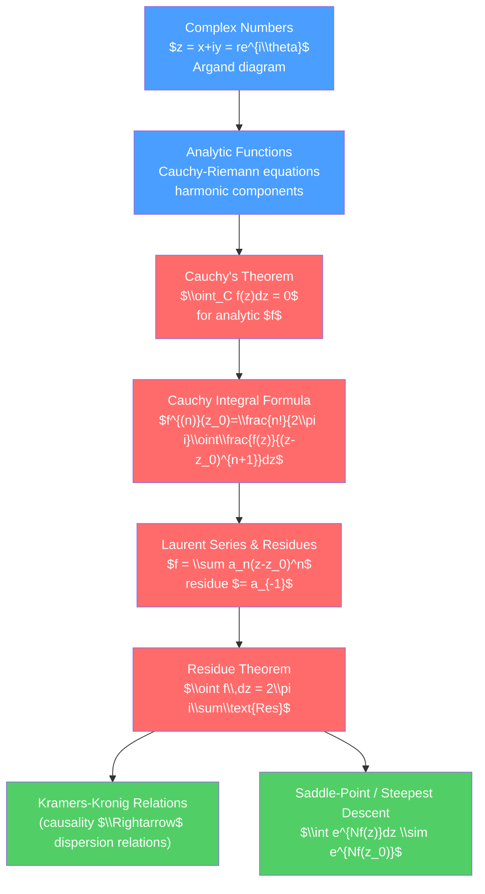

# 🔄 Complex Analysis for Physics

> [!abstract] TL;DR
> Complex analysis extends calculus to functions of a complex variable, and in doing so unlocks some of the most elegant tools in theoretical physics: the residue theorem turns hard real integrals into simple arithmetic, analytic continuation reveals hidden structure in special functions and quantum amplitudes, Kramers-Kronig relations connect real and imaginary parts of response functions via causality, and the saddle-point approximation gives asymptotic evaluations of path integrals and partition functions.

## Intuition — analogy FIRST

Analytic functions are the "most rigid" functions in mathematics — knowing them on any arc, no matter how small, determines them everywhere on their domain. This rigidity is why complex analysis is so powerful: you can deform contours of integration at will, picking up residues (simple pole contributions) along the way, and the final answer is independent of how you deformed the path. It is like paying a toll — you can choose any road around the obstacle, but the toll (residue) is fixed.

---

## How It Works



---

## Key Concepts / Details

### Secondary Level

A complex number $z = x + iy$ has real part $x$ and imaginary part $y$. In polar form: $z = r e^{i\theta}$ with $r = |z|$ and $\theta = \arg z$.

**Euler's formula** is the most beautiful identity in mathematics:
$$e^{i\theta} = \cos\theta + i\sin\theta \implies e^{i\pi} + 1 = 0$$

The complex conjugate $z^* = x - iy$ satisfies $|z|^2 = zz^*$. Complex numbers can be plotted in the Argand plane (Gauss plane): real axis horizontal, imaginary axis vertical. Multiplication by $e^{i\theta}$ rotates by angle $\theta$; multiplication by $r$ scales by $r$.

De Moivre's theorem: $(e^{i\theta})^n = e^{in\theta}$, giving $\cos(n\theta) = \text{Re}(e^{in\theta})$.

### Undergraduate Level

**Analytic Functions and Cauchy-Riemann Equations**

$f(z) = u(x,y) + iv(x,y)$ is analytic (holomorphic) at $z_0$ if the complex derivative $f'(z_0) = \lim_{\Delta z\to 0}(f(z_0+\Delta z)-f(z_0))/\Delta z$ exists independently of the direction of $\Delta z\to 0$.

This requires the *Cauchy-Riemann equations*:
$$\frac{\partial u}{\partial x} = \frac{\partial v}{\partial y}, \qquad \frac{\partial u}{\partial y} = -\frac{\partial v}{\partial x}$$

A consequence: both $u$ and $v$ satisfy Laplace's equation $\nabla^2 u = 0$, $\nabla^2 v = 0$ — analytic functions have harmonic real and imaginary parts.

**Cauchy's Integral Theorem and Formula**

For $f$ analytic inside and on a simple closed curve $C$:
$$\oint_C f(z)\,dz = 0 \quad \text{(Cauchy's theorem)}$$

And the integral representation (Cauchy's integral formula):
$$f^{(n)}(z_0) = \frac{n!}{2\pi i}\oint_C \frac{f(z)}{(z-z_0)^{n+1}}\,dz$$

This is remarkable: the values of $f$ at interior points are entirely determined by values on the boundary, and all derivatives exist automatically.

**Taylor and Laurent Series; Poles and Residues**

Every analytic function has a Taylor series $f(z) = \sum_{n=0}^\infty a_n(z-z_0)^n$ around any regular point.

Around a singularity at $z_0$, the Laurent series is:
$$f(z) = \sum_{n=-\infty}^\infty a_n(z-z_0)^n$$

If the series terminates at $n = -m$ (finitely many negative powers), $z_0$ is a *pole of order* $m$. The *residue* is $\text{Res}[f,z_0] = a_{-1}$.

For a simple pole: $\text{Res}[f,z_0] = \lim_{z\to z_0}(z-z_0)f(z)$.
For a pole of order $m$: $\text{Res}[f,z_0] = \frac{1}{(m-1)!}\lim_{z\to z_0}\frac{d^{m-1}}{dz^{m-1}}\left[(z-z_0)^m f(z)\right]$.

**The Residue Theorem**

$$\oint_C f(z)\,dz = 2\pi i\sum_k \text{Res}[f, z_k]$$

where the sum is over all poles inside $C$ (counterclockwise). This converts real integrals into residue calculations.

*Example*: $\displaystyle\int_{-\infty}^\infty \frac{dx}{1+x^2}$. Close the contour in the upper half-plane (Jordan's lemma: the semicircle at infinity contributes 0 for $|f|\to 0$). The only pole inside is $z=i$ with $\text{Res}[f,i] = 1/(2i)$. Result: $2\pi i \cdot \frac{1}{2i} = \pi$. ✓

*Example*: Gaussian integral using complex analysis:
$$\int_{-\infty}^\infty e^{-x^2}dx = \sqrt{\pi}$$
(via the trick of squaring and using polar coordinates, combined with analytic continuation to show $\int e^{-z^2}$ on any parallel contour gives the same result).

### Graduate Level

**Dispersion Relations and Kramers-Kronig**

For a causal linear response function $\chi(t) = 0$ for $t<0$, the Fourier transform $\tilde{\chi}(\omega)$ is analytic in the upper half-plane. By Cauchy's theorem on the real axis (principal value):

$$\text{Re}\,\tilde{\chi}(\omega) = \frac{1}{\pi}\,\mathcal{P}\int_{-\infty}^\infty \frac{\text{Im}\,\tilde{\chi}(\omega')}{\omega'-\omega}\,d\omega'$$
$$\text{Im}\,\tilde{\chi}(\omega) = -\frac{1}{\pi}\,\mathcal{P}\int_{-\infty}^\infty \frac{\text{Re}\,\tilde{\chi}(\omega')}{\omega'-\omega}\,d\omega'$$

These are the *Kramers-Kronig relations*: causality alone implies that the absorptive (imaginary) and dispersive (real) parts of the response are related. Applied to the dielectric function $\epsilon(\omega)$, refractive index, and scattering amplitudes.

**Saddle-Point Approximation (Method of Steepest Descent)**

For large parameter $N$:
$$I = \int_\mathcal{C} e^{N f(z)}\,dz$$

deform the contour to pass through the saddle point $z_0$ where $f'(z_0)=0$, descending steeply. Near the saddle: $f(z) \approx f(z_0) + \frac{1}{2}f''(z_0)(z-z_0)^2$. Gaussian integration gives:

$$I \sim \sqrt{\frac{2\pi}{N|f''(z_0)|}}e^{Nf(z_0)} \quad (N\to\infty)$$

Applications: Stirling's approximation ($\ln n! = n\ln n - n + O(\ln n)$) from the integral representation of $\Gamma(n+1)$, large-deviation theory in statistical mechanics, WKB amplitudes.

**Riemann Surfaces and Analytic Continuation**

Multi-valued functions like $\sqrt{z}$, $\ln z$ are made single-valued by introducing branch cuts (typically along the negative real axis) and branch points. The Riemann surface is a multi-sheeted covering of the complex plane on which the function is single-valued.

*Analytic continuation*: if $f$ is defined on a disk $D$, it can be analytically continued along any path where it remains analytic. The result is independent of the path (monodromy theorem), unless the path encircles a branch point. This technique gives the analytic continuation of the Gamma function to all $\mathbb{C}$ except non-positive integers, and of the Riemann zeta function.

**Conformal Mappings in 2D Physics**

An analytic function $w = f(z)$ is conformal (angle-preserving) at points where $f'(z)\neq 0$. This maps solutions to Laplace's equation in one domain to solutions in another. The Joukowski transform $w = z + a^2/z$ maps a circle to an airfoil shape, and the known potential flow around a circle gives the flow around the airfoil — including lift.

```python
import numpy as np
import matplotlib.pyplot as plt

# Visualize contour integration: poles and residues for f(z) = 1/(z^2+1)
# Poles at z = +i and z = -i; residue at z=i: 1/(2i)
theta = np.linspace(0, 2*np.pi, 1000)

fig, axes = plt.subplots(1, 2, figsize=(12, 5))

# Plot the function |f(z)| on complex plane
x_grid = np.linspace(-3, 3, 300)
y_grid = np.linspace(-3, 3, 300)
X, Y = np.meshgrid(x_grid, y_grid)
Z = X + 1j*Y
F = 1 / (Z**2 + 1)
axes[0].contourf(X, Y, np.log(np.abs(F)+0.01), levels=40, cmap='plasma')
axes[0].plot(0, 1, 'w*', markersize=12, label='pole at $z=i$')
axes[0].plot(0, -1, 'w*', markersize=12, label='pole at $z=-i$')
# Upper half-plane contour
R = 2.5
axes[0].plot(R*np.cos(theta[:500]), R*np.sin(theta[:500]), 'w--', lw=1.5, label='contour')
axes[0].plot([-R, R], [0, 0], 'w--', lw=1.5)
axes[0].set_title(r'$f(z) = 1/(z^2+1)$: poles and contour')
axes[0].set_xlim(-3, 3); axes[0].set_ylim(-3, 3)
axes[0].legend(fontsize=8)

# Kramers-Kronig: from Im(chi) to Re(chi) for Lorentzian
omega = np.linspace(-10, 10, 2000)
omega0, gamma = 3.0, 0.5
chi_im = -gamma * omega / ((omega**2 - omega0**2)**2 + gamma**2 * omega**2)  # imaginary part
# Analytic result for Re(chi):
chi_re = (omega0**2 - omega**2) / ((omega**2 - omega0**2)**2 + gamma**2 * omega**2)

axes[1].plot(omega, chi_re, label=r'Re$[\tilde{\chi}(\omega)]$', color='#4a9eff')
axes[1].plot(omega, chi_im, '--', label=r'Im$[\tilde{\chi}(\omega)]$', color='#ff6b6b')
axes[1].axhline(0, color='k', lw=0.5)
axes[1].set_title('Kramers-Kronig: Lorentzian response function')
axes[1].set_xlabel(r'$\omega$')
axes[1].legend()

plt.tight_layout()
```

---

## Real-World Notes

- **Quantum field theory**: Feynman integrals are contour integrals in momentum space; poles correspond to particle propagators and their residues give scattering amplitudes.
- **Signal processing**: the Hilbert transform (Kramers-Kronig in time domain) is used to construct the analytic signal and extract the instantaneous envelope and frequency.
- **Statistical mechanics**: the grand partition function and free energy are analytic in the thermodynamic limit except at phase transitions, where singularities develop.
- **Electrical engineering**: transfer functions $H(s)$ in the Laplace domain are analytic; poles in the right half-plane mean instability.

---

## Common Pitfalls

1. **Branch cuts must be specified**: $\sqrt{z}$ and $\ln z$ are multi-valued; choose a branch cut before integrating. Common choice: cut along negative real axis, $-\pi < \arg z \leq \pi$.
2. **Jordan's lemma applicability**: the semicircular arc at infinity contributes 0 only if $|f(z)|\to 0$ uniformly on the arc. For $|f|\sim 1/|z|$, the lemma applies; for slower decay, check carefully.
3. **Principal value integrals**: when a pole lies on the real axis (not inside the contour), indent the contour; the contribution is $\pm\pi i\,\text{Res}$ (half the residue), giving the Cauchy principal value.
4. **Essential singularities**: at an essential singularity, $f$ takes every value infinitely often (Picard's theorem). The Laurent series has infinitely many negative terms. Residues exist but contour integrals require care.
5. **Conformal maps and boundary conditions**: conformal maps preserve Laplace's equation but change boundary conditions. Verify that Dirichlet/Neumann conditions transform correctly.

---

## Related Concepts

- [[_MOC_Mathematical_Methods|↑ Section MOC]]
- [[Fourier_Analysis_and_Integral_Transforms]] — Inverse Laplace transform uses contour integration; Fourier transforms use Jordan's lemma
- [[Partial_Differential_Equations]] — Green's functions for wave equation are evaluated by contour integration
- [[Special_Functions_and_Greens_Functions]] — Gamma function, zeta function defined by analytic continuation
- [[Ordinary_Differential_Equations]] — WKB approximation uses steepest-descent integrals

---

## Review Questions

1. **Secondary**: Write $z = 3 + 4i$ in polar form $re^{i\theta}$. Compute $z^{10}$ using de Moivre's theorem. What does multiplying by $e^{i\pi/4}$ do geometrically?
2. **Undergraduate**: Evaluate $\displaystyle\int_{-\infty}^\infty \frac{\cos x}{x^2+a^2}\,dx$ ($a>0$) using the residue theorem. Identify the pole used, compute the residue, and verify the result is $\pi e^{-a}/a$.
3. **Graduate**: Derive the Kramers-Kronig relation for the real part of a causal response function $\tilde{\chi}(\omega)$ using Cauchy's theorem. What physical assumption about $\tilde{\chi}(\omega)$ ensures analyticity in the upper half-plane? How are these relations used experimentally to determine, e.g., the dielectric constant from absorption measurements?

---

## Sources

- Arfken, Weber & Harris — *Mathematical Methods for Physicists*, Chs. 11–12
- Ahlfors — *Complex Analysis* (rigorous)
- Needham — *Visual Complex Analysis* (geometric intuition)
- Landau & Lifshitz — *Statistical Physics*, Part 1, §123 (Kramers-Kronig)

#physics #mathematical-methods #complex-analysis #contour-integration #residue-theorem #Kramers-Kronig #saddle-point #undergraduate #graduate
