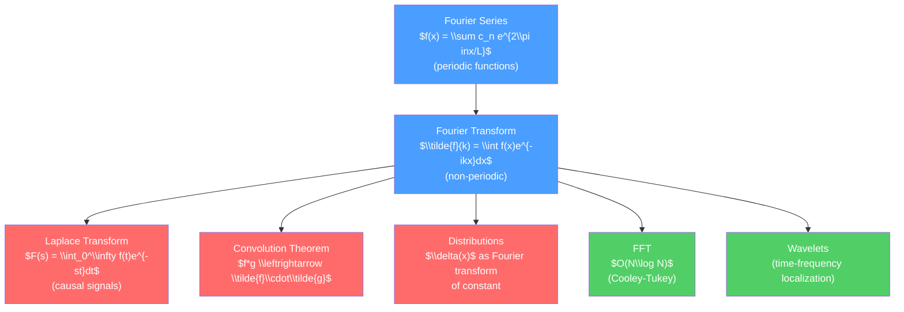

# 🎵 Fourier Analysis and Integral Transforms

> [!abstract] TL;DR
> Fourier analysis decomposes any signal — periodic or not, bounded or infinite — into sinusoidal components, revealing its frequency content. The Fourier transform diagonalizes translation-invariant operators (so $\nabla^2$ becomes $-k^2$), turning PDEs into algebraic equations and convolutions into products. The Laplace transform does the same for causal time-domain systems. At the graduate level, Fourier analysis extends to distributions (making sense of $\delta(x)$ as a transform), and FFT reduces the computational cost from $O(N^2)$ to $O(N\log N)$, enabling modern signal processing and scientific computing.

## Intuition — analogy FIRST

A musical chord is the sum of several pure notes (frequencies). If you play a chord and record it, you hear all the frequencies at once — that is the time-domain signal. A spectrum analyzer on a guitar tuner separates those frequencies — that is the Fourier transform at work. Every vibration, every wave, every oscillating quantity can be decomposed this way, and in the frequency domain, different frequencies are independent and can be analyzed separately.

---

## How It Works



---

## Key Concepts / Details

### Secondary Level

**Fourier Series for Periodic Functions**

A function $f(x)$ periodic with period $L$ can be written:
$$f(x) = \frac{a_0}{2} + \sum_{n=1}^\infty\left[a_n\cos\!\left(\frac{2\pi n x}{L}\right) + b_n\sin\!\left(\frac{2\pi n x}{L}\right)\right]$$

with coefficients $a_n = \frac{2}{L}\int_0^L f(x)\cos(2\pi nx/L)\,dx$, similarly for $b_n$.

Physical interpretation: a vibrating string on $[0,L]$ has harmonics with wavelengths $L, L/2, L/3, \ldots$ — these are the fundamental and overtones. The Fourier series gives their amplitudes.

Musical analogy: a middle A has fundamental 440 Hz plus harmonics at 880 Hz, 1320 Hz, etc. A flute sounds different from a violin at the same pitch because their harmonic amplitudes differ.

### Undergraduate Level

**Fourier Series: Convergence and Gibbs Phenomenon**

The Fourier series converges to $f$ at continuity points, and to the average $(f(x^-)+f(x^+))/2$ at jump discontinuities (Dirichlet conditions). However, near a jump, the series always overshoots by ~8.9%, no matter how many terms are kept — this is the *Gibbs phenomenon*. It is not a numerical error; it is intrinsic to uniform approximation by trigonometric polynomials.

**The Fourier Transform**

For $f \in L^1(\mathbb{R})$, the Fourier transform pair (in physics convention):
$$\tilde{f}(k) = \int_{-\infty}^\infty f(x)\,e^{-ikx}\,dx, \qquad f(x) = \frac{1}{2\pi}\int_{-\infty}^\infty \tilde{f}(k)\,e^{ikx}\,dk$$

Key properties:
- **Linearity**: $\widetilde{af+bg} = a\tilde{f} + b\tilde{g}$
- **Shift**: $\widetilde{f(x-a)} = e^{-ika}\tilde{f}(k)$
- **Derivative**: $\widetilde{f'(x)} = ik\,\tilde{f}(k)$ — derivatives become multiplications
- **Convolution theorem**: $(f*g)(x) = \int f(y)g(x-y)\,dy \implies \widetilde{f*g} = \tilde{f}\cdot\tilde{g}$
- **Parseval's theorem**: $\int|f(x)|^2\,dx = \frac{1}{2\pi}\int|\tilde{f}(k)|^2\,dk$ (energy conservation)
- **Uncertainty principle**: $\Delta x \cdot \Delta k \geq 1/2$ (standard deviation product bounded below)

The 3D Fourier transform: $\tilde{f}(\vec{k}) = \int f(\vec{r})e^{-i\vec{k}\cdot\vec{r}}d^3r$. Used throughout solid-state physics (Brillouin zone, reciprocal lattice) and quantum mechanics (momentum space).

**Laplace Transform**

For causal signals (defined for $t\geq 0$):
$$F(s) = \mathcal{L}\{f\}(s) = \int_0^\infty f(t)\,e^{-st}\,dt$$

Key properties:
- **Derivative**: $\mathcal{L}\{f'\} = sF(s) - f(0)$ — initial conditions enter naturally
- **Convolution**: $\mathcal{L}\{f*g\} = F(s)G(s)$
- **Initial value theorem**: $f(0^+) = \lim_{s\to\infty}sF(s)$
- **Final value theorem**: $\lim_{t\to\infty}f(t) = \lim_{s\to 0}sF(s)$ (if limit exists)

Inverse Laplace transform: $f(t) = \frac{1}{2\pi i}\int_{c-i\infty}^{c+i\infty}F(s)e^{st}\,ds$ (Bromwich integral — evaluated by residues).

**Solving ODEs with Laplace Transforms**

Example: $m\ddot{x} + k x = F_0\cos\omega t$, $x(0)=0$, $\dot{x}(0)=0$.

Transform: $(ms^2 + k)X(s) = F_0 s/(s^2+\omega^2)$, so $X(s) = F_0 s/[(ms^2+k)(s^2+\omega^2)]$.

Partial fractions + inverse transform gives $x(t)$ — including the resonance case $\omega\to\sqrt{k/m}$.

### Graduate Level

**Distributions and the Fourier Transform**

The Dirac delta function $\delta(x)$ is not a function but a *distribution* (tempered distribution in Schwartz space $\mathcal{S}$). Its Fourier transform:
$$\tilde{\delta}(k) = \int\delta(x)e^{-ikx}dx = 1$$

So $\delta(x) = \frac{1}{2\pi}\int e^{ikx}dk$ — the delta function is the "flat spectrum" signal. This gives meaning to the completeness relation of plane waves.

The Fourier transform extends to all tempered distributions $\mathcal{S}'$. The operator $\nabla^2$ in frequency space is $-k^2$ — this is why plane waves $e^{i\vec{k}\cdot\vec{r}}$ are eigenfunctions of the Laplacian.

**Discrete Fourier Transform and FFT**

For a sequence $x_0,\ldots,x_{N-1}$, the DFT:
$$X_k = \sum_{n=0}^{N-1}x_n e^{-2\pi ikn/N}, \quad k=0,\ldots,N-1$$

Direct computation costs $O(N^2)$. The *Cooley-Tukey FFT* algorithm recursively splits into even/odd indices, reducing to $O(N\log N)$:
$$X_k = X_k^{(\text{even})} + e^{-2\pi ik/N}X_k^{(\text{odd})}$$

For $N=2^{20}\approx 10^6$, FFT is $\sim 10^6/20 = 50{,}000\times$ faster than the naive DFT. The FFT is one of the most important algorithms in science and engineering.

**Wavelets**

Fourier analysis tells you *which* frequencies are present but not *when* they occur. Wavelets $\psi_{a,b}(x) = |a|^{-1/2}\psi((x-b)/a)$ provide *time-frequency localization*: parameter $b$ is the location, $a$ is the scale (inverse frequency).

The continuous wavelet transform: $W_f(a,b) = \int f(x)\psi_{a,b}^*(x)\,dx$.

Discrete wavelets (Daubechies, Haar) provide an orthogonal basis and are used in data compression (JPEG 2000), denoising, and multi-resolution analysis.

**Applications in Quantum Mechanics**

In momentum space: $\tilde{\psi}(p) = (2\pi\hbar)^{-1/2}\int\psi(x)e^{-ipx/\hbar}dx$. The Schrödinger equation in momentum space has $\hat{x} \to i\hbar\partial_p$. Harmonic oscillator: both $\psi(x)$ and $\tilde{\psi}(p)$ are Gaussian times Hermite polynomials, and $\psi$ is its own Fourier transform (up to normalization) — the ground state is a minimum-uncertainty state.

```python
import numpy as np
import matplotlib.pyplot as plt
from scipy.fft import fft, fftfreq, fftshift

# Demonstrate FFT, Gibbs phenomenon, and uncertainty principle
N = 512
x = np.linspace(0, 2*np.pi, N, endpoint=False)
dx = x[1] - x[0]

# Square wave (jump discontinuity -> Gibbs phenomenon)
f_square = np.sign(np.sin(x))
F_square = fft(f_square)
freqs = fftshift(fftfreq(N, d=dx/(2*np.pi)))

# Gaussian wavepacket (minimum uncertainty)
sigma_x = 0.5
k0 = 10.0
psi = np.exp(-x**2/(2*sigma_x**2)) * np.exp(1j*k0*x)
Psi = fft(psi)
k = fftfreq(N, d=dx/(2*np.pi)) * 2*np.pi

fig, axes = plt.subplots(2, 2, figsize=(12, 8))

# Gibbs phenomenon: partial Fourier sums
axes[0, 0].plot(x, f_square, 'k', lw=0.5, alpha=0.4, label='Square wave')
for n_terms, color in [(5, '#4a9eff'), (20, '#ff6b6b'), (100, '#51cf66')]:
    f_approx = np.zeros_like(x)
    for n in range(1, n_terms+1, 2):  # odd harmonics only
        f_approx += (4/(np.pi*n))*np.sin(n*x)
    axes[0, 0].plot(x, f_approx, color=color, lw=1, label=f'{n_terms} terms')
axes[0, 0].set_title('Gibbs Phenomenon: Fourier partial sums')
axes[0, 0].legend(fontsize=8)

# FFT spectrum of square wave
axes[0, 1].stem(fftshift(freqs[:N//2+1]), np.abs(fftshift(F_square))[:N//2+1],
               markerfmt='C0.', linefmt='C0-', basefmt='k-')
axes[0, 1].set_title('FFT spectrum: Square wave (odd harmonics only)')
axes[0, 1].set_xlim(0, 30)
axes[0, 1].set_xlabel('Frequency (harmonic number)')

# Gaussian wavepacket in position space
axes[1, 0].plot(x, np.real(psi), label=r'Re$[\psi(x)]$', color='#4a9eff')
axes[1, 0].plot(x, np.abs(psi), '--', label=r'$|\psi(x)|$', color='#ff6b6b')
axes[1, 0].set_title(f'Gaussian wavepacket: $\\sigma_x={sigma_x}$')
axes[1, 0].legend()

# Momentum space representation
axes[1, 1].plot(np.fft.fftshift(k), np.abs(np.fft.fftshift(Psi))/np.max(np.abs(Psi)),
               color='#51cf66', label=r'$|\tilde{\psi}(k)|$')
axes[1, 1].set_title(r'Momentum space: $\sigma_k \approx 1/\sigma_x$ (uncertainty principle)')
axes[1, 1].set_xlim(k0-20, k0+20)
axes[1, 1].legend()

plt.tight_layout()
```

---

## Real-World Notes

- **MRI**: magnetic resonance imaging acquires data in k-space (Fourier space) and reconstructs images via 2D inverse FFT.
- **Radio astronomy**: interferometers (VLBI, ALMA) measure the Fourier transform of the sky brightness; image reconstruction requires deconvolution.
- **Quantum mechanics**: the Heisenberg uncertainty principle is a theorem about Fourier transforms: $\sigma_x\sigma_k \geq 1/2$.
- **Communications**: AM/FM/WiFi radio all encode information via frequency-domain manipulation (modulation/demodulation = Fourier multiplication).
- **Gravitational wave detection**: LIGO uses matched filtering (correlation = convolution) in the Fourier domain to extract signals buried in noise.

---

## Common Pitfalls

1. **Convention chaos**: three common conventions for the Fourier transform differ in where the $2\pi$ goes and the sign of the exponent. Always state the convention explicitly and check before computing.
2. **Sampling theorem**: to represent a signal with maximum frequency $f_{\max}$, you must sample at $\geq 2f_{\max}$ (Nyquist rate). Sampling below this causes *aliasing* — high frequencies fold back to low frequencies.
3. **Parseval without the $2\pi$ factor**: $\int|f|^2\,dx = \int|\tilde{f}|^2\,dk/(2\pi)$ in the physics convention. A missing $2\pi$ gives wrong energies.
4. **Laplace vs. Fourier**: Laplace ($s = \sigma + i\omega$) handles exponentially growing signals and initial conditions; Fourier ($s = i\omega$ pure imaginary) handles steady-state. Applying Fourier to a non-$L^2$ function requires distributional interpretation.
5. **DFT assumes periodicity**: the FFT treats the input sequence as one period of a periodic signal. Applying it to a non-periodic signal without windowing produces spectral leakage — high-frequency "spurious" peaks.

---

## Related Concepts

- [[_MOC_Mathematical_Methods|↑ Section MOC]]
- [[Partial_Differential_Equations]] — Fourier method converts PDEs to algebraic equations in $k$-space
- [[Complex_Analysis_for_Physics]] — Inverse Laplace transform uses Bromwich contour integral
- [[Special_Functions_and_Greens_Functions]] — Fourier transform of the Green's function gives spectral representation

---

## Review Questions

1. **Secondary**: A clarinet plays middle A (440 Hz). Explain why it sounds different from a flute at the same pitch using the concept of Fourier series. What would a "pure" 440 Hz sound correspond to in the Fourier series?
2. **Undergraduate**: Prove the convolution theorem: $\widetilde{f*g} = \tilde{f}\cdot\tilde{g}$. Use it to solve the ODE $y'' - y = e^{-|x|}$ by taking Fourier transforms of both sides. What property of $e^{-|x|}$ ensures the Fourier transform is well-defined?
3. **Graduate**: Show that the Dirac delta function $\delta(x)$ satisfies $\tilde{\delta}(k) = 1$ in the distributional sense. Use this to derive the completeness relation $\frac{1}{2\pi}\int e^{ik(x-x')}dk = \delta(x-x')$. Explain how this is used to prove that position eigenstates are "complete" in quantum mechanics. What role does the Schwartz space $\mathcal{S}$ play in making this rigorous?

---

## Sources

- Arfken, Weber & Harris — *Mathematical Methods for Physicists*, Chs. 19–20
- Stein & Shakarchi — *Fourier Analysis: An Introduction*
- Bracewell — *The Fourier Transform and Its Applications*
- Press et al. — *Numerical Recipes*, Ch. 12 (FFT algorithms)

#physics #mathematical-methods #Fourier-series #Fourier-transform #Laplace-transform #FFT #wavelets #distributions #undergraduate #graduate
