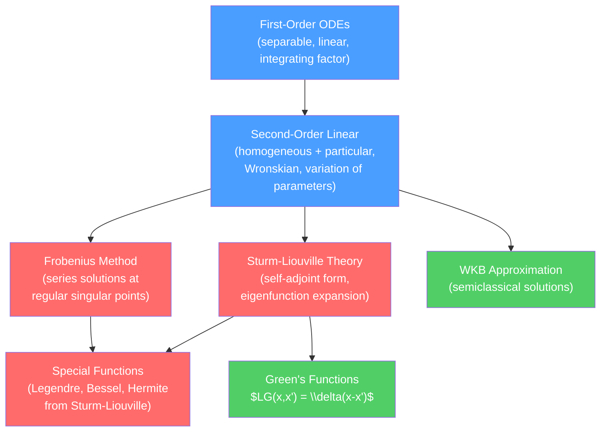

# 📈 Ordinary Differential Equations

> [!abstract] TL;DR
> Ordinary differential equations (ODEs) are the equations of motion of physics: every dynamical law (Newton, Schrödinger, Maxwell in 1D) is an ODE or reduces to one. The toolkit spans first-order separable equations and exponential decay, through the Wronskian and variation of parameters for second-order equations, Frobenius series solutions, and Sturm-Liouville theory that unifies all eigenfunction expansions. At the graduate level, the Green's function for an ODE solves the equation for any source, WKB gives semiclassical wave solutions, and nonlinear ODEs reveal chaos.

## Intuition — analogy FIRST

Cooling coffee follows Newton's law of cooling: the rate of temperature drop is proportional to the temperature difference from the room. That is a first-order ODE, and it gives exponential decay — a universal template for radioactive decay, RC circuits, and population loss.

A pendulum adds a second derivative (acceleration), giving a second-order ODE. The two independent solutions (sine and cosine for small angles) are like two orthogonal directions in solution space. For any initial position and velocity, the physical solution is a combination of the two — this is the superposition principle, valid for all *linear* ODEs.

---

## How It Works



---

## Key Concepts / Details

### Secondary Level

**First-order ODEs** are the simplest: they relate $y'$ to $y$ and $x$.

*Separable*: $\frac{dy}{dx} = f(x)g(y)$ — separate and integrate:
$$\int\frac{dy}{g(y)} = \int f(x)\,dx$$

Example: $\frac{dN}{dt} = -\lambda N$ gives $N(t) = N_0 e^{-\lambda t}$ (exponential decay, radioactive decay, RC discharge).

*Linear first-order*: $y' + p(x)y = q(x)$. Use the integrating factor $\mu = e^{\int p\,dx}$:
$$\frac{d}{dx}(\mu y) = \mu q \implies \mu y = \int\mu q\,dx$$

### Undergraduate Level

**Second-Order Linear ODEs**

The general second-order linear ODE:
$$y'' + p(x)y' + q(x)y = f(x)$$

Homogeneous ($f=0$): find two linearly independent solutions $y_1, y_2$. Check linear independence with the *Wronskian*:
$$W(y_1, y_2) = \begin{vmatrix}y_1 & y_2 \\ y_1' & y_2'\end{vmatrix} = y_1 y_2' - y_2 y_1'$$

$W \neq 0$ iff $y_1, y_2$ are linearly independent. Abel's theorem: $W(x) = W(x_0)\exp\!\left(-\int_{x_0}^x p\,dt\right)$.

*Variation of parameters* (for particular solution given $y_1, y_2$):
$$y_p = -y_1\int\frac{y_2 f}{W}dx + y_2\int\frac{y_1 f}{W}dx$$

**Frobenius Method (Series Solutions)**

At a *regular singular point* $x_0$ (where $p$ has at most a simple pole and $q$ at most a double pole), try a Frobenius series:
$$y(x) = (x-x_0)^r\sum_{n=0}^\infty a_n(x-x_0)^n, \quad a_0\neq 0$$

Substitute into the ODE to get the *indicial equation* for $r$, then recursion relations for $a_n$. Two independent solutions correspond to the two roots $r_1, r_2$ of the indicial equation. If $r_1 - r_2 \in \mathbb{Z}$, the second solution may involve a logarithm.

Example: Bessel's equation $x^2 y'' + xy' + (x^2-n^2)y = 0$ has a regular singular point at $x=0$; Frobenius gives $J_n(x)$.

**Sturm-Liouville Theory**

The *Sturm-Liouville operator* in self-adjoint form:
$$\mathcal{L}y = -\frac{d}{dx}\left[p(x)\frac{dy}{dx}\right] + q(x)y = \lambda w(x)y$$

with $p, w > 0$ on $[a,b]$ and suitable boundary conditions. Key results:
1. Eigenvalues $\lambda_n$ are all real and form an increasing sequence $\lambda_1 < \lambda_2 < \cdots \to \infty$.
2. Eigenfunctions $y_n(x)$ are orthogonal with weight $w$: $\int_a^b y_m y_n\, w\,dx = 0$ for $m\neq n$.
3. The eigenfunctions are *complete*: any $f\in L^2([a,b],w)$ can be expanded as $f(x) = \sum_n c_n y_n(x)$ where $c_n = \int_a^b f y_n w\,dx / \int_a^b y_n^2 w\,dx$.

Almost all special functions of mathematical physics (Legendre, Bessel, Hermite, Laguerre, Chebyshev) arise as solutions to Sturm-Liouville problems.

**Systems of ODEs and Phase Portraits**

A 2D autonomous system $\dot{x} = f(x,y)$, $\dot{y} = g(x,y)$ can be analyzed by linearizing around equilibria. At fixed point $(x_0, y_0)$, the Jacobian matrix $J$ determines stability:
- Real negative eigenvalues: stable node
- Real positive eigenvalues: unstable node
- Complex eigenvalues $\alpha\pm i\beta$: spiral (stable if $\alpha<0$)
- Pure imaginary: center

### Graduate Level

**Green's Functions for ODEs**

Given a linear operator $L = -d^2/dx^2 + V(x)$ with boundary conditions, the Green's function $G(x,x')$ satisfies:
$$L G(x,x') = \delta(x-x')$$

The solution to $Ly = f$ is then $y(x) = \int G(x,x')f(x')\,dx'$.

For the 1D Schrödinger-type operator on $[a,b]$ with Dirichlet BCs, the Green's function is:
$$G(x,x') = \frac{y_<(x_<)\,y_>(x_>)}{W(y_<, y_>)p(x')}$$
where $y_<$ satisfies the left BC and $y_>$ satisfies the right BC, and $x_<=\min(x,x')$, $x_>=\max(x,x')$.

*Spectral representation*: using the Sturm-Liouville eigenfunctions:
$$G(x,x') = \sum_n \frac{y_n(x)y_n^*(x')}{\lambda - \lambda_n}$$

**WKB Approximation**

For $\hbar^2 y'' + Q(x)y = 0$ (Schrödinger equation in disguise), the WKB ansatz $y \sim A(x)e^{iS(x)/\hbar}$ gives, to leading order:
$$y_\pm(x) \approx \frac{C}{\sqrt{|p(x)|}}\exp\!\left(\pm\frac{i}{\hbar}\int^x p(x')\,dx'\right), \quad p(x) = \sqrt{Q(x)}$$

This is valid away from turning points where $Q(x_0)=0$. Connection formulas at turning points link exponential and oscillatory solutions. WKB gives tunneling amplitudes, Bohr-Sommerfeld quantization ($\oint p\,dq = (n+1/2)h$), and semiclassical physics.

**Nonlinear ODEs and Phase Space**

For nonlinear autonomous systems, global behavior is studied via:
- *Poincaré-Bendixson theorem*: in 2D, bounded trajectories converge to fixed points, limit cycles, or homoclinic orbits.
- *Lyapunov stability*: a function $V(x)$ with $\dot{V}<0$ proves asymptotic stability.
- *Chaos* (dimension $\geq 3$): Lorenz system, Lyapunov exponents, strange attractors.

```python
import numpy as np
from scipy.integrate import odeint
import matplotlib.pyplot as plt

# Sturm-Liouville eigenvalue problem: simple harmonic oscillator form
# y'' + lambda*y = 0, y(0) = y(pi) = 0
# Exact eigenvalues: lambda_n = n^2, eigenfunctions: sin(n*x)

# Numerical solution for comparison
def sl_ode(state, x, lam):
    y, yp = state
    return [yp, -lam * y]

x = np.linspace(0, np.pi, 300)
fig, axes = plt.subplots(1, 2, figsize=(12, 4))

for n, color in [(1,'#4a9eff'), (2,'#ff6b6b'), (3,'#51cf66')]:
    lam = n**2
    sol = odeint(sl_ode, [0.0, 1.0], x, args=(lam,))
    axes[0].plot(x, sol[:, 0] / np.max(np.abs(sol[:, 0])),
                 color=color, label=f'n={n}, λ={lam}')

axes[0].axhline(0, color='k', lw=0.5)
axes[0].set_title('Sturm-Liouville eigenfunctions: $y\'\' + \\lambda y = 0$')
axes[0].set_xlabel('x')
axes[0].legend()

# Phase portrait: van der Pol oscillator
def van_der_pol(state, t, mu):
    x, v = state
    return [v, mu*(1-x**2)*v - x]

t = np.linspace(0, 40, 5000)
for ic in [[0.1, 0.0], [3.0, 0.0]]:
    sol = odeint(van_der_pol, ic, t, args=(1.0,))
    axes[1].plot(sol[1000:, 0], sol[1000:, 1], alpha=0.7)

axes[1].set_title('Phase portrait: Van der Pol oscillator (limit cycle)')
axes[1].set_xlabel('x')
axes[1].set_ylabel("x'")

plt.tight_layout()
```

---

## Real-World Notes

- **Quantum mechanics**: the Schrödinger equation $(-\hbar^2/2m)\psi'' + V(x)\psi = E\psi$ is a Sturm-Liouville problem; energy quantization is eigenvalue quantization.
- **RLC circuits**: $L\ddot{q} + R\dot{q} + q/C = \mathcal{E}(t)$ — second-order linear ODE, identical in structure to a damped harmonic oscillator.
- **Population biology**: Lotka-Volterra equations (predator-prey) are coupled nonlinear ODEs with oscillatory phase portraits.
- **Epidemiology**: SIR model is a nonlinear ODE system; WKB-like approximations give epidemic peak timing.

---

## Common Pitfalls

1. **Particular solution vs. general solution**: the general solution is $y = y_h + y_p$ (homogeneous + particular); forgetting $y_h$ loses free constants needed to satisfy initial conditions.
2. **Indicial equation roots**: if $r_1 = r_2$, the second Frobenius solution has a $\ln x$ term — do not simply use the same series twice.
3. **Sturm-Liouville form requirement**: the self-adjoint form requires the leading coefficient to be the same function $p(x)$ in both the derivative and weight. Verify before applying the orthogonality theorem.
4. **WKB breakdown at turning points**: WKB diverges as $p(x)\to 0$; use connection formulas (Airy functions bridge classically allowed and forbidden regions).
5. **Green's function discontinuity**: $G(x,x')$ is continuous at $x=x'$, but $\partial_x G$ has a jump of $-1/p(x')$ — this is how the delta function source is satisfied.

---

## Related Concepts

- [[_MOC_Mathematical_Methods|↑ Section MOC]]
- [[Partial_Differential_Equations]] — PDEs reduce to ODEs via separation of variables
- [[Special_Functions_and_Greens_Functions]] — Bessel, Legendre, Hermite functions solve specific ODEs
- [[Fourier_Analysis_and_Integral_Transforms]] — Laplace transform converts ODEs to algebraic equations
- [[Complex_Analysis_for_Physics]] — Contour integration evaluates inverse Laplace transforms

---

## Review Questions

1. **Secondary**: Solve $dy/dt = -ky$ with $y(0)=y_0$. What physical systems does this ODE model? How does the solution change if there is a constant source term: $dy/dt = -ky + S$?
2. **Undergraduate**: Apply the Frobenius method to find the series solution of Hermite's equation $y'' - 2xy' + 2ny = 0$ around $x=0$. Show that for integer $n$, one solution terminates (becoming a polynomial). How does the Sturm-Liouville formulation of this equation lead to the orthogonality of Hermite polynomials?
3. **Graduate**: Construct the Green's function for the operator $L = -d^2/dx^2$ with Dirichlet boundary conditions on $[0,1]$. Use it to solve $-y'' = f(x)$. Verify your answer by computing $y''$ directly. Then state the spectral representation of $G$ in terms of the eigenfunctions $\sin(n\pi x)$.

---

## Sources

- Arfken, Weber & Harris — *Mathematical Methods for Physicists*, Chs. 7–9
- Bender & Orszag — *Advanced Mathematical Methods for Scientists and Engineers* (WKB, asymptotic methods)
- Morse & Feshbach — *Methods of Theoretical Physics*, Vol. 1
- Griffiths — *Introduction to Quantum Mechanics*, Appendix (Frobenius method, special functions)

#physics #mathematical-methods #ODEs #Frobenius #Sturm-Liouville #Green-functions #WKB #undergraduate #graduate
