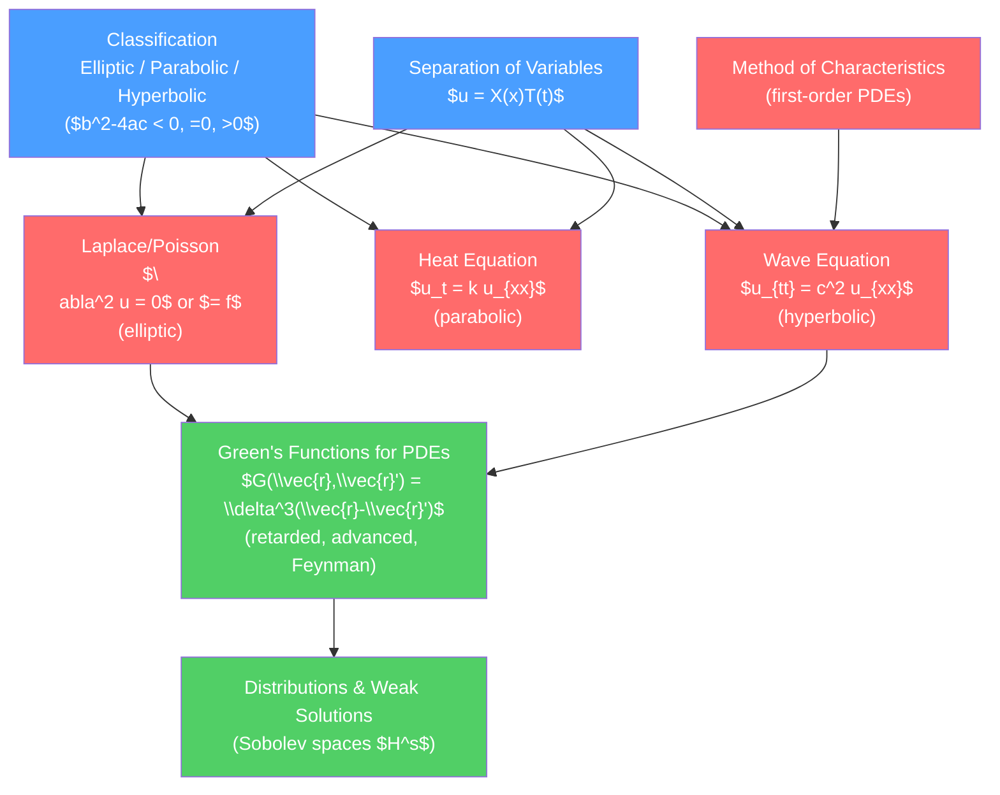

# 🌀 Partial Differential Equations

> [!abstract] TL;DR
> Partial differential equations (PDEs) govern every field in physics: Maxwell's equations, the Schrödinger equation, Einstein's field equations, and fluid dynamics are all PDEs. The three canonical PDEs — wave (hyperbolic), heat (parabolic), and Laplace/Poisson (elliptic) — cover the mathematical archetypes of all others. The solution toolkit progresses from separation of variables to Green's functions to the functional-analytic theory of distributions and Sobolev spaces.

## Intuition — analogy FIRST

Waves ripple outward from a stone dropped in a pond — the wave equation governs this, and information travels at finite speed. Heat diffuses from a hot stove, spreading smoothly and irreversibly — the heat equation governs this, and information propagates infinitely fast (a mathematical idealization). The temperature distribution in a metal plate with fixed edge temperatures settles into the uniquely determined Laplace solution — no time dependence, no propagation, just static equilibrium.

These three behaviors — propagation, diffusion, and equilibrium — exhaust the qualitatively distinct behaviors of linear second-order PDEs.

---

## How It Works



---

## Key Concepts / Details

### Secondary Level

Three fundamental PDEs and their physical meaning:

**Wave equation**: $\frac{\partial^2 u}{\partial t^2} = c^2\nabla^2 u$
Models: sound waves, light in vacuum (electromagnetic waves), vibrating string. Information travels at speed $c$. Reversible in time.

**Heat equation** (diffusion): $\frac{\partial u}{\partial t} = k\nabla^2 u$
Models: temperature diffusion, particle diffusion (Fick's law), Brownian motion. Irreversible; smooths out initial data instantly.

**Laplace equation**: $\nabla^2 u = 0$ (Poisson: $\nabla^2 u = -\rho/\epsilon_0$)
Models: electrostatic potential with no free charge, gravitational potential, steady-state temperature. Solutions are harmonic functions — infinitely smooth, satisfy maximum principle.

### Undergraduate Level

**Classification of Second-Order PDEs**

For $au_{xx} + bu_{xy} + cu_{yy} + \ldots = 0$, the discriminant $\Delta = b^2 - 4ac$ classifies:
- $\Delta < 0$: *elliptic* (Laplace) — no real characteristics, boundary value problems
- $\Delta = 0$: *parabolic* (heat) — one characteristic direction, initial-boundary value problems
- $\Delta > 0$: *hyperbolic* (wave) — two real characteristics, Cauchy problems, finite propagation speed

**Separation of Variables**

Assume $u(\vec{r},t) = T(t)\psi(\vec{r})$. Substituting into the wave equation:
$$\frac{\ddot{T}}{T} = c^2\frac{\nabla^2\psi}{\psi} = -\omega^2 \text{ (separation constant)}$$

This yields the Helmholtz equation $\nabla^2\psi + k^2\psi = 0$ (with $k=\omega/c$) and a simple ODE for $T$.

*Example: vibrating drumhead* (circular membrane, radius $a$):
In polar coordinates $\psi(r,\phi) = R(r)\Phi(\phi)$, the angular part gives $\Phi = e^{\pm in\phi}$ (integer $n$), and the radial part satisfies Bessel's equation with solution $R = J_n(kr)$. Boundary condition $J_n(ka)=0$ selects discrete $k_{nm}$ (zeros of Bessel functions).

**Boundary Conditions**

- *Dirichlet*: $u$ specified on the boundary
- *Neumann*: $\partial u/\partial n$ specified on the boundary
- *Robin*: $\alpha u + \beta \partial u/\partial n = \gamma$ on the boundary
- *Cauchy* (well-posed for hyperbolic): $u$ and $\partial u/\partial t$ specified on the initial surface

**Method of Characteristics (First-Order PDEs)**

For $a(x,t)u_x + b(x,t)u_t = c(x,t,u)$, the *characteristic curves* satisfy $dx/ds = a$, $dt/ds = b$, $du/ds = c$. Along characteristics, the PDE reduces to an ODE.

For the linear advection equation $u_t + cu_x = 0$: characteristics are $x - ct = \text{const}$, giving $u(x,t) = f(x-ct)$ — rightward-traveling wave. The method extends to quasi-linear and even nonlinear cases; shocks form when characteristics cross.

### Graduate Level

**Green's Functions for PDEs**

The Green's function $G(\vec{r},t;\vec{r}',t')$ satisfies:
$$\mathcal{L}\,G(\vec{r},t;\vec{r}',t') = \delta^3(\vec{r}-\vec{r}')\delta(t-t')$$

where $\mathcal{L}$ is the PDE operator. The solution to $\mathcal{L}u = f$ is:
$$u(\vec{r},t) = \int G(\vec{r},t;\vec{r}',t')\,f(\vec{r}',t')\,d^3r'\,dt'$$

Three physically distinct Green's functions for the wave operator $\square = \partial_t^2/c^2 - \nabla^2$:

*Retarded* (causal): $G_R \propto \delta(t-t'-|\vec{r}-\vec{r}'|/c)\,\theta(t-t')$ — responds only to past sources.

*Advanced*: $G_A \propto \delta(t-t'-|\vec{r}-\vec{r}'|/c)\,\theta(t'-t)$ — responds only to future sources.

*Feynman* (quantum field theory): $G_F$ is the time-ordered Green's function, analytic in the upper half-plane. Related to $G_R, G_A$ by $G_F = \theta(t-t')G_R + \theta(t'-t)G_A$.

For the Laplacian in 3D, the Green's function is:
$$G(\vec{r},\vec{r}') = \frac{-1}{4\pi|\vec{r}-\vec{r}'|}$$

giving Coulomb's law: $\phi(\vec{r}) = \frac{1}{4\pi\epsilon_0}\int\frac{\rho(\vec{r}')}{|\vec{r}-\vec{r}'|}d^3r'$.

**Distributions and Weak Solutions**

Classical solutions require differentiability, but physics often requires distributional (weak) solutions: shocks in gas dynamics, point charges in electrostatics.

A *distribution* $T$ acts on test functions $\phi \in \mathcal{D}$ (smooth, compact support): $T[\phi] = \int T(x)\phi(x)\,dx$ is a formal notation. The Dirac delta $\delta(x)[\phi] = \phi(0)$ is a distribution but not a function.

Derivatives of distributions: $T'[\phi] = -T[\phi']$ (integration by parts without boundary terms). This lets us differentiate the Heaviside step function: $\theta'(x) = \delta(x)$.

**Sobolev Spaces**: $H^s(\Omega)$ consists of functions with $s$ "weak derivatives" in $L^2$. The Sobolev embedding theorem tells us when solutions are actually continuous (classical). These are the natural spaces for PDE existence and uniqueness theory.

```python
import numpy as np
import matplotlib.pyplot as plt
from scipy.fft import fft, ifft, fftfreq

# Numerical solution of heat equation and wave equation via finite differences
N = 200
L = 2 * np.pi
x = np.linspace(0, L, N, endpoint=False)
dx = L / N
dt_heat = 0.0001
dt_wave = dx / 2  # CFL condition: c*dt/dx <= 1

# Initial condition: Gaussian bump
u0 = np.exp(-((x - np.pi)**2) / 0.1)

# Heat equation via spectral method (exact in Fourier space)
k = fftfreq(N, d=dx/(2*np.pi))
u_hat = fft(u0)
t_final = 0.05
diffusivity = 0.5
u_heat = np.real(ifft(u_hat * np.exp(-diffusivity * k**2 * t_final)))

# Wave equation via finite differences
c = 1.0
u_now = u0.copy()
u_prev = u0.copy()  # zero initial velocity
times = [0, 2.0, 4.0]
snapshots = [u0.copy()]

for step in range(int(4.0 / dt_wave)):
    u_next = 2*u_now - u_prev + (c*dt_wave/dx)**2 * (
        np.roll(u_now, -1) - 2*u_now + np.roll(u_now, 1))
    u_prev, u_now = u_now, u_next
    if abs(step*dt_wave - 2.0) < dt_wave:
        snapshots.append(u_now.copy())
    if abs(step*dt_wave - 4.0) < dt_wave:
        snapshots.append(u_now.copy())

fig, axes = plt.subplots(1, 2, figsize=(12, 4))

axes[0].plot(x, u0, label='t=0 (initial)')
axes[0].plot(x, u_heat, '--', label=f't={t_final} (heat diffused)')
axes[0].set_title('Heat Equation: Gaussian diffusion')
axes[0].legend()

for i, snap in enumerate(snapshots):
    axes[1].plot(x, snap, label=f't={times[i]}')
axes[1].set_title('Wave Equation: Propagating bump (spectral)')
axes[1].legend()

plt.tight_layout()
```

---

## Real-World Notes

- **Electrostatics**: Poisson's equation $\nabla^2\phi = -\rho/\epsilon_0$ is solved using the Green's function (Coulomb's law). Boundary-value problems (conductors) use method of images.
- **Quantum mechanics**: the Schrödinger equation $i\hbar\partial_t\psi = -(\hbar^2/2m)\nabla^2\psi + V\psi$ is a PDE. The retarded Green's function is the propagator $K(\vec{r},t;\vec{r}',t')$.
- **Seismology**: seismic waves in the Earth satisfy a generalized wave equation in inhomogeneous media; the method of characteristics gives ray theory.
- **Numerical weather prediction**: the Navier-Stokes and thermodynamics equations are PDEs discretized on global grids at km resolution.

---

## Common Pitfalls

1. **Well-posedness**: for the wave equation, specifying only Dirichlet BCs at two times (not one time with initial velocity) is ill-posed. The right data for hyperbolic equations is Cauchy data on a space-like surface.
2. **Separation of variables requires linear, constant-coefficient (or separable) equations**: it fails for nonlinear PDEs and generally for variable-coefficient operators except in special coordinates.
3. **Gibbs phenomenon**: truncating a Fourier series at a jump discontinuity produces oscillations of ~9% amplitude regardless of how many terms are kept.
4. **Green's function vs. fundamental solution**: the fundamental solution $\Phi$ satisfies $L\Phi=\delta$ in all of $\mathbb{R}^n$; the Green's function additionally satisfies boundary conditions. Confusing them leads to wrong answers in bounded domains.
5. **Parabolic equations and backward problems**: the heat equation is well-posed forward in time but ill-posed backward — small perturbations in final data grow exponentially in backward time. This is not a numerical artifact; it is intrinsic.

---

## Related Concepts

- [[_MOC_Mathematical_Methods|↑ Section MOC]]
- [[Ordinary_Differential_Equations]] — Separation of variables reduces PDEs to ODEs
- [[Fourier_Analysis_and_Integral_Transforms]] — Fourier transforms solve PDEs in frequency domain
- [[Special_Functions_and_Greens_Functions]] — Solutions in spherical/cylindrical geometries use Legendre/Bessel functions
- [[Vector_Calculus_and_Differential_Operators]] — $\nabla^2$, $\nabla$, $\nabla\times$ are the building blocks of PDE operators
- [[Complex_Analysis_for_Physics]] — Contour integration evaluates Green's function integrals

---

## Review Questions

1. **Secondary**: Explain in physical terms why the heat equation is irreversible but the wave equation is reversible. What does "finite propagation speed" mean for the wave equation, and why does the heat equation violate it?
2. **Undergraduate**: Use separation of variables to solve the heat equation $u_t = k u_{xx}$ on $[0,L]$ with $u(0,t)=u(L,t)=0$ and initial condition $u(x,0)=f(x)$. Write the final answer as a Fourier series. What happens as $t\to\infty$?
3. **Graduate**: Derive the retarded Green's function for the 3D wave equation $(\partial_t^2 - c^2\nabla^2)G = \delta^4(x)$ using Fourier transforms. Show that $G_R \propto \delta(t - r/c)\theta(t)/r$. Explain in physical terms why the factor $\theta(t)$ ensures causality, and how Huygens' principle is encoded in the delta function.

---

## Sources

- Strauss — *Partial Differential Equations: An Introduction*
- Evans — *Partial Differential Equations* (rigorous graduate treatment)
- Morse & Feshbach — *Methods of Theoretical Physics*, Vol. 1, Chs. 7–8
- Arfken, Weber & Harris — *Mathematical Methods for Physicists*, Chs. 9–10

#physics #mathematical-methods #PDEs #wave-equation #heat-equation #Laplace #Green-functions #distributions #undergraduate #graduate
