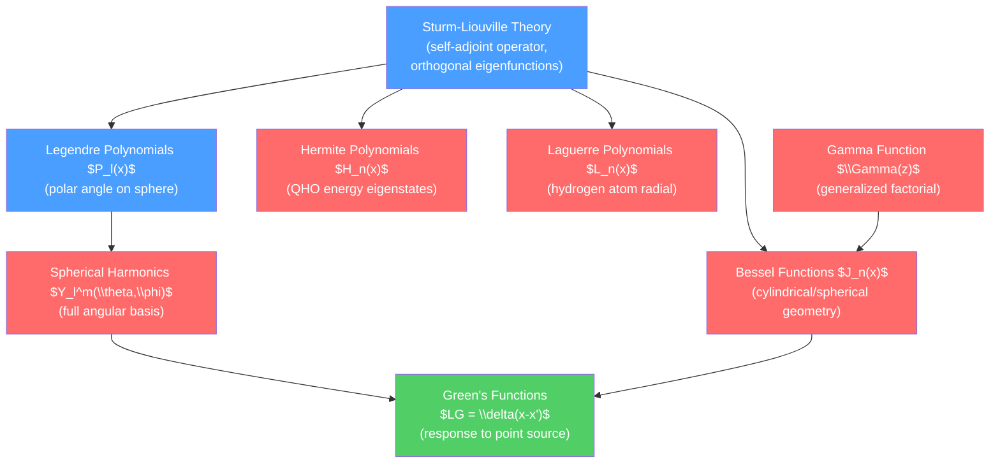

# 🔑 Special Functions and Green's Functions

> [!abstract] TL;DR
> Special functions — Legendre polynomials, spherical harmonics, Bessel functions, Hermite and Laguerre polynomials, the Gamma function — arise as eigenfunctions of the Sturm-Liouville problems that appear in every coordinate system in physics. They provide the orthogonal basis functions for expanding solutions to PDEs in spherical, cylindrical, and Cartesian geometries. Green's functions for differential operators — defined by $LG(x,x')=\delta(x-x')$ — give the response to an arbitrary source as a superposition of point responses, unifying the solution of Poisson's equation, the Schrödinger equation, and classical field theory.

## Intuition — analogy FIRST

When you solve a problem on a rectangular box, Fourier's sine and cosine series are the natural basis — they satisfy the Laplacian and vanish at rectangular boundaries. When the box is replaced by a sphere, the right basis is spherical harmonics $Y_l^m(\theta,\phi)$ — they are the "Fourier series of the sphere." When the domain is a cylinder, Bessel functions take over. Each geometry has its own special functions, and they are special precisely because they diagonalize the Laplacian in that geometry.

---

## How It Works



---

## Key Concepts / Details

### Secondary Level

Special functions grow out of the building blocks of mathematics:
- **Factorial**: $n! = n(n-1)\cdots 2\cdot 1$ counts permutations. The Gamma function extends this to all complex numbers.
- **Trigonometric functions**: $\sin$, $\cos$ are the special functions for 1D periodic problems and the circle.
- **Exponential and Gaussian**: $e^x$, $e^{-x^2}$ are the eigenfunctions of the derivative and the harmonic oscillator in flat space.

These familiar functions are themselves special functions — what makes functions "special" is being solutions to important ODEs with good orthogonality and recurrence properties.

### Undergraduate Level

**Legendre Polynomials $P_l(\cos\theta)$**

Arise from $\nabla^2$ in spherical coordinates after separating the $\phi$ part. The Legendre ODE ($m=0$):
$$(1-x^2)P_l'' - 2xP_l' + l(l+1)P_l = 0, \quad x=\cos\theta$$

*Rodrigues formula*: $P_l(x) = \frac{1}{2^l l!}\frac{d^l}{dx^l}(x^2-1)^l$

First few: $P_0=1$, $P_1=x$, $P_2=\frac{1}{2}(3x^2-1)$, $P_3=\frac{1}{2}(5x^3-3x)$.

*Generating function*: $\frac{1}{\sqrt{1-2xt+t^2}} = \sum_{l=0}^\infty P_l(x)t^l$ — used to expand $1/|\vec{r}-\vec{r}'|$ in multipoles.

*Orthogonality*: $\int_{-1}^1 P_l(x)P_{l'}(x)\,dx = \frac{2}{2l+1}\delta_{ll'}$

*Recurrence*: $(l+1)P_{l+1} = (2l+1)xP_l - lP_{l-1}$

**Spherical Harmonics $Y_l^m(\theta,\phi)$**

Complete angular basis for $S^2$:
$$Y_l^m(\theta,\phi) = \sqrt{\frac{(2l+1)}{4\pi}\frac{(l-m)!}{(l+m)!}}P_l^m(\cos\theta)\,e^{im\phi}$$

where $P_l^m$ are the associated Legendre functions. Quantum numbers: $l = 0,1,2,\ldots$ (azimuthal), $m = -l,\ldots,l$ (magnetic).

*Orthonormality*: $\int Y_l^m Y_{l'}^{m'*}\,d\Omega = \delta_{ll'}\delta_{mm'}$

*Completeness*: any function on the sphere: $f(\theta,\phi) = \sum_{l,m}c_{lm}Y_l^m(\theta,\phi)$

*Eigenfunction of $\nabla^2_{\text{angular}}$*: $\hat{L}^2 Y_l^m = \hbar^2 l(l+1)Y_l^m$ — directly gives hydrogen atom angular wave functions.

**Bessel Functions $J_n(x)$**

Arise from the Helmholtz equation $\nabla^2\psi + k^2\psi = 0$ in cylindrical coordinates. The Bessel ODE:
$$x^2 J_n'' + xJ_n' + (x^2-n^2)J_n = 0$$

Frobenius series: $J_n(x) = \sum_{m=0}^\infty \frac{(-1)^m}{m!\,\Gamma(m+n+1)}\left(\frac{x}{2}\right)^{2m+n}$

Second solution $Y_n(x)$ (Neumann function) is singular at $x=0$; excluded when the domain includes the origin.

*Asymptotic behavior*: $J_n(x) \approx \sqrt{2/(\pi x)}\cos(x - n\pi/2 - \pi/4)$ for large $x$ — oscillatory, decaying envelope.

*Zeros*: $J_n$ has infinitely many positive zeros $j_{n,k}$; orthogonality:
$$\int_0^a J_n(j_{n,k}r/a)J_n(j_{n,k'}r/a)\,r\,dr = \frac{a^2}{2}[J_{n+1}(j_{n,k})]^2\delta_{kk'}$$

Spherical Bessel functions $j_l(x) = \sqrt{\pi/(2x)}J_{l+1/2}(x)$ appear in the 3D Schrödinger equation and electromagnetic scattering off spheres.

**Hermite Polynomials $H_n(x)$ — Quantum Harmonic Oscillator**

The QHO Schrödinger equation in dimensionless form: $-\psi'' + x^2\psi = (2n+1)\psi$. Solutions: $\psi_n(x) = e^{-x^2/2}H_n(x)$.

*Rodrigues formula*: $H_n(x) = (-1)^n e^{x^2}\frac{d^n}{dx^n}e^{-x^2}$

First few: $H_0=1$, $H_1=2x$, $H_2=4x^2-2$, $H_3=8x^3-12x$.

*Orthogonality* (with weight $e^{-x^2}$): $\int_{-\infty}^\infty H_m H_n e^{-x^2}dx = \sqrt{\pi}\,2^n n!\,\delta_{mn}$

**Laguerre Polynomials $L_n(x)$ — Hydrogen Atom**

The radial part of hydrogen wave functions satisfies the associated Laguerre ODE. Solutions: $R_{nl}(r) \propto e^{-r/na_0}(r/a_0)^l L_{n-l-1}^{2l+1}(2r/na_0)$.

**Gamma Function $\Gamma(z)$**

Generalization of the factorial: $\Gamma(n) = (n-1)!$ for positive integers.

$$\Gamma(z) = \int_0^\infty t^{z-1}e^{-t}\,dt \quad (\text{Re}\,z > 0)$$

Key properties: $\Gamma(z+1) = z\Gamma(z)$; $\Gamma(1/2)=\sqrt{\pi}$; reflection formula: $\Gamma(z)\Gamma(1-z) = \pi/\sin(\pi z)$.

Appears in Bessel function series, in the normalization of wave functions, in dimensional regularization in QFT.

### Graduate Level

**Green's Functions: Definition and Construction**

For a linear differential operator $L$ acting on functions on $[a,b]$ with boundary conditions, the Green's function $G(x,x')$ satisfies:
$$LG(x,x') = \delta(x-x'), \quad G \text{ satisfies BCs in both } x \text{ and } x'$$

The solution to $Ly = f$ is: $y(x) = \int_a^b G(x,x')f(x')\,dx'$.

**Construction via left/right solutions**: let $y_1$ satisfy the left BC and $y_2$ satisfy the right BC (both solutions of $Ly=0$). Then:
$$G(x,x') = \frac{1}{p(x')W(x')}\begin{cases}y_1(x)y_2(x') & x < x' \\ y_1(x')y_2(x) & x > x'\end{cases}$$

where $W = y_1y_2'-y_2y_1'$ is the Wronskian and $p(x)$ is the weight in the Sturm-Liouville operator.

**Spectral Representation**

Using the completeness of eigenfunctions $\{y_n\}$ of $L$ with eigenvalues $\{\lambda_n\}$:
$$G(x,x'; E) = \sum_n \frac{y_n(x)y_n^*(x')}{E - \lambda_n}$$

This is the *resolvent* of $L$. Poles of $G$ in the complex $E$-plane occur at $E = \lambda_n$ (bound states in QM). The imaginary part of $G$ on the real axis gives the spectral density:
$$\text{Im}\,G(x,x';\lambda+i\epsilon) \to -\pi\sum_n y_n(x)y_n^*(x')\delta(\lambda-\lambda_n)$$

**Method of Images as Green's Function**

The Dirichlet Green's function for the Laplacian in a half-space $z>0$ can be constructed by placing an image charge of opposite sign at the mirror point: $G(\vec{r},\vec{r}') = \frac{-1}{4\pi|\vec{r}-\vec{r}'|} + \frac{1}{4\pi|\vec{r}-\vec{r}''|}$, where $\vec{r}''$ is the image. Generalizations to spheres and other geometries follow.

**Physical Green's Functions**

In quantum mechanics, the retarded Green's function (propagator) $G^+(x,t;x',t') = -i\theta(t-t')\langle x|e^{-iH(t-t')/\hbar}|x'\rangle$ encodes all dynamical information. In quantum field theory, the Feynman propagator $G_F$ is the time-ordered two-point function, computed as a contour integral.

```python
import numpy as np
import matplotlib.pyplot as plt
from scipy.special import legendre, jv, hermite, gamma

x = np.linspace(-1, 1, 400)
r = np.linspace(0, 20, 600)
xi = np.linspace(-4, 4, 400)

fig, axes = plt.subplots(2, 2, figsize=(12, 8))

# Legendre polynomials
for l, color in [(0,'#4a9eff'), (1,'#ff6b6b'), (2,'#51cf66'), (3,'#ffd700')]:
    Pl = legendre(l)
    axes[0, 0].plot(x, Pl(x), color=color, label=f'$P_{l}(x)$')
axes[0, 0].axhline(0, color='k', lw=0.5)
axes[0, 0].set_title('Legendre Polynomials $P_l(x)$')
axes[0, 0].legend()

# Bessel functions
for n, color in [(0,'#4a9eff'), (1,'#ff6b6b'), (2,'#51cf66'), (3,'#ffd700')]:
    axes[0, 1].plot(r, jv(n, r), color=color, label=f'$J_{n}(x)$')
axes[0, 1].axhline(0, color='k', lw=0.5)
axes[0, 1].set_title('Bessel Functions $J_n(x)$')
axes[0, 1].set_xlim(0, 20)
axes[0, 1].legend()

# Hermite polynomials (QHO wave functions)
for n, color in [(0,'#4a9eff'), (1,'#ff6b6b'), (2,'#51cf66'), (3,'#ffd700')]:
    Hn = hermite(n)
    psi_n = Hn(xi) * np.exp(-xi**2/2)
    psi_n /= np.max(np.abs(psi_n))
    axes[1, 0].plot(xi, psi_n + 2*n, color=color, label=f'$\\psi_{n}(x)$')
axes[1, 0].set_title('QHO Eigenfunctions: $e^{-x^2/2}H_n(x)$')
axes[1, 0].legend()

# Green's function for -d^2/dx^2 on [0,1] with Dirichlet BCs
# G(x,x') = x_< (1 - x_>)
x1d = np.linspace(0, 1, 200)
X, Xp = np.meshgrid(x1d, x1d)
G = np.where(X <= Xp, X*(1-Xp), Xp*(1-X))
im = axes[1, 1].contourf(x1d, x1d, G, levels=30, cmap='viridis')
plt.colorbar(im, ax=axes[1, 1])
axes[1, 1].set_title("Green's function $G(x,x')$ for $-d^2/dx^2$ on $[0,1]$")
axes[1, 1].set_xlabel("x"); axes[1, 1].set_ylabel("x'")

plt.tight_layout()
```

---

## Real-World Notes

- **Atomic physics**: hydrogen wave functions are products of spherical harmonics, associated Laguerre polynomials, and exponentials — all special functions arising from the 3D Schrödinger equation.
- **Wireless communications**: antenna radiation patterns are expanded in spherical harmonics; phased-array beam steering uses their addition theorem.
- **Geophysics**: Earth's gravity field and magnetic field are expanded in spherical harmonics up to degree $l \sim 2000$ in global models.
- **Computational physics**: fast multipole methods use the addition theorem for spherical harmonics to reduce $N$-body gravitational/electrostatic calculations from $O(N^2)$ to $O(N)$.

---

## Common Pitfalls

1. **Bessel function order confusion**: $J_n$ is regular at $x=0$; $Y_n$ (Neumann) diverges. For problems with the origin in the domain, discard $Y_n$. For annular domains (hollow cylinders), both $J_n$ and $Y_n$ are needed.
2. **Phase conventions for $Y_l^m$**: the Condon-Shortley phase $(-1)^m$ is included in some conventions and not others. Different textbooks (Griffiths vs. Jackson vs. Arfken) differ — check before comparing results.
3. **Normalization of Hermite polynomials**: "probabilist's Hermite" $He_n$ and "physicist's Hermite" $H_n$ differ by $H_n(x) = 2^{n/2}He_n(\sqrt{2}\,x)$. The QHO uses physicist's Hermite.
4. **Green's function for non-self-adjoint operators**: the construction via left/right solutions requires the operator to have no eigenvalues at the specified energy. At $E = \lambda_n$, the resolvent has a pole — resonance or bound state.
5. **Gamma function poles**: $\Gamma(z)$ has poles (not zeros) at $z = 0, -1, -2, \ldots$. It has no zeros. This causes denominators in Bessel function series to vanish at non-positive-integer orders in a controlled way.

---

## Related Concepts

- [[_MOC_Mathematical_Methods|↑ Section MOC]]
- [[Ordinary_Differential_Equations]] — Special functions are solutions to Sturm-Liouville ODEs
- [[Partial_Differential_Equations]] — Separation of variables in spherical/cylindrical coords produces these functions
- [[Fourier_Analysis_and_Integral_Transforms]] — Spectral decomposition is the Fourier analysis of these function families
- [[Complex_Analysis_for_Physics]] — Gamma function is analytic; Bessel function asymptotics use steepest descent

---

## Review Questions

1. **Secondary**: List the first four Legendre polynomials. Verify that $P_2(x) = (3x^2-1)/2$ satisfies the Legendre ODE with $l=2$. Draw $P_0$, $P_1$, $P_2$ on the interval $[-1,1]$ and describe how their zeros are distributed.
2. **Undergraduate**: State the orthogonality relation for spherical harmonics $Y_l^m$. Use it to find the expansion coefficients $c_{lm}$ when expanding a function $f(\theta,\phi) = \cos^2\theta$ in spherical harmonics. Which terms survive and why?
3. **Graduate**: Construct the Green's function for the Schrödinger operator $L = -\hbar^2/(2m)\,d^2/dx^2 + V_0\theta(x-a)\theta(b-x)$ (particle in a box with a barrier) using the left-right solution method. How does the Green's function approach the free-space propagator as $V_0\to 0$? What happens to the spectral representation at an energy that equals a bound state energy?

---

## Sources

- Arfken, Weber & Harris — *Mathematical Methods for Physicists*, Chs. 14–16 (Legendre, Bessel, special functions)
- Jackson — *Classical Electrodynamics*, Chs. 2–3 (Green's functions, multipole expansion)
- Griffiths — *Introduction to Quantum Mechanics*, Chs. 2–4 (Hermite, Laguerre, spherical harmonics)
- Stakgold & Holst — *Green's Functions and Boundary Value Problems*

#physics #mathematical-methods #special-functions #Legendre-polynomials #spherical-harmonics #Bessel-functions #Hermite #Green-functions #undergraduate #graduate
