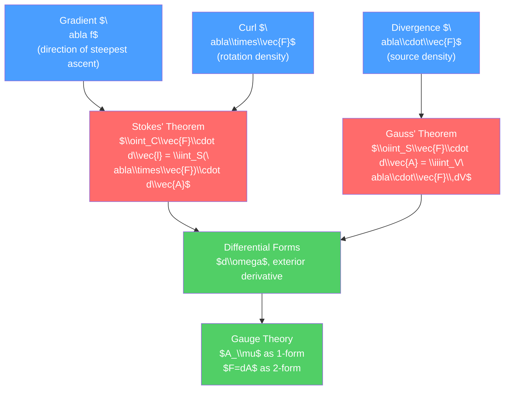

# 📐 Vector Calculus and Differential Operators

> [!abstract] TL;DR
> Vector calculus gives us three differential operators — gradient ($\nabla f$), divergence ($\nabla\cdot\vec{F}$), and curl ($\nabla\times\vec{F}$) — that capture how scalar and vector fields change in space. The integral theorems of Stokes, Gauss, and Green relate these operators to flux and circulation, unifying virtually every conservation law in physics. At the graduate level, differential forms and exterior calculus provide the coordinate-free language in which Maxwell's equations, general relativity, and gauge theories are naturally expressed.

## Intuition — analogy FIRST

Imagine temperature varying across a room. The **gradient** points uphill — in the direction of fastest warming, with magnitude equal to the rate of change. Now imagine air flowing through the room. The **divergence** measures whether more air is flowing out of a tiny volume than into it (sources vs sinks). The **curl** measures the swirling rotation of the flow — whether a tiny paddle wheel placed in the flow would spin.

These three operations answer the fundamental question about any field: how does it change, does it have sources, and does it rotate?

---

## How It Works



---

## Key Concepts / Details

### Secondary Level

The three key operations on fields:

- **Gradient**: takes a scalar field $f$, produces a vector pointing in the direction of maximum increase. $\nabla f = \left(\frac{\partial f}{\partial x}, \frac{\partial f}{\partial y}, \frac{\partial f}{\partial z}\right)$.
- **Divergence**: takes a vector field $\vec{F}$, produces a scalar measuring net outward flow per volume. $\nabla\cdot\vec{F} = \frac{\partial F_x}{\partial x} + \frac{\partial F_y}{\partial y} + \frac{\partial F_z}{\partial z}$.
- **Curl**: takes a vector field $\vec{F}$, produces a vector measuring rotation. $\nabla\times\vec{F} = \left(\frac{\partial F_z}{\partial y}-\frac{\partial F_y}{\partial z},\,\frac{\partial F_x}{\partial z}-\frac{\partial F_z}{\partial x},\,\frac{\partial F_y}{\partial x}-\frac{\partial F_x}{\partial y}\right)$.

Key identities: $\nabla\times(\nabla f) = 0$ (curl of gradient vanishes) and $\nabla\cdot(\nabla\times\vec{F}) = 0$ (divergence of curl vanishes).

### Undergraduate Level

**The Integral Theorems**

*Stokes' theorem* relates line integrals around a closed curve $C$ to surface integrals over any surface $S$ bounded by $C$:
$$\oint_C \vec{F}\cdot d\vec{l} = \iint_S (\nabla\times\vec{F})\cdot d\vec{A}$$

*Divergence (Gauss') theorem* relates surface integrals over a closed surface $S$ to volume integrals over the enclosed volume $V$:
$$\oiint_S \vec{F}\cdot d\vec{A} = \iiint_V \nabla\cdot\vec{F}\,dV$$

*Green's theorem* (2D special case of Stokes):
$$\oint_C (P\,dx + Q\,dy) = \iint_D \left(\frac{\partial Q}{\partial x} - \frac{\partial P}{\partial y}\right)dA$$

**Curvilinear Coordinates**

In *spherical coordinates* $(r,\theta,\phi)$, the Laplacian $\nabla^2 f$ is:
$$\nabla^2 f = \frac{1}{r^2}\frac{\partial}{\partial r}\left(r^2\frac{\partial f}{\partial r}\right) + \frac{1}{r^2\sin\theta}\frac{\partial}{\partial\theta}\left(\sin\theta\frac{\partial f}{\partial\theta}\right) + \frac{1}{r^2\sin^2\theta}\frac{\partial^2 f}{\partial\phi^2}$$

In *cylindrical coordinates* $(s,\phi,z)$:
$$\nabla^2 f = \frac{1}{s}\frac{\partial}{\partial s}\left(s\frac{\partial f}{\partial s}\right) + \frac{1}{s^2}\frac{\partial^2 f}{\partial\phi^2} + \frac{\partial^2 f}{\partial z^2}$$

The general formula for the gradient in an orthogonal curvilinear system with scale factors $h_i$:
$$\nabla f = \sum_i \frac{1}{h_i}\frac{\partial f}{\partial q_i}\hat{e}_i, \qquad \nabla\cdot\vec{A} = \frac{1}{h_1 h_2 h_3}\sum_i\frac{\partial}{\partial q_i}\left(\frac{h_1h_2h_3}{h_i}A_i\right)$$

**Einstein Summation Convention and Index Notation**

Repeated indices are summed: $a_i b_i \equiv \sum_i a_i b_i$. The Kronecker delta $\delta_{ij}$ and Levi-Civita symbol $\epsilon_{ijk}$ (totally antisymmetric, $\epsilon_{123}=1$) encode all dot and cross products:

$$\vec{A}\cdot\vec{B} = A_i B_i, \qquad (\vec{A}\times\vec{B})_i = \epsilon_{ijk}A_j B_k$$

Key identity: $\epsilon_{ijk}\epsilon_{ilm} = \delta_{jl}\delta_{km} - \delta_{jm}\delta_{kl}$. This proves $\vec{A}\times(\vec{B}\times\vec{C}) = \vec{B}(\vec{A}\cdot\vec{C})-\vec{C}(\vec{A}\cdot\vec{B})$ (BAC-CAB rule).

### Graduate Level

**Differential Forms and Exterior Calculus**

A *$p$-form* is a totally antisymmetric tensor of rank $p$. In 3D:
- 0-forms: scalar functions $f$
- 1-forms: $\omega = A_i dx^i$ (like covectors)
- 2-forms: $\omega = F_{ij}dx^i\wedge dx^j$
- 3-forms: volume forms $f\,dx\wedge dy\wedge dz$

The *exterior derivative* $d$ acts as: $d(p\text{-form}) = (p+1)\text{-form}$, with $d^2 = 0$ automatically. This single operator encodes grad, div, and curl:
$$df = \nabla f \text{ (0-form to 1-form)}, \quad d\omega_{1\text{-form}} = \text{curl}, \quad d\omega_{2\text{-form}} = \text{div}$$

Stokes' theorem in unified form on a manifold $M$ with boundary $\partial M$:
$$\int_M d\omega = \int_{\partial M} \omega$$

This single equation contains Stokes', Gauss', and Green's theorems as special cases.

**de Rham Cohomology**

The *de Rham cohomology* $H^p(M)$ classifies $p$-forms that are closed ($d\omega=0$) but not exact ($\omega \neq d\eta$). $H^1(\mathbb{R}^2\setminus\{0\}) \neq 0$ encodes why $\oint_C \frac{-y\,dx + x\,dy}{x^2+y^2} = 2\pi$ for a loop encircling the origin — a topological fact.

**Gauge Theory**

In electromagnetism, the vector potential $A_\mu$ is a 1-form. The field strength $F = dA$ is a 2-form:
$$F_{\mu\nu} = \partial_\mu A_\nu - \partial_\nu A_\mu$$

Maxwell's equations become simply $dF = 0$ (Bianchi identity) and $d{\star}F = J$ (source equation, with $\star$ the Hodge dual). Gauge freedom is $A \to A + d\lambda$ — exact forms don't change $F$.

```python
import numpy as np
import matplotlib.pyplot as plt

# Visualize gradient, divergence, curl for simple fields
x, y = np.meshgrid(np.linspace(-2, 2, 20), np.linspace(-2, 2, 20))

# Example: F = (-y, x) — has curl but zero divergence (rotation)
Fx = -y
Fy = x
curl_z = 2.0 * np.ones_like(x)  # d(Fy)/dx - d(Fx)/dy = 1 - (-1) = 2

fig, axes = plt.subplots(1, 2, figsize=(12, 5))
axes[0].quiver(x, y, Fx, Fy, alpha=0.8)
axes[0].set_title(r'$\vec{F} = (-y, x)$: uniform rotation')
axes[0].set_aspect('equal')

# Example: G = (x, y) — has divergence but zero curl (source)
Gx = x
Gy = y
div = np.ones_like(x) * 2  # d(Gx)/dx + d(Gy)/dy = 1 + 1 = 2

axes[1].quiver(x, y, Gx, Gy, alpha=0.8)
axes[1].set_title(r'$\vec{G} = (x, y)$: diverging source, div = 2')
axes[1].set_aspect('equal')

plt.suptitle('Vector Field Examples: Curl vs Divergence')
plt.tight_layout()
```

---

## Real-World Notes

- **Electromagnetism**: Maxwell's equations are entirely written in $\nabla$, $\nabla\cdot$, $\nabla\times$ — Gauss's law $\nabla\cdot\vec{E}=\rho/\epsilon_0$, Faraday's law $\nabla\times\vec{E}=-\partial_t\vec{B}$, etc.
- **Fluid mechanics**: Continuity equation $\nabla\cdot(\rho\vec{v})=0$ and vorticity $\vec{\omega}=\nabla\times\vec{v}$.
- **Gravity**: In GR, the metric tensor and curvature forms replace vector calculus — exterior calculus is the native language.
- **Topology**: de Rham cohomology connects analysis to topology, relevant in condensed matter (topological insulators, Berry phase).

---

## Common Pitfalls

1. **Stokes' theorem orientation**: the normal to $S$ and the direction of $C$ must follow the right-hand rule. Reversing either changes the sign.
2. **Curl-free $\neq$ conservative on non-simply-connected domains**: $\nabla\times\vec{F}=0$ implies $\vec{F}=\nabla f$ only if the domain has no holes. The $1/r^2$ magnetic field of a wire is the canonical counterexample.
3. **Laplacian in curvilinear coordinates**: $\nabla^2 f \neq \partial_{rr}f + \partial_{\theta\theta}f + \partial_{\phi\phi}f$ — the scale factors create extra terms.
4. **Index notation sign errors**: $\epsilon_{ijk}$ is totally antisymmetric; any odd permutation picks up a minus sign.
5. **Forms vs vectors**: in curved space or general coordinates, vectors and 1-forms are distinct objects ($v^i$ vs $v_i$). Conflating them leads to errors in GR and differential geometry.

---

## Related Concepts

- [[_MOC_Mathematical_Methods|↑ Section MOC]]
- [[Partial_Differential_Equations]] — PDE operators are built from $\nabla$, $\nabla^2$
- [[Special_Functions_and_Greens_Functions]] — Spherical harmonics arise from $\nabla^2$ in spherical coords
- [[Fourier_Analysis_and_Integral_Transforms]] — Fourier transform diagonalizes $\nabla^2$
- [[Ordinary_Differential_Equations]] — Radial part of PDEs reduces to ODEs via separation

---

## Review Questions

1. **Secondary**: State the divergence theorem in words. If $\vec{F} = \vec{r}/r^3$ (the Coulomb field), what does the divergence theorem say about the integral $\oiint_S \vec{F}\cdot d\vec{A}$ for a surface enclosing the origin vs. one not enclosing it?
2. **Undergraduate**: Express the curl of a vector field in spherical coordinates. Use Stokes' theorem to derive Ampère's law $\oint_C \vec{B}\cdot d\vec{l} = \mu_0 I_{enc}$ from the differential form $\nabla\times\vec{B}=\mu_0\vec{J}$.
3. **Graduate**: Define the exterior derivative $d$ and prove $d^2=0$ for a 1-form in $\mathbb{R}^3$. Explain how Maxwell's equations in vacuum can be written as $dF=0$ and $d\star F = 0$, and why the gauge freedom $A\to A+d\lambda$ follows from $d^2=0$.

---

## Sources

- Griffiths — *Introduction to Electrodynamics*, Appendix A (vector calculus review)
- Arfken, Weber & Harris — *Mathematical Methods for Physicists*, Chs. 1–3
- Spivak — *Calculus on Manifolds* (rigorous differential forms)
- Flanders — *Differential Forms with Applications to the Physical Sciences*

#physics #mathematical-methods #vector-calculus #differential-forms #Stokes-theorem #undergraduate #graduate
