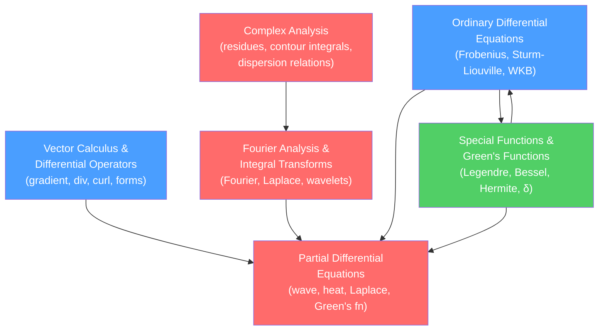

# 🧮 Mathematical Methods for Physics — Map of Content

> [!abstract] Section Overview
> Mathematical Methods for Physics covers the core toolkit every physicist needs: vector calculus and differential geometry, ordinary and partial differential equations, complex analysis, Fourier and integral transforms, and the special functions and Green's functions that tie them all together. These tools are the language in which physics is written — mastering them unlocks every advanced topic in the discipline.

## How the Topics Connect

## Recommended Learning Path

1. **[[Vector_Calculus_and_Differential_Operators]]** — The geometric language: grad, div, curl, theorems of Stokes and Gauss, curvilinear coordinates, differential forms.
2. **[[Ordinary_Differential_Equations]]** — First and second-order ODEs, Frobenius series solutions, Sturm-Liouville theory, Green's functions for ODEs, WKB.
3. **[[Special_Functions_and_Greens_Functions]]** — Legendre polynomials, spherical harmonics, Bessel functions, Hermite/Laguerre polynomials, gamma function, Green's functions.
4. **[[Partial_Differential_Equations]]** — Wave, heat, and Laplace equations; separation of variables; Green's functions for PDEs; distributions.
5. **[[Complex_Analysis_for_Physics]]** — Analytic functions, contour integration, residue theorem, dispersion relations, saddle-point method.
6. **[[Fourier_Analysis_and_Integral_Transforms]]** — Fourier series and transform, Laplace transform, distributions, FFT, wavelets.

## Notes in This Section

| Note | Core Ideas | Difficulty |
|------|-----------|------------|
| [[Vector_Calculus_and_Differential_Operators]] | Gradient, divergence, curl; Stokes/divergence theorems; curvilinear coordinates; differential forms | Secondary → Graduate |
| [[Ordinary_Differential_Equations]] | Separation of variables; Frobenius method; Sturm-Liouville; Green's functions; WKB | Secondary → Graduate |
| [[Partial_Differential_Equations]] | Wave/heat/Laplace; separation of variables; characteristics; distributions | Secondary → Graduate |
| [[Complex_Analysis_for_Physics]] | Cauchy's theorem; residues; contour integration; Kramers-Kronig; steepest descent | Secondary → Graduate |
| [[Fourier_Analysis_and_Integral_Transforms]] | Fourier series/transform; Laplace transform; convolution; FFT; wavelets | Secondary → Graduate |
| [[Special_Functions_and_Greens_Functions]] | Legendre; spherical harmonics; Bessel; Hermite; Laguerre; Green's functions | Secondary → Graduate |

## Connections to Other Physics Sections

- [[_MOC_Classical_Mechanics|Classical Mechanics]] — Euler-Lagrange equations (ODEs), normal modes (eigenvalue problems)
- [[_MOC_Electromagnetism|Electromagnetism]] — Maxwell's equations (vector calculus + PDEs), multipole expansion (Legendre polynomials)
- [[_MOC_Quantum_Mechanics|Quantum Mechanics]] — Schrödinger equation (PDE), hydrogen atom (special functions), operator formalism (functional analysis)
- [[_MOC_Statistical_Mechanics|Statistical Mechanics]] — Partition functions (complex analysis), generating functions (Laplace transform)
- [[_MOC_SS_Master|Signals & Systems]] — Fourier and Laplace transforms are shared backbone

#physics #mathematical-methods #moc
