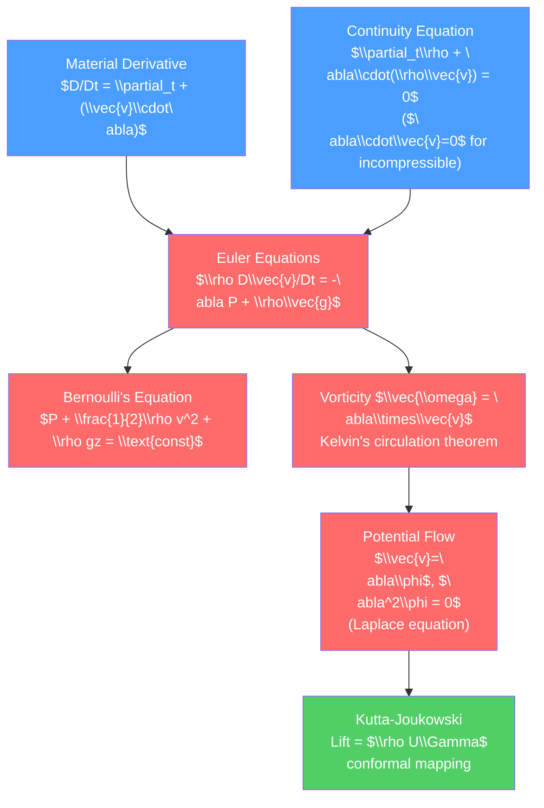

# 🌬️ Euler Equations and Ideal Fluids

> [!abstract] TL;DR
> The Euler equations govern the motion of ideal (inviscid, incompressible) fluids: $\rho D\vec{v}/Dt = -\nabla P + \rho\vec{g}$. Bernoulli's equation — that pressure plus kinetic energy density is constant along streamlines — follows directly and explains lift, carburetors, and the venturi effect. Vorticity $\vec{\omega}=\nabla\times\vec{v}$ is a conserved quantity in ideal flow (Kelvin's theorem), and irrotational (potential) flows $\nabla^2\phi=0$ can be solved analytically, connecting fluid dynamics to complex analysis.

## Intuition — analogy FIRST

Blow air over a piece of paper held horizontally in front of you: the paper rises. Fast-moving air above the paper creates low pressure (Bernoulli), and higher pressure below pushes the paper up. The same physics underlies airplane lift — the wing is shaped so air moves faster over the top than the bottom. The faster the flow, the lower the pressure — conservation of energy in a fluid.

---

## How It Works



---

## Key Concepts / Details

### Secondary Level

**Bernoulli's principle**: faster fluid has lower pressure. For steady, incompressible, inviscid flow along a streamline:
$$P + \tfrac{1}{2}\rho v^2 + \rho g z = \text{constant}$$

Applications:
- **Venturi effect**: flow through a constricted pipe speeds up, pressure drops. Used in carburetors, atomizers, and measuring flow rate (venturi meter).
- **Airplane lift**: wing shape (airfoil) causes air to travel faster over the top surface than the bottom, creating lower pressure on top → net upward force.
- **Pitot tube**: measures airspeed by comparing static pressure to stagnation pressure ($v=0$ at the tube opening): $v = \sqrt{2(P_{\text{stag}}-P_{\text{static}})/\rho}$.
- **Ball in a wind stream**: a spinning baseball or soccer ball curves due to the Magnus effect — spin creates asymmetric flow speed, hence asymmetric pressure.

### Undergraduate Level

**Material Derivative**

For a fluid property $f(\vec{r},t)$, the rate of change *following a fluid parcel*:
$$\frac{Df}{Dt} = \frac{\partial f}{\partial t} + (\vec{v}\cdot\nabla)f$$

The first term is the local time rate; the second is the *advective* (convective) term — the change due to the parcel moving into a region with different $f$.

**Continuity Equation** (mass conservation):
$$\frac{\partial\rho}{\partial t} + \nabla\cdot(\rho\vec{v}) = 0$$

For *incompressible* flow ($D\rho/Dt = 0$, equivalently $\rho=\text{const}$):
$$\nabla\cdot\vec{v} = 0$$

**Euler Equations**

Newton's second law for a fluid parcel:
$$\rho\frac{D\vec{v}}{Dt} = -\nabla P + \rho\vec{g}$$

Expanded:
$$\rho\left(\frac{\partial\vec{v}}{\partial t} + (\vec{v}\cdot\nabla)\vec{v}\right) = -\nabla P + \rho\vec{g}$$

The $(\vec{v}\cdot\nabla)\vec{v}$ term is nonlinear — the source of all complexity in fluid dynamics.

**Deriving Bernoulli's Equation**

Use the vector identity $(\vec{v}\cdot\nabla)\vec{v} = \nabla(v^2/2) - \vec{v}\times\vec{\omega}$ where $\vec{\omega}=\nabla\times\vec{v}$. For steady flow ($\partial_t\vec{v}=0$) along a streamline ($d\vec{l}\parallel\vec{v}$, so $(\vec{v}\times\vec{\omega})\cdot d\vec{l}=0$):

$$\nabla\!\left(\frac{P}{\rho} + \frac{v^2}{2} + gz\right) = 0 \text{ along streamline}$$

$$\boxed{P + \tfrac{1}{2}\rho v^2 + \rho gz = \text{const along a streamline}}$$

For irrotational flow ($\vec{\omega}=0$), Bernoulli holds throughout the flow, not just along streamlines.

**Vorticity and Circulation**

Vorticity: $\vec{\omega} = \nabla\times\vec{v}$ measures local rotation. The Euler vorticity equation:
$$\frac{D\vec{\omega}}{Dt} = (\vec{\omega}\cdot\nabla)\vec{v} - \vec{\omega}(\nabla\cdot\vec{v})$$

In incompressible 2D flow: $D\omega/Dt = 0$ — vorticity is advected (frozen into fluid parcels).

*Circulation*: $\Gamma = \oint_C \vec{v}\cdot d\vec{l} = \iint_S \vec{\omega}\cdot d\vec{A}$ (Stokes' theorem).

**Kelvin's Circulation Theorem**: for an ideal, barotropic ($\rho=\rho(P)$ only) fluid, the circulation around a material loop (moving with the fluid) is conserved:
$$\frac{D\Gamma}{Dt} = 0$$

This means: if vorticity is zero initially, it remains zero. Ideal flows starting from rest are irrotational.

**Potential Flow**

For irrotational flow, $\vec{\omega}=0$ implies $\vec{v} = \nabla\phi$ for a velocity potential $\phi$. With incompressibility: $\nabla\cdot\vec{v}=0$ gives:
$$\nabla^2\phi = 0 \quad \text{(Laplace equation)}$$

The *stream function* $\psi$ (2D): $v_x = \partial_y\psi$, $v_y = -\partial_x\psi$. Streamlines are contours of $\psi$. The complex potential $w(z) = \phi + i\psi$ is an analytic function — all of complex analysis applies.

Key potential flows (in 2D):
- Uniform flow: $w = Uz$
- Source/sink: $w = (m/2\pi)\ln z$
- Vortex: $w = -(i\Gamma/2\pi)\ln z$
- Doublet: $w = \mu/z$
- Flow past a cylinder: $w = U(z + a^2/z)$ — superposition of uniform flow + doublet

### Graduate Level

**Kutta-Joukowski Theorem**

For a 2D body with circulation $\Gamma$ in a uniform flow $U$, the lift per unit span:
$$L = \rho U\Gamma$$

This is exact for any airfoil shape (not just a circle) and any angle of attack. The direction of lift is perpendicular to $U$, toward the side with faster flow. For a rotating cylinder (Magnus effect), $\Gamma = 2\pi a^2 \Omega$ (from potential flow around a rotating cylinder).

**Conformal Mapping for Aerodynamics**

The Joukowski transform $z\mapsto \zeta = z + a^2/z$ maps a circle to an airfoil-like shape. If we know the potential flow around the circle (uniform flow + circulation), the map gives the flow around the airfoil:
$$w_{\text{airfoil}}(\zeta) = w_{\text{circle}}(z(\zeta))$$

The Kutta condition (smooth flow at the trailing edge) determines the circulation: $\Gamma = 4\pi Ua\sin\alpha$ where $\alpha$ is the angle of attack. This gives lift $L = \rho U\Gamma \propto \sin\alpha$ for thin symmetric airfoils.

**d'Alembert's Paradox and Its Resolution**

In ideal potential flow past any body, the drag is zero — pressure forces are symmetric front-to-back. This contradicts experience. Resolution: real flows separate at the trailing edge, forming a wake. The wake carries momentum away (drag). Even vanishingly small viscosity creates a boundary layer (see [[Viscous_Fluids_and_Navier_Stokes]]) that eventually separates, destroying the front-back symmetry.

**Helmholtz Vortex Theorems**

1. The strength of a vortex tube is constant along its length.
2. Vortex tubes move with the fluid (in ideal flow).
3. A vortex tube cannot end inside the fluid — it must close on itself or end at a boundary.

**Kelvin-Helmholtz Instability** (preview): at a velocity discontinuity (shear layer), small perturbations roll up into vortices — the mechanism behind clouds forming at wind shear layers and plasma jets.

```python
import numpy as np
import matplotlib.pyplot as plt

# Potential flow: uniform flow past a cylinder (2D)
# w(z) = U(z + a^2/z), velocity v = dw/dz = U(1 - a^2/z^2)

U = 1.0
a = 1.0  # cylinder radius
Gamma = 2.5  # circulation (for Magnus effect)

x = np.linspace(-4, 4, 500)
y = np.linspace(-4, 4, 500)
X, Y = np.meshgrid(x, y)
Z = X + 1j*Y
mask = np.abs(Z) < a

# Complex potential (with circulation)
W = U * (Z + a**2/Z) - 1j*Gamma/(2*np.pi) * np.log(Z)

# Stream function (imaginary part of W)
psi = np.imag(W)
psi[mask] = np.nan  # inside cylinder

# Velocity field
dW = U * (1 - a**2/Z**2) - 1j*Gamma/(2*np.pi*Z)
vx = np.real(dW)
vy = -np.imag(dW)
vx[mask] = np.nan
vy[mask] = np.nan

fig, axes = plt.subplots(1, 2, figsize=(14, 6))

# Streamlines
levels = np.linspace(-3, 3, 40)
cs = axes[0].contour(X, Y, psi, levels=levels, colors='#4a9eff', linewidths=0.8)
circle = plt.Circle((0, 0), a, color='#333', fill=True, zorder=5)
axes[0].add_patch(circle)
axes[0].set_aspect('equal')
axes[0].set_title(f'Potential flow past cylinder\nCirculation Γ={Gamma} (Magnus effect)')
axes[0].set_xlim(-4, 4); axes[0].set_ylim(-4, 4)
axes[0].set_xlabel('x/a'); axes[0].set_ylabel('y/a')

# Pressure distribution via Bernoulli: P + 0.5*rho*v^2 = const
rho = 1.0
v2 = vx**2 + vy**2
Cp = 1 - v2/U**2  # pressure coefficient

im = axes[1].contourf(X, Y, Cp, levels=40, cmap='RdBu_r')
circle2 = plt.Circle((0, 0), a, color='#333', fill=True, zorder=5)
axes[1].add_patch(circle2)
plt.colorbar(im, ax=axes[1], label='Pressure coefficient $C_p$')
axes[1].set_aspect('equal')
axes[1].set_title('Pressure field (Bernoulli)\nHigh pressure → low velocity')
axes[1].set_xlim(-4, 4); axes[1].set_ylim(-4, 4)

plt.tight_layout()
```

---

## Real-World Notes

- **Aviation**: lift on commercial aircraft is calculated using thin-airfoil theory (Kutta-Joukowski as a starting point), then corrected for viscous effects, compressibility, and 3D finite-span effects.
- **Sailing**: a sailboat sails upwind by generating circulation (lift) around the sail — the Kutta-Joukowski theorem applies to sails as to wings.
- **Blood flow**: in large arteries, flow is nearly ideal (Re ~ 4000); Bernoulli's equation estimates pressure drops across stenoses.
- **Meteorology**: large-scale atmospheric circulation (jet streams, hurricanes) is nearly inviscid; Kelvin's theorem explains how vorticity is conserved in ideal atmospheric dynamics.

---

## Common Pitfalls

1. **Bernoulli applies along streamlines only (unless irrotational)**: for rotational flows, $P + \frac{1}{2}\rho v^2 + \rho gz$ can differ between streamlines.
2. **Material derivative vs. partial derivative**: $\partial_t \vec{v}$ is the acceleration at a fixed point; $D\vec{v}/Dt$ is the acceleration of a fluid parcel. They differ by the advection term $(\vec{v}\cdot\nabla)\vec{v}$.
3. **Irrotational flow does not mean no rotation of fluid parcels globally**: $\vec{\omega}=0$ means no local solid-body rotation, but streamlines can curve — the fluid parcels rotate to align with curved streamlines without spinning about their own axes.
4. **Ideal fluid has no drag**: d'Alembert's paradox. Always add "inviscid approximation breaks down in the wake" when applying Euler equations to drag.
5. **Kelvin's theorem requires barotropic fluid**: for a non-barotropic fluid (e.g., stratified ocean), baroclinic torques ($\nabla\rho\times\nabla P\neq 0$) generate vorticity even in otherwise ideal flow.

---

## Related Concepts

- [[_MOC_Fluid_Mechanics|↑ Section MOC]]
- [[Fluid_Statics_and_Properties]] — Statics is the zero-velocity limit of Euler equations
- [[Viscous_Fluids_and_Navier_Stokes]] — Full equations with viscosity
- [[Waves_in_Fluids_and_Acoustics]] — Sound waves from linearized Euler equations
- [[Turbulence_and_Instabilities]] — Kelvin-Helmholtz instability from shear flow
- [[Vector_Calculus_and_Differential_Operators]] — Vorticity, circulation, and the curl operator

---

## Review Questions

1. **Secondary**: A pipe narrows from a cross-sectional area of $100\,\text{cm}^2$ to $25\,\text{cm}^2$. Water flows at $2\,\text{m/s}$ in the wide section. Use the continuity equation to find the speed in the narrow section, then use Bernoulli's equation to find the pressure difference. What device exploits this principle?
2. **Undergraduate**: Derive the vorticity equation $D\vec{\omega}/Dt = (\vec{\omega}\cdot\nabla)\vec{v}$ for incompressible ideal flow starting from the Euler equation. Explain the physical meaning of the term $(\vec{\omega}\cdot\nabla)\vec{v}$ — what happens to a vortex tube that is being stretched?
3. **Graduate**: Using the Joukowski transform $\zeta = z + a^2/z$, find the shape that a unit circle maps to. Derive the Kutta-Joukowski lift formula $L = \rho U\Gamma$ by computing the force from the pressure integral around the airfoil. Show that imposing the Kutta condition (finite velocity at trailing edge) fixes $\Gamma = 4\pi Ua\sin\alpha$.

---

## Sources

- Batchelor — *An Introduction to Fluid Dynamics*, Chs. 3–6
- Kundu, Cohen & Dowling — *Fluid Mechanics*, Chs. 3–6
- Milne-Thomson — *Theoretical Hydrodynamics*, Chs. 6–9 (potential flow, conformal maps)
- Acheson — *Elementary Fluid Dynamics*, Chs. 1–4

#physics #fluid-mechanics #Euler-equations #Bernoulli #potential-flow #vorticity #Kelvin-theorem #Kutta-Joukowski #undergraduate #graduate
