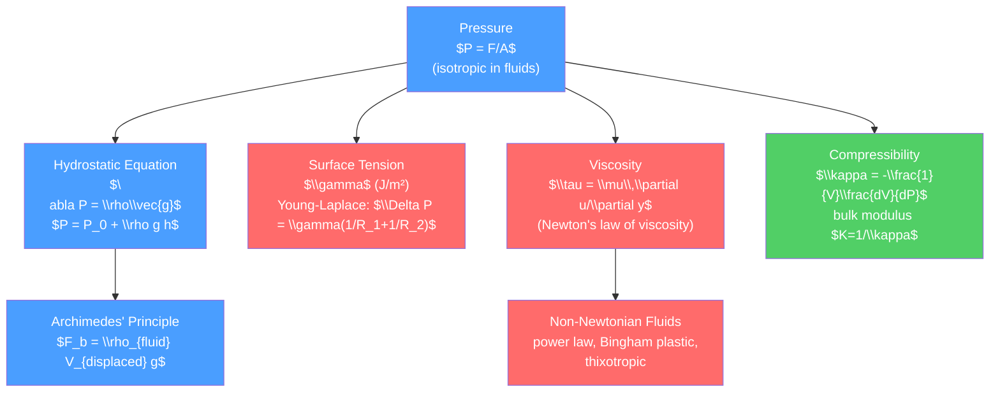

# 💧 Fluid Statics and Properties

> [!abstract] TL;DR
> Fluid statics describes fluids at rest: pressure increases with depth ($P = P_0 + \rho g h$), submerged objects feel an upward buoyant force equal to the weight of displaced fluid (Archimedes), and surface tension creates pressure jumps across curved interfaces (Young-Laplace equation). The material properties — viscosity, compressibility, and their non-Newtonian generalizations — determine how a fluid resists deformation and how it flows under stress.

## Intuition — analogy FIRST

A submarine at depth $d$ experiences the same pressure from all directions — the ocean does not "know" which way is into the submarine. That pressure $\rho g d$ acts on every square centimeter of hull equally. An ice cube in your drink is pushed up by the water it displaces — the surrounding water "wants" to fill the lower-energy configuration where heavy water is below light ice. Surface tension is why water beads on a waxy surface: the water-air interface stores energy $\gamma$ per unit area, and the interface curves to minimize that energy.

---

## How It Works



---

## Key Concepts / Details

### Secondary Level

**Pressure** is force per area, $P = F/A$, measured in Pascals (Pa = N/m²). Fluids transmit pressure equally in all directions (Pascal's principle): compressing one part of a fluid raises the pressure everywhere.

**Hydrostatic pressure**: pressure increases with depth because each layer of fluid must support the weight of fluid above it:
$$P(h) = P_0 + \rho g h$$
where $h$ is depth below the surface, $\rho$ is fluid density, $g=9.81\,\text{m/s}^2$.

**Archimedes' principle**: an object submerged in a fluid experiences an upward buoyant force equal to the weight of the fluid it displaces:
$$F_b = \rho_{\text{fluid}}\,V_{\text{displaced}}\,g$$

An object floats if $\rho_{\text{object}} < \rho_{\text{fluid}}$ (it displaces its own weight with only partial submersion). This is why ships float despite being made of steel — the hull encloses air, making the average density less than water.

### Undergraduate Level

**Hydrostatic Equation**

In vector form, the condition for a fluid at rest ($\vec{v}=0$, $\partial_t=0$) is:
$$\nabla P = \rho\vec{g}$$

For incompressible fluid ($\rho = \text{const}$) with $\vec{g} = -g\hat{z}$:
$$P(z) = P_0 - \rho g z \quad \text{(increasing downward)}$$

**Pascal's Principle**: A hydraulic press amplifies force — pressure $P$ applied to area $A_1$ produces force $PA_2$ at area $A_2 > A_1$, while displacement is reduced by the same factor (work conservation).

**Surface Tension and Capillarity**

The liquid-gas interface carries energy $\gamma$ per unit area (surface tension, units: N/m or J/m²). Values: water-air $\gamma \approx 0.073$ N/m at 20°C; mercury-air $\gamma \approx 0.485$ N/m.

For a curved interface, the pressure jump (Young-Laplace equation):
$$\Delta P = P_{\text{inside}} - P_{\text{outside}} = \gamma\!\left(\frac{1}{R_1}+\frac{1}{R_2}\right)$$

where $R_1, R_2$ are principal radii of curvature. Special cases:
- Spherical bubble (soap, two surfaces): $\Delta P = 4\gamma/R$
- Spherical droplet (one surface): $\Delta P = 2\gamma/R$
- Cylindrical jet: $\Delta P = \gamma/R$

**Young's equation** for contact angle $\theta_c$ (where solid-liquid-vapor meet):
$$\gamma_{SV} = \gamma_{SL} + \gamma_{LV}\cos\theta_c$$

$\theta_c < 90°$: wetting (hydrophilic); $\theta_c > 90°$: non-wetting (hydrophobic). Capillary rise height: $h = 2\gamma\cos\theta_c/(\rho g r)$ — water climbs in a narrow tube.

**Viscosity: Newton's Law of Viscosity**

For a fluid between two plates (distance $d$, top plate moving at velocity $U$), the shear stress:
$$\tau = \mu\frac{\partial u}{\partial y}$$

where $\mu$ (Pa·s = kg/(m·s)) is the *dynamic viscosity* and $\partial u/\partial y$ is the velocity gradient (shear rate). The *kinematic viscosity* $\nu = \mu/\rho$ (m²/s).

Water at 20°C: $\mu \approx 10^{-3}$ Pa·s. Air: $\mu \approx 1.8\times 10^{-5}$ Pa·s. Honey: $\mu \approx 2$ Pa·s.

**Newtonian vs. Non-Newtonian Fluids**

*Newtonian*: $\tau = \mu\dot\gamma$ (linear, $\mu$ constant). Water, air, most simple liquids.

*Power-law (Ostwald-de Waele)*: $\tau = K\dot\gamma^n$.
- $n<1$: shear-thinning (paint, ketchup — flows more easily when stirred)
- $n>1$: shear-thickening / dilatant (cornstarch in water — becomes solid when hit)

*Bingham plastic*: $\tau = \tau_0 + \mu_p\dot\gamma$ for $\tau > \tau_0$, solid for $\tau < \tau_0$ (toothpaste, mayonnaise, lava).

*Thixotropic*: viscosity decreases with sustained shear (yogurt, blood at high shear).

**Compressibility**

The bulk modulus $K$ (or isothermal compressibility $\kappa = 1/K$):
$$K = -V\frac{dP}{dV} = \rho\frac{dP}{d\rho}$$

For water: $K \approx 2.2$ GPa (nearly incompressible). For ideal gas: $K = \gamma P$ (adiabatic). Compressibility governs the speed of sound: $c_s = \sqrt{K/\rho}$.

### Graduate Level

**Atmospheric Structure and Scale Height**

For an ideal gas atmosphere with temperature $T(z)$: combining $\nabla P = \rho g$ with $P=\rho RT/M$ (gas law) and $\rho = MP/(RT)$ gives:
$$\frac{dP}{dz} = -\frac{Mg}{RT}P \implies P(z) = P_0\exp\!\left(-\int_0^z \frac{Mg}{RT(z')}dz'\right)$$

For isothermal atmosphere: $P = P_0 e^{-z/H}$ with *scale height* $H = RT/(Mg) \approx 8.5$ km for Earth's troposphere.

*Potential temperature*: $\Theta = T(P_0/P)^{R/c_p}$ is conserved in adiabatic vertical displacement. Atmospheric stability requires $d\Theta/dz > 0$.

**Viscous Stress Tensor**

In the full tensorial form, the viscous stress in a Newtonian fluid:
$$\sigma_{ij} = -P\delta_{ij} + \mu\left(\frac{\partial v_i}{\partial x_j} + \frac{\partial v_j}{\partial x_i}\right) + \lambda\,\delta_{ij}\,\nabla\cdot\vec{v}$$

Here $\mu$ is the *shear viscosity* and $\lambda$ is the *second viscosity* (bulk viscosity), related to internal energy relaxation. Stokes hypothesis: $\lambda = -\frac{2}{3}\mu$ (valid for monatomic gases). The second viscosity matters for sound absorption and rapidly compressed flows.

The strain rate tensor: $e_{ij} = \frac{1}{2}(\partial_i v_j + \partial_j v_i)$. Newtonian fluid: $\tau_{ij} = 2\mu e_{ij} + \lambda e_{kk}\delta_{ij}$.

```python
import numpy as np
import matplotlib.pyplot as plt

# Visualize: capillary rise, pressure-depth, non-Newtonian rheology
fig, axes = plt.subplots(1, 3, figsize=(14, 5))

# 1. Hydrostatic pressure vs depth
depth = np.linspace(0, 100, 200)
rho_water = 1000  # kg/m^3
g = 9.81
P_gauge = rho_water * g * depth / 1e5  # in bar
axes[0].plot(P_gauge, depth, color='#4a9eff', lw=2)
axes[0].invert_yaxis()
axes[0].set_xlabel('Gauge pressure (bar)')
axes[0].set_ylabel('Depth (m)')
axes[0].set_title('Hydrostatic pressure vs depth\n(freshwater)')
axes[0].axhline(10, color='#ff6b6b', linestyle='--', label='10 m → ~1 bar')
axes[0].legend()

# 2. Capillary rise vs tube radius
r = np.linspace(0.05e-3, 2e-3, 200)  # radius in meters
gamma = 0.073  # N/m (water-air)
rho = 1000; theta_c = 0  # complete wetting
h_cap = 2 * gamma * np.cos(theta_c) / (rho * g * r) * 100  # cm
axes[1].plot(r*1e3, h_cap, color='#51cf66', lw=2)
axes[1].set_xlabel('Tube radius (mm)')
axes[1].set_ylabel('Capillary rise height (cm)')
axes[1].set_title('Capillary rise: $h = 2\\gamma\\cos\\theta/(\\rho g r)$\n(water, complete wetting)')

# 3. Non-Newtonian rheology: stress vs shear rate
gamma_dot = np.linspace(0, 100, 300)  # shear rate s^{-1}
mu_newtonian = 0.01  # Pa.s
K, n_thin, n_thick = 0.01, 0.5, 1.5
tau_0 = 0.2  # Bingham yield stress

tau_newton = mu_newtonian * gamma_dot
tau_thinning = K * gamma_dot**n_thin
tau_thickening = K * gamma_dot**n_thick
tau_bingham = tau_0 + mu_newtonian * gamma_dot

axes[2].plot(gamma_dot, tau_newton, label='Newtonian', color='#4a9eff', lw=2)
axes[2].plot(gamma_dot, tau_thinning, label='Shear-thinning (n=0.5)', color='#ff6b6b', lw=2)
axes[2].plot(gamma_dot, tau_thickening, label='Shear-thickening (n=1.5)', color='#51cf66', lw=2)
axes[2].plot(gamma_dot, tau_bingham, '--', label='Bingham plastic', color='#ffd700', lw=2)
axes[2].set_xlabel(r'Shear rate $\dot{\gamma}$ (s$^{-1}$)')
axes[2].set_ylabel(r'Shear stress $\tau$ (Pa)')
axes[2].set_title('Non-Newtonian rheology')
axes[2].legend(fontsize=8)

plt.tight_layout()
```

---

## Real-World Notes

- **Submarines**: pressure hull design must withstand $P = \rho g h \approx 1$ MPa per 100 m depth; deep-sea vessels (bathyscaphes) go to ~10 km depth (~100 MPa).
- **Biology**: surface tension maintains the fluid lining of alveoli in the lungs; pulmonary surfactant reduces $\gamma$ to prevent alveolar collapse (atelectasis).
- **Oil drilling**: drilling mud is engineered as a Bingham plastic — it circulates during drilling but "gels" to hold cuttings in suspension when the pump stops.
- **Inkjet printing**: the fluid must have a precisely tuned viscosity so that it flows through nozzles but forms stable droplets on impact.

---

## Common Pitfalls

1. **Gauge vs. absolute pressure**: hydrostatic formula gives *gauge* pressure above ambient. For compressibility and thermodynamics, use *absolute* pressure.
2. **Archimedes and partial submersion**: a floating object displaces fluid equal to its own weight, NOT its own volume. The volume displaced is less than the total volume.
3. **Young-Laplace signs**: the pressure is *higher inside* a curved interface that is concave outward (a droplet or bubble). For a soap film (two surfaces), the factor of 2 doubles the pressure jump.
4. **Dynamic vs. kinematic viscosity**: $\mu$ [Pa·s] and $\nu = \mu/\rho$ [m²/s] — the Reynolds number uses $\nu$, not $\mu$. Water has lower $\nu$ than air at the same temperature, despite higher $\mu$.
5. **Inviscid $\neq$ zero viscosity everywhere**: even fluids with $\mu\to 0$ can have singular viscous layers. The "inviscid" ideal-fluid approximation fails near walls.

---

## Related Concepts

- [[_MOC_Fluid_Mechanics|↑ Section MOC]]
- [[Euler_Equations_and_Ideal_Fluids]] — Inviscid fluid dynamics from the static base
- [[Viscous_Fluids_and_Navier_Stokes]] — Full equations including viscous stress tensor
- [[Waves_in_Fluids_and_Acoustics]] — Sound speed depends on compressibility

---

## Review Questions

1. **Secondary**: A wooden block (density 600 kg/m³, volume 0.01 m³) floats in water. What fraction of it is submerged? If instead placed in oil of density 800 kg/m³, what fraction is submerged?
2. **Undergraduate**: Derive the capillary rise formula $h = 2\gamma\cos\theta_c/(\rho g r)$ by balancing the surface tension force (pulling the liquid up at the contact line) against the weight of the liquid column. For water in glass ($\theta_c \approx 0$, $r = 0.5$ mm), calculate $h$. Why does capillary rise decrease as $r$ increases?
3. **Graduate**: Write the full viscous stress tensor $\sigma_{ij}$ for a Newtonian fluid. What is Stokes' hypothesis and when does it fail? For a fluid undergoing pure compression ($\vec{v} = -\alpha\vec{r}$, uniform compression rate $\alpha$), compute the stress and show that bulk viscosity contributes while shear viscosity does not.

---

## Sources

- Batchelor — *An Introduction to Fluid Dynamics*, Chs. 1–3
- Kundu, Cohen & Dowling — *Fluid Mechanics*, Chs. 1–2
- White — *Fluid Mechanics*, Ch. 1 (properties) and Ch. 2 (statics)
- de Gennes, Brochard-Wyart & Quéré — *Capillarity and Wetting Phenomena*

#physics #fluid-mechanics #hydrostatics #Archimedes #surface-tension #viscosity #non-Newtonian #undergraduate #graduate
