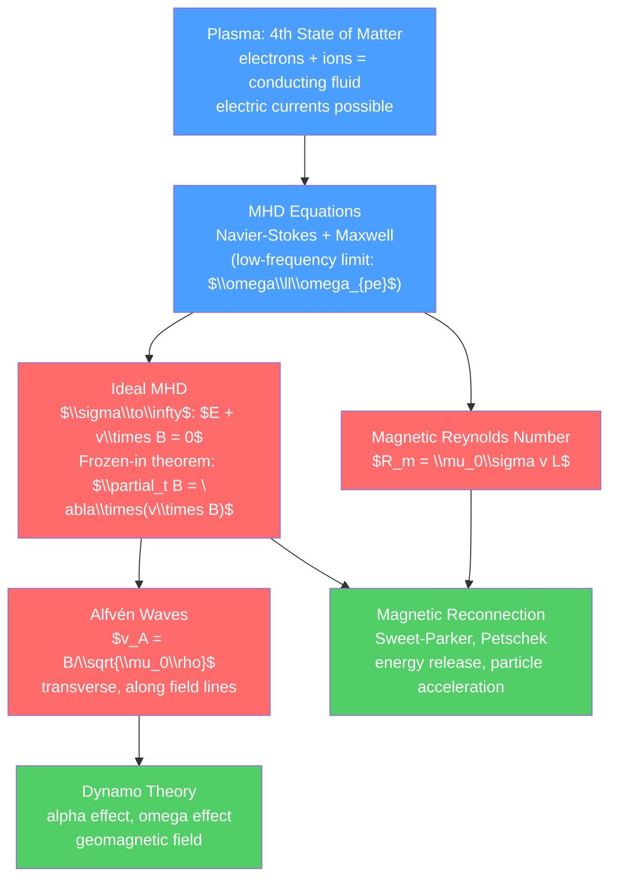

# ⚡ Magnetohydrodynamics

> [!abstract] TL;DR
> Magnetohydrodynamics (MHD) describes electrically conducting fluids — plasmas, liquid metals, ionized gases — where magnetic and fluid forces are tightly coupled. In ideal MHD, magnetic flux is frozen into the fluid (Alfvén's theorem), and transverse waves called Alfvén waves propagate along field lines at speed $v_A = B/\sqrt{\mu_0\rho}$. Magnetic reconnection breaks this frozen-in condition in thin current sheets, releasing enormous energy — powering solar flares, substorms, and being a candidate process in astrophysical jets. Dynamo theory explains how fluid motion generates and sustains the magnetic fields of planets and stars.

## Intuition — analogy FIRST

In ideal MHD, magnetic field lines behave like elastic strings embedded in the fluid — they are carried along by the fluid (frozen in), store tension ($B^2/\mu_0$ per unit area), and resist bending (magnetic tension restores displaced field lines, giving Alfvén waves). When two oppositely directed field lines are pushed together in a thin current sheet, they can "snap and reconnect" — releasing the stored magnetic energy as heat and particle acceleration. This is what causes solar flares: a billion tonnes of magnetized plasma being flung into space in minutes.

---

## How It Works



---

## Key Concepts / Details

### Secondary Level

**Plasma: the fourth state of matter**

At sufficiently high temperatures, atoms ionize — electrons are freed from nuclei. The result is a quasineutral gas of ions and electrons: a *plasma*. Plasmas are by far the most abundant form of visible matter in the universe:
- Stars (the Sun is a plasma ball)
- Lightning (briefly — $\sim 30{,}000$ K)
- Aurora borealis (charged particles from the solar wind hitting the upper atmosphere)
- Neon signs, fluorescent lights
- Fusion reactors (tokamaks)

Plasmas conduct electricity because free electrons and ions can carry current. A moving conductor in a magnetic field generates an EMF — so the fluid and the magnetic field are electromagnetically coupled.

**Everyday MHD**:
- Liquid metal cooling in nuclear reactors: liquid sodium ($\sigma \sim 10^7$ S/m) pumped by electromagnetic (MHD) pumps — no moving parts
- Earth's liquid iron outer core: convective MHD generates the geomagnetic field
- Sunspots: regions where strong magnetic fields suppress convection (cooler, darker)

### Undergraduate Level

**MHD Equations**

Combine the incompressible Navier-Stokes equations with Maxwell's equations in the low-frequency (MHD) limit ($\omega \ll \omega_{pe}$, displacement current neglected):

*Momentum equation*:
$$\rho\frac{D\vec{v}}{Dt} = -\nabla P + \frac{1}{\mu_0}(\nabla\times\vec{B})\times\vec{B} + \mu\nabla^2\vec{v}$$

The magnetic force (Lorentz force density) $\vec{J}\times\vec{B} = (\nabla\times\vec{B})\times\vec{B}/\mu_0$ splits as:
$$\frac{(\nabla\times\vec{B})\times\vec{B}}{\mu_0} = \frac{1}{\mu_0}(\vec{B}\cdot\nabla)\vec{B} - \nabla\frac{B^2}{2\mu_0}$$

The first term is *magnetic tension* ($B^2/\mu_0$ per unit length, acts to straighten field lines). The second is *magnetic pressure gradient* ($B^2/(2\mu_0)$ acts like an outward pressure).

*Induction equation* (from Faraday's law + Ohm's law for a conductor):
$$\frac{\partial\vec{B}}{\partial t} = \nabla\times(\vec{v}\times\vec{B}) + \frac{1}{\mu_0\sigma}\nabla^2\vec{B}$$

*Continuity*: $\nabla\cdot\vec{v}=0$ (incompressible); $\nabla\cdot\vec{B}=0$ (always).

**Magnetic Reynolds Number**

The dimensionless ratio of magnetic advection to magnetic diffusion:
$$R_m = \mu_0\sigma v L$$

- $R_m \ll 1$: magnetic field diffuses rapidly through the fluid (laboratory MHD, $R_m \sim 10^{-2}$–$10^2$)
- $R_m \gg 1$: magnetic field is "frozen" into the fluid (stellar interiors, $R_m \sim 10^8$–$10^{12}$)

**Ideal MHD and Alfvén's Frozen-in Theorem**

When $\sigma\to\infty$ (perfect conductor), the induction equation becomes:
$$\frac{\partial\vec{B}}{\partial t} = \nabla\times(\vec{v}\times\vec{B})$$

This is the kinematic equation for a vector field "frozen into" the flow. *Alfvén's theorem*: magnetic flux through any material surface (moving with the fluid) is conserved:
$$\frac{d}{dt}\iint_S\vec{B}\cdot d\vec{A} = 0$$

Consequence: magnetic field lines move with the plasma. If you grab the plasma, you grab the field lines; if the field lines move, the plasma moves. This couples plasma and field dynamics intimately.

**Alfvén Waves**

Small perturbations $\vec{b} = \vec{B}_0 + \vec{b}'$, $\vec{v} = \vec{v}'$ around a uniform field $\vec{B}_0$ in ideal, incompressible MHD:

$$\rho_0\partial_t\vec{v}' = \frac{1}{\mu_0}(\vec{B}_0\cdot\nabla)\vec{b}'$$
$$\partial_t\vec{b}' = (\vec{B}_0\cdot\nabla)\vec{v}'$$

These give a wave equation for $\vec{v}'$ propagating along $\vec{B}_0$ at the *Alfvén speed*:
$$v_A = \frac{B_0}{\sqrt{\mu_0\rho_0}}$$

Alfvén waves are transverse (like electromagnetic waves or waves on a string), propagate along field lines, and carry magnetic and kinetic energy equally. They are the dominant low-frequency wave in magnetized plasmas.

Also present: *fast* and *slow magnetosonic waves* (compressible), which propagate at angles to $\vec{B}_0$ and modify the sound speed with magnetic pressure.

### Graduate Level

**MHD Instabilities**

- *Kink instability* (sausage: $m=0$, kink: $m=1$): a current-carrying flux tube is unstable if the current exceeds a threshold (Kruskal-Shafranov condition). Kink drives coronal loop oscillations; sausage drives filament pinching.
- *Tearing mode instability*: in current sheets, the frozen-in condition breaks down over thin resistive layers ($\delta \sim R_m^{-1/2}$), allowing reconnection. Growth rate $\gamma \sim \tau_A^{-3/5}\tau_R^{-2/5}$ (geometric mean of Alfvén and resistive time scales).

**Magnetic Reconnection**

In ideal MHD, field lines cannot break or reconnect — topology is conserved. But in thin current sheets with finite resistivity, field lines with opposite orientations can reconnect, releasing free magnetic energy.

*Sweet-Parker model* (slow reconnection): current sheet of length $L$, thickness $\delta \sim L/\sqrt{R_m}$. Reconnection rate:
$$v_{\text{in}}/v_A = R_m^{-1/2}$$

For solar corona ($R_m \sim 10^{12}$): predicted rate $v_{\text{in}} \sim 10^{-6}v_A$ — too slow by orders of magnitude compared to observed flare timescales.

*Petschek model* (fast reconnection): most reconnection is mediated by standing slow-mode shocks, not the resistive layer. Rate: $v_{\text{in}} \sim v_A/\ln R_m$ — much faster. Though Petschek's mechanism requires localized resistivity enhancement; the details are still debated.

**Dynamo Theory**

How does Earth maintain its magnetic field? The dynamo mechanism converts kinetic energy of the conducting liquid iron in the outer core into magnetic energy.

*Cowling's theorem*: no steady axisymmetric magnetic field can be maintained by a dynamo — the field must be 3D.

*$\alpha$-$\Omega$ dynamo*: two key ingredients:
1. *$\Omega$ effect*: differential rotation ($\Omega(r)$) stretches poloidal field into toroidal field
2. *$\alpha$ effect*: helical turbulence twists toroidal field back into poloidal field (with cyclonic convection)

The mean-field dynamo equation:
$$\frac{\partial\bar{\vec{B}}}{\partial t} = \nabla\times(\alpha\bar{\vec{B}}) + \nabla\times(\bar{\vec{v}}\times\bar{\vec{B}}) + \eta\nabla^2\bar{\vec{B}}$$

where $\alpha$ is a pseudoscalar (helicity of turbulence) and $\eta = 1/(\mu_0\sigma)$ is magnetic diffusivity.

**Solar Wind and Heliosphere**

The Sun continuously emits a supersonic plasma outflow — the *solar wind* — with $v_{SW} \sim 400$–$800$ km/s, $n \sim 10$ cm$^{-3}$, $B \sim 5$ nT at 1 AU. The solar wind shapes the heliosphere (a MHD bubble extending to $\sim 100$ AU) and drives space weather.

The *Parker spiral*: solar wind + solar rotation wrap the embedded magnetic field into an Archimedean spiral. Earth's magnetosphere is carved out by the solar wind pressure balancing Earth's dipole field.

**Jet Formation in AGN**

Active galactic nuclei (AGN) and microquasars launch relativistic jets extending to Mpc scales. The Blandford-Znajek mechanism: magnetic fields threading a rotating black hole extract rotational energy via the Penrose process, driving a Poynting-flux-dominated outflow that collimates into a jet. The jet then becomes MHD-turbulent and particle accelerates via shocks and reconnection.

```python
import numpy as np
import matplotlib.pyplot as plt

# Visualize Alfvén wave and frozen-in field line motion

# Setup: 2D field line stretching (frozen-in)
fig, axes = plt.subplots(1, 3, figsize=(15, 5))

# 1. Alfvén wave dispersion relation (vs MHD wave modes)
theta = np.linspace(0, np.pi/2, 100)  # angle between k and B
v_A = 1.0; c_s = 0.7  # Alfvén and sound speeds

# Alfvén mode: v = v_A cos(theta)
v_alfven = v_A * np.abs(np.cos(theta))

# Fast and slow magnetosonic modes:
vA2, cs2 = v_A**2, c_s**2
fast = np.sqrt(0.5*(vA2+cs2 + np.sqrt((vA2+cs2)**2 - 4*cs2*vA2*np.cos(theta)**2)))
slow = np.sqrt(0.5*(vA2+cs2 - np.sqrt((vA2+cs2)**2 - 4*cs2*vA2*np.cos(theta)**2)))

axes[0].plot(np.degrees(theta), v_alfven, '#4a9eff', lw=2, label=r'Alfvén: $v_A|\cos\theta|$')
axes[0].plot(np.degrees(theta), fast, '#ff6b6b', lw=2, label='Fast magnetosonic')
axes[0].plot(np.degrees(theta), slow, '#51cf66', lw=2, label='Slow magnetosonic')
axes[0].set_xlabel(r'Angle $\theta$ between $\vec{k}$ and $\vec{B}_0$ (degrees)')
axes[0].set_ylabel('Phase speed / $v_A$')
axes[0].set_title('MHD Wave Modes')
axes[0].legend(fontsize=9)

# 2. Frozen-in field lines: flux tube deformation
# Show field lines frozen into a shear flow: v_x = v_0 * y, B initially vertical
x = np.linspace(0, 2*np.pi, 40)
y0 = np.linspace(0, 1, 5)  # field line labels
t_vals = [0, 0.5, 1.0]

for t, lw, alpha in zip(t_vals, [2, 1.5, 1], [1, 0.7, 0.4]):
    for y in y0:
        # Shear: x -> x + v0*y*t, y -> y (horizontal shear)
        x_def = x + 0.5*y*t  # shear
        y_arr = np.ones_like(x) * y
        axes[1].plot(x_def % (2*np.pi), y_arr + 0.01*np.sin(3*x),
                    color='#4a9eff', lw=lw, alpha=alpha)
axes[1].set_xlim(0, 2*np.pi); axes[1].set_ylim(-0.1, 1.1)
axes[1].set_title("Frozen-in field lines:\n shear stretches $\\vec{B}$")
axes[1].set_xlabel('x'); axes[1].set_ylabel('y')

# 3. Magnetic reconnection current sheet: B-field reversal
y_rec = np.linspace(-3, 3, 200)
x_rec = np.linspace(-5, 5, 200)
X_rec, Y_rec = np.meshgrid(x_rec, y_rec)

# Harris sheet: B_x = B0 tanh(y/a), B_y = 0
B0 = 1.0; a = 0.5
Bx = B0 * np.tanh(Y_rec / a)
By = np.zeros_like(Bx)

# Stream function for field lines: phi = B0*a*ln(cosh(y/a))
Phi = B0 * a * np.log(np.cosh(Y_rec / a))

cs_rec = axes[2].contour(X_rec, Y_rec, Phi, levels=15, colors='#4a9eff', linewidths=1)
axes[2].axhline(0, color='#ff6b6b', lw=2, linestyle='--', label='Current sheet (X-line)')
# Show reconnection outflow arrows
axes[2].annotate('', xy=(3, 0), xytext=(1, 0),
                arrowprops=dict(arrowstyle='->', color='#ff6b6b', lw=2))
axes[2].annotate('', xy=(-3, 0), xytext=(-1, 0),
                arrowprops=dict(arrowstyle='->', color='#ff6b6b', lw=2))
axes[2].set_title('Magnetic reconnection:\nHarris current sheet')
axes[2].set_xlabel('x/L'); axes[2].set_ylabel('y/L')
axes[2].legend()

plt.tight_layout()
```

---

## Real-World Notes

- **Fusion energy (ITER)**: tokamaks confine plasma at $10^8$ K using strong magnetic fields. MHD instabilities (kink, ballooning modes) limit plasma pressure and must be controlled for net energy gain.
- **Space weather**: solar flares and coronal mass ejections (CMEs) — driven by magnetic reconnection on the Sun — can disrupt GPS satellites, power grids (as in the 1989 Quebec blackout), and pose radiation hazards to astronauts.
- **Earth's geomagnetic field**: generated by MHD dynamo in the liquid outer core. The field protects Earth's atmosphere from solar wind stripping — crucial for habitability. Field reversals ($\sim$every 300 kyr on average) are recorded in volcanic rocks.
- **Electromagnetic stirring**: in steel foundries, MHD forces stir liquid steel to prevent segregation — a direct industrial application of the Lorentz force on conducting fluid.

---

## Common Pitfalls

1. **MHD is a low-frequency approximation**: MHD is valid for $\omega \ll \omega_{ci}$ (ion cyclotron frequency) and $k\rho_i \ll 1$ (scales much larger than ion gyroradius). At shorter scales, kinetic effects (wave-particle resonances) dominate.
2. **Ideal MHD conserves topology — reconnection requires non-ideal effects**: in numerical simulations, numerical diffusion can cause spurious reconnection. Grid resolution must be sufficient to resolve the resistive layer.
3. **Alfvén speed can exceed light speed — unphysical**: in extremely low-density, strongly magnetized plasmas (e.g., pulsar magnetospheres), $v_A = B/\sqrt{\mu_0\rho}$ formally exceeds $c$. This signals breakdown of non-relativistic MHD; use relativistic MHD (RMHD) instead.
4. **Magnetic pressure $\neq$ gas pressure**: the plasma $\beta = P_{\text{gas}}/(B^2/2\mu_0)$ parameter controls which dominates. High-$\beta$ (solar interior): gas dominates. Low-$\beta$ (corona, magnetosphere): magnetic dominates. Much of the non-intuitive corona behavior comes from $\beta \ll 1$.
5. **Cowling's theorem limitation**: mean-field dynamo theory uses the $\alpha$ effect (parameterizing helical turbulence) — this requires turbulence. The $\alpha$ effect cannot be measured directly; uncertainty in $\alpha$ limits predictive power for geomagnetic reversals.

---

## Related Concepts

- [[_MOC_Fluid_Mechanics|↑ Section MOC]]
- [[Euler_Equations_and_Ideal_Fluids]] — MHD extends Euler with magnetic force; Kelvin's theorem has a magnetic analog
- [[Viscous_Fluids_and_Navier_Stokes]] — Full MHD includes viscous dissipation
- [[Waves_in_Fluids_and_Acoustics]] — Alfvén and magnetosonic waves alongside acoustic waves
- [[Turbulence_and_Instabilities]] — MHD turbulence; Alfvénic cascade in the solar wind

---

## Review Questions

1. **Secondary**: List five naturally occurring or man-made plasmas. Explain in words why a plasma, unlike a neutral gas, can be confined by magnetic fields. What does it mean for a field line to be "frozen into" the plasma?
2. **Undergraduate**: Derive the Alfvén wave dispersion relation $\omega = k_\parallel v_A$ by linearizing the ideal MHD equations around a uniform background field $\vec{B}_0$. What is the physical restoring force? Why do Alfvén waves propagate only along field lines? Calculate the Alfvén speed in the solar corona ($B\sim 100$ G, $n\sim 10^9$ cm$^{-3}$) and compare to the sound speed.
3. **Graduate**: Explain the Sweet-Parker reconnection model: what is the geometry of the current sheet, what determines its thickness $\delta$, and what is the reconnection rate $v_{\text{in}}/v_A$? Why is this rate too slow for solar flares? What does the Petschek model change, and what is the maximum reconnection rate? What observational or simulation evidence distinguishes the two models?

---

## Sources

- Priest & Forbes — *Magnetic Reconnection: MHD Theory and Applications* (definitive)
- Davidson — *An Introduction to Magnetohydrodynamics* (clear, rigorous)
- Moffatt — *Magnetic Field Generation in Electrically Conducting Fluids* (dynamo theory)
- Goedbloed, Keppens & Poedts — *Advanced Magnetohydrodynamics* (graduate)

#physics #fluid-mechanics #MHD #magnetohydrodynamics #Alfvén-waves #magnetic-reconnection #dynamo-theory #plasma #undergraduate #graduate
