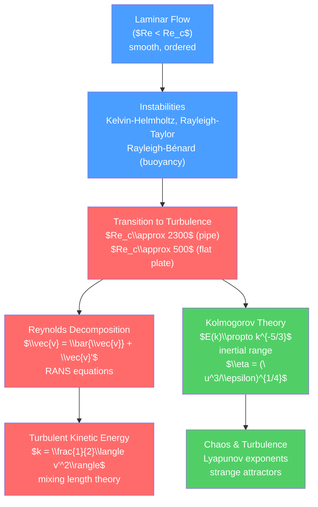

# 🌪️ Turbulence and Instabilities

> [!abstract] TL;DR
> Turbulence is the chaotic, multi-scale motion that arises when inertial forces overwhelm viscosity ($Re \gg Re_c$). Kolmogorov's 1941 theory predicts the energy spectrum $E(k)\propto k^{-5/3}$ in the inertial range, connecting the macroscopic energy injection scale to the microscopic dissipation scale $\eta = (\nu^3/\epsilon)^{1/4}$. Flow instabilities — Kelvin-Helmholtz (shear), Rayleigh-Taylor (stratification), Rayleigh-Bénard (buoyancy) — provide the mechanisms by which laminar flows break down and transition to turbulence.

## Intuition — analogy FIRST

Turn a kitchen tap slowly: the water flows in a smooth, glassy column (laminar flow). Turn it fully: the water becomes opaque and chaotic (turbulent). The transition happens around Reynolds number $Re \approx 2300$ for pipe flow. Turbulence is not random noise — it has structure at every scale, from the pipe diameter down to tiny dissipating eddies. Like a cascade of eddies eating smaller eddies: energy flows from large scales (where it is injected) to small scales (where it is dissipated by viscosity).

---

## How It Works



---

## Key Concepts / Details

### Secondary Level

**Laminar vs. turbulent flow** in everyday life:
- Tap water at low flow: smooth, transparent — laminar
- Tap water at high flow: opaque, churning — turbulent
- Cigarette smoke rising from a still tip: initially laminar, then breaks into turbulent curls at ~20 cm
- Clouds: turbulent (look at the billowing edges of cumulus)

The transition is controlled by **Reynolds number** $Re = \rho v L/\mu$:
- $Re < 2300$ (pipe): laminar
- $2300 < Re < 4000$: transitional
- $Re > 4000$: fully turbulent

High viscosity suppresses turbulence: thick liquids (honey, syrup) stay laminar. Low viscosity or high speed or large scale (rivers, jet engines, the atmosphere) → turbulent.

### Undergraduate Level

**Critical Reynolds Numbers and Transition**

Transition to turbulence depends on geometry:
- Pipe flow: $Re_c \approx 2300$ (but can be maintained laminar up to $Re \sim 10^5$ with very careful conditions)
- Flow past a flat plate: $Re_c \approx 5\times 10^5$
- Flow past a sphere: $Re_c \approx 200{,}000$ (drag crisis: sudden drop in drag coefficient)

**Hydrodynamic Instabilities**

*Kelvin-Helmholtz instability*: at the interface between two fluid layers moving at different velocities, small perturbations grow exponentially. Growth rate for a sinusoidal perturbation of wavenumber $k$:
$$\sigma = k\frac{|U_1 - U_2|}{2}\left(1 - \frac{4g\Delta\rho}{\rho k(U_1-U_2)^2}\right)^{1/2}$$

When the velocity difference dominates gravity, all wavenumbers grow. Visible as the rolling "cat's eye" vortices at cloud edges and the ocean surface.

*Rayleigh-Taylor instability*: a heavy fluid on top of a lighter fluid is unstable. Small perturbations at the interface grow, with growth rate $\sigma = \sqrt{Akg}$ where $A = (\rho_2-\rho_1)/(\rho_2+\rho_1)$ is the Atwood number. Examples: mushroom clouds, ICF implosion, supernova ejecta.

*Rayleigh-Bénard convection*: a fluid layer heated from below. When the Rayleigh number $Ra = g\alpha\Delta T L^3/(\nu\kappa)$ exceeds $Ra_c \approx 1708$, the conductive state becomes unstable and convection cells form. Earth's mantle convection, solar granulation.

**Reynolds Decomposition**

Write $\vec{v} = \bar{\vec{v}} + \vec{v}'$ where $\bar{\vec{v}}$ is the time-average (mean flow) and $\vec{v}'$ is the fluctuation. Substituting into Navier-Stokes and averaging:

$$\rho\left(\frac{\partial\bar{v}_i}{\partial t} + \bar{v}_j\frac{\partial\bar{v}_i}{\partial x_j}\right) = -\frac{\partial\bar{P}}{\partial x_i} + \mu\nabla^2\bar{v}_i - \frac{\partial}{\partial x_j}(\rho\overline{v_i'v_j'})$$

The last term is the *Reynolds stress tensor* $\tau_{ij}^{Re} = -\rho\overline{v_i'v_j'}$ — the extra momentum transport by turbulent fluctuations. This is the *closure problem*: the mean-flow equations contain unknown Reynolds stresses, requiring turbulence models.

**Mixing Length Theory (Prandtl)**

Prandtl's model: a turbulent eddy travels a "mixing length" $l_m$ before mixing with its surroundings. The eddy velocity scale is $v'\sim l_m|\partial\bar{v}/\partial y|$, giving:
$$\tau_{Re} = \rho l_m^2\left|\frac{\partial\bar{v}}{\partial y}\right|\frac{\partial\bar{v}}{\partial y}$$

This "turbulent viscosity" $\nu_T = l_m^2|\partial\bar{v}/\partial y|$ is the basis of algebraic turbulence models. In the log-law region of a turbulent boundary layer: $l_m = \kappa y$ (von Kármán constant $\kappa\approx 0.41$), giving the logarithmic velocity profile $\bar{v}/u_* = (1/\kappa)\ln(y/y_0)$.

### Graduate Level

**Kolmogorov's Theory (K41)**

Kolmogorov (1941) proposed a statistical theory of turbulence based on two hypotheses:
1. **Local isotropy**: at sufficiently small scales (well below the injection scale $L_0$), statistics are isotropic and universal.
2. **Inertial range**: there exists a range of scales $\eta \ll r \ll L_0$ where energy cascades at a constant rate $\epsilon$ (dissipation rate per unit mass), without viscosity directly affecting the dynamics.

By dimensional analysis, the only combination of $\epsilon$ (m²/s³) and $k$ (m⁻¹) that gives energy spectrum units (m³/s²) is:
$$E(k) = C_K\epsilon^{2/3}k^{-5/3} \quad \text{(Kolmogorov spectrum)}$$

Kolmogorov constant: $C_K \approx 1.5$ (measured experimentally; consistent across many flows).

**Kolmogorov scales** (dissipation scale):
$$\eta = \left(\frac{\nu^3}{\epsilon}\right)^{1/4}, \quad \tau_\eta = \left(\frac{\nu}{\epsilon}\right)^{1/2}, \quad v_\eta = (\nu\epsilon)^{1/4}$$

The ratio of injection scale $L_0$ to dissipation scale: $L_0/\eta = Re^{3/4}$. For $Re = 10^6$: $L_0/\eta \sim 10^{4.5}$ — turbulence spans many decades of scale.

**Third-order structure function** (Kolmogorov's exact relation, K41):
$$\langle(\delta v_\parallel)^3\rangle = -\frac{4}{5}\epsilon r \quad \text{(in the inertial range)}$$

where $\delta v_\parallel = (v(x+r)-v(x))\cdot\hat{r}$ is the longitudinal velocity increment. This is one of the few exact results in turbulence theory.

**Intermittency Corrections**

K41 predicts scaling exponents $\zeta_p = p/3$ for $p$-th order structure functions. Experiments show $\zeta_p < p/3$ for $p > 3$ (anomalous scaling). This is due to *intermittency* — dissipation is concentrated in thin, sheet-like structures, not uniformly distributed. Refined Kolmogorov hypotheses (K62) and multifractal models capture this.

**Direct Numerical Simulation (DNS) and Large Eddy Simulation (LES)**

*DNS* resolves all scales from $L_0$ to $\eta$, requiring $N^3 \sim (L_0/\eta)^3 = Re^{9/4}$ grid points. For $Re=10^4$: $\sim 10^9$ points. Feasible only for $Re\leq 10^4$ with modern supercomputers.

*LES* resolves scales $> \Delta$ (filter width) and models subgrid-scale stresses. More efficient than DNS; applicable to engineering flows.

*RANS* models solve only the mean flow with turbulence model (e.g., $k$-$\epsilon$, Spalart-Allmaras). Used in nearly all industrial CFD.

**Turbulence in Astrophysics**

Turbulence is ubiquitous in astrophysics: supersonic turbulence in the interstellar medium (ISM) drives star formation; turbulent convection in stellar interiors (solar granulation, convection zone); turbulent viscosity in accretion disk drives angular momentum transport. MHD turbulence (see [[Magnetohydrodynamics]]) has additional Alfvénic and compressible modes.

```python
import numpy as np
import matplotlib.pyplot as plt
from scipy.fft import fft, fftfreq

# Simulate a turbulent-like velocity field and compute energy spectrum
# Use a 1D synthetic turbulence: superpose modes with Kolmogorov spectrum

N = 4096
L = 1.0
k_arr = fftfreq(N, d=L/N) * 2*np.pi
k_arr[0] = 1e-10  # avoid divide by zero

# Kolmogorov spectrum amplitude: |u_k|^2 ~ epsilon^(2/3) k^(-5/3)
# Generate random phase, Kolmogorov amplitude
np.random.seed(42)
epsilon = 1.0
C_K = 1.5

k_pos = np.abs(k_arr)
k_pos[0] = 1.0
amplitude = np.sqrt(C_K * epsilon**(2/3) * k_pos**(-5/3) / N)
amplitude[0] = 0  # zero mean
amplitude[N//2] = 0  # Nyquist

phase = 2*np.pi*np.random.rand(N)
u_hat = amplitude * np.exp(1j * phase)
# Make Hermitian (real signal)
u_hat[N//2+1:] = np.conj(u_hat[1:N//2][::-1])

u = np.real(np.fft.ifft(u_hat * N))

# Energy spectrum: E(k) = |u_k|^2
E_k = np.abs(fft(u)/N)**2
k_plot = k_arr[1:N//2]
E_plot = E_k[1:N//2]

fig, axes = plt.subplots(1, 3, figsize=(15, 5))

# 1. Velocity field
x_arr = np.linspace(0, L, N)
axes[0].plot(x_arr[:400], u[:400], color='#4a9eff', lw=0.8)
axes[0].set_xlabel('x')
axes[0].set_ylabel('u(x)')
axes[0].set_title('Synthetic turbulent velocity field')

# 2. Energy spectrum with Kolmogorov -5/3 line
axes[1].loglog(k_plot, E_plot, color='#4a9eff', alpha=0.6, lw=0.8)
# Smooth with rolling average
smoothed = np.convolve(E_plot, np.ones(20)/20, mode='valid')
k_smoothed = k_plot[9:-10]
axes[1].loglog(k_smoothed, smoothed, color='#ff6b6b', lw=2, label='Smoothed spectrum')
# Reference k^{-5/3} line
k_ref = np.logspace(np.log10(k_plot[10]), np.log10(k_plot[-10]), 50)
axes[1].loglog(k_ref, 3e-4 * k_ref**(-5/3), 'k--', lw=2, label=r'$k^{-5/3}$ (Kolmogorov)')
axes[1].set_xlabel('Wavenumber k')
axes[1].set_ylabel('E(k)')
axes[1].set_title('Kolmogorov Energy Spectrum')
axes[1].legend()

# 3. Kelvin-Helmholtz growth rate vs wavenumber (simple case)
k_range = np.linspace(0.01, 10, 200)
Delta_U = 2.0  # velocity jump
rho = 1.0
g = 9.81
Delta_rho = 0.0  # no density difference (pure KH)
sigma_KH = k_range * Delta_U / 2  # growth rate (pure KH, no gravity)

axes[2].plot(k_range, sigma_KH, color='#51cf66', lw=2, label='KH growth rate (no gravity)')
axes[2].set_xlabel('Wavenumber k')
axes[2].set_ylabel(r'Growth rate $\sigma$')
axes[2].set_title('Kelvin-Helmholtz Instability\n(all wavenumbers unstable without gravity)')
axes[2].legend()

plt.tight_layout()
```

---

## Real-World Notes

- **Weather forecasting**: the atmosphere is turbulent from millimeter to planetary scales. Global circulation models (GCMs) resolve scales $\sim 10$ km and parameterize everything smaller.
- **Aviation turbulence**: clear-air turbulence (CAT) occurs in jet stream shear layers — a Kelvin-Helmholtz instability with no visible clouds.
- **Combustion**: turbulent mixing controls reaction rates in jet engines and gas turbines; turbulence models determine efficiency and emissions.
- **Fusion plasma**: turbulence in tokamaks drives anomalous transport of heat and particles, degrading confinement — a major challenge in fusion energy research.

---

## Common Pitfalls

1. **Turbulence is not random noise**: it has structure, correlations, and scaling laws. Treating turbulent fluctuations as white noise leads to wrong transport rates and wrong energy spectra.
2. **Kolmogorov -5/3 applies in the inertial range only**: it breaks down at $k\sim 1/L_0$ (injection) and $k\sim 1/\eta$ (dissipation). Fitting power laws outside this range is not meaningful.
3. **RANS closure models are not universal**: $k$-$\epsilon$ and similar models are calibrated for specific flow types (channel flow, free jets). Applying them to separated flows, rotating flows, or highly stratified flows can give large errors.
4. **Reynolds number for transition depends on geometry and perturbations**: $Re_c = 2300$ for pipe flow is the engineering estimate; with extreme care, laminar flow can be maintained to $Re \sim 10^5$. Turbulence transition is subcritical (non-normal) in many cases.
5. **Intermittency invalidates K41 for high-order statistics**: the -5/3 spectrum is robust ($\zeta_2 = 2/3$), but moments $\langle(\delta v)^p\rangle$ for $p>3$ deviate from K41 predictions. Anomalous scaling is not a numerical artifact.

---

## Related Concepts

- [[_MOC_Fluid_Mechanics|↑ Section MOC]]
- [[Viscous_Fluids_and_Navier_Stokes]] — Navier-Stokes is the governing equation; turbulence is its high-$Re$ behavior
- [[Euler_Equations_and_Ideal_Fluids]] — Kelvin-Helmholtz and Rayleigh-Taylor instabilities start in ideal flow
- [[Waves_in_Fluids_and_Acoustics]] — Wave-turbulence interaction; internal waves in stratified fluids
- [[Magnetohydrodynamics]] — MHD turbulence adds Alfvénic cascade

---

## Review Questions

1. **Secondary**: Describe three everyday examples of turbulent flow and three examples of laminar flow. For each, estimate whether the Reynolds number is large or small. How would you increase $Re$ in a laminar flow to trigger turbulence?
2. **Undergraduate**: Derive the Reynolds-averaged Navier-Stokes (RANS) equations by substituting $\vec{v} = \bar{\vec{v}} + \vec{v}'$ into the incompressible NS equations and time-averaging. Identify the Reynolds stress tensor. Why is the closure problem fundamental, and what does Prandtl's mixing length theory assume to close it?
3. **Graduate**: State Kolmogorov's two similarity hypotheses. Use dimensional analysis to derive $E(k) \propto \epsilon^{2/3}k^{-5/3}$ in the inertial range. What is the physical meaning of the dissipation scale $\eta$, and how does it scale with Reynolds number? What is the "intermittency" correction to Kolmogorov's theory and why does it matter for high-order structure functions?

---

## Sources

- Pope — *Turbulent Flows* (comprehensive graduate text)
- Tennekes & Lumley — *A First Course in Turbulence* (classic introduction)
- Frisch — *Turbulence: The Legacy of A.N. Kolmogorov* (K41 theory and beyond)
- Chandrasekhar — *Hydrodynamic and Hydromagnetic Stability* (instabilities)

#physics #fluid-mechanics #turbulence #Kolmogorov #energy-cascade #Kelvin-Helmholtz #Reynolds-decomposition #DNS #LES #undergraduate #graduate
