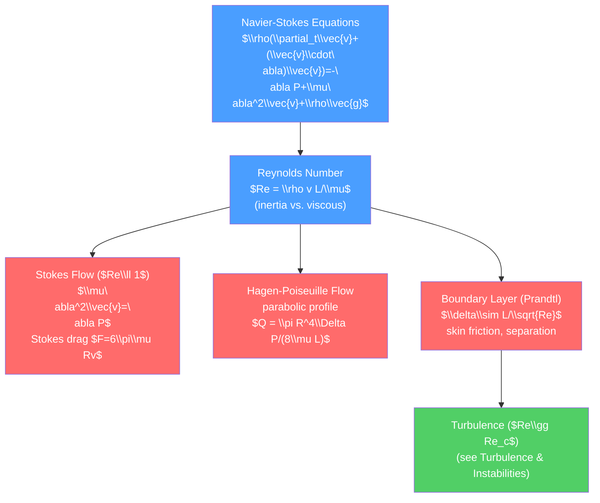

# 🍯 Viscous Fluids and Navier-Stokes Equations

> [!abstract] TL;DR
> The Navier-Stokes equations extend the Euler equations by adding viscous forces: $\rho(\partial_t\vec{v} + (\vec{v}\cdot\nabla)\vec{v}) = -\nabla P + \mu\nabla^2\vec{v} + \rho\vec{g}$. They govern all Newtonian fluid flows and are nonlinear PDEs whose global smooth-solution existence is one of the Millennium Prize Problems. Key solutions include Stokes drag ($F=6\pi\mu Rv$) at low Reynolds number, Hagen-Poiseuille pipe flow with a parabolic profile, and Prandtl's boundary layer theory — the thin viscous layer near walls that determines drag and flow separation.

## Intuition — analogy FIRST

Honey poured from a jar flows slowly — the layers of honey resist sliding past each other. Water poured the same way flows freely. This resistance to shear is viscosity. At very low speeds (honey, blood cells, microorganisms), viscosity dominates completely and the nonlinear inertia term vanishes — this is Stokes flow, and it is reversible. At high speeds (water through a pipe), inertia dominates and flow becomes turbulent. The Reynolds number $Re = \rho v L/\mu$ is the ratio of these two effects.

---

## How It Works



---

## Key Concepts / Details

### Secondary Level

**Viscosity in everyday life**:
- Honey: ~2 Pa·s (very viscous)
- Motor oil: ~0.1–1 Pa·s
- Water: ~0.001 Pa·s
- Air: ~0.000018 Pa·s

Drag on objects moving through a fluid has two contributions:
1. **Pressure drag** (form drag): higher pressure on the upstream face than the downstream face.
2. **Skin friction drag**: viscous shear stress on the surface.

Streamlined shapes (teardrop, airfoils) minimize pressure drag by preventing flow separation. Rough surfaces increase skin friction.

A **boundary layer** forms near any solid wall: the fluid velocity rises from zero at the wall (no-slip condition) to the free-stream value over a thin layer of thickness $\delta$.

### Undergraduate Level

**The Navier-Stokes Equations**

Combining Newton's second law for a fluid parcel with the viscous stress tensor for a Newtonian fluid:
$$\rho\left(\frac{\partial\vec{v}}{\partial t} + (\vec{v}\cdot\nabla)\vec{v}\right) = -\nabla P + \mu\nabla^2\vec{v} + \rho\vec{g}$$

With the continuity equation $\nabla\cdot\vec{v} = 0$ (incompressible). The term $\mu\nabla^2\vec{v}$ is the viscous diffusion of momentum — it smooths velocity gradients.

**Reynolds Number**

Dimensionless ratio of inertial to viscous forces:
$$Re = \frac{\rho v L}{\mu} = \frac{vL}{\nu}$$

where $L$ is the characteristic length scale, $v$ the characteristic speed, $\nu = \mu/\rho$ the kinematic viscosity.
- $Re \ll 1$: viscous-dominated (Stokes flow) — slow, reversible, laminar
- $Re \sim 1$: transition regime
- $Re \gg 1$: inertia-dominated — boundary layers, flow separation, eventual turbulence

Example values: blood cell ($L\sim 10\,\mu$m): $Re \sim 10^{-3}$; swimming bacteria: $Re \sim 10^{-5}$; airplane: $Re \sim 10^7$.

**Stokes Flow ($Re \ll 1$)**

Drop the inertia term — the NS equations linearize to:
$$\mu\nabla^2\vec{v} = \nabla P, \quad \nabla\cdot\vec{v} = 0$$

For a sphere of radius $R$ moving at speed $v$ through a fluid of viscosity $\mu$:
- Velocity field: $\vec{v}\propto R^3/(r^2)$ corrections to uniform flow (decaying slowly)
- Pressure: $P\propto R/r^2$

**Stokes drag**:
$$F_{\text{drag}} = 6\pi\mu R v$$

Proof via exact solution of Stokes equations in spherical coordinates. This law is used in:
- Millikan oil-drop experiment (measuring electron charge)
- Sedimentation velocity of particles in centrifuges
- Dynamics of aerosol particles in the atmosphere

**Hagen-Poiseuille Flow (Pipe Flow)**

Fully developed, steady, laminar flow in a circular pipe of radius $R$ and length $L$, driven by pressure difference $\Delta P$. Assume $v_r = v_\phi = 0$ and $v_z = v_z(r)$ only. Navier-Stokes reduces to:

$$\mu\frac{1}{r}\frac{d}{dr}\left(r\frac{dv_z}{dr}\right) = \frac{\Delta P}{L}$$

With $v_z(R)=0$ (no-slip) and finite $v_z(0)$, solution: **parabolic profile**:
$$v_z(r) = \frac{\Delta P}{4\mu L}(R^2 - r^2)$$

Maximum velocity at center: $v_{\max} = \Delta P R^2/(4\mu L)$. Volume flow rate:
$$Q = \int_0^R v_z\,2\pi r\,dr = \frac{\pi R^4\Delta P}{8\mu L} \quad \text{(Hagen-Poiseuille law)}$$

Note $Q\propto R^4$ — halving the pipe radius reduces flow by 16×. This is why arterial stenosis (narrowing) severely reduces blood flow.

**Boundary Layer Theory (Prandtl)**

For large $Re$, the flow divides into:
1. **Outer region**: inviscid (Euler), potential flow
2. **Inner region** (boundary layer): viscous, thickness $\delta$

Scaling: viscous term $\mu v/\delta^2$ must balance inertia $\rho v^2/L$:
$$\delta \sim L\left(\frac{\mu}{\rho v L}\right)^{1/2} = \frac{L}{\sqrt{Re}}$$

For a flat plate, the Blasius solution gives the boundary layer profile:
$$\delta_{99}(x) = 5.0\,x/\sqrt{Re_x}, \quad Re_x = Ux/\nu$$

The skin friction coefficient: $C_f = 0.664/\sqrt{Re_x}$ (Blasius). Total drag on one side of a flat plate of length $L$ and width $b$:
$$F_D = 0.664\,b\sqrt{\rho\mu U^3 L}$$

Flow separation occurs when the boundary layer cannot overcome the adverse pressure gradient on the downstream side of a bluff body — this creates the wake and gives pressure drag.

### Graduate Level

**Existence and Uniqueness: Millennium Prize Problem**

The Clay Mathematics Institute has offered $1 million for proving (or disproving) the global existence and smoothness of solutions to the 3D Navier-Stokes equations with smooth initial data. In 2D, existence and uniqueness are proved. In 3D, short-time existence is known; whether solutions can blow up (develop singularities) in finite time remains open.

Physical implication: we do not know if the NS equations always have a smooth solution, even though they are used daily in engineering.

**Oseen Correction to Stokes Drag**

Stokes flow breaks down far from the sphere (the far field has $v\sim R/r$ — very slow decay, inconsistent with uniform flow). The Oseen correction linearizes the advection term:

$$\mu\nabla^2\vec{v} - \rho U\partial_x\vec{v} = \nabla P$$

Gives corrected drag: $F = 6\pi\mu Rv(1 + \frac{3}{8}Re + O(Re^2\ln Re))$ for small $Re$.

**Lubrication Theory**

For flow between surfaces separated by a thin gap $h(x) \ll L$, the NS equations simplify dramatically (lubrication approximation):
$$\frac{\partial P}{\partial x} = \mu\frac{\partial^2 v}{\partial y^2}, \quad \frac{\partial P}{\partial y} = 0$$

This gives the Reynolds equation for bearing pressure. Lubrication theory explains why journal bearings support heavy loads with thin oil films, and how red blood cells deform to squeeze through capillaries narrower than their diameter.

**Blasius Boundary Layer (Similarity Solution)**

The flat-plate boundary layer has a similarity solution: let $\eta = y\sqrt{U/(\nu x)}$, $\psi = \sqrt{\nu Ux}f(\eta)$. The Blasius equation:
$$f''' + \tfrac{1}{2}ff'' = 0, \quad f(0)=f'(0)=0,\quad f'(\infty)=1$$

This ODE has no closed-form solution but is easily integrated numerically. The shape of the boundary layer profile is universal (independent of $x$, $U$, $\nu$ when expressed in $\eta$).

```python
import numpy as np
from scipy.integrate import solve_ivp
import matplotlib.pyplot as plt

# Blasius boundary layer similarity solution
# f''' + (1/2)f f'' = 0, f(0)=f'(0)=0, f'(inf)=1
# Shooting method: guess f''(0) until f'(eta->inf) = 1

def blasius(eta, y):
    """y = [f, f', f'']"""
    return [y[1], y[2], -0.5 * y[0] * y[2]]

# Shoot from 0, adjust f''(0) to match f'(inf)=1
f2_0_guess = 0.332  # known: f''(0) ≈ 0.332

eta_max = 10.0
sol = solve_ivp(blasius, [0, eta_max], [0, 0, f2_0_guess],
                dense_output=True, max_step=0.05)

eta = np.linspace(0, eta_max, 400)
f, fp, fpp = sol.sol(eta)

# Hagen-Poiseuille parabolic profile
r_norm = np.linspace(-1, 1, 200)
v_HP = 1 - r_norm**2  # normalized: v/v_max

fig, axes = plt.subplots(1, 3, figsize=(15, 5))

# Blasius profile
axes[0].plot(fp, eta, color='#4a9eff', lw=2, label="$f'(\\eta) = u/U$")
axes[0].axvline(0.99, color='#ff6b6b', linestyle='--', label='99% of free stream')
eta_99 = eta[np.argmin(np.abs(fp - 0.99))]
axes[0].axhline(eta_99, color='#ff6b6b', linestyle='--')
axes[0].set_xlabel("$f'(\\eta) = u/U$")
axes[0].set_ylabel(r"$\eta = y\sqrt{U/\nu x}$")
axes[0].set_title('Blasius Boundary Layer Profile')
axes[0].legend(); axes[0].invert_xaxis()

# Hagen-Poiseuille parabolic profile
axes[1].plot(v_HP, r_norm, color='#51cf66', lw=2)
axes[1].set_xlabel('$v_z / v_{\\max}$')
axes[1].set_ylabel('$r/R$')
axes[1].set_title('Hagen-Poiseuille: Parabolic profile\n$v_z = (\\Delta P/4\\mu L)(R^2-r^2)$')

# Stokes drag: settling velocity vs radius
R_sphere = np.logspace(-7, -3, 100)  # meters
rho_particle = 2000  # kg/m^3 (silica)
rho_fluid = 1000    # water
mu_fluid = 1e-3     # Pa.s
g = 9.81

# Stokes: F_drag = 6 pi mu R v = weight - buoyancy = (4/3)pi R^3 (rho_p - rho_f) g
v_stokes = (2 * R_sphere**2 * (rho_particle - rho_fluid) * g) / (9 * mu_fluid)
Re_val = rho_fluid * v_stokes * R_sphere / mu_fluid

axes[2].loglog(R_sphere*1e6, v_stokes*1e6, color='#ff6b6b', lw=2)
axes[2].set_xlabel('Sphere radius ($\\mu$m)')
axes[2].set_ylabel('Settling velocity ($\\mu$m/s)')
axes[2].set_title('Stokes settling velocity\n$v = 2R^2(\\rho_p-\\rho_f)g/(9\\mu)$')

plt.tight_layout()
```

---

## Real-World Notes

- **Medical devices**: the Hagen-Poiseuille law governs IV drip rates, dialysis filters, and airflow in the lungs. A factor of 2 narrowing in an artery reduces flow by 16×.
- **Microfluidics**: lab-on-a-chip devices operate at $Re\sim 10^{-3}$ — pure Stokes flow. Mixing requires chaotic advection (geometry) since turbulent mixing is absent.
- **Aerodynamics**: the Boeing 747 cruises at $Re\sim 10^8$ — the boundary layer is turbulent, and turbulence models (RANS, LES) replace the Blasius solution. Winglet design reduces trailing vortex drag.
- **Drag reduction**: riblets (V-grooves aligned with the flow, used on Olympic swimsuits) reduce skin friction drag by 5-8% by interfering with near-wall turbulence.

---

## Common Pitfalls

1. **No-slip boundary condition**: real fluids have zero velocity at solid walls. Perfect-slip (Euler) boundary conditions are only valid far from walls or for superfluid helium.
2. **Hagen-Poiseuille requires fully developed laminar flow**: it fails near the pipe entrance (developing region, length ~$0.06Re \cdot D$) and at $Re > 2300$ where flow transitions to turbulence.
3. **$Q\propto R^4$ is very sensitive**: Poiseuille flow is fourth-power in radius. Vessel constriction or tube bending causes huge flow reductions. This is the key challenge in arterial disease.
4. **Stokes drag overestimates at moderate $Re$**: the drag coefficient $C_D \approx 24/Re$ for $Re\ll 1$, but deviates significantly for $Re > 1$ (Oseen corrections, wake development).
5. **Boundary layer separation vs. transition**: separation (flow reversal at the wall) and transition to turbulence are distinct phenomena. Turbulent boundary layers are more resistant to separation because turbulent mixing adds momentum to the near-wall fluid.

---

## Related Concepts

- [[_MOC_Fluid_Mechanics|↑ Section MOC]]
- [[Euler_Equations_and_Ideal_Fluids]] — Inviscid limit ($\mu\to 0$) of Navier-Stokes
- [[Fluid_Statics_and_Properties]] — Viscosity tensor derivation from molecular physics
- [[Turbulence_and_Instabilities]] — High-$Re$ behavior of Navier-Stokes
- [[Ordinary_Differential_Equations]] — Blasius equation is a nonlinear ODE; Hagen-Poiseuille is a simple linear ODE

---

## Review Questions

1. **Secondary**: Why does doubling the radius of a blood vessel increase flow rate by a factor of 16 (Hagen-Poiseuille)? What clinical intervention (angioplasty) restores flow, and by how much does a 50% diameter increase in radius change the flow rate?
2. **Undergraduate**: Derive the Hagen-Poiseuille velocity profile $v_z(r)$ from the Navier-Stokes equations. What are the boundary conditions? Compute the total volume flow rate $Q$ and show $Q \propto R^4$. At what Reynolds number does the flow transition to turbulence for a typical blood vessel?
3. **Graduate**: Explain why the Navier-Stokes existence and uniqueness problem is a Millennium Prize Problem. What is known in 2D but unknown in 3D? Describe the Oseen correction to Stokes drag: why does the Stokes approximation fail at large distances, and how does the Oseen linearization fix this? How large is the correction at $Re = 0.1$?

---

## Sources

- Batchelor — *An Introduction to Fluid Dynamics*, Chs. 4–5 (viscous flow), Ch. 6 (boundary layers)
- Landau & Lifshitz — *Fluid Mechanics*, §17–26 (Stokes, Poiseuille) §39–42 (boundary layer)
- Schlichting & Gersten — *Boundary Layer Theory* (definitive reference)
- Denn — *Process Fluid Mechanics*, Chs. 2–4 (pipe flow, engineering applications)

#physics #fluid-mechanics #Navier-Stokes #Stokes-flow #Reynolds-number #Hagen-Poiseuille #boundary-layer #Blasius #undergraduate #graduate
