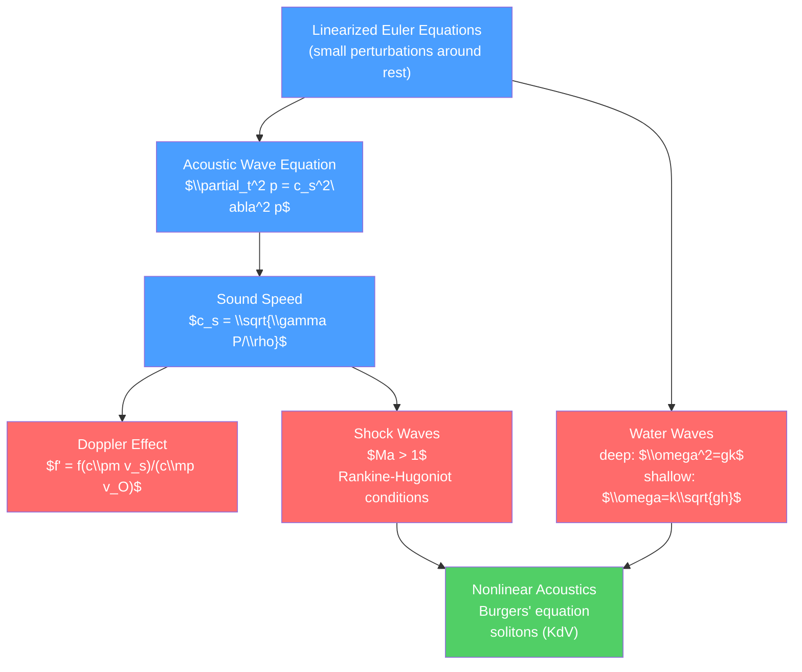

# 🔊 Waves in Fluids and Acoustics

> [!abstract] TL;DR
> Fluids support a rich variety of waves: acoustic (pressure/sound) waves, surface gravity waves, internal waves in stratified media, and shock waves when flow exceeds the wave speed. Linearizing the Euler equations around a rest state yields the acoustic wave equation with speed $c_s = \sqrt{\gamma P/\rho}$. Water waves have dispersion relations that differ for deep ($\omega^2=gk$) and shallow ($\omega=k\sqrt{gh}$) water. Beyond linear theory, nonlinearity steepens wave profiles and can form solitons (KdV equation) or shocks (Burgers' equation), with jump conditions given by Rankine-Hugoniot.

## Intuition — analogy FIRST

Tap a table: the sound you hear travels through the air as alternating compressions and rarefactions — pressure waves moving at 340 m/s. Drop a stone in a pond: circular waves spread outward, with long waves traveling faster than short ones (dispersion). Now imagine accelerating an airplane past the speed of sound: the pressure waves pile up into a shock front — a thin, nearly discontinuous jump in pressure, density, and temperature. The same physics occurs in supernovae, hypersonic reentry, and supersonic bullets.

---

## How It Works



---

## Key Concepts / Details

### Secondary Level

**Sound** is a mechanical wave — alternating regions of compression (high pressure) and rarefaction (low pressure) traveling through a medium.

Speed of sound:
$$c_s = \sqrt{\frac{\gamma P}{\rho}} = \sqrt{\gamma\frac{k_B T}{m}}$$

where $\gamma$ is the adiabatic index (air: $\gamma=1.4$), $P$ and $\rho$ are pressure and density. In air at 20°C: $c_s \approx 343\,\text{m/s}$. In water: $\approx 1480\,\text{m/s}$. In steel: $\approx 5100\,\text{m/s}$.

**Sound intensity** and decibels:
$$I = \frac{P_{\text{amp}}^2}{2\rho c_s}, \quad \text{dB} = 10\log_{10}(I/I_0), \quad I_0 = 10^{-12}\,\text{W/m}^2$$

Normal conversation: ~60 dB. Jet engine: ~140 dB (threshold of pain).

**Doppler effect**: a moving source or observer shifts the perceived frequency:
$$f' = f\frac{c \pm v_{\text{observer}}}{c \mp v_{\text{source}}}$$

(upper sign: approaching; lower: receding). Used in radar speed guns, medical ultrasound (blood flow), astronomical redshift.

### Undergraduate Level

**Derivation of the Acoustic Wave Equation**

Linearize the Euler equations: write $\rho = \rho_0 + \rho'$, $P = P_0 + p'$, $\vec{v} = \vec{v}'$ with primed quantities small. Ignoring quadratic terms:

$$\frac{\partial\rho'}{\partial t} + \rho_0\nabla\cdot\vec{v}' = 0 \quad \text{(continuity)}$$
$$\rho_0\frac{\partial\vec{v}'}{\partial t} = -\nabla p' \quad \text{(Euler)}$$
$$p' = c_s^2\rho' \quad \text{(thermodynamic relation, adiabatic)}$$

Combining: $\frac{\partial^2 p'}{\partial t^2} = c_s^2\nabla^2 p'$ — the acoustic wave equation.

**Acoustic Intensity and Impedance**

The acoustic impedance: $Z = \rho_0 c_s$ (Pa·s/m = Rayl).

Power flow (intensity): $I = p'^2/(2Z) = \frac{1}{2}\rho_0 c_s v'^2$.

Reflection and transmission at a flat interface (normal incidence):
$$r = \frac{Z_2 - Z_1}{Z_2 + Z_1}, \qquad t = \frac{2Z_2}{Z_2+Z_1}$$

Large impedance mismatch → strong reflection. This is why ultrasound gel is used in medical imaging: to minimize the air-tissue impedance mismatch.

**Shock Waves and Mach Number**

The Mach number $Ma = v/c_s$. For $Ma > 1$ (supersonic), pressure waves cannot outrun the source, and pile up into a *Mach cone* of half-angle $\mu = \arcsin(1/Ma)$.

The **Rankine-Hugoniot conditions** (conservation of mass, momentum, energy across a shock):
$$\rho_1 v_1 = \rho_2 v_2 \quad \text{(mass)}$$
$$P_1 + \rho_1 v_1^2 = P_2 + \rho_2 v_2^2 \quad \text{(momentum)}$$
$$h_1 + \frac{1}{2}v_1^2 = h_2 + \frac{1}{2}v_2^2 \quad \text{(energy, } h=\text{specific enthalpy)}$$

For a perfect gas ($\gamma=1.4$), density ratio across a strong shock ($Ma\to\infty$):
$$\frac{\rho_2}{\rho_1} = \frac{\gamma+1}{\gamma-1} = 6 \quad (\gamma=1.4)$$

Normal shock: flow behind becomes subsonic ($Ma_2 = \sqrt{(\gamma-1)Ma_1^2+2}/\sqrt{2\gamma Ma_1^2-(\gamma-1)}$).

**Water Waves**

For gravity waves on a fluid of depth $h$, the dispersion relation:
$$\omega^2 = gk\tanh(kh)$$

Limits:
- *Deep water* ($kh\gg 1$): $\omega^2 = gk$ → phase speed $c = \sqrt{g/k}$ (shorter waves are slower: dispersive)
- *Shallow water* ($kh\ll 1$): $\omega = k\sqrt{gh}$ → non-dispersive, all waves travel at $c=\sqrt{gh}$

Group velocity:
- Deep: $v_g = \frac{1}{2}\sqrt{g/k} = c/2$ (group slower than phase — each wave crest passes through the envelope)
- Shallow: $v_g = \sqrt{gh} = c$ (non-dispersive)

**Capillary-gravity waves**: at very short wavelengths, surface tension dominates. Full dispersion relation: $\omega^2 = (gk + \gamma k^3/\rho)\tanh(kh)$. Minimum phase speed: $c_{\min} = (4g\gamma/\rho)^{1/4}\approx 0.23$ m/s for water.

### Graduate Level

**Nonlinear Acoustics and Burgers' Equation**

For finite-amplitude acoustic waves, nonlinear effects steepen the wave profile. The weakly nonlinear wave equation for 1D sound:

$$\frac{\partial p}{\partial t} + c_s\frac{\partial p}{\partial x} + \frac{\gamma+1}{2\rho_0 c_s}p\frac{\partial p}{\partial x} = \frac{\mu}{2\rho_0}\frac{\partial^2 p}{\partial x^2}$$

In the retarded frame ($\tau = t - x/c_s$), this becomes the **Burgers' equation**:
$$\frac{\partial u}{\partial x} + u\frac{\partial u}{\partial \tau} = \nu_{\text{eff}}\frac{\partial^2 u}{\partial\tau^2}$$

The Cole-Hopf transformation $u = -2\nu_{\text{eff}}\partial_\tau\ln\theta$ converts Burgers' to the linear heat equation. Exact solutions show: without dissipation ($\nu\to 0$), the wave steepens until characteristics cross — shock formation at time $t_{\text{shock}} = 1/\max(\partial u_0/\partial x)$.

**Solitons and the KdV Equation**

Shallow water waves with weak nonlinearity and dispersion are governed by the **Korteweg-de Vries (KdV) equation**:
$$\frac{\partial u}{\partial t} + 6u\frac{\partial u}{\partial x} + \frac{\partial^3 u}{\partial x^3} = 0$$

This has remarkable soliton solutions: localized wave packets that travel without changing shape and pass through each other intact:
$$u(x,t) = -\frac{c}{2}\text{sech}^2\!\left(\frac{\sqrt{c}}{2}(x-ct)\right)$$

Faster solitons are taller and narrower. The KdV equation is exactly integrable (inverse scattering transform). Solitons were first observed by John Scott Russell following a canal barge in 1834.

**Internal Gravity Waves and Brunt-Väisälä Frequency**

In a stably stratified fluid (density decreasing upward), a displaced parcel oscillates at the **Brunt-Väisälä frequency**:
$$N = \sqrt{-\frac{g}{\rho_0}\frac{d\rho_0}{dz}} = \sqrt{\frac{g}{\Theta}\frac{d\Theta}{dz}}$$

Internal waves with frequency $\omega < N$ can propagate with phase speed $c = (N/k_h)$ (anisotropic). They are ubiquitous in the ocean (thermocline) and atmosphere (mountain lee waves).

**Rossby Waves** arise from the variation of the Coriolis parameter with latitude. The dispersion relation on a $\beta$-plane: $\omega = -\beta k_x/(k_x^2+k_y^2)$. Westward-propagating, retrograde waves; crucial for atmospheric teleconnections (El Niño→jet stream response).

**Wave Turbulence**: when many weakly nonlinear waves interact, wave-wave interactions drive energy transfer across scales — a *wave turbulence* theory (Zakharov) analogous to Kolmogorov turbulence. Examples: ocean surface waves, internal waves in the stratified ocean.

```python
import numpy as np
import matplotlib.pyplot as plt
from scipy.fft import fft, ifft, fftfreq

# Demonstrate: water wave dispersion, acoustic wave, and KdV soliton

fig, axes = plt.subplots(1, 3, figsize=(15, 5))

# 1. Water wave dispersion relation
k = np.logspace(-2, 2, 300)
h_deep = 100.0; h_med = 1.0; h_shallow = 0.1
g = 9.81
omega_deep = np.sqrt(g * k * np.tanh(k * h_deep))
omega_med = np.sqrt(g * k * np.tanh(k * h_med))
omega_shallow = np.sqrt(g * k * np.tanh(k * h_shallow))
omega_deep_asymp = np.sqrt(g * k)
omega_shallow_asymp = k * np.sqrt(g * h_shallow)

axes[0].loglog(k, omega_deep, '#4a9eff', lw=2, label='Deep (h=100 m)')
axes[0].loglog(k, omega_med, '#ff6b6b', lw=2, label='Medium (h=1 m)')
axes[0].loglog(k, omega_shallow, '#51cf66', lw=2, label='Shallow (h=0.1 m)')
axes[0].loglog(k, omega_deep_asymp, 'k--', lw=1, label=r'$\omega=\sqrt{gk}$ (deep)')
axes[0].set_xlabel('Wavenumber k (1/m)')
axes[0].set_ylabel(r'Angular frequency $\omega$ (rad/s)')
axes[0].set_title('Water wave dispersion relation')
axes[0].legend(fontsize=8)

# 2. Shock formation in 1D (method of characteristics)
# Simple wave: u_t + u u_x = 0 (inviscid Burgers)
x = np.linspace(-5, 10, 500)
u0 = np.exp(-x**2)  # Gaussian initial condition
times = [0, 0.8, 1.5, 2.5]
for t, color in zip(times, ['#4a9eff', '#ff6b6b', '#51cf66', '#ffd700']):
    # Characteristics: x = x0 + u0(x0) * t
    x0 = np.linspace(-5, 10, 2000)
    u0_vals = np.exp(-x0**2)
    x_char = x0 + u0_vals * t
    # Sort and interpolate (before shock formation)
    sort_idx = np.argsort(x_char)
    x_char_s, u_char_s = x_char[sort_idx], u0_vals[sort_idx]
    # Keep only first occurrence (before multivalued)
    _, unique_idx = np.unique(x_char_s, return_index=True)
    axes[1].plot(x_char_s[unique_idx], u_char_s[unique_idx],
                color=color, lw=1.5, label=f't={t}')
axes[1].set_title('Shock formation: $u_t + u u_x = 0$\n(Gaussian initial condition)')
axes[1].set_xlabel('x'); axes[1].set_ylabel('u(x,t)')
axes[1].legend(fontsize=8)
axes[1].set_xlim(-3, 8); axes[1].set_ylim(-0.1, 1.2)

# 3. KdV soliton
x_s = np.linspace(-20, 40, 800)
for c, color in [(1.0,'#4a9eff'), (2.0,'#ff6b6b'), (4.0,'#51cf66')]:
    t_s = 3.0
    u_sol = -c/2 * (1/np.cosh(np.sqrt(c)/2 * (x_s - c*t_s)))**2
    axes[2].plot(x_s, u_sol, color=color, lw=2, label=f'c={c}, t={t_s}')
axes[2].set_title('KdV Solitons at t=3\n$u = -(c/2)\\,\\text{sech}^2((\\sqrt{c}/2)(x-ct))$')
axes[2].set_xlabel('x'); axes[2].set_ylabel('u(x,t)')
axes[2].legend()

plt.tight_layout()
```

---

## Real-World Notes

- **Medical ultrasound**: diagnostic imaging at 1–20 MHz. Doppler ultrasound measures blood velocity via frequency shift. Impedance matching layers on transducers minimize reflection at the skin.
- **Supersonic aircraft**: Concorde cruised at Mach 2; sonic boom on the ground from the Mach cone. Modern supersonic aircraft designs try to minimize boom footprint (low-boom designs).
- **Tsunami**: a shallow-water wave ($h\sim 4$ km) with $\lambda \sim 200$ km ($kh \ll 1$). Non-dispersive: travels at $c=\sqrt{gh}\approx 200\,\text{m/s}$ across the Pacific. Shoaling causes amplitude to grow as depth decreases: $a \propto h^{-1/4}$ (Green's law).
- **Fiber optic communications**: solitons were proposed for dispersion-free pulse propagation in optical fibers (nonlinear Schrödinger equation — same mathematical structure as KdV). Used in trans-oceanic cables.

---

## Common Pitfalls

1. **Phase velocity vs. group velocity**: the phase velocity $c_p = \omega/k$ is the speed of individual wave crests; the group velocity $c_g = d\omega/dk$ is the speed of the wave envelope (energy). In deep water, $c_g = c_p/2$ — waves outrun their group; you see waves "disappear" at the front of a group.
2. **Shock waves vs. sound waves**: a shock is a discontinuity that travels *faster* than sound (supersonic in the upstream frame). Sound waves are continuous small-amplitude perturbations. A shock cannot be described by linear acoustics.
3. **Rankine-Hugoniot does not give shock structure**: the RH conditions give upstream/downstream states. The internal shock structure (thickness $\sim$ mean free path) requires kinetic theory or viscous NS.
4. **Brunt-Väisälä frequency and evanescent waves**: for $\omega > N$, internal gravity waves become evanescent (exponentially decaying). This is why waves cannot propagate in the troposphere into an overlying stably stratified layer without tunneling.
5. **Tsunami amplitude on open ocean**: on the open ocean, a tsunami may be only 1 m tall with a 200 km wavelength — barely detectable by ships but carrying enormous energy. The danger is entirely in shallow coastal water.

---

## Related Concepts

- [[_MOC_Fluid_Mechanics|↑ Section MOC]]
- [[Euler_Equations_and_Ideal_Fluids]] — Acoustic wave equation from linearized Euler
- [[Partial_Differential_Equations]] — Wave equation, method of characteristics for shocks
- [[Fourier_Analysis_and_Integral_Transforms]] — Dispersion relations analyzed in Fourier space
- [[Turbulence_and_Instabilities]] — Wave turbulence; Kelvin-Helmholtz as wave instability
- [[Magnetohydrodynamics]] — Alfvén waves, magnetosonic waves

---

## Review Questions

1. **Secondary**: The speed of sound in air at sea level is 343 m/s and in water is 1480 m/s. Why does sound travel faster in water despite water being denser? Why is the speed of sound higher at higher altitude (where temperature and pressure are lower)?
2. **Undergraduate**: Derive the deep-water and shallow-water limits of the dispersion relation $\omega^2 = gk\tanh(kh)$. For a tsunami with wavelength 200 km in water of depth 4 km, is it deep or shallow water? Calculate its speed and travel time across the 10,000 km Pacific.
3. **Graduate**: Starting from the 1D Euler equations with weak nonlinearity and dispersion, derive the KdV equation. Verify that $u = -(c/2)\,\text{sech}^2(\sqrt{c}(x-ct)/2)$ is an exact soliton solution. Explain what "inverse scattering" means in the context of KdV and why solitons emerge as the long-time solution for any localized initial condition.

---

## Sources

- Lighthill — *Waves in Fluids* (comprehensive, elegant)
- Whitham — *Linear and Nonlinear Waves* (definitive graduate reference)
- Lamb — *Hydrodynamics*, Chs. 9–10 (surface waves, classical)
- Dauxois & Peyrard — *Physics of Solitons* (KdV, NLS, integrable systems)

#physics #fluid-mechanics #acoustics #sound-waves #water-waves #shock-waves #Rankine-Hugoniot #solitons #KdV #Burgers-equation #undergraduate #graduate
