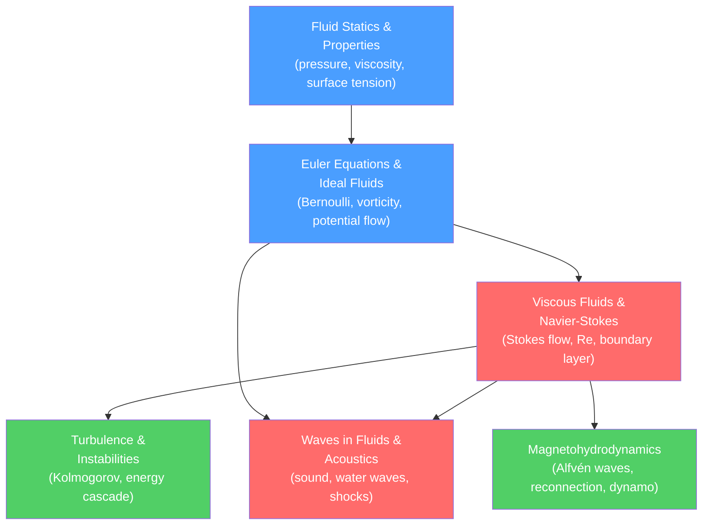

# 🌊 Fluid Mechanics — Map of Content

> [!abstract] Section Overview
> Fluid Mechanics studies the motion and equilibrium of liquids and gases — from a dripping tap to a supernova shock wave. It is organized around successive levels of idealization: static fluids (statics), inviscid flows (Euler equations and Bernoulli), viscous flows (Navier-Stokes), and the turbulent, wave-bearing, magnetized extremes found in astrophysics and engineering.

## How the Topics Connect

## Recommended Learning Path

1. **[[Fluid_Statics_and_Properties]]** — Pressure, buoyancy, surface tension, viscosity definitions, Newtonian vs non-Newtonian fluids.
2. **[[Euler_Equations_and_Ideal_Fluids]]** — Material derivative, continuity, Euler equations, Bernoulli, vorticity, potential flow.
3. **[[Viscous_Fluids_and_Navier_Stokes]]** — Full Navier-Stokes derivation, Stokes flow, Poiseuille flow, boundary layers, Reynolds number.
4. **[[Waves_in_Fluids_and_Acoustics]]** — Acoustic waves, Doppler effect, shock waves, water wave dispersion.
5. **[[Turbulence_and_Instabilities]]** — Transition to turbulence, instabilities, Kolmogorov cascade, RANS, DNS/LES.
6. **[[Magnetohydrodynamics]]** — MHD equations, Alfvén waves, magnetic reconnection, dynamo theory.

## Notes in This Section

| Note | Core Ideas | Difficulty |
|------|-----------|------------|
| [[Fluid_Statics_and_Properties]] | Hydrostatic equation; Archimedes; surface tension; viscosity; non-Newtonian fluids | Secondary → Graduate |
| [[Euler_Equations_and_Ideal_Fluids]] | Material derivative; continuity; Euler equations; Bernoulli; vorticity; potential flow | Secondary → Graduate |
| [[Viscous_Fluids_and_Navier_Stokes]] | Navier-Stokes; Stokes drag; Poiseuille; Reynolds number; boundary layers | Secondary → Graduate |
| [[Turbulence_and_Instabilities]] | Transition; Kelvin-Helmholtz; Reynolds decomposition; Kolmogorov $k^{-5/3}$ | Secondary → Graduate |
| [[Waves_in_Fluids_and_Acoustics]] | Acoustic wave equation; shocks; Rankine-Hugoniot; water waves; solitons | Secondary → Graduate |
| [[Magnetohydrodynamics]] | MHD equations; Alfvén waves; magnetic reconnection; dynamo; solar wind | Secondary → Graduate |

## Connections to Other Physics Sections

- [[_MOC_Classical_Mechanics|Classical Mechanics]] — Continuum mechanics as the limit of many-particle mechanics
- [[_MOC_Thermodynamics|Thermodynamics]] — Equation of state for gases; entropy production in viscous flows
- [[_MOC_Electromagnetism|Electromagnetism]] — Maxwell equations couple with fluid in MHD
- [[_MOC_Mathematical_Methods|Mathematical Methods]] — Vector calculus, PDEs (wave/heat equations), Green's functions

#physics #fluid-mechanics #moc
