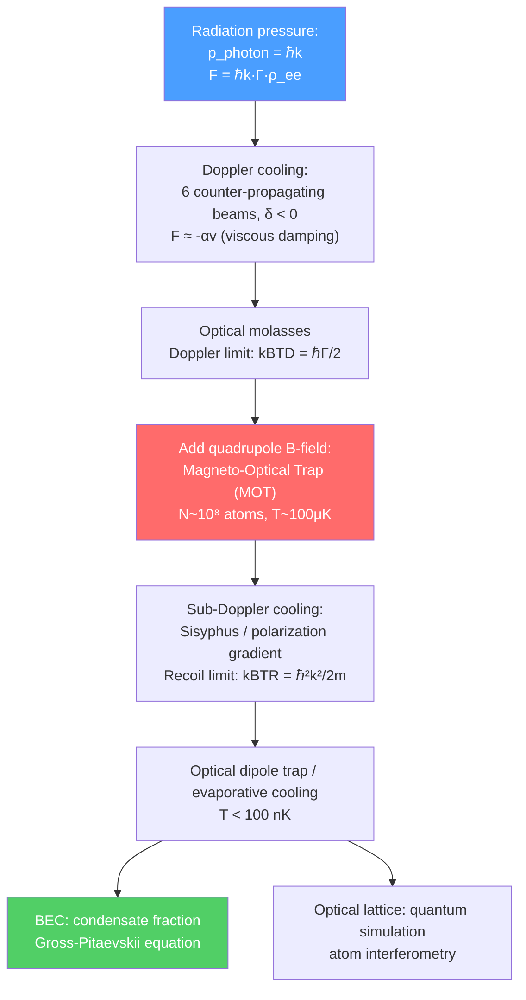

# 🧊 Laser Cooling and Trapping

> [!abstract] TL;DR
> Light carries momentum $\hbar k$ per photon; when an atom absorbs a photon, it receives a kick — radiation pressure. By arranging six counter-propagating laser beams tuned slightly below an atomic resonance (red-detuned), atoms moving in any direction see a blue-shifted, on-resonance beam opposing their motion — they slow down. This Doppler cooling reaches the Doppler limit $k_BT_D = \hbar\Gamma/2$. A magneto-optical trap (MOT) adds a quadrupole field for spatial confinement. Sub-Doppler (Sisyphus) cooling, then evaporative cooling, drives gases to the quantum degenerate regime, achieving Bose-Einstein condensation (BEC) and Fermi degeneracy. These ultracold atoms serve as pristine quantum simulators and atom interferometers.

## Intuition — analogy FIRST

Imagine a ball rolling across a table covered in tall grass. No matter which direction it rolls, the grass stalks ahead bend toward it and push back — the ball slows down. Laser cooling is the photon analog: an atom moving in any direction encounters a laser beam head-on; Doppler-shifted into resonance, the beam pushes back on the atom. Replace "grass" with six counter-propagating laser beams. The random recoil kicks from spontaneous emission average to zero, while the directed radiation-pressure forces sum to a velocity-proportional drag — optical molasses. The atom eventually stalls at a temperature set by how much the random recoil kicks can heat it up.

---

## How It Works

---

## Key Concepts / Details

### Secondary Level

**Light can push atoms:** A photon carries momentum $p = h/\lambda = \hbar k$. When an atom absorbs a photon, it receives a tiny kick in the direction the photon was traveling ($\Delta v \sim$ mm/s per photon for alkali atoms). Spontaneous re-emission kicks the atom in a random direction. Net effect over many absorption-emission cycles: the atom is pushed steadily in the laser beam direction.

**Counterintuitive cooling:** If you shine two laser beams directly at each other on an atom, you might expect the pushes to cancel. But Doppler shifting changes the picture: detune the lasers slightly to the red (below resonance). An atom moving right sees the left-traveling beam blue-shifted toward resonance and the right-traveling beam shifted further from resonance — so the left beam wins and pushes the atom left (opposing its motion). An atom moving left sees the opposite. The atom always gets pushed opposite to its velocity — this is cooling.

### Undergraduate Level

**Radiation pressure force:** An atom in a traveling-wave laser field with intensity $I$ and detuning $\delta = \omega_L - \omega_0$ (negative = red-detuned) scatters photons at rate $R_{sc} = \frac{\Gamma}{2}\frac{s}{1+s+4\delta^2/\Gamma^2}$ where $s = I/I_{sat}$ is the saturation parameter and $\Gamma$ is the natural linewidth. The scattering force:

$$F_{scatt} = \hbar k R_{sc}$$

**Doppler cooling:** For $s \ll 1$, the force from six counter-propagating beams on an atom moving with velocity $v \ll \Gamma/k$ is approximately:

$$F \approx -\alpha v, \qquad \alpha = -8\hbar k^2 \frac{|\delta|/\Gamma}{(1 + 4\delta^2/\Gamma^2)^2} s$$

This is a viscous damping force — optical molasses. But random recoil kicks from spontaneous emission heat the atom at rate $D = \hbar^2k^2\Gamma/2$ (momentum diffusion). Balancing damping against heating gives the **Doppler limit**:

$$k_BT_D = \frac{\hbar\Gamma}{2} \qquad (T_D \sim 100\text{–}200\text{ μK for alkalis})$$

The optimal detuning is $\delta = -\Gamma/2$ (half linewidth below resonance).

**Zeeman slower:** An atomic beam emerging from an oven ($v_{th} \sim 500$ m/s) can be slowed to rest using a single counter-propagating laser beam with a spatially varying magnetic field. The Zeeman effect tunes the atomic resonance to compensate the changing Doppler shift as the atom decelerates, keeping the beam resonant throughout. Atoms exit slow enough to be captured in a MOT.

**Magneto-Optical Trap (MOT):** Combines optical molasses (cooling) with spatial confinement. A quadrupole magnetic field ($\mathbf{B} = 0$ at the center, $|\mathbf{B}| \propto r$) shifts the Zeeman sublevels: atoms displaced from center see a field that makes $\sigma^+$ or $\sigma^-$ light resonant depending on their position — radiation pressure always pushes them back toward the center. A typical MOT captures $N \sim 10^8$ atoms at $T \sim 100$ μK in $\sim 1$ cm diameter. The MOT is the workhorse of cold-atom experiments.

**Optical dipole trap:** A focused laser beam far from resonance (large detuning $|\delta| \gg \Gamma$) exerts a conservative force on atoms via the AC Stark effect. For red-detuned light ($\delta < 0$), atoms are attracted to the intensity maximum (focus):

$$U_{dip} = -\frac{\hbar\Omega_R^2}{4\delta} \propto \frac{I}{\delta}$$

where $\Omega_R$ is the Rabi frequency. Scattering rate is suppressed by $1/\delta^2$ → very little heating. Dipole traps can hold atoms without magnetic field, enabling studies of spinor condensates and magnetic-field-sensitive states.

### Graduate Level

**Sub-Doppler cooling (Sisyphus cooling / polarization gradient cooling):** For alkali atoms with hyperfine structure, Doppler cooling experiments mysteriously produced temperatures *below* $T_D$. Explanation (Chu, Cohen-Tannoudji, Phillips — Nobel 1997): two counter-propagating laser beams with orthogonal linear polarizations create a polarization gradient with spatial period $\lambda/2$. Different magnetic sub-levels of the ground state have light shifts that alternate with the polarization. A slow atom climbs a potential hill (light-shifted energy), loses kinetic energy, then optically pumps to the bottom of the next hill — like a ball always rolling uphill (Sisyphus myth). This continues until the atom is too cold to climb the next hill:

$$k_BT_R = \frac{\hbar^2k^2}{2m} \qquad (T_R \sim 1\text{ μK for Rb})$$

This **recoil limit** corresponds to one photon recoil energy — the minimum possible with photon-based cooling (subrecoil requires dark states: VSCPT or Raman cooling).

**Evaporative cooling:** Below the recoil limit, all photon-based methods fail. Atoms loaded into a magnetic or optical trap are evaporatively cooled: the trap depth is gradually lowered, allowing the hottest atoms to escape. The remaining atoms rethermalize to a colder temperature (like coffee cooling by evaporation). Each evaporation step reduces $N$ but lowers $T$ faster, increasing phase-space density $\rho = n\lambda_{dB}^3$ toward the quantum degenerate regime.

**Bose-Einstein Condensation (BEC):** When $\rho \sim 1$ (thermal de Broglie wavelength $\lambda_{dB} = h/\sqrt{2\pi mk_BT}$ comparable to interparticle spacing), bosons undergo a phase transition: macroscopic occupation of the single-particle ground state. The condensate fraction:

$$N_0/N = 1 - (T/T_c)^3, \qquad k_BT_c = 0.94\,\hbar\omega_{ho}N^{1/3}$$

(for a harmonic trap). The condensate is described by a macroscopic wavefunction $\Psi(\mathbf{r},t)$ satisfying the **Gross-Pitaevskii (GP) equation**:

$$i\hbar\frac{\partial\Psi}{\partial t} = \left(-\frac{\hbar^2\nabla^2}{2m} + V(\mathbf{r}) + g|\Psi|^2\right)\Psi$$

where $g = 4\pi\hbar^2 a_s/m$ is the interaction parameter ($a_s$ = s-wave scattering length). BEC was first achieved in $^{87}$Rb (JILA, 1995) and $^{23}$Na (MIT, 1995) — Nobel 2001 (Cornell, Wieman, Ketterle).

**Optical lattices as quantum simulators:** Interfering laser beams create periodic standing-wave potentials — artificial crystal lattices for neutral atoms. Atoms in such lattices realize the Hubbard model: $H = -J\sum_{\langle i,j\rangle}a^\dagger_ia_j + U\sum_i n_i(n_i-1)/2$. By tuning $J/U$ (via lattice depth), the Mott insulator-superfluid phase transition was observed (Munich, 2002). Optical lattice clocks (Sr, Yb) reach $\Delta\nu/\nu \sim 10^{-18}$ — the best clocks ever built.

**Atom interferometry:** A matter-wave interferometer uses laser pulses to split, redirect, and recombine atomic wavepackets. The phase accumulated between paths depends on the acceleration or rotation (Sagnac effect). Applications: precision measurement of $g$ (gravitational acceleration, $\Delta g/g \sim 10^{-10}$), gravitational gradients (geophysics, geodesy), tests of the equivalence principle, and proposals for detecting gravitational waves with km-scale atom interferometers (MAGIS-100, AION).

**Fermi gases in traps:** Fermions (e.g., $^{40}$K, $^6$Li) reach quantum degeneracy at the Fermi temperature $T_F = \hbar\omega_{ho}(6N)^{1/3}/k_B$. Unlike BEC, they cannot all occupy the ground state (Pauli exclusion). By tuning near a Feshbach resonance (diverging $a_s$), one can cross from weakly interacting BCS superfluidity (paired Cooper pairs) to a BEC of diatomic molecules — the **BCS-BEC crossover**, a paradigm of strongly correlated quantum matter.

---

## Real-World Notes

- **Optical lattice clocks (NIST, PTB, SYRTE):** Sr and Yb clocks at $10^{-18}$ fractional accuracy can detect gravitational redshift over a 1 cm height difference — relativistic geodesy.
- **Quantum computing with neutral atoms:** Arrays of Rb or Cs atoms in optical tweezer arrays (Lukin group, Browaeys group) with Rydberg-mediated gates form programmable quantum computers with 1000+ qubits.
- **Atom gravimeters (geophysics):** Deployed on ships and airplanes to map underground density variations — oil exploration and volcano monitoring.
- **IQBAL (International Quantum Benchmark):** BEC machines serve as metrology standards for the kilogram (Planck constant $h$ via atom recoil) since the 2019 SI redefinition.

---

## Common Pitfalls

- **Doppler cooling requires red detuning ($\delta < 0$):** Blue-detuned beams would heat atoms (anti-damping). The sign of the force reverses with the sign of detuning.
- **The Doppler limit is not fundamental:** Sub-Doppler cooling breaks through it by exploiting internal structure (Zeeman sublevels), and subrecoil cooling goes even further.
- **BEC ≠ laser:** Both involve macroscopic coherence, but a BEC is an equilibrium phase of matter (thermodynamics), while a laser is a non-equilibrium steady state (pumped gain medium).
- **The GP equation is a mean-field theory:** It fails for strongly correlated condensates (e.g., in low dimensions, near Feshbach resonances) where beyond-mean-field corrections are essential.

---

## Related Concepts

- [[Laser_Physics]] — laser technology is the enabling tool for all cooling and trapping
- [[Quantum_Optics_and_Cavity_QED]] — BEC in cavities, cavity-mediated cooling, photon BEC
- [[Multi_Electron_Atoms]] — internal structure (hyperfine levels, Zeeman sublevels) is essential for MOT and sub-Doppler cooling
- [[_MOC_AMO_Physics|↑ Section MOC]]

---

## Review Questions

1. **(Secondary)** Explain why red-detuned laser light cools atoms while blue-detuned light would heat them. Use the Doppler effect in your explanation.
2. **(Undergraduate)** Derive the Doppler limit $k_BT_D = \hbar\Gamma/2$ by balancing the cooling power of optical molasses against the heating from photon recoil. What is the optimal detuning and why?
3. **(Graduate)** Write the Gross-Pitaevskii equation and identify each term physically. What is the Thomas-Fermi approximation and when does it apply? Describe the BCS-BEC crossover in a two-component Fermi gas near a Feshbach resonance.

---

## Sources

- Metcalf & van der Straten, *Laser Cooling and Trapping* (comprehensive textbook)
- Cohen-Tannoudji, Nobel Lecture (1997) — sub-Doppler cooling
- Ketterle, Cornell & Wieman, Nobel Lectures (2001) — BEC
- Pethick & Smith, *Bose-Einstein Condensation in Dilute Gases*, Cambridge
- Cronin, Schmiedmayer & Pritchard, *Rev. Mod. Phys.* 81, 1051 (2009) — atom interferometry

#physics #amo-physics #laser-cooling #Doppler-cooling #MOT #BEC #Gross-Pitaevskii #optical-lattice #atom-interferometry
