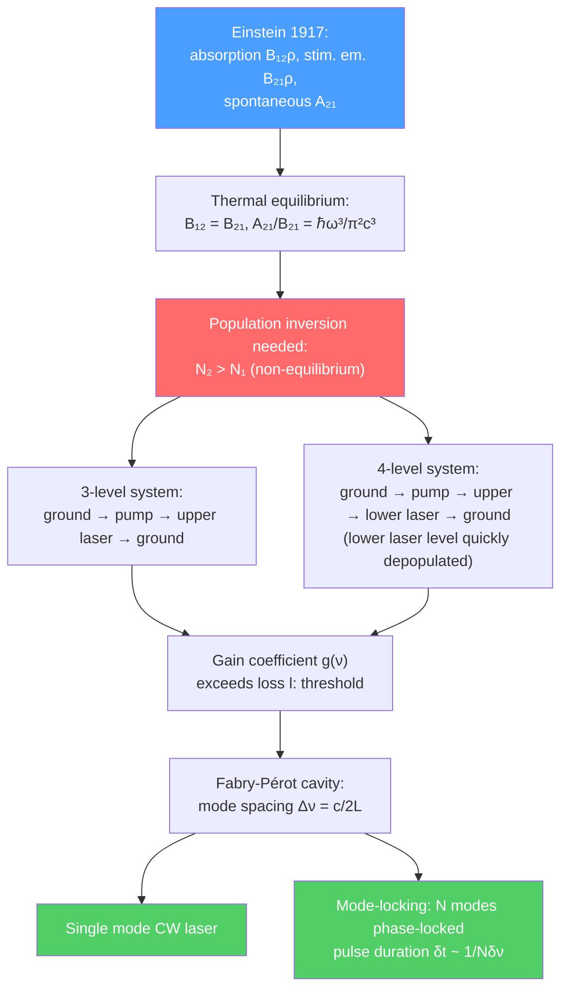

# 🔴 Laser Physics

> [!abstract] TL;DR
> A laser (Light Amplification by Stimulated Emission of Radiation) produces coherent, highly directional, monochromatic light by stimulated emission from an inverted population. Einstein's 1917 analysis of blackbody radiation introduced the A and B coefficients relating spontaneous emission, stimulated emission, and absorption. Population inversion (more atoms in the upper state than the lower) is thermodynamically non-equilibrium and requires pumping via three- or four-level schemes. A Fabry-Pérot cavity selects longitudinal modes; mode-locking forces them to interfere coherently, producing ultrashort pulses. At PhD level, chirped pulse amplification (Nobel 2018), high harmonic generation for attosecond pulses, and optical frequency combs (Nobel 2005) represent the frontier.

## Intuition — analogy FIRST

Ordinary light (a lamp) is like a crowd of people all talking at random — incoherent noise. A laser is like a choir trained to sing the exact same note at the exact same time — every photon has the same frequency, phase, and direction. The trick is **stimulated emission**: when a photon passes an already-excited atom, it can trigger the atom to emit an *identical* photon — same frequency, same direction, same phase. If there are more excited atoms than ground-state atoms (population inversion), each stimulated photon creates two, those two create four, and so on — an exponential chain reaction of coherent light.

---

## How It Works

---

## Key Concepts / Details

### Secondary Level

**What makes laser light special:** Three properties distinguish laser light from a lamp:
1. **Coherence:** All photons are in phase (temporal and spatial coherence)
2. **Monochromaticity:** Extremely narrow linewidth (single frequency)
3. **Directionality:** Low divergence beam (diffraction-limited)

**Everyday lasers:** Barcode scanners (red diode, 650 nm), laser printers (IR diode, 780 nm), fiber-optic internet (1550 nm laser pulses), laser surgery (CO₂ 10.6 µm for cutting, Nd:YAG 1064 nm for ophthalmology), laser levels in construction.

**Light amplification:** "Laser" is an acronym. The key physical process is stimulated emission — an excited atom, triggered by a passing photon, emits a second photon that is an exact copy of the first.

### Undergraduate Level

**Einstein A and B coefficients (1917):** Consider a two-level atom with populations $N_1$ (lower) and $N_2$ (upper) in a radiation field of spectral energy density $\rho(\nu)$:

| Process | Rate |
|---------|------|
| Absorption | $B_{12}\rho(\nu)N_1$ |
| Stimulated emission | $B_{21}\rho(\nu)N_2$ |
| Spontaneous emission | $A_{21}N_2$ |

At thermal equilibrium, setting rate of change to zero and applying the Boltzmann distribution $N_2/N_1 = e^{-h\nu/k_BT}$ plus Planck's law for $\rho(\nu)$ gives:

$$B_{12} = B_{21} \qquad \text{and} \qquad \frac{A_{21}}{B_{21}} = \frac{8\pi h\nu^3}{c^3}$$

The high ratio $A_{21}/B_{21} \propto \nu^3$ means spontaneous emission dominates at optical frequencies in vacuum — this is why making a laser requires cavity feedback to build up enough stimulated emission rate.

**Population inversion:** At thermal equilibrium, $N_2/N_1 = e^{-h\nu/k_BT} < 1$ always — more atoms in the lower state. Lasing requires $N_2 > N_1$ (inversion), achieved by external pumping.

- **Three-level laser** (e.g., ruby): Ground state = lower laser level. Must pump more than half the atoms to the upper state. High threshold. Ruby laser (Maiman, 1960): ground $\to$ pump band $\to$ upper laser level ($^2E$) $\to$ ground.
- **Four-level laser** (e.g., Nd:YAG, HeNe): Lower laser level is above the ground state and rapidly depopulated by non-radiative decay. Even a small pump creates inversion → lower threshold. Nd:YAG: $^4F_{3/2} \to {^4I_{11/2}}$ at 1064 nm.

**Laser rate equations:** For photon number $\phi$ in the cavity and population difference $\Delta N = N_2 - N_1$:

$$\frac{d\phi}{dt} = (g - l)\phi + A_{21}N_2 \qquad \frac{d\Delta N}{dt} = R_p - \frac{\Delta N}{\tau} - 2g\phi$$

**Threshold condition:** Gain equals round-trip loss: $g(\nu) = l$, where gain coefficient $g \propto \Delta N \sigma(\nu)$ ($\sigma$ = stimulated emission cross-section). Below threshold, the field is amplified spontaneous emission (ASE); above, lasing.

**Fabry-Pérot resonator:** A cavity of length $L$ supports standing-wave **longitudinal modes** at frequencies $\nu_q = qc/2nL$ (spacing $\Delta\nu_{FSR} = c/2nL$). The cavity **finesse** $\mathcal{F} = \pi\sqrt{R}/(1-R)$ (for mirror reflectivity $R$) determines how many modes are supported and the linewidth of each mode: $\delta\nu = \Delta\nu_{FSR}/\mathcal{F}$.

**Transverse modes (TEM modes):** The transverse profile of the beam is described by Hermite-Gaussian modes TEM$_{mn}$. The fundamental TEM$_{00}$ is a Gaussian beam — the ideal laser output. Higher-order modes have node lines; beam quality parameter $M^2 = 1$ for a perfect Gaussian.

**Mode-locking:** A laser cavity supporting $N$ longitudinal modes, if their phases are locked (using a saturable absorber or acousto-optic modulator), produces a train of ultrashort pulses. The pulse duration:

$$\delta t \approx \frac{1}{N\Delta\nu_{FSR}} = \frac{2L}{Nc}$$

is inversely proportional to the gain bandwidth. **Kerr lens mode-locking (KLM)** in Ti:sapphire exploits the intensity-dependent refractive index $n = n_0 + n_2 I$: the high-intensity pulse creates a self-focusing lens that couples with an aperture to prefer short pulses over CW. Ti:sapphire lasers produce pulses as short as 5 fs.

**Q-switching:** Instead of locking phases, one can build up population inversion with the cavity **quality factor Q blocked** (high loss), then suddenly switch to high Q — the stored energy is dumped in a giant pulse of ns duration with MW peak power.

### Graduate Level

**Laser types and their physics:**

| Laser | Medium | Wavelength | Mechanism |
|-------|--------|-----------|-----------|
| HeNe | He-Ne gas | 633 nm | He* excites Ne by collisional transfer |
| Nd:YAG | Nd³⁺ in YAG | 1064 nm | 4-level, high gain |
| CO₂ | CO₂/N₂/He | 10.6 µm | Vibrational transitions of CO₂ |
| Ti:sapphire | Ti³⁺ in Al₂O₃ | 700–1000 nm | Vibronic (broad bandwidth → fs pulses) |
| Diode laser | Semiconductor | 375–2000 nm | Electron-hole recombination |
| Fiber laser | Er/Yb-doped fiber | 1030–1550 nm | Distributed gain, excellent beam quality |
| Free-electron laser (FEL) | Relativistic e⁻ | X-ray–THz | Undulator spontaneous/stimulated emission |

**Chirped pulse amplification (CPA)** (Mourou & Strickland, Nobel 2018): To amplify ultrashort pulses without destroying the gain medium by the enormous peak intensity, the pulse is first **stretched** in time by a grating pair (chirping — different frequencies at different times), amplified safely, then **re-compressed** by a matched grating pair. Enables petawatt ($10^{15}$ W) pulses at tabletop scale. Applications: laser-driven particle acceleration, laser-plasma experiments, LASIK surgery.

**High harmonic generation (HHG) and attosecond pulses:** A femtosecond laser pulse focused into a noble gas produces harmonics at odd multiples of the fundamental (3rd, 5th, ..., up to ~100th). The three-step model: (1) ionization by tunnel ionization, (2) electron acceleration in the laser field, (3) recombination with the ion — emitting an attosecond ($10^{-18}$ s) XUV burst. Attosecond pulses resolve electron dynamics in atoms and molecules (Nobel 2023, L'Huillier, Krausz, Agostini).

**Optical frequency combs** (Hall & Hänsch, Nobel 2005): A mode-locked laser produces a frequency comb — evenly-spaced teeth in the frequency domain at $f_n = f_{CEO} + n\cdot f_{rep}$, where $f_{rep} = 1/T_{round-trip}$ is the repetition rate and $f_{CEO}$ is the carrier-envelope offset frequency (stabilizable via $f$-to-$2f$ self-referencing). A comb phase-locked to an atomic clock transfers optical frequency precision ($\Delta\nu/\nu \sim 10^{-18}$) to any point in the visible spectrum. Applications: optical clocks, precision GPS, astronomical spectrograph calibration, direct spectroscopy.

**Laser-plasma interaction:** At intensities $> 10^{18}$ W/cm², the laser ponderomotive force ($F_{pond} = -e^2E_0^2/4m_e\omega^2$, averaged over a cycle) expels electrons from the focus, creating relativistic electron beams via wakefield acceleration (LWFA) — GeV electrons in cm-scale plasma. This is the basis for compact particle accelerators and X-ray free-electron lasers.

---

## Real-World Notes

- **LASIK eye surgery:** An excimer laser (ArF, 193 nm) reshapes the cornea with sub-micron precision using ablative photodecomposition — UV photons break molecular bonds directly without thermal damage.
- **LiDAR (autonomous vehicles):** Pulsed laser rangefinding maps 3D environments at 10+ Hz; time-of-flight $\Delta t \to \Delta r = c\Delta t/2$.
- **Gravitational wave detection (LIGO):** 1064 nm Nd:YAG laser with $\sim$200 kW circulating power in 4-km Fabry-Pérot arms — strain sensitivity $h \sim 10^{-23}/\sqrt{\text{Hz}}$.
- **Laser isotope separation:** Selective two-photon ionization exploits isotope shifts in atomic resonance frequencies to separate $^{235}$U from $^{238}$U.

---

## Common Pitfalls

- **A two-level laser is impossible:** Stimulated emission and absorption rates are equal ($B_{12} = B_{21}$), so a two-level system can at best reach equal populations — no inversion.
- **Spontaneous emission is the enemy of coherence** in a laser — it seeds phase noise. A laser operating well above threshold has linewidth $\delta\nu = A_{21}\langle n_{sp}\rangle/4\pi P_{out}$ (Schawlow-Townes formula), far below the gain linewidth.
- **Mode-locked pulse duration $\delta t$ and bandwidth $\Delta\nu$ satisfy** $\delta t \cdot \Delta\nu \geq K$ (time-bandwidth product, $K = 0.441$ for transform-limited Gaussian pulses). Pulses with $K > 0.441$ are chirped.
- **Finesse and Q-factor are distinct:** Finesse $\mathcal{F} = \Delta\nu_{FSR}/\delta\nu$ is a property of the resonator geometry; $Q = \nu_0/\delta\nu$ also depends on the frequency.

---

## Related Concepts

- [[Multi_Electron_Atoms]] — atomic energy levels define laser transitions and selection rules
- [[Molecular_Spectroscopy]] — laser sources enable modern spectroscopy; laser linewidth limits resolution
- [[Laser_Cooling_and_Trapping]] — lasers are the tool; laser physics is the foundation
- [[Quantum_Optics_and_Cavity_QED]] — cavity resonator theory, quantized field modes
- [[_MOC_AMO_Physics|↑ Section MOC]]

---

## Review Questions

1. **(Secondary)** Name three properties that distinguish laser light from the light of an ordinary lamp. Give one everyday application for each property.
2. **(Undergraduate)** Derive the relation $A_{21}/B_{21} = 8\pi h\nu^3/c^3$ from the requirement that Einstein's two-level model reproduce Planck's blackbody spectrum at thermal equilibrium. Why is a two-level laser impossible?
3. **(Graduate)** Describe the three steps of the chirped pulse amplification technique. Why is CPA necessary for petawatt lasers, and what damage mechanism does it avoid? Briefly explain how a self-referencing $f$-to-$2f$ interferometer stabilizes the carrier-envelope offset frequency of a frequency comb.

---

## Sources

- Saleh & Teich, *Fundamentals of Photonics*, 3rd ed. (comprehensive laser optics textbook)
- Siegman, *Lasers* (definitive graduate reference, mode theory, rate equations)
- Mourou & Strickland, Nobel Lecture (2018) — chirped pulse amplification
- Hänsch & Hall, Nobel Lecture (2005) — frequency combs
- Brabec & Krausz, *Rev. Mod. Phys.* 72, 545 (2000) — intense few-cycle laser fields

#physics #amo-physics #laser-physics #stimulated-emission #mode-locking #CPA #frequency-comb #attosecond
