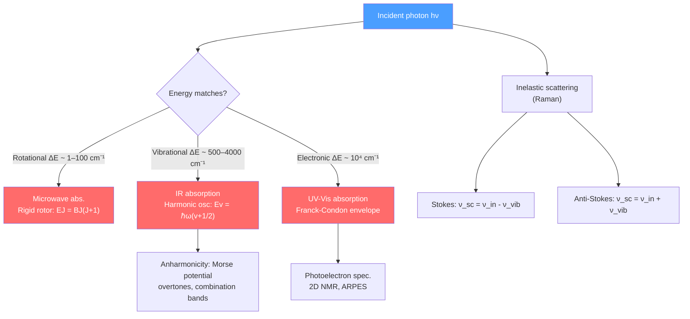

# 📡 Molecular Spectroscopy

> [!abstract] TL;DR
> Spectroscopy uses light to probe the quantized energy levels of molecules. Microwave radiation drives **rotational** transitions (rigid rotor, $E_J = BJ(J+1)$); infrared drives **vibrational** transitions (harmonic oscillator, $E_v = \hbar\omega(v+1/2)$); visible/UV drives **electronic** transitions (Franck-Condon principle governs vibrational envelope). Raman scattering (inelastic photon scattering) reveals modes inactive in IR. At PhD level, NMR exploits nuclear spin precession in magnetic fields for structural determination, while ultrafast pump-probe and 2D spectroscopies resolve dynamics on femtosecond timescales.

## Intuition — analogy FIRST

A molecule is like a tiny tuning-fork sculpture with rotating arms and vibrating springs connecting the masses. Shine light of just the right frequency and you excite one of its natural motions — you can "ring" the rotational modes with microwaves, the vibrational modes with infrared, and the electronic modes with visible or UV light. Reading back which frequencies were absorbed is like reading a fingerprint — each molecule has a unique spectral barcode. Raman spectroscopy is different: you shine one color in and look for light scattered at slightly different colors, each shift revealing a particular vibration's frequency.

---

## How It Works

---

## Key Concepts / Details

### Secondary Level

**Spectroscopy as molecular fingerprinting:** Each molecule absorbs and emits light at specific frequencies determined by its quantum energy levels. An absorption spectrum (dark lines on a bright background) or emission spectrum (bright lines on dark) uniquely identifies the molecule — used from chemical analysis labs to astronomers identifying molecules in stellar atmospheres.

**The electromagnetic spectrum for molecular spectroscopy:**
| Region | Frequency range | Transition type |
|--------|----------------|-----------------|
| Microwave | 1–300 GHz | Molecular rotation |
| Infrared (IR) | 300 GHz–430 THz | Molecular vibration |
| Visible/UV | 430 THz–3 PHz | Electronic |
| X-ray | >3 PHz | Core electron (inner shell) |

Color in molecules comes from electronic absorption: chlorophyll absorbs red and blue, reflects green; hemoglobin absorbs blue-green, reflects red.

### Undergraduate Level

**Rotational spectroscopy — rigid rotor:** A diatomic molecule rotating about its center of mass has quantized angular momentum. The energy levels are:

$$E_J = \frac{\hbar^2}{2I}J(J+1) \equiv BJ(J+1), \qquad J = 0, 1, 2, \ldots$$

where $I = \mu r_e^2$ is the moment of inertia ($\mu$ = reduced mass, $r_e$ = bond length) and $B = \hbar^2/2I$ is the rotational constant. The **selection rule** is $\Delta J = \pm 1$ (requires a permanent dipole moment — homonuclear diatomics N₂, O₂ have *no* pure rotational spectrum). Transitions appear as an equally-spaced comb in the microwave with spacing $2B$. Measuring $B$ gives $r_e$ with picometer precision.

**Vibrational spectroscopy — harmonic oscillator:** Diatomic vibrational energy levels:

$$E_v = \hbar\omega_e\left(v + \frac{1}{2}\right), \qquad v = 0, 1, 2, \ldots$$

where $\omega_e = \sqrt{k/\mu}$ ($k$ = force constant). Selection rule: $\Delta v = \pm 1$ AND the dipole moment must change with displacement (IR-active). The fundamental transition $v = 0 \to 1$ appears in the mid-infrared.

**Anharmonicity and the Morse potential:**

$$V(r) = D_e\left(1 - e^{-a(r-r_e)}\right)^2$$

gives corrected energy levels $E_v = \hbar\omega_e(v+1/2) - \hbar\omega_e x_e(v+1/2)^2$ where $x_e$ is the anharmonicity constant. Anharmonicity allows overtone ($\Delta v = 2, 3, \ldots$) transitions and means vibrational levels converge toward the dissociation energy $D_0$.

**Raman spectroscopy:** A photon of frequency $\nu_0$ scatters inelastically:
- **Stokes Raman** ($\nu_{sc} = \nu_0 - \nu_{vib}$): molecule gains vibrational quantum → scattered photon has less energy
- **Anti-Stokes Raman** ($\nu_{sc} = \nu_0 + \nu_{vib}$): molecule starts in excited vibrational state → scattered photon gains energy (weaker at room temperature)

Selection rule: the **polarizability** must change during the vibration (not the dipole moment). This makes Raman complementary to IR — the symmetric stretch of CO₂ is Raman-active but IR-inactive, and vice versa for the asymmetric stretch. Selection rules: $\Delta v = \pm 1$, $\Delta J = 0, \pm 2$ (giving O, Q, S branches).

**Electronic spectroscopy and the Franck-Condon principle:** Electronic transitions (UV-visible) occur on a timescale ($\sim 10^{-15}$ s) much faster than nuclear motion ($\sim 10^{-13}$ s). Thus, during an electronic transition, the nuclear coordinates and momenta are unchanged — the transition appears as a vertical line on the PES diagram. The probability of ending in vibrational level $v'$ of the upper state is:

$$I(v'' \to v') \propto |\langle \chi_{v'}|\chi_{v''}\rangle|^2$$

These **Franck-Condon factors** determine the vibrational envelope of electronic bands. If the equilibrium bond length changes little between states, $v=0 \to v'=0$ is strongest. If the bond lengthens (weakened by the electronic excitation), the intensity maximum shifts to higher $v'$.

**Vibration-rotation coupling:** In a real diatomic, the rotational constant $B$ depends on $v$ because the average bond length changes with vibrational amplitude: $B_v = B_e - \alpha_e(v+1/2)$. This produces P-branch ($\Delta J = -1$) and R-branch ($\Delta J = +1$) in a vibration-rotation spectrum, with a gap at the band origin.

### Graduate Level

**NMR spectroscopy:** A nucleus with spin $I > 0$ placed in a magnetic field $B_0$ has Zeeman energy levels $E_m = -\gamma_N\hbar m B_0$, where $\gamma_N$ is the gyromagnetic ratio. RF pulses at the Larmor frequency $\nu_L = \gamma_N B_0 / 2\pi$ flip spins; the free-induction decay after the pulse is Fourier-transformed to give the NMR spectrum.

**Chemical shift:** Electrons in bonds partially shield the nucleus from $B_0$: $B_{eff} = B_0(1-\sigma)$. The chemical shift $\delta = (\nu_{sample} - \nu_{ref})/\nu_{ref} \times 10^6$ (in ppm) reports the electronic environment. **J-coupling** (scalar coupling) between nearby nuclei through bonds causes line splitting ($n+1$ rule for equivalent neighbors).

**Relaxation:** Spin-lattice relaxation time $T_1$ (longitudinal, recovery of $M_z$) and spin-spin relaxation time $T_2$ (transverse, decay of $M_{xy}$) determine linewidth ($\Delta\nu \sim 1/\pi T_2$) and pulsing repetition. MRI exploits spatial variation of $T_1$ and $T_2$ in tissues.

**2D NMR** (COSY, NOESY, HSQC) spreads peaks into two frequency axes via pulse sequences with variable delay $t_1$; cross-peaks reveal through-bond couplings (COSY) or through-space proximity (<5 Å, NOESY), enabling determination of protein solution structures.

**Ultrafast spectroscopy (pump-probe):** A femtosecond pump pulse initiates a photochemical process (e.g., bond breaking, charge transfer); a delayed probe pulse measures transient absorption at time delay $\Delta t$. Time resolution $\sim 10$–100 fs maps dynamics on the PES. **2D IR** spectroscopy resolves vibrational coupling and energy transfer on the same timescale as molecular dynamics.

**Photoelectron spectroscopy and ARPES:** Measuring the kinetic energy of photoejected electrons at fixed photon energy gives the binding energy of molecular orbitals (Koopmans' theorem in UPS). **Angle-Resolved Photoemission Spectroscopy (ARPES)** on solids maps the electronic band structure $E(\mathbf{k})$ in reciprocal space — the primary experimental tool for correlated electron materials.

**EXAFS (Extended X-ray Absorption Fine Structure):** Oscillations in X-ray absorption above an edge arise from backscattering of the ejected photoelectron from neighboring atoms. Fourier transform gives a pseudo-radial distribution function — bond lengths and coordination numbers with Å precision, element-specific, applicable to amorphous and liquid samples.

---

## Real-World Notes

- **Breathalyzer:** Infrared absorption at 3.4 µm ($\nu_{C-H}$) detects ethanol vapor concentration in exhaled air.
- **Greenhouse gases:** CO₂ ($\nu_3$ at 15 µm), CH₄, and H₂O absorb outgoing IR radiation — IR-active vibrational modes are directly responsible for climate forcing.
- **Drug structure determination:** NMR (¹H, ¹³C, and 2D experiments) identifies molecular structure and stereochemistry of pharmaceutical compounds in solution.
- **Raman in art conservation:** Portable Raman spectrometers identify pigments (cinnabar, lapis lazuli) in paintings without sampling, for authentication and conservation.

---

## Common Pitfalls

- **IR vs Raman activity is not the same:** For centrosymmetric molecules (CO₂, benzene), no mode can be *simultaneously* IR and Raman active (rule of mutual exclusion) — the symmetry that makes it IR-active (dipole change) is incompatible with it being Raman-active (polarizability change) under an inversion center.
- **The Franck-Condon principle is about nuclear coordinates, not momenta** — vertical transitions conserve nuclear positions, not velocities (momentum is not conserved in the sense that the electronic potential has changed).
- **$T_1 \geq T_2/2$ always** — $T_2$ can never exceed $2T_1$; in solids $T_2 \ll T_1$ is common.
- **Raman anti-Stokes intensity is thermally populated** — it depends on $\exp(-\hbar\omega_{vib}/k_BT)$, so anti-Stokes/Stokes ratio gives vibrational temperature.

---

## Related Concepts

- [[Molecular_Structure_and_Bonding]] — PES and vibrational modes arise from the electronic structure
- [[Laser_Physics]] — lasers are the light sources for all modern spectroscopy techniques
- [[Multi_Electron_Atoms]] — atomic selection rules generalize to molecular selection rules
- [[Quantum_Optics_and_Cavity_QED]] — cavity-enhanced spectroscopy; cavity ring-down spectroscopy
- [[_MOC_AMO_Physics|↑ Section MOC]]

---

## Review Questions

1. **(Secondary)** Why does CO₂ absorb infrared radiation but N₂ does not? What property of the molecular vibration determines IR activity?
2. **(Undergraduate)** The rotational constant of HCl is $B = 10.59$ cm⁻¹. Calculate the bond length. Predict the frequency of the $J=0 \to 1$ transition. Why does the pure rotational spectrum show lines spaced by $2B$?
3. **(Graduate)** Explain the Franck-Condon principle and how it determines the vibrational envelope of an electronic absorption band. Describe how pump-probe spectroscopy can track nuclear wavepacket motion on a PES after photoexcitation.

---

## Sources

- Atkins & de Paula, *Physical Chemistry*, Ch. 13–14 (molecular spectroscopy, NMR)
- Herzberg, *Spectra of Diatomic Molecules* (definitive classical reference)
- Hamm & Zanni, *Concepts and Methods of 2D Infrared Spectroscopy* (ultrafast 2D IR)
- Ernst, Bodenhausen & Wokaun, *Principles of NMR in One and Two Dimensions*
- Lüth, *Solid Surfaces, Interfaces and Thin Films*, Ch. 4 (ARPES)

#physics #amo-physics #spectroscopy #rotational-spectroscopy #vibrational-spectroscopy #Raman #Franck-Condon #NMR #ultrafast
