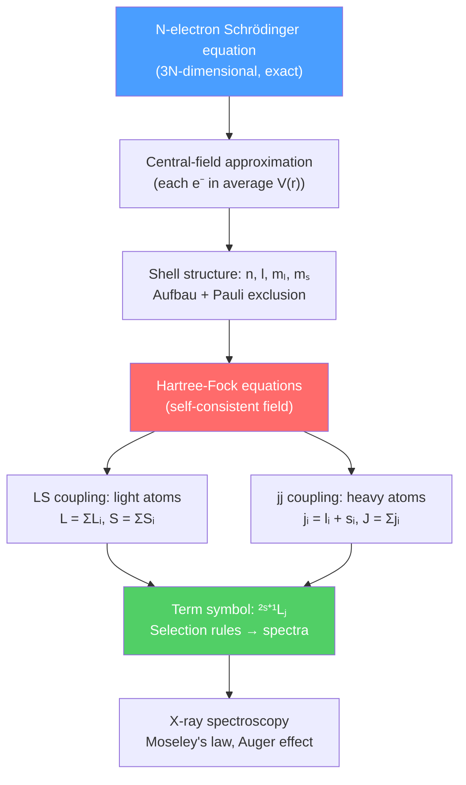

# ⚛️ Multi-Electron Atoms

> [!abstract] TL;DR
> Beyond hydrogen, atoms have multiple electrons that repel each other — this electron-electron repulsion is the central complication. The central-field (Hartree-Fock) approximation handles it by having each electron move in an average potential from the nucleus plus all other electrons, producing the familiar shell structure ($n, l, m_s$) that underlies the periodic table. Coupling schemes (LS for light atoms, jj for heavy ones) specify how orbital and spin angular momenta combine into spectroscopic terms $^{2S+1}L_J$. At the PhD level, Rydberg atoms, relativistic corrections from the Dirac equation, and parity non-conservation from the weak force push atomic physics toward the frontier of precision tests of the Standard Model.

## Intuition — analogy FIRST

Think of a crowded city apartment block. Each apartment (atomic orbital) can hold at most two tenants (electrons, spin up and down). Tenants on lower floors (lower $n$) pay less rent (have lower energy). But tenants also push each other away — the electrostatic repulsion means the "rent schedule" is more complicated than it would be in an empty building. The Hartree-Fock method is like letting each tenant feel only the *average* crowd pressure from all others — a huge simplification that still captures most of the physics.

---

## How It Works

---

## Key Concepts / Details

### Secondary Level

**Electron shells and the periodic table:** Electrons fill energy levels characterized by principal quantum number $n = 1, 2, 3, \ldots$ (K, L, M shells). Within each shell, sub-shells are labeled by orbital angular momentum $l = 0, 1, 2, 3, \ldots$ (s, p, d, f). The Pauli exclusion principle limits each orbital to two electrons (spin up and down), leading to the shell-filling pattern that organizes the periodic table.

**Valence electrons** occupy the outermost incompletely filled shell and determine chemical bonding, reactivity, and optical spectra. Core electrons are tightly bound and largely inert to chemistry but accessible via X-rays.

**Shielding:** Inner electrons partially screen the nuclear charge $Ze$ from outer electrons. An outer electron sees an effective nuclear charge $Z_{eff} = Z - \sigma$ where $\sigma$ is the shielding constant. This is why $3s$ electrons are more tightly bound than $3p$ even though $n$ is the same — $s$ orbitals penetrate closer to the nucleus.

### Undergraduate Level

**Helium and the Hartree-Fock (HF) approximation:** The two-electron Hamiltonian is:

$$H = -\frac{\hbar^2}{2m}(\nabla_1^2 + \nabla_2^2) - \frac{Ze^2}{r_1} - \frac{Ze^2}{r_2} + \frac{e^2}{r_{12}}$$

The $e^2/r_{12}$ term is the troublemaker. The central-field approximation replaces it with a spherically averaged potential $U(r)$, making the problem separable. Each electron then satisfies a one-electron Schrödinger equation, which is solved self-consistently (the HF SCF loop).

**Exchange interaction:** Because electrons are fermions, the total wave function must be antisymmetric. Writing $\psi = \psi_{spatial}\chi_{spin}$, the antisymmetry requirement forces parallel spins (triplet, symmetric spin) to have an antisymmetric spatial wave function, which keeps electrons farther apart and *lowers* the repulsion energy. This is the **exchange energy** — purely quantum mechanical, no classical analog. It is responsible for Hund's first rule: for a given configuration, the term with maximum $S$ lies lowest.

**LS (Russell-Saunders) coupling** applies to light atoms ($Z \lesssim 30$) where spin-orbit coupling is weaker than the residual electron-electron repulsion. Individual orbital angular momenta combine to give total $\mathbf{L} = \sum_i \mathbf{l}_i$ and individual spins give $\mathbf{S} = \sum_i \mathbf{s}_i$; then $\mathbf{J} = \mathbf{L} + \mathbf{S}$. The spectroscopic term symbol is:

$$^{2S+1}L_J$$

where $L$ is written as S, P, D, F for $L = 0, 1, 2, 3$.

**jj coupling** applies to heavy atoms ($Z \gtrsim 70$) where spin-orbit interaction dominates. Each electron first forms $\mathbf{j}_i = \mathbf{l}_i + \mathbf{s}_i$, then the individual $j_i$ couple to give total $\mathbf{J} = \sum_i \mathbf{j}_i$. Lead and bismuth spectral lines are characteristic jj examples.

**Hund's rules** (for the ground term of a given configuration):
1. Maximum $S$ (triplet below singlet).
2. Maximum $L$ consistent with rule 1.
3. $J = |L-S|$ for a less-than-half-filled shell; $J = L+S$ for more-than-half-filled.

**Electric dipole selection rules** ($\Delta l = \pm 1$ for the active electron):
$$\Delta L = 0, \pm 1 \quad (\text{not } 0 \to 0); \qquad \Delta S = 0; \qquad \Delta J = 0, \pm 1 \quad (\text{not } 0 \to 0)$$

**X-ray spectroscopy and Moseley's law:** Bombarding an atom with electrons ejects a K-shell electron ($n=1$). An L-shell electron ($n=2$) drops down, emitting a characteristic X-ray with frequency:

$$\sqrt{\nu} \propto (Z - \sigma)$$

Moseley (1913) measured $\sqrt{\nu}$ vs $Z$ and found a straight line — this was the first empirical ordering of the periodic table by atomic number rather than atomic weight.

**Auger effect:** Instead of emitting an X-ray, an atom can transfer the de-excitation energy to a second electron, ejecting it (the Auger electron). Auger emission dominates for light elements (low Z); X-ray emission dominates for heavy elements.

### Graduate Level

**Rydberg atoms** have one electron excited to a very large principal quantum number $n \gg 1$. Their properties scale dramatically with $n$:

| Property | Scaling |
|----------|---------|
| Orbital radius | $\langle r \rangle \propto n^2 a_0$ |
| Binding energy | $E \propto -1/n^2$ |
| Radiative lifetime | $\tau \propto n^3$ |
| Electric dipole moment | $\mu \propto n^2 e a_0$ |
| Polarizability | $\alpha \propto n^7$ |

At $n \sim 50$, atoms are $\sim$µm in size with lifetimes of ms, making them ideal for strong-coupling cavity QED and quantum simulation. **Quantum defect theory** accounts for the penetration of the Rydberg electron into the ionic core: $E_{n,l} = -R_\infty hc/(n - \delta_l)^2$ where $\delta_l$ is the quantum defect (largest for $l=0$, nearly zero for large $l$).

**Multi-configuration Hartree-Fock (MCHF):** The single-configuration HF wavefunction misses **correlation energy** — the correlated motion of electrons beyond the mean field. MCHF expands the wavefunction as a sum over many Slater determinants (configurations), recovering correlation effects important for accurate energies and transition rates.

**Relativistic corrections from the Dirac equation:** For hydrogen, the Dirac equation predicts fine structure splitting of order $(Z\alpha)^2 E_n$ between levels with the same $n$ but different $j$, where $\alpha \approx 1/137$ is the fine-structure constant. The $2s_{1/2}$ and $2p_{1/2}$ states are predicted degenerate by Dirac but split by the **Lamb shift** ($\sim 1058$ MHz) due to QED vacuum fluctuations — one of the most precise tests of QED.

**Parity non-conservation in atoms:** The weak force violates parity. In atoms, the Z boson mediates a tiny parity-violating interaction between electrons and the nucleus. This produces observable effects in heavy atoms (Cs, Tl) — a small optical rotation in atomic vapors — which provide precision tests of the electroweak mixing angle $\sin^2\theta_W$ complementary to accelerator experiments.

---

## Real-World Notes

- **Fluorescent lamps and LEDs:** Mercury vapor transitions (253.7 nm UV → phosphor → visible) and semiconductor band-edge transitions both arise from multi-electron quantum structure.
- **Analytical chemistry (ICP-OES):** Inductively coupled plasma optical emission spectroscopy identifies elements from characteristic emission lines — directly applying Moseley's ordering.
- **Medical imaging (PET):** Positron emission creates electron-positron annihilation → two 511 keV gamma rays; the positron source nuclides are identified by their atomic spectra.
- **Quantum computing (Rydberg qubits):** Strong, tunable Rydberg-Rydberg interactions ($\propto n^{11}$) enable high-fidelity two-qubit gates in neutral-atom quantum computers.

---

## Common Pitfalls

- **Hund's rules apply only to the ground term** of a given electron configuration, not to excited states.
- **LS vs jj coupling is a continuum**, not a sharp boundary; intermediate coupling (mixing of LS states) applies to many atoms in the middle of the periodic table.
- **Exchange energy is not a "force"** — it is a consequence of the antisymmetry requirement and exists even for electrons that never classically "interact."
- **Screening constants $\sigma$ depend on the orbital**, not just the shell; Slater's rules give approximate values but break down for d and f orbitals.

---

## Related Concepts

- [[Molecular_Structure_and_Bonding]] — atomic orbital theory extends directly to molecules
- [[Molecular_Spectroscopy]] — selection rules derived from atomic physics govern molecular transitions too
- [[Laser_Physics]] — laser transitions exploit atomic energy levels and selection rules
- [[Quantum_Optics_and_Cavity_QED]] — Rydberg atoms are key platforms for cavity QED
- [[_MOC_AMO_Physics|↑ Section MOC]]

---

## Review Questions

1. **(Secondary)** Carbon has ground configuration $1s^2 2s^2 2p^2$. How many electrons are in each shell? Which electrons are valence electrons?
2. **(Undergraduate)** Write the ground term symbol for carbon using Hund's rules. What are the allowed $J$ values and which lies lowest? State the electric dipole selection rules for transitions from this term.
3. **(Graduate)** A Rydberg atom has $n = 50$. Estimate its orbital radius, electric dipole moment, and radiative lifetime compared to the $n=1$ state. Why are Rydberg atoms useful for quantum simulation?

---

## Sources

- Foot, *Atomic Physics*, Oxford (shells, coupling schemes, spectroscopy)
- Bransden & Joachain, *Physics of Atoms and Molecules*, 2nd ed. (Hartree-Fock, LS/jj coupling)
- Gallagher, *Rydberg Atoms*, Cambridge (Rydberg physics and quantum defect theory)
- Johnson, *Atomic Structure Theory* (relativistic Dirac approach, parity violation)
- Drake (ed.), *Springer Handbook of Atomic, Molecular, and Optical Physics*

#physics #amo-physics #atomic-physics #multi-electron-atoms #LS-coupling #Rydberg #Hartree-Fock #spectroscopy
