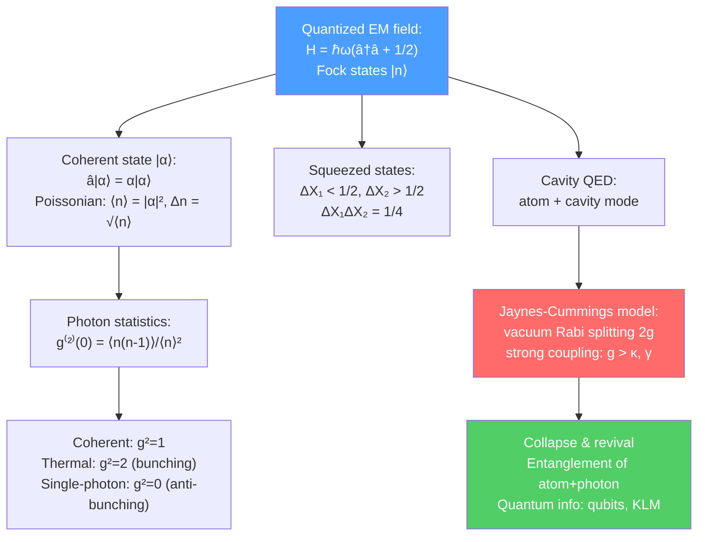

# 💡 Quantum Optics and Cavity QED

> [!abstract] TL;DR
> Quantum optics treats the electromagnetic field itself as quantized, with photon number states $|n\rangle$ (Fock states), creation/annihilation operators $\hat{a}^\dagger, \hat{a}$, and a zero-point field energy $\hbar\omega/2$ even in the vacuum. Coherent states $|\alpha\rangle$ (Glauber, Nobel 2005) are eigenstates of $\hat{a}$ and describe laser light — Poissonian photon statistics, minimum uncertainty. Squeezed states push below vacuum noise in one quadrature. The Hanbury Brown-Twiss experiment distinguishes classical (bunching) from quantum (anti-bunching, $g^{(2)}(0) < 1$) light. Cavity QED couples a single atom to a single photon mode: the Jaynes-Cummings model produces vacuum Rabi splitting and collapse-and-revival of Rabi oscillations. These tools underpin photonic quantum computing, quantum cryptography, and quantum networking.

## Intuition — analogy FIRST

Classical electromagnetism describes light as a wave with continuously adjustable amplitude and phase — like water in a bathtub, you can have any amount. Quantum optics reveals that the water is actually made of discrete drops (photons), and even an "empty" bathtub has unavoidable quantum ripples (vacuum fluctuations). A coherent state — laser light — is the quantum state that most closely mimics the classical wave, but its photon number still fluctuates (Poissonian). Squeezed states trade photon-number certainty for phase certainty (or vice versa), beating the "standard quantum limit." Cavity QED is the ultimate version: one atom + one photon, fully coupled, with every quantum jump visible.

---

## How It Works

---

## Key Concepts / Details

### Secondary Level

**Light is made of photons:** Each photon carries energy $E = h\nu$ and momentum $p = h/\lambda$. The photoelectric effect (Einstein, 1905, Nobel 1921) showed that light ejects electrons with energy determined by photon energy, not intensity — proving light comes in discrete quanta.

**Photon counting:** Detectors (avalanche photodiodes, superconducting nanowire single-photon detectors) can register single photons. The quantum nature of light shows up in statistics: how photons bunch or anti-bunch in time.

**Laser vs thermal vs single-photon sources:**
- Laser: random arrival times, but average rate stable
- Thermal source (lamp): photons bunch (arrive in clumps)
- Single-photon emitter (quantum dot, NV center): never two photons at once

### Undergraduate Level

**Quantization of the electromagnetic field:** The vector potential is expanded in modes, each with Hamiltonian:

$$\hat{H} = \hbar\omega\left(\hat{a}^\dagger\hat{a} + \frac{1}{2}\right)$$

where $\hat{a}^\dagger$ (creation) and $\hat{a}$ (annihilation) obey $[\hat{a}, \hat{a}^\dagger] = 1$. The **Fock states** (number states) $|n\rangle = (\hat{a}^\dagger)^n|0\rangle/\sqrt{n!}$ are eigenstates of photon number $\hat{n} = \hat{a}^\dagger\hat{a}$ with $\hat{n}|n\rangle = n|n\rangle$. The vacuum $|0\rangle$ has zero photons but non-zero energy $\hbar\omega/2$ — the **zero-point energy**. Vacuum fluctuations cause spontaneous emission, the Lamb shift, and the Casimir effect.

**Coherent states:** Defined as eigenstates of the (non-Hermitian) annihilation operator:

$$\hat{a}|\alpha\rangle = \alpha|\alpha\rangle, \qquad \alpha \in \mathbb{C}$$

Expanded in Fock states: $|\alpha\rangle = e^{-|\alpha|^2/2}\sum_{n=0}^\infty \frac{\alpha^n}{\sqrt{n!}}|n\rangle$ — a Poissonian superposition. Properties:
- $\langle \hat{n}\rangle = |\alpha|^2$, $(\Delta n)^2 = |\alpha|^2$ (Poissonian)
- Minimum uncertainty: $\Delta X_1 \Delta X_2 = 1/4$ (both quadratures equal $1/2$)
- $|\alpha\rangle$ remains coherent under free evolution (just rotates in phase space)
- Best quantum description of laser light

**Squeezed states:** A squeezed vacuum has reduced noise in one quadrature $\hat{X}_1 = (\hat{a}+\hat{a}^\dagger)/2$ at the expense of increased noise in $\hat{X}_2 = (\hat{a}-\hat{a}^\dagger)/2i$, while saturating $\Delta X_1\Delta X_2 = 1/4$. Squeezed states enable sub-shot-noise interferometry. LIGO uses squeezed light to push beyond the standard quantum limit, extending gravitational wave detection range by $\sim 15$%.

**Photon statistics and the second-order coherence:** The second-order coherence function:

$$g^{(2)}(\tau) = \frac{\langle \hat{a}^\dagger(t)\hat{a}^\dagger(t+\tau)\hat{a}(t+\tau)\hat{a}(t)\rangle}{\langle\hat{a}^\dagger\hat{a}\rangle^2}$$

At $\tau = 0$: $g^{(2)}(0) = \langle n(n-1)\rangle/\langle n\rangle^2$.

| Source | $g^{(2)}(0)$ | Statistics |
|--------|-------------|-----------|
| Thermal (chaotic) | 2 | Super-Poissonian (bunching) |
| Coherent (laser) | 1 | Poissonian |
| Single-photon | 0 | Sub-Poissonian (anti-bunching) |
| Squeezed | $< 1$ | Sub-Poissonian |

The **Hanbury Brown-Twiss (HBT) experiment** (1956) measured $g^{(2)}(\tau)$ of starlight, demonstrating photon bunching for thermal light and enabling stellar radius measurements. Anti-bunching ($g^{(2)}(0) < 1$) is a purely quantum feature — no classical light can exhibit it.

**Mandel Q parameter:** $Q = (\Delta n)^2/\langle n\rangle - 1$; $Q < 0$ (sub-Poissonian = non-classical), $Q = 0$ (Poissonian = coherent), $Q > 0$ (super-Poissonian).

**Beam splitter in quantum optics:** A 50:50 beam splitter transforms modes: $\hat{a}_{out} = (\hat{a}_{in} + \hat{b}_{in})/\sqrt{2}$, $\hat{b}_{out} = (\hat{a}_{in} - \hat{b}_{in})/\sqrt{2}$. Hong-Ou-Mandel (HOM) effect: two identical photons incident on both ports simultaneously always exit together (both in same output port) — photon bunching due to bosonic symmetry. HOM dip ($g^{(2)}(0) = 0$) is a signature of indistinguishable single photons, essential for photonic quantum computing.

### Graduate Level

**Jaynes-Cummings model:** The canonical model of cavity QED — a two-level atom (states $|g\rangle, |e\rangle$, frequency $\omega_0$) coupled to a single cavity mode (frequency $\omega_c$) in the rotating-wave approximation:

$$\hat{H}_{JC} = \hbar\omega_c\hat{a}^\dagger\hat{a} + \frac{\hbar\omega_0}{2}\hat{\sigma}_z + \hbar g(\hat{a}\hat{\sigma}_+ + \hat{a}^\dagger\hat{\sigma}_-)$$

where $g$ is the vacuum Rabi coupling. The exact eigenstates are dressed states $|\pm,n\rangle = (|e,n\rangle \pm |g,n+1\rangle)/\sqrt{2}$ with energies $E_{\pm,n} = (n+1)\hbar\omega \pm \hbar g\sqrt{n+1}$.

**Vacuum Rabi splitting:** Even with $n=0$ photons, the atom-cavity system splits into two dressed states separated by $2g$ — the **vacuum Rabi splitting**. This is the hallmark of the strong-coupling regime: $g > \kappa$ (cavity decay rate) and $g > \gamma$ (atomic spontaneous emission rate). When the photon bounces between the atom and the cavity faster than either can leak away, the system is in strong coupling.

**Collapse and revival of Rabi oscillations:** If the initial state is $|e\rangle \otimes |\alpha\rangle$ (atom excited + cavity in coherent state), the Rabi oscillations at each photon number $n$ have frequency $\Omega_n = 2g\sqrt{n+1}$. Summing over the Poissonian distribution of $n$: the oscillations dephase (collapse) then rephase (revival) after time $T_{rev} = 2\pi|\alpha|/g$. Each collapse-revival cycle builds atom-field entanglement. **Haroche's group** (Paris) observed these with microwave cavities and Rydberg atoms — Nobel 2012 (Haroche and Wineland).

**Cavity QED experiments:**
- **Microwave cavities + Rydberg atoms (Haroche):** $Q \sim 10^{10}$, $g/2\pi \sim 50$ kHz. Quantum non-demolition measurement of photon number; Schrödinger cat states of the field.
- **Optical cavities + neutral atoms (Kimble):** $g/2\pi \sim$ MHz, single-atom detection, photon blockade (only one photon at a time due to anharmonicity of dressed-state ladder).
- **Circuit QED (superconducting qubits + microwave resonators):** $g/2\pi \sim 100$ MHz, $Q \sim 10^6$; scalable quantum processors.

**Quantum information with photons:**
- **Photonic qubits:** Encoded in polarization $|H\rangle, |V\rangle$ or path. Fiber-compatible at 1550 nm.
- **Linear optical quantum computing (KLM):** Knill, Laflamme & Milburn (2001) showed that universal quantum computing is achievable with beam splitters, phase shifters, photodetectors, and single-photon sources — no nonlinear interactions needed, if one uses feed-forward from measurement outcomes.
- **Quantum key distribution (BB84):** Alice sends single photons polarized in one of four states to Bob; any eavesdropper disturbs the quantum state detectably. Information-theoretically secure by the no-cloning theorem.
- **Bell inequalities in quantum optics:** Aspect's experiments (1982) violated Bell inequalities with entangled photon pairs from atomic cascades, ruling out local hidden-variable theories. Loophole-free tests (2015, Delft) and Bell experiments at $\sim 1.3$ km separation confirmed quantum entanglement is non-local.

---

## Real-World Notes

- **LIGO squeezed light:** Since 2019, Advanced LIGO injects squeezed vacuum into the dark port to reduce shot noise, extending detection range by $\sim 15$% and increasing event rate.
- **Quantum key distribution (QKD) networks:** China's Micius satellite demonstrated QKD at 1200 km; metropolitan fiber QKD networks operate in several cities.
- **Superconducting quantum computers (IBM, Google):** Circuit QED architecture — transmon qubits coupled to coplanar waveguide resonators — is the basis for 100+ qubit quantum processors.
- **Single-photon sources for quantum networks:** NV centers in diamond, quantum dots in photonic crystal cavities, and rare-earth ions in crystals are leading candidates for deterministic single-photon sources in quantum repeaters.

---

## Common Pitfalls

- **Coherent states are not energy eigenstates:** A coherent state $|\alpha\rangle$ is a superposition of infinitely many Fock states — its energy expectation value is $\hbar\omega|\alpha|^2 + \hbar\omega/2$, but it has a spread in energy.
- **$g^{(2)}(0) < 1$ cannot be explained classically:** This sub-Poissonian statistics is a genuinely quantum effect. Classical fields always satisfy $g^{(2)}(0) \geq 1$ (Cauchy-Schwarz inequality for classical intensities).
- **Strong coupling ($g > \kappa, \gamma$) is necessary for Jaynes-Cummings physics:** If $g < \kappa$, the photon leaks before completing a Rabi oscillation — bad-cavity (Purcell) regime, not strong coupling.
- **The rotating-wave approximation (RWA) in JC model** drops counter-rotating terms $\hat{a}^\dagger\hat{\sigma}_+$ and $\hat{a}\hat{\sigma}_-$; valid for $g \ll \omega_0, \omega_c$. The ultra-strong coupling regime (circuit QED, $g \sim \omega$) requires the full quantum Rabi model.

---

## Related Concepts

- [[Laser_Physics]] — laser light is the quintessential coherent state; cavity physics is central to both
- [[Laser_Cooling_and_Trapping]] — cavity-mediated cooling; BEC in optical cavities; quantum simulation
- [[Multi_Electron_Atoms]] — Rydberg atoms are the "big dipoles" of microwave cavity QED
- [[_MOC_AMO_Physics|↑ Section MOC]]

---

## Review Questions

1. **(Secondary)** What is a photon? Why does a single-photon source never emit two photons simultaneously, and how is this measured?
2. **(Undergraduate)** Define a coherent state $|\alpha\rangle$ as an eigenstate of $\hat{a}$. Show that its photon-number distribution is Poissonian with $\langle n\rangle = |\alpha|^2$ and $\Delta n = \sqrt{|\alpha|^2}$. What is $g^{(2)}(0)$ for a coherent state, and for a Fock state $|n\rangle$?
3. **(Graduate)** Write the Jaynes-Cummings Hamiltonian and find its eigenstates (dressed states). What is the vacuum Rabi splitting and what experimental condition is required to observe it? Describe the collapse and revival of Rabi oscillations in a coherent field.

---

## Sources

- Gerry & Knight, *Introductory Quantum Optics*, Cambridge (textbook)
- Walls & Milburn, *Quantum Optics*, 2nd ed., Springer (advanced)
- Haroche & Raimond, *Exploring the Quantum*, Oxford (cavity QED, Nobel lectures)
- Kimble, *Nature* 453, 1023 (2008) — quantum internet
- Aspect, Grangier & Roger, *Phys. Rev. Lett.* 49, 91 (1982) — Bell inequality violation

#physics #amo-physics #quantum-optics #cavity-QED #Jaynes-Cummings #coherent-states #photon-statistics #Bell-inequality #quantum-information
