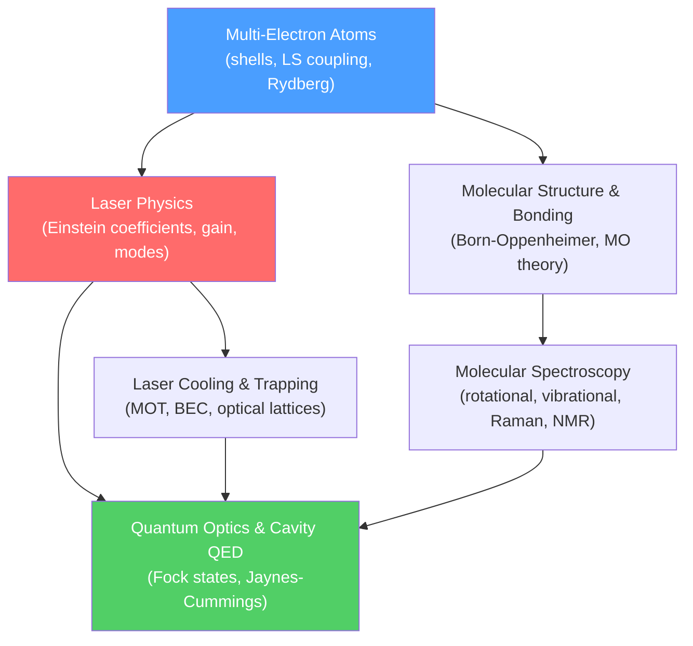

# ⚛️ Atomic, Molecular, and Optical Physics — Map of Content

> [!abstract] Section Overview
> AMO physics sits at the intersection of quantum mechanics, electrodynamics, and precision measurement. It spans from the shell structure of multi-electron atoms and the quantum chemistry of molecular bonds, through spectroscopic probes of molecular structure, to the engineering of coherent light sources and the exquisite control of individual quantum systems via laser cooling and cavity QED. AMO is the foundation of modern quantum technology.

---

## Mermaid — How the Topics Connect

---

## Notes in This Section

| # | Note | Core Idea | Difficulty |
|---|------|-----------|------------|
| 1 | [[Multi_Electron_Atoms]] | Shell structure, LS coupling, Rydberg atoms | Sec → Grad |
| 2 | [[Molecular_Structure_and_Bonding]] | Born-Oppenheimer, LCAO-MO, van der Waals | Sec → Grad |
| 3 | [[Molecular_Spectroscopy]] | Rotational/vibrational/electronic spectra, NMR | Sec → Grad |
| 4 | [[Laser_Physics]] | Einstein coefficients, population inversion, modes | Sec → Grad |
| 5 | [[Laser_Cooling_and_Trapping]] | Doppler cooling, MOT, BEC, optical lattices | Sec → Grad |
| 6 | [[Quantum_Optics_and_Cavity_QED]] | Fock states, coherent states, Jaynes-Cummings | Sec → Grad |

---

## Recommended Learning Path

1. **[[Multi_Electron_Atoms]]** — understand how QM generalizes beyond hydrogen; shells, exchange, coupling schemes
2. **[[Molecular_Structure_and_Bonding]]** — apply QM to two nuclei; Born-Oppenheimer and MO theory
3. **[[Molecular_Spectroscopy]]** — probe molecular structure with light; rotational, vibrational, electronic transitions
4. **[[Laser_Physics]]** — build on spectroscopy to understand stimulated emission, gain, and laser operation
5. **[[Laser_Cooling_and_Trapping]]** — use lasers to control atomic motion; reaching quantum degeneracy
6. **[[Quantum_Optics_and_Cavity_QED]]** — quantize the electromagnetic field; atom-photon entanglement at the single-quantum level

---

## Key Equations at a Glance

| Concept | Equation |
|---------|----------|
| Spectroscopic term | $^{2S+1}L_J$ |
| Moseley's law | $\sqrt{\nu} \propto (Z - \sigma)$ |
| Born-Oppenheimer | $\psi_{mol} = \psi_{el}(R)\,\chi_{nuc}(R)$ |
| Rigid rotor energy | $E_J = BJ(J+1)$ |
| Harmonic oscillator | $E_v = \hbar\omega(v + 1/2)$ |
| Einstein B coefficient | $B_{12}\rho = B_{21}\rho$ |
| Doppler limit | $k_BT_D = \hbar\Gamma/2$ |
| Jaynes-Cummings splitting | $2g$ (vacuum Rabi splitting) |

---

## Connections to Other Sections

- [[_MOC_Quantum_Mechanics|05 Quantum Mechanics]] — foundational formalism used throughout AMO
- [[_MOC_Nuclear_Particle|07 Nuclear and Particle Physics]] — X-ray spectroscopy; nuclear spin (NMR)
- [[_MOC_Advanced_QFT|12 Advanced QFT]] — cavity QED and quantum information connect to field quantization
- [[_MOC_Physics_Master|↑ Physics Master MOC]]

---

#physics #amo-physics #atomic-physics #molecular-physics #optical-physics #lasers #quantum-optics
