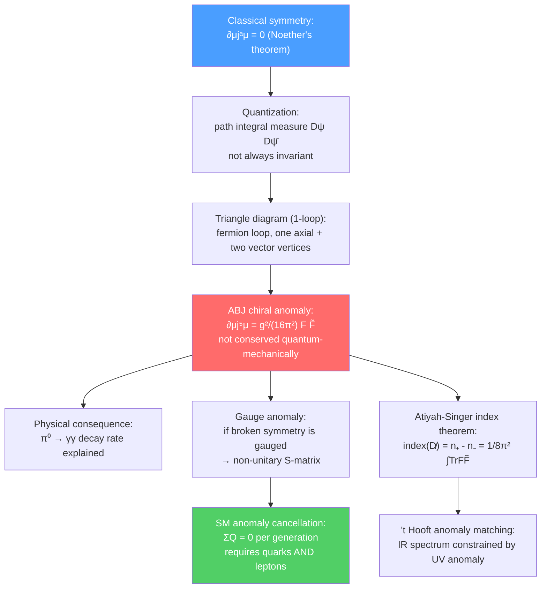

# ⚡ Anomalies in Quantum Field Theory

> [!abstract] TL;DR
> An anomaly is the quantum violation of a symmetry that is present in the classical Lagrangian — quantization itself breaks the symmetry. The most famous is the **Adler-Bell-Jackiw (ABJ) chiral anomaly**: the axial current $j_5^\mu$ is conserved classically ($\partial_\mu j_5^\mu = 0$), but a triangle diagram (fermion loop with one axial and two vector vertices) produces $\partial_\mu j_5^\mu = g^2F_{\mu\nu}\tilde{F}^{\mu\nu}/16\pi^2$. This explains the $\pi^0 \to \gamma\gamma$ decay rate. If an anomaly affects a **gauge** (not global) symmetry, the theory becomes inconsistent (non-unitary). The Standard Model is anomaly-free because quarks and leptons appear in exactly the right combinations to cancel all gauge anomalies. At PhD level, the Atiyah-Singer index theorem gives the mathematical foundation, and 't Hooft anomaly matching constrains the spectrum of infrared degrees of freedom.

## Intuition — analogy FIRST

Imagine a law that says "left shoes and right shoes must always appear in pairs." In classical mechanics, this law is perfectly maintained. Now "quantize" the shoe factory: quantum fluctuations can spontaneously create pairs, but due to a subtle quantum effect, the pair-creation process slightly favors right shoes — so after quantization, you end up with more right shoes than left. This is an anomaly: the classical law (equal number of left and right shoes) is violated by quantum effects. In particle physics, the "shoes" are the chiralities (left-handed and right-handed particles), and the subtle quantum effect is the path integral measure not being invariant under the axial symmetry transformation.

---

## How It Works

---

## Key Concepts / Details

### Secondary Level

**What is an anomaly?** In classical mechanics, if a Lagrangian has a symmetry, the corresponding conserved current is guaranteed by Noether's theorem. In quantum mechanics, this guarantee can fail: quantum fluctuations (virtual particle loops) can break a classical symmetry. When this happens, the classical conservation law is violated by a quantum correction — this is an anomaly.

**Why it matters:**
- **Good anomalies (global symmetry):** If the anomalous symmetry is just a global symmetry (not gauged), the anomaly is physically real and observable — it gives new decay processes (like $\pi^0 \to \gamma\gamma$).
- **Bad anomalies (gauge symmetry):** If the anomalous symmetry is gauged, the theory is mathematically inconsistent — the Ward identities needed for unitarity are violated, and probability is not conserved.

**$\pi^0 \to \gamma\gamma$:** The neutral pion decays to two photons in $\sim 10^{-16}$ s. This seems puzzling because the pion is a pseudo-Goldstone of chiral symmetry (which would protect it from decaying to photons), but the chiral anomaly provides an additional coupling — and the calculated rate matches experiment perfectly.

### Undergraduate Level

**Classical axial current conservation:** A massless Dirac fermion has a vector current $j^\mu = \bar\psi\gamma^\mu\psi$ (exactly conserved, $\partial_\mu j^\mu = 0$) and an axial vector current $j_5^\mu = \bar\psi\gamma^\mu\gamma^5\psi$. Classically, for massless fermions:

$$\partial_\mu j_5^\mu = 0 \quad \text{(classical)}$$

This axial U(1)$_A$ symmetry acts as $\psi \to e^{i\alpha\gamma^5}\psi$ — rotating left-handed and right-handed fermions by opposite phases.

**The triangle diagram (ABJ anomaly):** At one-loop order, the three-point function $\langle j_5^\mu(q)\, j^\nu(k_1)\, j^\rho(k_2)\rangle$ contains a triangle diagram: a fermion loop with one axial vertex ($\gamma^\mu\gamma^5$) and two vector vertices ($\gamma^\nu$, $\gamma^\rho$). Naive Ward identities give $q_\mu T^{\mu\nu\rho} = 0$ (axial current conserved), but the actual computation (Adler 1969, Bell-Jackiw 1969) yields a non-zero result:

$$\partial_\mu j_5^\mu = \frac{e^2}{16\pi^2}F_{\mu\nu}\tilde{F}^{\mu\nu}$$

where $\tilde{F}^{\mu\nu} = \frac{1}{2}\epsilon^{\mu\nu\rho\sigma}F_{\rho\sigma}$ is the dual field strength. The anomaly is a one-loop exact result — no higher-loop corrections (Adler-Bardeen theorem).

**Physical meaning of $F\tilde{F}$:** The combination $F_{\mu\nu}\tilde{F}^{\mu\nu} = \mathbf{E}\cdot\mathbf{B}$ — a CP-violating combination of electromagnetic fields. The anomaly sources axial charge in the presence of parallel electric and magnetic fields.

**$\pi^0 \to \gamma\gamma$ decay rate:** The pion is the pseudo-Goldstone of broken chiral symmetry. Under the anomaly, the chiral symmetry that would protect the $\pi^0 \to \gamma\gamma$ amplitude is violated. The predicted decay rate:

$$\Gamma(\pi^0\to\gamma\gamma) = \frac{\alpha^2 m_\pi^3}{64\pi^3 f_\pi^2}\left(\frac{N_c}{3}\right)^2 = 7.73\text{ eV}$$

(using $N_c = 3$ colors, $f_\pi = 92.4$ MeV). Measured: $7.82 \pm 0.14$ eV — spectacular agreement. This was historically important evidence for the existence of 3 quark colors.

**Consistency vs. cancellation:** Distinguishing two types:
- **Consistent anomaly:** satisfies the Wess-Zumino consistency conditions but is not symmetric between the two external gauge legs.
- **Covariant anomaly:** symmetric, easier to work with.

### Graduate Level

**Gauge anomaly and consistency:** If the anomalous symmetry is gauged (promoted to a local symmetry), the anomaly appears in the Ward identity for the gauge current:

$$\partial^\mu\langle j_\mu^a\rangle = \mathcal{A}^a[\text{gauge fields}] \neq 0$$

This means the longitudinal photon couples to matter — the theory is not gauge-invariant at the quantum level. Gauge invariance is essential for:
1. Unitarity of the S-matrix (cancellation of unphysical polarizations)
2. Renormalizability
3. Consistent definition of the theory

A theory with uncancelled gauge anomalies is simply wrong.

**Standard Model anomaly cancellation:** The SM fermion content in one generation is:
- Quarks: $Q_L = (u_L, d_L)$ in $(\mathbf{3}, \mathbf{2})_{1/6}$, $u_R$ in $(\mathbf{3}, \mathbf{1})_{2/3}$, $d_R$ in $(\mathbf{3}, \mathbf{1})_{-1/3}$
- Leptons: $L = (\nu_L, e_L)$ in $(\mathbf{1}, \mathbf{2})_{-1/2}$, $e_R$ in $(\mathbf{1}, \mathbf{1})_{-1}$

The dangerous anomaly diagrams are:
| Triangle diagram | Cancellation condition |
|-----------------|----------------------|
| SU(3)²-U(1)$_Y$ | $\sum_{\text{quarks}} Y = 0$ ✓ |
| SU(2)²-U(1)$_Y$ | $\sum_{\text{doublets}} Y = 0$ ✓ |
| U(1)$_Y^3$ | $\sum_{\text{all}} Y^3 = 0$ ✓ |
| Mixed gauge-gravity | $\sum_{\text{all}} Y = 0$ ✓ |

All conditions are satisfied in each generation — a non-trivial constraint that relates quark and lepton quantum numbers. The existence of the top quark (1995) was required for anomaly cancellation of the third generation.

**Gravitational anomaly:** In curved spacetime, diffeomorphism invariance (general coordinate invariance) can also be anomalous. For chiral fermions in $d = 4k + 2$ dimensions, there is a gravitational anomaly. In 10D supergravity + super Yang-Mills (the Green-Schwarz mechanism), anomaly cancellation requires the gauge group to be SO(32) or $E_8 \times E_8$ — this was a key result in the first superstring revolution (1984).

**Atiyah-Singer Index Theorem:** The number of zero modes of the Dirac operator in the background of a gauge field is a topological quantity:

$$\text{index}(\not{D}) = n_+ - n_- = \frac{1}{8\pi^2}\int\text{Tr}(F \wedge F)$$

where $n_\pm$ are the numbers of zero modes with positive/negative chirality. This connects the analytic index of the Dirac operator to the topological charge (second Chern number) of the gauge bundle. The anomaly coefficient is this index — the anomaly is truly topological.

**'t Hooft anomaly matching:** Even when anomalies affect global symmetries (not problematic for consistency), they constrain the IR theory. If a UV theory has a global symmetry $G$ with anomaly coefficient $\mathcal{A}$, then any IR description (e.g., confinement of QCD into hadrons) must reproduce the same anomaly coefficient. This is a powerful constraint on the spectrum of massless particles in the IR. Example: QCD's chiral anomaly must be matched by massless pions, constraining the chiral Lagrangian.

**Anomaly inflow and topological insulators:** In condensed matter, the surface of a 3D topological insulator hosts a 2D massless Dirac fermion with a chiral anomaly. The anomaly is "cancelled" by an anomaly-inflow from the bulk: the bulk topological term compensates the surface anomaly. This is the condensed-matter avatar of the Green-Schwarz mechanism and is at the heart of the modern understanding of topological phases.

**Wess-Zumino-Witten (WZW) term:** The effective action for NGBs can have anomalous terms required by 't Hooft anomaly matching. For pions in QCD, the WZW term reproduces the chiral anomaly and predicts additional processes like $\pi^+\pi^-\pi^0 \to \gamma$. These are completely determined by anomaly matching — a beautiful example of anomaly constraints on low-energy physics.

---

## Real-World Notes

- **$\pi^0$ lifetime:** The $10^{-16}$ s lifetime of the neutral pion is entirely anomaly-driven — without the ABJ anomaly, $\pi^0$ would be forbidden from decaying to $\gamma\gamma$ by the Landau-Yang theorem (spin-0 → 2 photons is allowed; the anomaly provides the amplitude).
- **Quark color counting:** The factor of $N_c = 3$ in the $\pi^0\to\gamma\gamma$ rate is direct experimental evidence for 3 quark colors — before the discovery of color in deep inelastic scattering.
- **Baryon number violation by anomaly:** The SM has a non-perturbative anomaly (sphaleron) that violates baryon and lepton number $B+L$ while conserving $B-L$. At temperatures above the electroweak scale, sphalerons are active and can generate the baryon asymmetry of the universe.
- **Weyl semimetals:** In condensed matter, 3D Weyl semimetals host chiral fermion zero modes at band-touching points (Weyl nodes). The chiral anomaly manifests as a **negative magnetoresistance** in parallel $\mathbf{E}$ and $\mathbf{B}$ fields — exactly $\propto \mathbf{E}\cdot\mathbf{B}$.

---

## Common Pitfalls

- **Anomalies are 1-loop exact:** The ABJ anomaly coefficient receives no corrections beyond one loop (Adler-Bardeen theorem). This makes anomaly calculations uniquely reliable in perturbation theory.
- **An anomaly in a global symmetry is not a problem for consistency:** Only gauge anomalies render a theory inconsistent. Global anomalies are physical predictions (like $\pi^0\to\gamma\gamma$).
- **Anomaly cancellation in the SM requires *all three colors* of quarks per lepton:** Remove the top quark or change quark colors, and the SM is inconsistent. This is a non-trivial structure.
- **The triangle diagram result is ambiguous without a choice of regularization:** Different momentum routings give different results — the anomaly reflects the impossibility of simultaneously preserving both the vector and axial Ward identities. A choice must be made; physics dictates the vector current is exactly conserved (charge conservation), so the anomaly goes to the axial current.

---

## Related Concepts

- [[Non_Abelian_Gauge_Theories]] — gauge anomaly cancellation constrains the fermion content of non-Abelian gauge theories
- [[Spontaneous_Symmetry_Breaking]] — anomalies modify the Goldstone boson sector (WZW term)
- [[Effective_Field_Theories]] — 't Hooft anomaly matching constrains the IR EFT
- [[Path_Integral_Formulation]] — Fujikawa's derivation: the anomaly comes from the non-invariance of the path integral measure under chiral transformations
- [[_MOC_Advanced_QFT|↑ Section MOC]]

---

## Review Questions

1. **(UG)** What is the ABJ chiral anomaly? Write the anomaly equation $\partial_\mu j_5^\mu = ?$ and explain each term. What is the triangle diagram, and why does it produce a non-zero result?
2. **(UG/Grad)** Why is an anomaly in a gauge symmetry catastrophic? List the anomaly cancellation conditions in one generation of the Standard Model and verify one of them using the fermion hypercharge assignments.
3. **(Graduate)** State the Atiyah-Singer index theorem for the Dirac operator in a gauge background. How does it connect the anomaly to topology? Explain 't Hooft anomaly matching and give an example where it constrains the IR spectrum.

---

## Sources

- Adler, *Phys. Rev.* 177, 2426 (1969); Bell & Jackiw, *Nuovo Cimento* 60A, 47 (1969) — original ABJ anomaly
- Peskin & Schroeder, *Introduction to QFT*, Ch. 19 (anomalies)
- Bertlmann, *Anomalies in Quantum Field Theory*, Oxford (comprehensive reference)
- Atiyah & Singer, *Ann. Math.* 87, 485 (1968) — index theorem
- 't Hooft, in *Recent Developments in Gauge Theories* (1980) — anomaly matching

#physics #advanced-qft #anomalies #ABJ-anomaly #chiral-anomaly #gauge-anomaly #pi-zero-decay #Atiyah-Singer #anomaly-matching
