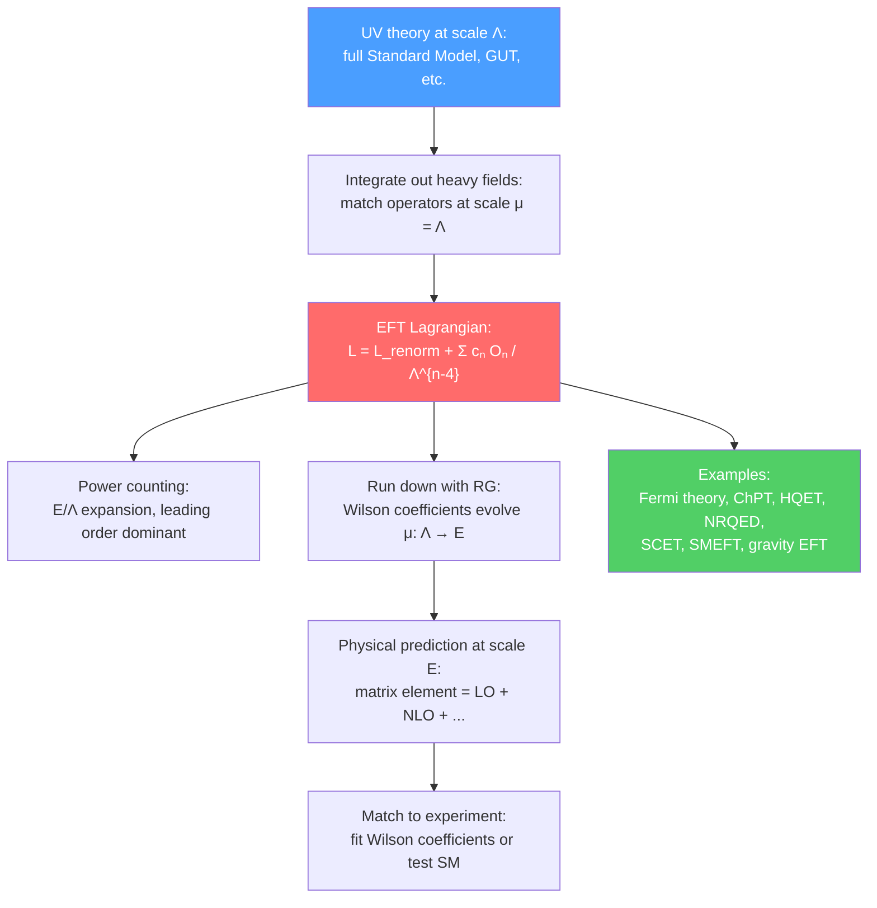

# 📐 Effective Field Theories

> [!abstract] TL;DR
> An effective field theory (EFT) is the right theory for the right scale — a systematic framework for describing physics at energy $E \ll \Lambda$ by writing down all operators consistent with the symmetries, organized by powers of $E/\Lambda$. Heavy degrees of freedom (mass $\sim \Lambda$) are "integrated out," leaving behind local operators suppressed by powers of $\Lambda$. Fermi theory ($G_F \sim 1/M_W^2$) is the EFT of the electroweak theory below $M_W$. Chiral Perturbation Theory (ChPT) describes low-energy QCD with pions as pseudo-Goldstone bosons. HQET and SCET are precision EFTs for heavy quark physics and jets at the LHC. The Standard Model itself is an EFT, with dimension-6 operators encoding effects of new physics at TeV scale.

## Intuition — analogy FIRST

You don't use general relativity to design a bridge — Newtonian mechanics suffices at those velocities and length scales. You don't use QED to describe traffic flow — classical fluid dynamics is the right EFT. Physics has a natural hierarchy of scales, and at each scale you use the "effective theory" appropriate to it, ignoring the irrelevant details of physics at shorter scales. The beauty of the EFT framework is that this process is systematic: you can quantify exactly how wrong you are (corrections go as powers of $E/\Lambda$ where $\Lambda$ is the scale of the next "layer" of physics), and you can compute corrections to any desired precision by including higher-dimensional operators. EFT is not an approximation — it is the organizing principle of all of modern physics.

---

## How It Works

---

## Key Concepts / Details

### Secondary Level

**Different models for different scales:** Traffic engineers use fluid equations for cars — not molecular dynamics. Chemists use bond energies — not quark physics. Engineers use Newtonian mechanics — not general relativity. Each scale has its own appropriate "effective theory," and crossing scales requires "integrating out" the irrelevant details.

**Power counting — the key organizing principle:** Once you identify the relevant scale $\Lambda$ of the "next layer" of physics, you can organize your effective theory as an expansion in $E/\Lambda$ (or equivalently $p/\Lambda$, $m/\Lambda$ where $p$ is momentum and $m$ is a light mass). Higher powers of $E/\Lambda$ give smaller and smaller corrections — you can compute to any desired precision by including more terms.

**The Standard Model is an EFT:** Even the SM is an effective theory — valid up to some scale $\Lambda_{new}$ (TeV? GUT scale? Planck scale?) where new physics enters. Neutrino masses, dark matter, baryogenesis all suggest new physics beyond the SM.

### Undergraduate Level

**EFT philosophy — the three steps:**
1. **Identify the relevant degrees of freedom** at your energy scale (e.g., pions not quarks at $E \ll 1$ GeV)
2. **Write all operators consistent with the symmetries** of the problem, organized by mass dimension
3. **Fix the coefficients** by matching to the UV theory (if known) or to experiment

Schematically:

$$\mathcal{L}_{EFT} = \sum_{n \leq 4} c_n \mathcal{O}_n + \frac{1}{\Lambda}\sum c_n^{(5)}\mathcal{O}_n^{(5)} + \frac{1}{\Lambda^2}\sum c_n^{(6)}\mathcal{O}_n^{(6)} + \cdots$$

At energies $E \ll \Lambda$, the expansion converges and only the first few terms matter.

**Fermi theory as the EFT of electroweak interactions:** At energies $E \ll M_W \approx 80$ GeV, the W boson propagator $\sim 1/(k^2 - M_W^2) \approx -1/M_W^2$ (the W is heavy and can't propagate). Integrating out the W gives:

$$\mathcal{L}_{Fermi} = -\frac{G_F}{\sqrt{2}}\left(\bar\nu_e\gamma^\mu(1-\gamma^5)e\right)\left(\bar d\gamma_\mu(1-\gamma^5)u\right) + h.c.$$

with:

$$\frac{G_F}{\sqrt{2}} = \frac{g^2}{8M_W^2}$$

Fermi's constant $G_F = 1.166 \times 10^{-5}$ GeV$^{-2}$ is measured from muon decay, and $M_W$ can be inferred. Fermi theory is an excellent description of nuclear beta decay and muon decay for $E \ll M_W$, with corrections of order $(E/M_W)^2 \sim 10^{-4}$ for typical nuclear physics.

**Power counting:** The Fermi operator is dimension 6 ($[G_F] = [\text{mass}]^{-2}$, 4 fermion fields each of dimension 3/2 → total dimension 6). So cross sections scale as $\sigma \sim G_F^2 E^2$ — growing with energy and eventually violating perturbative unitarity at $E \sim 1/\sqrt{G_F} \approx 300$ GeV. This signaled the need for a UV completion — the W boson — discovered in 1983.

**Chiral Perturbation Theory (ChPT) — low-energy QCD:** QCD with massless $u, d$ quarks has a chiral symmetry $SU(2)_L \times SU(2)_R$ spontaneously broken to $SU(2)_V$ (isospin) — producing 3 NGBs (pions). ChPT is the systematic EFT for $E \ll m_\rho \approx 770$ MeV, using the pion fields as degrees of freedom. The pion matrix:

$$U(x) = \exp\!\left(i\frac{\pi^a\tau^a}{f_\pi}\right), \quad f_\pi \approx 92.4\text{ MeV (pion decay constant)}$$

The leading-order Lagrangian (determined by chiral symmetry alone):

$$\mathcal{L}_{ChPT}^{(2)} = \frac{f_\pi^2}{4}\text{Tr}\!\left[\partial_\mu U^\dagger\partial^\mu U\right] + \frac{f_\pi^2 m_\pi^2}{4}\text{Tr}\!\left[U + U^\dagger\right]$$

Corrections come at $O(p^4)$ (Gasser-Leutwyler Lagrangian with 10 low-energy constants), $O(p^6)$, etc. ChPT is the most systematic, rigorous framework for low-energy hadronic physics.

**Nuclear EFT:** ChPT extends to nuclear forces with pion exchanges ($r > 1/m_\pi \sim 1.4$ fm) plus short-range contact operators. This organizes the nuclear force systematically and has become the basis for ab initio nuclear structure calculations.

### Graduate Level

**Heavy Quark Effective Theory (HQET):** For heavy quarks ($m_Q \gg \Lambda_{QCD}$, relevant for $c, b, t$), the heavy quark velocity $v^\mu$ is a conserved quantum number at leading order. HQET is the EFT of QCD in the limit $m_Q \to \infty$ with $1/m_Q$ corrections:

$$\mathcal{L}_{HQET} = \bar{h}_v\,iv\cdot D\,h_v + \frac{1}{2m_Q}\bar{h}_v(iD)^2h_v + \frac{g_s}{4m_Q}\bar{h}_v\sigma_{\mu\nu}G^{\mu\nu}h_v + O(1/m_Q^2)$$

where $h_v$ is the heavy quark field in the heavy quark limit. At $m_Q \to \infty$, there is a **heavy quark symmetry**: the spin and flavor of the heavy quark decouple from the light degrees of freedom. This gives model-independent relations between form factors of $B \to D^*\ell\nu$ and $B \to D\ell\nu$ — essential for precision determination of the CKM element $|V_{cb}|$.

**Non-Relativistic QED (NRQED):** The EFT of QED for non-relativistic electrons ($v \ll c$) — the hydrogen atom. Expansion in $v/c \sim \alpha_{em} \sim 1/137$. NRQED reproduces the Lamb shift, fine structure, hyperfine structure, and allows systematic computation of QED corrections to atomic energy levels to high precision.

**Soft-Collinear Effective Theory (SCET):** For processes with jets at high-energy colliders (LHC), the relevant scales are the hard scale $Q$, the collinear scale $Q\lambda$ (jet invariant mass), and the soft scale $Q\lambda^2$ (inter-jet radiation). SCET factorizes the cross section:

$$\sigma = H(Q^2/\mu^2) \otimes J(Q^2\lambda^2/\mu^2) \otimes S(Q^2\lambda^4/\mu^2) + O(\lambda)$$

where $H$ is the hard function (from integrating out the hard process), $J$ is the jet function, and $S$ is the soft function. SCET enables resumming large logarithms $\ln(Q/\Lambda_{QCD})$ to all orders — essential for precise predictions of jet cross sections at the LHC.

**Standard Model as an EFT (SMEFT):** The SM is the leading order of an expansion in $1/\Lambda$:

$$\mathcal{L}_{SMEFT} = \mathcal{L}_{SM} + \frac{1}{\Lambda}\mathcal{O}^{(5)} + \frac{1}{\Lambda^2}\sum_i C_i^{(6)}\mathcal{O}_i^{(6)} + \cdots$$

The unique dimension-5 operator is the **Weinberg operator** $(LH)(LH)/\Lambda$, which upon SSB gives a Majorana neutrino mass $m_\nu = v^2/\Lambda$ — the seesaw mechanism. For $m_\nu \sim 0.1$ eV and $v = 174$ GeV, $\Lambda \sim 3 \times 10^{14}$ GeV (close to GUT scale). The 59 dimension-6 operators encode possible effects of new physics at the TeV scale (anomalous top-quark couplings, four-fermion operators, gauge-Higgs operators), constrained by LHC measurements.

**Gravity as an EFT:** At energies $E \ll M_{Pl} = (\hbar c/G)^{1/2} \approx 1.22 \times 10^{19}$ GeV, quantum gravity is an EFT:

$$\mathcal{L}_{QG} = \frac{M_{Pl}^2}{2}R + c_1 R^2 + c_2 R_{\mu\nu}^2 + \cdots$$

Quantum corrections to the gravitational potential between masses $m_1$ and $m_2$:

$$V(r) = -\frac{Gm_1m_2}{r}\left(1 + \frac{3G(m_1+m_2)}{rc^2} + \frac{41G\hbar}{10\pi r^2c^3} + \cdots\right)$$

The last term (quantum correction, $\hbar$-dependent) is a genuine prediction of quantum gravity as an EFT — computed by Bjerrum-Bohr et al. (2003), it is in principle measurable even without knowing UV-complete quantum gravity.

---

## Real-World Notes

- **Precision electroweak tests:** LEP measurements of $M_W, M_Z, \sin^2\theta_W$ match SM predictions at the $0.1\%$ level — probing EFT corrections at the $M_Z^2/\Lambda^2$ level, constraining new physics to $\Lambda > $ few TeV.
- **$B$-physics (LHCb, Belle II):** HQET enables precision extraction of CKM matrix elements $|V_{ub}|, |V_{cb}|$ from semileptonic $B$ decays, testing the SM flavor structure.
- **Neutron stars (nuclear EFT):** The equation of state of dense nuclear matter, needed to interpret gravitational wave signals from neutron star mergers (LIGO/Virgo GW170817), is systematically computed using chiral EFT at nuclear densities.
- **Axion EFT:** The axion solving the strong CP problem is the pseudo-Goldstone of a new U(1)$_{PQ}$ symmetry broken at scale $f_a$. Its interactions are $\mathcal{L} \supset -(a/f_a)g_s^2F\tilde{F}/32\pi^2$, with coupling $\propto 1/f_a$ — a direct EFT structure.

---

## Common Pitfalls

- **EFT does not mean "approximate":** Within its domain of validity ($E \ll \Lambda$), an EFT is *exact* — its predictions can be computed to any desired precision by including higher-order operators. The approximation is in truncating the tower at some order in $E/\Lambda$.
- **Renormalizability is not a fundamental requirement:** The SM was originally required to be renormalizable, which limited the operators to dimension $\leq 4$. In the modern EFT view, renormalizability is the statement that we are keeping only the leading (renormalizable) terms. Non-renormalizable operators are suppressed by powers of $E/\Lambda$ and are simply small corrections.
- **Matching is necessary at the boundary:** When passing from the UV theory to the EFT, you must carefully match at the scale $\mu = \Lambda$ to fix all Wilson coefficients. Naive guessing without matching gives wrong answers for short-distance sensitive quantities.
- **The EFT expansion breaks down at $E \sim \Lambda$:** This is not a failure of EFT — it's the signal that the heavy degrees of freedom become relevant and must be included. Fermi theory breaks unitarity at $E \sim 300$ GeV → W boson discovered.

---

## Related Concepts

- [[Renormalization_and_RG]] — Wilson's RG is the foundational tool of EFT; relevant/irrelevant operators
- [[Spontaneous_Symmetry_Breaking]] — SSB produces NGBs that dominate the low-energy EFT (ChPT, HQET)
- [[Non_Abelian_Gauge_Theories]] — QCD provides examples: Fermi theory (integrating out W), ChPT (integrating out quarks and gluons below $\Lambda_{QCD}$)
- [[Anomalies_in_QFT]] — 't Hooft anomaly matching constrains what low-energy EFTs are consistent
- [[_MOC_Advanced_QFT|↑ Section MOC]]

---

## Review Questions

1. **(UG)** Explain the EFT philosophy in three steps. Why is the Fermi theory a valid description of nuclear beta decay but breaks down at the LHC? How does the breakdown scale estimate $\Lambda \sim 1/\sqrt{G_F}$ arise?
2. **(UG/Grad)** Write the leading-order ChPT Lagrangian for two flavors. What are the degrees of freedom, and why is the Lagrangian organized in powers of $p^2$? What determines $f_\pi$ and the pion mass in this framework?
3. **(Graduate)** What is the Weinberg operator $(LH)^2/\Lambda$ and what does it predict for neutrino masses? If the observed neutrino mass is $m_\nu \sim 0.1$ eV, what does this imply for the scale $\Lambda$ of lepton-number violation? Describe the seesaw mechanism as an EFT statement.

---

## Sources

- Georgi, *Weak Interactions and Modern Particle Theory* (EFT introduction, Fermi theory)
- Weinberg, *Phenomenological Lagrangians*, *Physica A* 96, 327 (1979) — foundational EFT paper
- Gasser & Leutwyler, *Ann. Phys.* 158, 142 (1984) — ChPT
- Manohar & Wise, *Heavy Quark Physics*, Cambridge (HQET)
- Bauer, Fleming & Luke, *Phys. Rev. D* 63, 014006 (2001) — SCET
- Donoghue, Golowich & Holstein, *Dynamics of the Standard Model* (EFT applications)

#physics #advanced-qft #effective-field-theory #EFT #Fermi-theory #ChPT #HQET #SCET #SMEFT #power-counting #seesaw
