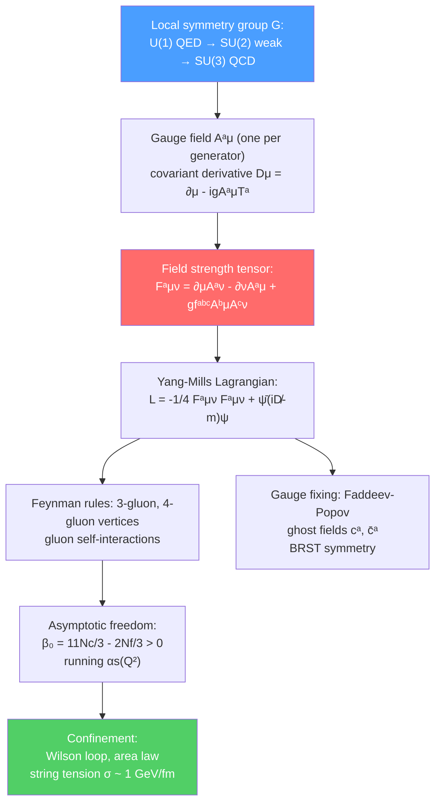

# 🎯 Non-Abelian Gauge Theories

> [!abstract] TL;DR
> Gauge theories are built on the principle that physics is invariant under local symmetry transformations. QED is based on the Abelian group U(1); Yang-Mills theory (1954) extended this to non-Abelian groups like SU(2) and SU(3). The non-Abelian gauge bosons carry the charge of their own symmetry — gluons in SU(3) QCD carry color charge and therefore interact with each other (three- and four-gluon vertices), unlike the uncharged photon. Quantizing a gauge theory requires the Faddeev-Popov procedure (fixing the gauge and introducing ghost fields), with the residual BRST symmetry ensuring unitarity. QCD with $N_f \leq 16$ is asymptotically free and confining, binding quarks into hadrons via a string tension of $\sim 1$ GeV/fm.

## Intuition — analogy FIRST

U(1) gauge symmetry (QED) is like everyone agreeing to set their clock to whatever local time zone they want — you can rotate the phase of the electron wavefunction differently at each spacetime point, and the photon field automatically adjusts to keep physics unchanged. Now imagine that instead of simple clock-face rotations (commuting, Abelian), the symmetry operations are 3D rotations of color arrows — and two successive rotations give different results depending on order (non-Abelian). The gauge bosons (gluons) carry the "color arrows" themselves and therefore rotate each other. This self-interaction — photons don't interact with photons, but gluons interact with gluons — is what makes QCD so rich and leads to confinement.

---

## How It Works

---

## Key Concepts / Details

### Secondary Level

**Symmetry → Force:** The deep principle of gauge theory: every fundamental force corresponds to a local symmetry. The requirement that physics be invariant under *local* (spacetime-dependent) symmetry transformations forces the existence of a gauge field — the force carrier.

- Electromagnetism (QED): U(1) local phase symmetry → photon
- Weak force: SU(2) × U(1) gauge symmetry → W±, Z⁰, photon
- Strong force (QCD): SU(3) color symmetry → 8 gluons

**Gluons carry color:** Unlike the photon, which is electrically neutral, gluons carry color charge (a combination of color and anti-color). This means gluons can interact with each other — crucial for confinement and asymptotic freedom.

**Quarks and confinement:** Quarks come in 3 colors (red, green, blue). They are never observed in isolation — only in color-singlet combinations: baryons (qqq) and mesons ($q\bar{q}$). The energy required to separate a quark from a hadron grows linearly with distance (string tension), making quark liberation energetically impossible.

### Undergraduate Level

**U(1) gauge invariance review (QED):** The Lagrangian $\mathcal{L} = \bar\psi(i\partial\!\!\!/ - m)\psi - \frac{1}{4}F_{\mu\nu}F^{\mu\nu} - eA_\mu\bar\psi\gamma^\mu\psi$ is invariant under:

$$\psi(x) \to e^{i\alpha(x)}\psi(x), \qquad A_\mu(x) \to A_\mu(x) + \frac{1}{e}\partial_\mu\alpha(x)$$

The photon field $A_\mu$ compensates for the $x$-dependent phase rotation. Because U(1) is Abelian (all group elements commute), $F_{\mu\nu} = \partial_\mu A_\nu - \partial_\nu A_\mu$ is invariant, and there is no photon self-interaction.

**SU(2) Yang-Mills:** Yang and Mills (1954) generalized this to SU(2) isospin. The gauge field is $A_\mu^a$ ($a = 1,2,3$ for the three SU(2) generators $T^a = \tau^a/2$). The covariant derivative is $D_\mu = \partial_\mu - ig A_\mu^a T^a$. The field strength:

$$F_{\mu\nu}^a = \partial_\mu A_\nu^a - \partial_\nu A_\mu^a + g\epsilon^{abc}A_\mu^b A_\nu^c$$

The $\epsilon^{abc}$ (structure constants of SU(2)) term — absent in Abelian U(1) — generates cubic and quartic gauge-boson self-interactions. The Yang-Mills Lagrangian:

$$\mathcal{L}_{YM} = -\frac{1}{4}F_{\mu\nu}^a F^{a\,\mu\nu}$$

**SU(3) QCD:** The gauge group for the strong force is SU(3) with 8 generators $T^a = \lambda^a/2$ (Gell-Mann matrices), 8 gluon fields $A_\mu^a$, and structure constants $f^{abc}$ (antisymmetric, e.g., $f^{123} = 1$). Quarks come in 3 colors (fundamental representation) and 6 flavors (u, d, s, c, b, t). The QCD Lagrangian:

$$\mathcal{L}_{QCD} = -\frac{1}{4}F_{\mu\nu}^a F^{a\,\mu\nu} + \sum_f\bar{q}_f(iD\!\!\!\!/ - m_f)q_f$$

**Feynman rules for QCD:** Three- and four-gluon vertices arise from $\mathcal{L}_{YM}$; the quark-gluon vertex is $-ig_s\gamma^\mu T^a$ (color matrix times Dirac matrix). The gluon propagator in covariant gauge $R_\xi$: $-i(g_{\mu\nu} - (1-\xi)k_\mu k_\nu/k^2)/k^2$.

**Faddeev-Popov procedure:** The path integral $\int\mathcal{D}A\,e^{iS_{YM}}$ is ill-defined because gauge-equivalent field configurations contribute redundantly (the gauge orbit is infinite). Gauge-fixing (e.g., Lorenz gauge $\partial^\mu A_\mu^a = 0$) introduces the **Faddeev-Popov determinant** $\det(\partial^\mu D_\mu)$, which is exponentiated as ghost fields $c^a$, $\bar{c}^a$ — Grassmann scalars obeying fermionic statistics but with bosonic quantum numbers (unphysical). Ghosts cancel the unphysical longitudinal gluon degrees of freedom in loop diagrams.

**BRST symmetry:** After gauge fixing, the action has a residual nilpotent symmetry (BRST, Becchi-Rouet-Stora-Tyutin) with parameter $\theta$ (Grassmann): $sA_\mu^a = D_\mu c^a$, $sc^a = -\frac{g}{2}f^{abc}c^bc^c$, $s\bar{c}^a = b^a$ (Nakanishi-Lautrup field). BRST charge $Q_B$ satisfies $Q_B^2 = 0$; physical states are $Q_B$-closed but not exact. BRST symmetry is the substitute for gauge invariance after gauge fixing and is essential for proving the unitarity of the S-matrix and the renormalizability of non-Abelian gauge theories.

### Graduate Level

**Asymptotic freedom derivation:** The one-loop beta function coefficient for SU($N_c$) with $N_f$ Dirac quarks is:

$$\beta_0 = \frac{11N_c}{3} - \frac{2N_f}{3}$$

The $11N_c/3$ comes from gluon loops (with ghost subtraction); the $-2N_f/3$ from quark loops. For SU(3) QCD with $N_f \leq 16$ (in practice $N_f = 6$): $\beta_0 = 11 - 4 = 7 > 0$. Since $\beta(g) = -g^3\beta_0/(16\pi^2) + O(g^5) < 0$, the coupling decreases at high $\mu$ — **asymptotic freedom**. The QCD coupling runs as:

$$\alpha_s(\mu^2) = \frac{2\pi}{\beta_0\ln(\mu/\Lambda_{QCD})}$$

with $\Lambda_{QCD} \approx 200$ MeV. At $\mu = M_Z = 91$ GeV, $\alpha_s \approx 0.118$.

**Confinement — Wilson loop and area law:** The Wilson loop $W(C) = \text{Tr}\,P\exp\!\left(ig\oint_C A_\mu\,dx^\mu\right)$ for a rectangular contour of area $RT$ (temporal extent $T$, spatial separation $R$) is related to the static quark-antiquark potential: $\langle W\rangle \propto e^{-VT}$. **Area law** confinement: $\langle W\rangle \propto e^{-\sigma RT}$ where $\sigma \approx 0.18$ GeV² is the string tension (about 14 tons per meter, or 1 GeV/fm). This is confirmed in lattice QCD but not yet analytically proved — confinement in pure Yang-Mills theory is one of the Clay Millennium Problems (Yang-Mills mass gap).

**Instantons in QCD (BPST):** The $\theta$-vacuum of QCD is a superposition of states with different topological winding numbers $n$. BPST instantons are self-dual solutions of the Euclidean Yang-Mills equations ($F_{\mu\nu} = \tilde{F}_{\mu\nu}$) with action $S = 8\pi^2/g^2$ and topological charge $Q = n$. They contribute $e^{-8\pi^2/g^2}$ to the path integral and generate the $\theta$-term $\theta\,\text{Tr}(F\tilde{F})/16\pi^2$ in the QCD Lagrangian. The **strong CP problem**: why is $|\theta| < 10^{-10}$ (from neutron EDM bounds)? The Peccei-Quinn symmetry and the axion are proposed solutions.

**Large-$N$ expansion:** For SU($N$) with 't Hooft coupling $\lambda = g^2N$ fixed as $N \to \infty$: only **planar diagrams** (genus-0 surfaces) contribute at leading order in $1/N$; non-planar diagrams are suppressed. This maps gauge theory to string theory (AdS/CFT duality is a concrete realization). Large-$N$ QCD becomes a weakly coupled string theory.

**Lattice QCD:** Discretize spacetime on a 4D grid with spacing $a$. Gauge fields live on links: $U_\mu(x) = e^{igaA_\mu(x)} \in SU(3)$. The plaquette $U_{\mu\nu} = U_\mu U_\nu U_\mu^\dagger U_\nu^\dagger$ approximates $F_{\mu\nu}$. Monte Carlo sampling of $e^{-S_E}$ gives non-perturbative predictions: hadron spectrum (pion, proton masses) agrees with experiment at the percent level, confirming QCD.

---

## Real-World Notes

- **Deep inelastic scattering (SLAC/HERA):** Quarks inside the proton scatter nearly freely at high $Q^2$ — direct evidence for asymptotic freedom (Bjorken scaling).
- **Quark-gluon plasma (LHC, RHIC):** Heavy-ion collisions create temperatures $\sim 10^{12}$ K, above the QCD deconfinement transition — a new phase of matter probed via jet quenching, collective flow.
- **Higgs discovery (LHC 2012):** Gluon-gluon fusion (via a top-quark triangle loop) is the dominant Higgs production mechanism at the LHC — a purely non-Abelian QCD process.
- **Exotic hadrons:** LHCb has discovered dozens of "tetraquarks" and "pentaquarks" since 2003 — multiquark color-singlet states beyond the quark model.

---

## Common Pitfalls

- **Gluons are NOT photons:** Unlike photons, gluons carry color charge, so they interact with each other. This is the source of three- and four-gluon vertices in Feynman diagrams.
- **Ghost fields are not physical particles:** They never appear as external states; they only propagate in loops to cancel unphysical longitudinal gluon contributions.
- **BRST cohomology, not just gauge invariance, defines physical states:** A state is physical iff it is $Q_B$-closed; two states are identified iff they differ by a $Q_B$-exact state.
- **Asymptotic freedom requires $N_f \leq 16$:** For $N_f \geq 17$, $\beta_0 < 0$ and QCD would be IR-free — gluons would be screened at long distances like in QED.

---

## Related Concepts

- [[Path_Integral_Formulation]] — Faddeev-Popov and ghost fields arise from gauge-fixing in the path integral
- [[Renormalization_and_RG]] — asymptotic freedom is the statement that the QCD beta function is negative
- [[Spontaneous_Symmetry_Breaking]] — electroweak theory uses SU(2)×U(1) gauge symmetry + Higgs mechanism
- [[Anomalies_in_QFT]] — chiral anomaly and gauge anomaly cancellation are essential QCD/SM constraints
- [[_MOC_Advanced_QFT|↑ Section MOC]]

---

## Review Questions

1. **(UG)** Write the SU(2) Yang-Mills field strength tensor $F_{\mu\nu}^a$ and identify the term that has no analog in QED. What physical phenomenon does this term lead to?
2. **(UG/Grad)** Explain why the Faddeev-Popov procedure is necessary in quantizing a gauge theory. What are ghost fields, and why do they have the "wrong" spin-statistics relation?
3. **(Graduate)** Derive the sign of $\beta_0$ for SU(3) QCD and explain why gluon loops contribute positively to $\beta_0$ while quark loops contribute negatively. How does this relate to the phenomenology of deep inelastic scattering?

---

## Sources

- Peskin & Schroeder, *Introduction to QFT*, Ch. 15–16 (non-Abelian gauge theories, QCD)
- Yang & Mills, *Phys. Rev.* 96, 191 (1954) — original Yang-Mills paper
- Faddeev & Popov, *Phys. Lett. B* 25, 29 (1967) — Faddeev-Popov method
- Gross, Politzer & Wilczek, Nobel Lectures (2004) — asymptotic freedom
- Creutz, *Quarks, Gluons and Lattices* (lattice QCD introduction)
- 't Hooft, *Nucl. Phys. B* 72, 461 (1974) — large-$N$ expansion

#physics #advanced-qft #non-Abelian-gauge #Yang-Mills #QCD #asymptotic-freedom #confinement #BRST #instantons
