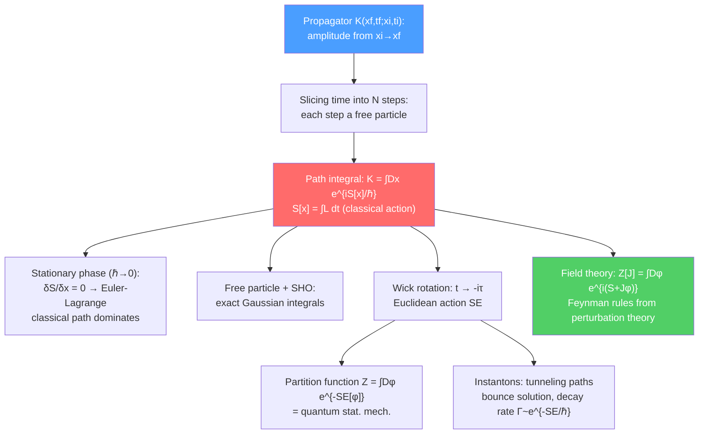

# 🌀 Path Integral Formulation

> [!abstract] TL;DR
> Feynman's path integral says: the quantum amplitude for a particle to travel from $x_i$ to $x_f$ is the sum of $e^{iS/\hbar}$ over all possible paths — not just the classical one. This "sum over histories" makes the classical limit ($\hbar \to 0$) transparent (only the stationary-phase path survives) and extends naturally to field theory. The generating functional $Z[J] = \int\mathcal{D}\phi\, e^{i(S+J\phi)}$ encodes all correlation functions via functional derivatives; perturbation theory produces Feynman diagrams. Wick rotation to Euclidean time connects quantum field theory to statistical mechanics, and instanton solutions of the Euclidean equations reveal non-perturbative tunneling effects.

## Intuition — analogy FIRST

Planning a road trip from city $A$ to city $B$: in classical mechanics you take the single fastest route (least action). In quantum mechanics, you simultaneously take *every possible route* — mountain passes, ocean detours, backwards spirals — and each route contributes a complex amplitude $e^{iS/\hbar}$, like a tiny arrow spinning at a rate proportional to the path's action. Most routes have rapidly oscillating phases that cancel in the sum; the routes near the classical path have slowly varying phases and add constructively. The total amplitude is dominated by paths near the classical one — which is exactly why classical mechanics works at human scales. But at quantum scales, nearby detours contribute measurably, creating interference effects like quantum tunneling through barriers.

---

## How It Works

---

## Key Concepts / Details

### Secondary Level

**Sum over paths — the core idea:** Classical mechanics says a particle takes the *one* path of least action. Feynman's insight: in quantum mechanics, the particle simultaneously explores *all* paths. Each path contributes an amplitude $e^{iS/\hbar}$ (a unit-magnitude complex number rotating at a rate set by the action $S$). Paths far from the classical one have rapidly rotating phases and tend to cancel each other. Paths near the classical one add up — this interference is why quantum particles mostly follow classical trajectories at large scales.

**Why this recovers classical mechanics:** In the limit $\hbar \to 0$, the phase $S/\hbar$ oscillates infinitely fast for any non-stationary path — everything cancels except the path where $\delta S = 0$ (the classical Euler-Lagrange solution). So as $\hbar \to 0$, quantum mechanics → classical mechanics, automatically.

**Tunneling:** A particle hitting a classically forbidden barrier can still contribute paths that go through the barrier — they have complex action but still contribute to the sum. The tunneling amplitude is small (exponentially suppressed in $1/\hbar$) but nonzero.

### Undergraduate Level

**Derivation — slicing time:** The propagator $K(x_f, t_f; x_i, t_i) = \langle x_f|e^{-iH(t_f-t_i)/\hbar}|x_i\rangle$ is derived by splitting the time interval into $N \gg 1$ slices of width $\epsilon = (t_f-t_i)/N$ and inserting a complete set of position eigenstates at each intermediate time. Each short-time propagator is a free-particle propagator (for small $\epsilon$). Taking $N \to \infty$ with $\epsilon \to 0$ at fixed $(t_f - t_i)$:

$$K(x_f, t_f; x_i, t_i) = \int \mathcal{D}x(t)\,\exp\!\left(\frac{i}{\hbar}\int_{t_i}^{t_f}L(x, \dot{x})\,dt\right)$$

where $\mathcal{D}x(t)$ is a functional measure over all continuous paths from $x_i$ to $x_f$.

**Stationary phase = classical action:** Varying the exponent: $\delta S/\delta x(t) = 0$ gives the Euler-Lagrange equations of motion. The path integral automatically recovers classical mechanics as the stationary-phase approximation.

**Exactly solvable cases — Gaussian integrals:** The path integral is exactly computable when $S$ is quadratic in coordinates (Gaussian):

- **Free particle** ($V = 0$): $K = \sqrt{m/2\pi i\hbar T}\exp\!\left(\frac{im(x_f-x_i)^2}{2\hbar T}\right)$
- **Harmonic oscillator** ($V = m\omega^2x^2/2$): $K = \sqrt{m\omega/2\pi i\hbar\sin\omega T}\exp\left(\frac{im\omega}{2\hbar\sin\omega T}\left[(x_f^2+x_i^2)\cos\omega T - 2x_fx_i\right]\right)$

For anharmonic potentials, expand $e^{iS_{int}/\hbar}$ in powers of the coupling → Feynman diagrams.

**Euclidean path integral — Wick rotation:** Replace $t \to -i\tau$ (Wick rotation to imaginary time / Euclidean time). The oscillating phase $e^{iS/\hbar}$ becomes a decaying exponential $e^{-S_E/\hbar}$, where $S_E = \int d\tau\left[\frac{m}{2}\dot{x}^2 + V(x)\right]$ is the Euclidean action (kinetic + potential, no relative sign flip). This is formally identical to the **partition function** of a statistical mechanics system at temperature $1/\hbar$:

$$Z = \int\mathcal{D}x\,e^{-S_E[x]/\hbar} \longleftrightarrow Z_{stat} = \text{Tr}\,e^{-H/k_BT}$$

with identification $\hbar \leftrightarrow k_BT$. This deep connection means quantum field theory and classical statistical field theory share the same mathematical structure.

### Graduate Level

**Generating functional in field theory:** For a scalar field $\phi(x)$, the generating functional:

$$Z[J] = \int\mathcal{D}\phi\,\exp\!\left[i\left(S[\phi] + \int d^4x\,J(x)\phi(x)\right)\right]$$

encodes all $n$-point correlation functions via functional differentiation:

$$\langle\phi(x_1)\cdots\phi(x_n)\rangle = \frac{1}{Z[0]}\left.\frac{(-i\delta)^n Z[J]}{\delta J(x_1)\cdots\delta J(x_n)}\right|_{J=0}$$

The **connected** generating functional $W[J] = -i\ln Z[J]$ generates connected correlators. The **1PI effective action** $\Gamma[\phi_{cl}] = W[J] - \int J\phi_{cl}$ (Legendre transform, $\phi_{cl} = \delta W/\delta J$) generates one-particle-irreducible diagrams — it encodes the exact quantum effective potential and is the central object in the renormalization group.

**Perturbation theory and Feynman diagrams:** For $S = S_0 + S_{int}$ (free + interaction), expand $e^{iS_{int}}$ in powers of the coupling:

$$Z[J] = \sum_n \frac{(iS_{int})^n}{n!}\int\mathcal{D}\phi\,e^{iS_0+iJ\phi}$$

Applying Wick's theorem to the free-field Gaussian path integral gives the **Feynman propagator** $\Delta_F(x-y) = \langle T\phi(x)\phi(y)\rangle_0$. Each term in the perturbative expansion corresponds to a Feynman diagram: lines are propagators, vertices come from $S_{int}$.

**Instantons and tunneling:** In the Euclidean path integral, non-perturbative contributions come from stationary points of $S_E$ other than $\phi = 0$. For a double-well potential $V = \lambda(\phi^2 - v^2)^2$, the **instanton** (or "bounce") is the classical solution in Euclidean time interpolating between the two minima:

$$\phi_{inst}(\tau) = v\tanh\!\left(\sqrt{\lambda/2}\,v(\tau - \tau_0)\right)$$

The tunneling amplitude is $A \propto e^{-S_E[\phi_{inst}]}$, and the false vacuum decay rate per unit volume is:

$$\frac{\Gamma}{V} \propto \left(\frac{S_E}{2\pi}\right)^2 e^{-S_E}$$

(the prefactor from Gaussian fluctuations around the instanton). **BPST instantons** in QCD (Belavin-Polyakov-Schwarz-Tyupkin) are topologically non-trivial gauge field configurations with action $S = 8\pi^2/g^2$ per instanton — relevant for the strong CP problem and the $\theta$-vacuum.

---

## Real-World Notes

- **Lattice QCD:** Euclidean path integral discretized on a spacetime lattice; Monte Carlo sampling of $e^{-S_E}$ gives non-perturbative predictions for hadron masses, quark condensates, and phase diagrams.
- **Condensed matter:** The same Euclidean path-integral framework describes phase transitions (Wilson-Fisher fixed point, critical exponents), superfluid-insulator transitions, and quantum spin systems.
- **String theory:** The first-quantized string is described by a 2D path integral over worldsheet geometries — a direct generalization of Feynman's path integral.
- **Quantum gravity (via path integral):** The Hartle-Hawking "no-boundary" wave function uses a Euclidean path integral over compact 4-geometries — a proposed cosmological wavefunction.

---

## Common Pitfalls

- **The path integral measure $\mathcal{D}x$ is not well-defined mathematically** in the continuum without regularization. Lattice regularization or $\zeta$-function regularization is always implicitly assumed.
- **Wick rotation ($t \to -i\tau$) is not always valid:** for time-dependent backgrounds or spacetimes without Euclidean continuation, analytic continuation can be subtle or impossible.
- **Instantons contribute non-perturbatively** ($e^{-1/g^2}$ for coupling $g$) — they are *invisible* in perturbation theory (all orders in $g^2$). Truncating to a fixed loop order misses them entirely.
- **$Z[0]$ is the vacuum persistence amplitude, not unity:** normalization of the path integral requires dividing by $Z[0]$ to get normalized correlators.

---

## Related Concepts

- [[Renormalization_and_RG]] — perturbation theory from $Z[J]$ produces divergences; RG fixes them
- [[Non_Abelian_Gauge_Theories]] — gauge-fixed path integral requires Faddeev-Popov ghosts
- [[Spontaneous_Symmetry_Breaking]] — 1PI effective action $\Gamma[\phi]$ determines the true vacuum
- [[_MOC_Advanced_QFT|↑ Section MOC]]

---

## Review Questions

1. **(Secondary/UG)** Explain the "sum over paths" in words. Why does the classical path dominate in the limit $\hbar \to 0$? Use the concept of stationary phase.
2. **(Undergraduate)** Derive the free-particle propagator $K(x_f, T; x_i, 0) = \sqrt{m/2\pi i\hbar T}\exp(im(x_f-x_i)^2/2\hbar T)$ by performing the Gaussian path integral explicitly. What is the analog of this formula after Wick rotation?
3. **(Graduate)** Define the generating functional $Z[J]$ and the 1PI effective action $\Gamma[\phi_{cl}]$. What physical quantity does the minimum of $\Gamma$ determine? Describe the instanton in a double-well potential and explain how it contributes to quantum tunneling.

---

## Sources

- Feynman & Hibbs, *Quantum Mechanics and Path Integrals* (original textbook)
- Peskin & Schroeder, *Introduction to Quantum Field Theory*, Ch. 9 (functional methods)
- Zinn-Justin, *Quantum Field Theory and Critical Phenomena* (comprehensive, stat mech connection)
- Coleman, *Aspects of Symmetry*, Ch. 7 (instantons — the classic lecture)
- Rajaraman, *Solitons and Instantons* (non-perturbative field theory)

#physics #advanced-qft #path-integral #Feynman #generating-functional #instantons #Euclidean-QFT #perturbation-theory
