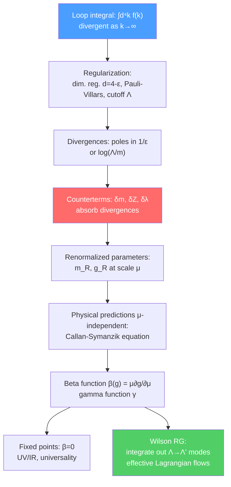

# 🔄 Renormalization and the Renormalization Group

> [!abstract] TL;DR
> Loop integrals in QFT diverge in the ultraviolet (UV, large momenta) — an alarming feature that is tamed by renormalization: systematically absorbing divergences into redefinitions of physical parameters (masses, coupling constants, field normalizations). The renormalization group (RG) describes how these parameters "run" with the energy scale $\mu$ at which they are measured, governed by the beta function $\beta(g) = \mu\,\partial g/\partial\mu$. Wilson's RG provides the deep physical picture: integrating out short-distance (high-energy) modes generates an effective Lagrangian at lower scales; fixed points of the RG flow determine universality classes. Asymptotic freedom in QCD (negative beta function) explains why quarks behave as nearly free at high energies but are confined at low energies.

## Intuition — analogy FIRST

A photograph of a city looks smooth from 10,000 feet — you see blocks and parks. From 100 feet you see individual buildings. From 1 foot you see bricks. The "effective description" changes with scale: different degrees of freedom are visible, different coupling strengths are relevant. The renormalization group formalizes this: it's the mathematical machinery for changing the scale at which you describe a physical system, keeping observable predictions unchanged. The coupling constants "run" with scale — not because the underlying physics is changing, but because the effective description changes as you zoom in or out. Divergences in perturbation theory are symptoms of this scale-dependence — not true infinities, but signals that naively mixing all scales at once is the wrong approach.

---

## How It Works

---

## Key Concepts / Details

### Secondary Level

**Measurements depend on scale:** A ruler looks smooth from far away but has grooves up close. A turbulent river looks chaotic close up but has large-scale eddies from a distance. Physics is like this: at large scales (low energies, long distances) you need different "effective rules" than at small scales. The renormalization group is the mathematical tool for relating these different descriptions.

**Running coupling:** The electric charge of the electron appears different when measured at different energies. At $Q = 0$ (classical), $\alpha_{em} = 1/137.036$. At $Q = M_Z = 91$ GeV, $\alpha_{em} \approx 1/128$ — the coupling has "run" to a larger value at higher energy. This is measured experimentally at particle colliders.

**Logarithmic divergences are everywhere:** In quantum mechanics, when you sum contributions from all possible virtual particle states (all energies), the sum often diverges logarithmically. Renormalization replaces this divergence with a physically meaningful result by recognizing that the "coupling" you measure is already the renormalized (finite) one.

### Undergraduate Level

**UV divergences — the self-energy example:** Consider the electron self-energy in QED — a loop diagram where the electron emits and reabsorbs a virtual photon. The integral over the virtual photon momentum $k$:

$$\Sigma(p^2) = \int\frac{d^4k}{(2\pi)^4}\frac{1}{(k^2-m^2)((k+p)^2-m^2)} \sim \int_0^\Lambda \frac{k^3\,dk}{k^4} \sim \ln\Lambda$$

diverges logarithmically as the UV cutoff $\Lambda \to \infty$. In $\phi^4$ theory, the self-energy diverges quadratically; in QED the photon self-energy (vacuum polarization) diverges logarithmically.

**Regularization:** To make the divergent integral well-defined while preserving Lorentz invariance and gauge invariance, use **dimensional regularization** (dim. reg.): analytically continue the spacetime dimension to $d = 4 - \epsilon$. Loop integrals that diverge in 4D develop poles $1/\epsilon$ in dim. reg.:

$$\int\frac{d^dk}{(2\pi)^d}\frac{1}{(k^2+m^2)^2} = \frac{1}{16\pi^2}\left(\frac{2}{\epsilon} - \gamma_E + \ln\frac{4\pi\mu^2}{m^2}\right) + O(\epsilon)$$

where $\mu$ is the dimensional regularization scale and $\gamma_E \approx 0.577$ is the Euler-Mascheroni constant.

**Renormalization — absorbing divergences:** Write the bare Lagrangian in terms of bare parameters $m_0, \lambda_0, \phi_0$:

$$\mathcal{L} = \frac{1}{2}(\partial_\mu\phi_0)^2 - \frac{1}{2}m_0^2\phi_0^2 - \frac{\lambda_0}{4!}\phi_0^4$$

Then decompose: $\phi_0 = Z_\phi^{1/2}\phi_R$, $m_0^2 = Z_m m_R^2$, $\lambda_0 = Z_\lambda\mu^\epsilon\lambda_R$ (with counterterms $\delta Z = Z-1$). The counterterms are chosen to cancel the $1/\epsilon$ poles at each loop order — the $\overline{\text{MS}}$ (modified minimal subtraction) scheme keeps only the pole plus $\ln 4\pi - \gamma_E$.

**Running coupling:** After renormalization, the coupling $\lambda_R$ depends on the renormalization scale $\mu$. Since physics cannot depend on the arbitrary scale $\mu$, the **Callan-Symanzik equation** must hold for any $n$-point function $\Gamma^{(n)}$:

$$\left(\mu\frac{\partial}{\partial\mu} + \beta(\lambda_R)\frac{\partial}{\partial\lambda_R} + n\gamma\right)\Gamma^{(n)}(p_i; \lambda_R, \mu) = 0$$

where the **beta function** $\beta(\lambda_R) = \mu\partial\lambda_R/\partial\mu|_{\lambda_0\,\text{fixed}}$ describes how the coupling runs with scale, and the **anomalous dimension** $\gamma = \mu\partial\ln Z_\phi/\partial\mu$ describes field strength renormalization.

**Running of $\alpha_{em}$:** In QED, the one-loop beta function is positive: $\beta(\alpha) = +\alpha^2/(3\pi) + O(\alpha^3)$. The coupling *increases* with energy (UV). Running from $\mu = m_e$ to $\mu = M_Z$:

$$\alpha^{-1}(M_Z) \approx \alpha^{-1}(m_e) - \frac{1}{3\pi}\ln\frac{M_Z}{m_e} \approx 137 - 9 \approx 128$$

### Graduate Level

**Callan-Symanzik equation and RG flows:** The beta function $\beta(g) = \mu\partial g/\partial\mu$ defines the **RG flow** in coupling-constant space. **Fixed points** where $\beta(g^*) = 0$ are special:

- **IR fixed point** (attractive in the IR, $g \to g^*$ as $\mu \to 0$): describes universal long-distance behavior. The Gaussian fixed point $g^* = 0$ is IR-free in $\phi^4$ theory in $d < 4$; the Wilson-Fisher fixed point $g^* > 0$ governs the 3D Ising model universality class.
- **UV fixed point** (attractive in the UV, $g \to g^*$ as $\mu \to \infty$): the theory is UV-complete — no Landau pole. Non-Abelian gauge theories in 4D have $g^* = 0$ as a UV fixed point (asymptotic freedom).

**Wilson's renormalization group:** The physical picture: integrate out field modes with momenta $\Lambda' < k < \Lambda$. The result is an effective Lagrangian at scale $\Lambda'$ with shifted couplings. Operators are classified:

| Scaling dimension | Behavior under RG | Name |
|-------------------|-------------------|------|
| $d < 4$ ($[\mathcal{O}] < 4$) | coupling grows in IR | Relevant operator |
| $d = 4$ ($[\mathcal{O}] = 4$) | coupling runs logarithmically | Marginal operator |
| $d > 4$ ($[\mathcal{O}] > 4$) | coupling shrinks in IR | Irrelevant operator |

**Universality:** Different microscopic Hamiltonians that flow to the same fixed point have identical long-distance behavior (same critical exponents, same correlation functions up to normalization). This is why the same $\beta$ function describes the liquid-gas critical point, the Ising magnet transition, and the superfluid-normal transition — all in the same universality class.

**Asymptotic freedom in QCD:** For SU($N_c$) gauge theory with $N_f$ flavors of quarks, the one-loop beta function:

$$\beta(g) = -\frac{g^3}{16\pi^2}\left(\frac{11N_c}{3} - \frac{2N_f}{3}\right) + O(g^5)$$

For QCD ($N_c = 3$, $N_f \leq 6$), the coefficient $\beta_0 = 11\times 3/3 - 2\times 6/3 = 11 - 4 = 7 > 0$, so $\beta(g) < 0$ — the coupling *decreases* with increasing $\mu$. This is **asymptotic freedom** (Gross, Politzer, Wilczek — Nobel 2004): quarks interact weakly at high energies (hard collisions in deep inelastic scattering) and strongly at low energies (confinement at $\Lambda_{QCD} \approx 200$ MeV).

The coupling diverges at $\mu = \Lambda_{QCD}$ (the **Landau pole** from below, or strong coupling scale) — perturbation theory breaks down here, and non-perturbative methods (lattice QCD, Dyson-Schwinger equations) are required.

---

## Real-World Notes

- **Precision QCD (LHC):** Running of $\alpha_s(Q^2)$ is measured across 5 orders of magnitude in $Q$ at colliders, confirming asymptotic freedom with 1% precision.
- **Critical phenomena (condensed matter):** Wilson's RG gave the first accurate theoretical predictions for critical exponents of phase transitions (Ising model, liquid-gas) — $\nu = 0.630$, $\eta = 0.036$ for 3D Ising, matching experiment.
- **Cosmological naturalness:** The hierarchy problem — why is $m_H \ll M_{Pl}$? — is about quadratic running of the Higgs mass: $\delta m_H^2 \propto \Lambda^2$. This drives searches for supersymmetry or compositeness.
- **Lattice QFT and thermodynamics:** The Euclidean path integral at finite imaginary-time period $\beta = 1/T$ gives quantum field theory at finite temperature — used for QCD thermodynamics and the quark-gluon plasma.

---

## Common Pitfalls

- **Renormalization is not removing infinities by hand:** It is the systematic recognition that the bare parameters are not the physical ones, and the physical parameters depend on scale.
- **Dim. reg. does not introduce a physical cutoff:** The scale $\mu$ in dim. reg. is arbitrary (no physics at $\mu$); physical observables are $\mu$-independent order by order.
- **The Landau pole in QED is a UV, not an IR, problem:** $\alpha_{em}$ runs to large values at $\mu \sim 10^{286}$ eV — far beyond any physical relevance. QED is an effective theory, not UV-complete.
- **$\beta = 0$ (fixed point) does not mean the coupling is constant for all $\mu$:** Only at the fixed-point value $g^*$ is the coupling exactly scale-invariant. Away from $g^*$, $\beta \neq 0$ and the coupling runs.

---

## Related Concepts

- [[Path_Integral_Formulation]] — path integral generates the loop diagrams that contain UV divergences
- [[Non_Abelian_Gauge_Theories]] — asymptotic freedom is the key property of QCD
- [[Effective_Field_Theories]] — Wilson RG directly motivates EFT; relevant operators are renormalizable interactions
- [[Spontaneous_Symmetry_Breaking]] — RG determines whether the symmetry-breaking potential is stable (vacuum stability)
- [[_MOC_Advanced_QFT|↑ Section MOC]]

---

## Review Questions

1. **(UG)** What is a UV divergence? Using $\phi^4$ theory in 4D, identify which diagrams are superficially divergent and classify them as logarithmic or quadratic by power counting.
2. **(UG/Grad)** State the Callan-Symanzik equation and define the beta function $\beta(g)$ and anomalous dimension $\gamma$. If $\beta(g) < 0$ at small $g$, what happens to the coupling as $\mu$ increases? Give QCD as an example.
3. **(Graduate)** Explain Wilson's picture of the RG: what does "integrating out high-momentum modes" mean, and how does it generate new operators in the effective Lagrangian? Classify operators as relevant, marginal, or irrelevant and explain why only finitely many are needed in a renormalizable theory.

---

## Sources

- Peskin & Schroeder, *Introduction to QFT*, Ch. 10–13 (renormalization, RG)
- Wilson & Kogut, *Phys. Rep.* 12, 75 (1974) — Wilson RG (original)
- Gross, Politzer, Wilczek, Nobel Lectures (2004) — asymptotic freedom
- Zinn-Justin, *Quantum Field Theory and Critical Phenomena* (comprehensive)
- Polchinski, *Renormalization and Effective Lagrangians*, *Nucl. Phys.* B 231, 269 (1984)

#physics #advanced-qft #renormalization #RG #beta-function #asymptotic-freedom #Wilson-RG #universality #Callan-Symanzik
