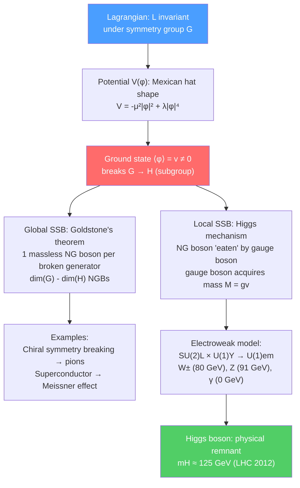

# 🍬 Spontaneous Symmetry Breaking

> [!abstract] TL;DR
> Spontaneous symmetry breaking (SSB) occurs when the Lagrangian respects a symmetry but the ground state (vacuum) does not. Goldstone's theorem says each broken continuous global symmetry generator produces one massless Nambu-Goldstone boson. When the broken symmetry is local (gauged), the Higgs mechanism applies: the would-be Goldstone bosons are "eaten" by the gauge bosons, which acquire mass. The electroweak model of Glashow-Weinberg-Salam (Nobel 1979) breaks $SU(2)_L \times U(1)_Y \to U(1)_{em}$ via a Higgs doublet with VEV $v = 246$ GeV, giving masses $M_W = gv/2 \approx 80$ GeV and $M_Z = M_W/\cos\theta_W \approx 91$ GeV. The Higgs boson at $m_H = 125$ GeV was discovered at the LHC in 2012.

## Intuition — analogy FIRST

A pencil balanced perfectly on its tip is symmetric under rotations about the vertical axis — every direction is equivalent. The equations of motion respect this symmetry. But the pencil is unstable: any tiny perturbation tips it, and it falls in a specific direction, spontaneously breaking the rotational symmetry. Once it's lying on the table, you can still slide it along the table in any horizontal direction at no energy cost — this "zero-cost mode" is the Goldstone boson (the rotational symmetry of rolling the pencil along the table is unbroken). If you now try to lift the pencil, you need energy — the gauge boson gets a mass. The key point: the equations (the Lagrangian) remain symmetric; only the ground state (vacuum) picks a direction.

---

## How It Works

---

## Key Concepts / Details

### Secondary Level

**Symmetry breaking in everyday life:**
- A ball in a spherical bowl at the bottom: symmetric. Tilt the bowl: the ball rolls to one side, breaking left-right symmetry — but the bowl equation doesn't change.
- Ferromagnet: above the Curie temperature, all spin directions are equivalent (symmetric). Below, spins align along one direction (breaking rotational symmetry) — same Hamiltonian, different ground state.
- The Standard Model Higgs: the universe below $10^{15}$ K has a preferred direction in "internal" (isospin) space — the Higgs field has a non-zero vacuum value, like the ferromagnet below $T_C$.

**Why the Higgs gives mass:** Particles acquire mass by interacting with the non-zero Higgs vacuum value $\langle\phi\rangle = v$. The stronger the coupling to the Higgs field, the more massive the particle. The photon doesn't couple to the Higgs (it's part of the unbroken U(1)$_{em}$) and remains massless; the W and Z couple strongly and become heavy.

### Undergraduate Level

**Mexican hat potential:** For a complex scalar field $\phi = \phi_1 + i\phi_2$:

$$V(\phi) = -\mu^2|\phi|^2 + \lambda|\phi|^4$$

For $\mu^2 > 0$, the potential has a minimum not at $\phi = 0$ but on a circle of radius:

$$|\langle\phi\rangle| = v = \sqrt{\mu^2/2\lambda}$$

The field can choose any point on this circle — all are degenerate. The choice of a specific point, say $\langle\phi\rangle = v$ (real), breaks the global U(1) symmetry $\phi \to e^{i\alpha}\phi$.

**Goldstone's theorem (global symmetry):** For each generator of the continuous symmetry group $G$ that is broken by the vacuum, there is one massless scalar particle — the **Nambu-Goldstone boson (NGB)**. Physical realization: expand $\phi = (v + h)e^{i\pi/v}/\sqrt{2}$ where $h$ (the "Higgs mode") acquires mass $m_h = \sqrt{2\mu^2}$ and $\pi$ (the "Goldstone") remains exactly massless.

**Examples of NGBs:**
| Broken symmetry | System | Goldstone bosons |
|----------------|--------|-----------------|
| Chiral SU(2)$_L$ × SU(2)$_R$ → SU(2)$_V$ | QCD | Pions $\pi^\pm, \pi^0$ |
| Rotational | Ferromagnet | Magnons (spin waves) |
| Translation | Crystal | Phonons |
| U(1) | Superfluid He-4 | Superfluid phonon |

Pions are **pseudo-Goldstone bosons** because chiral symmetry is only approximate (quarks have small but nonzero masses $m_u, m_d \approx$ few MeV); pions are light ($m_\pi \approx 140$ MeV) but not exactly massless.

**Higgs mechanism (local/gauge symmetry):** When the broken symmetry is a local gauge symmetry, the Goldstone boson couples to the gauge field. In unitary gauge, the phase degree of freedom is "gauged away" (eaten by the gauge boson). The gauge boson gains a longitudinal polarization component — it becomes massive. For U(1) with coupling $e$:

$$M_A = ev$$

The Mexican hat potential with gauged U(1) has: 1 massive scalar (Higgs, mass $m_H = \sqrt{2\lambda}v$) + 1 massive gauge boson (mass $M_A = ev$). The would-be Goldstone boson has disappeared, becoming the longitudinal degree of freedom of the massive gauge boson.

**Electroweak symmetry breaking:** The Standard Model gauge group is $SU(3)_c \times SU(2)_L \times U(1)_Y$. The electroweak sector $SU(2)_L \times U(1)_Y$ (4 gauge bosons: $W^1, W^2, W^3, B$) is broken by a complex SU(2) doublet of scalar fields (the **Higgs doublet**):

$$\Phi = \begin{pmatrix}\phi^+\\\phi^0\end{pmatrix}$$

with $V(\Phi) = -\mu^2\Phi^\dagger\Phi + \lambda(\Phi^\dagger\Phi)^2$. The VEV is:

$$\langle\Phi\rangle = \frac{1}{\sqrt{2}}\begin{pmatrix}0\\v\end{pmatrix}, \qquad v = \sqrt{\mu^2/\lambda} \approx 246\text{ GeV}$$

$SU(2)_L \times U(1)_Y$ (4 generators) → $U(1)_{em}$ (1 generator): 3 broken generators → 3 NGBs → eaten by $W^+, W^-, Z^0$. The 4th gauge boson ($\gamma$, photon) stays massless (unbroken $U(1)_{em}$). **Physical spectrum:**

$$M_W = \frac{gv}{2} \approx 80.4\text{ GeV}, \quad M_Z = \frac{M_W}{\cos\theta_W} \approx 91.2\text{ GeV}, \quad M_\gamma = 0$$

where $\theta_W$ is the Weinberg angle ($\sin^2\theta_W \approx 0.231$). The one remaining physical scalar is the **Higgs boson**, discovered at the LHC in 2012 with mass $m_H \approx 125.1$ GeV.

**Fermion masses via Yukawa coupling:** In the SM, fermions cannot have explicit mass terms ($m\bar\psi\psi$) because left- and right-handed fermions transform differently under $SU(2)_L$. Instead, they couple to the Higgs doublet via Yukawa interactions: $\mathcal{L}_Y = y_f\bar\psi_L\Phi\psi_R + h.c.$ After SSB: $m_f = y_fv/\sqrt{2}$. Top quark: $y_t \approx 1$ (almost exactly); electron: $y_e \approx 3 \times 10^{-6}$.

### Graduate Level

**Glashow-Weinberg-Salam (GWS) electroweak theory** (Nobel 1979): The complete SU(2)$_L$ × U(1)$_Y$ model with the Higgs doublet, quarks and leptons in chiral representations, and the complete Yukawa sector. Renormalizability proved by 't Hooft and Veltman (Nobel 1999). The GWS model is confirmed to high precision by LEP, SLD, Tevatron, and LHC experiments.

**Custodial symmetry:** The SM Higgs potential has an accidental SO(4) ≅ SU(2)$_L$ × SU(2)$_R$ symmetry broken to SU(2)$_V$ (custodial symmetry). This enforces the tree-level relation $\rho = M_W^2/(M_Z^2\cos^2\theta_W) = 1$ — confirmed experimentally to $\rho = 1.00037 \pm 0.00023$.

**Vacuum stability:** Is our Higgs vacuum stable? The effective Higgs potential $V_{eff}(\phi)$ runs with scale via the RG. For $m_H = 125$ GeV and $m_t = 173$ GeV, $V_{eff}$ develops a second (deeper) minimum at $\phi \sim 10^{10}$ GeV — suggesting our vacuum is **metastable** (tunneling lifetime $\gg$ age of the universe). The universe sits in a false vacuum — a discovery that depends critically on the top quark mass.

**False vacuum decay (Coleman-De Luccia):** The tunneling rate from false to true vacuum via bubble nucleation (the Coleman bounce solution, Euclidean instanton): $\Gamma/V \propto e^{-B}$ where $B = S_E[\phi_{bounce}] - S_E[\phi_{false}]$. The bubble wall expands at the speed of light after nucleation — if this happened somewhere in the universe, a true-vacuum bubble would consume the observable universe.

**Alternatives to the Higgs mechanism:**
- **Technicolor:** No fundamental scalar; instead a new strong force condenses technifermions, analogous to $\langle\bar\psi\psi\rangle \neq 0$ in chiral symmetry breaking. Ruled out in its simplest form by precision EW constraints.
- **Composite Higgs models:** The Higgs is a pseudo-Goldstone boson of a new strong dynamics at TeV scale. Currently constrained but not excluded.

---

## Real-World Notes

- **W and Z boson discovery (CERN SPS, 1983):** Rubbia and van der Meer (Nobel 1984) confirmed the SM prediction $M_W \approx 80$ GeV, $M_Z \approx 91$ GeV — direct confirmation of SSB.
- **Higgs boson (LHC 2012):** $pp \to H \to \gamma\gamma$ and $H \to ZZ^* \to 4\ell$ at ATLAS and CMS; $m_H = 125.1$ GeV, Nobel 2013 (Higgs and Englert).
- **Superconductivity:** SSB of U(1) electromagnetic gauge symmetry by the Cooper pair condensate gives photons a mass inside the superconductor (penetration depth $\lambda_L = c/\omega_p$) — the Meissner effect. This is the condensed-matter Higgs mechanism.
- **Baryon asymmetry:** Electroweak baryogenesis requires a first-order EW phase transition at the early universe — the SM transition is a crossover (not first-order) for $m_H > 75$ GeV, motivating beyond-SM scenarios.

---

## Common Pitfalls

- **The symmetry of the Lagrangian is not broken:** Only the ground state breaks the symmetry. The vacuum is not invariant under the symmetry transformation, but the action is.
- **The Goldstone boson is massless only for exact global symmetry:** Any explicit symmetry breaking (quark masses, EW corrections for pions) gives NGBs a small mass — they are pseudo-Goldstone bosons.
- **"Eating" the Goldstone changes the degree-of-freedom count, not the total:** Massless gauge boson has 2 polarizations + 0 scalars = 2. Massive gauge boson has 3 polarizations + 0 scalars = 3. The Goldstone boson (1 scalar) was "eaten" to give the extra polarization: 2 + 1 = 3. ✓
- **The Higgs mechanism is not about "particles dragging through molasses":** The intuitive picture of fermions and bosons acquiring mass by interacting with a Higgs "field filling all of space" is qualitatively correct but must not be taken too literally — the mass is a coupling to the VEV $\langle\phi\rangle = v$, not a friction.

---

## Related Concepts

- [[Non_Abelian_Gauge_Theories]] — the Higgs mechanism requires a gauge theory; QCD has chiral SSB
- [[Anomalies_in_QFT]] — anomaly cancellation in the SM requires specific quark-lepton structure
- [[Effective_Field_Theories]] — Fermi theory is the EFT below the W/Z mass after EW SSB
- [[Renormalization_and_RG]] — running of the Higgs quartic coupling determines vacuum stability
- [[_MOC_Advanced_QFT|↑ Section MOC]]

---

## Review Questions

1. **(UG)** Write the Mexican-hat potential $V(\phi) = -\mu^2|\phi|^2 + \lambda|\phi|^4$ for a complex scalar field. Find the VEV $v$. Expand around the minimum and identify the Higgs mode (massive) and the Goldstone mode (massless).
2. **(UG)** State Goldstone's theorem. In the electroweak model, $SU(2)_L \times U(1)_Y$ is broken to $U(1)_{em}$. How many NGBs are produced? What happens to them in the Higgs mechanism, and what is the physical spectrum of gauge bosons?
3. **(Graduate)** What is custodial symmetry and why does it enforce $\rho = 1$ at tree level? Describe the vacuum stability problem in the SM: what does it mean that our vacuum is metastable, and what are the key parameters that determine the stability?

---

## Sources

- Peskin & Schroeder, *Introduction to QFT*, Ch. 20 (electroweak theory, Higgs mechanism)
- Weinberg, *The Quantum Theory of Fields*, Vol. 2, Ch. 19–21 (SSB, Goldstone, Higgs)
- Higgs, *Phys. Rev. Lett.* 13, 508 (1964); Englert & Brout, *Phys. Rev. Lett.* 13, 321 (1964)
- ATLAS Collaboration, *Phys. Lett. B* 716, 1 (2012) — Higgs discovery
- Coleman, *Aspects of Symmetry*, Ch. 5 (secret symmetry and NGBs — classic lectures)

#physics #advanced-qft #spontaneous-symmetry-breaking #Higgs #Goldstone #electroweak #GWS-model #vacuum-stability
