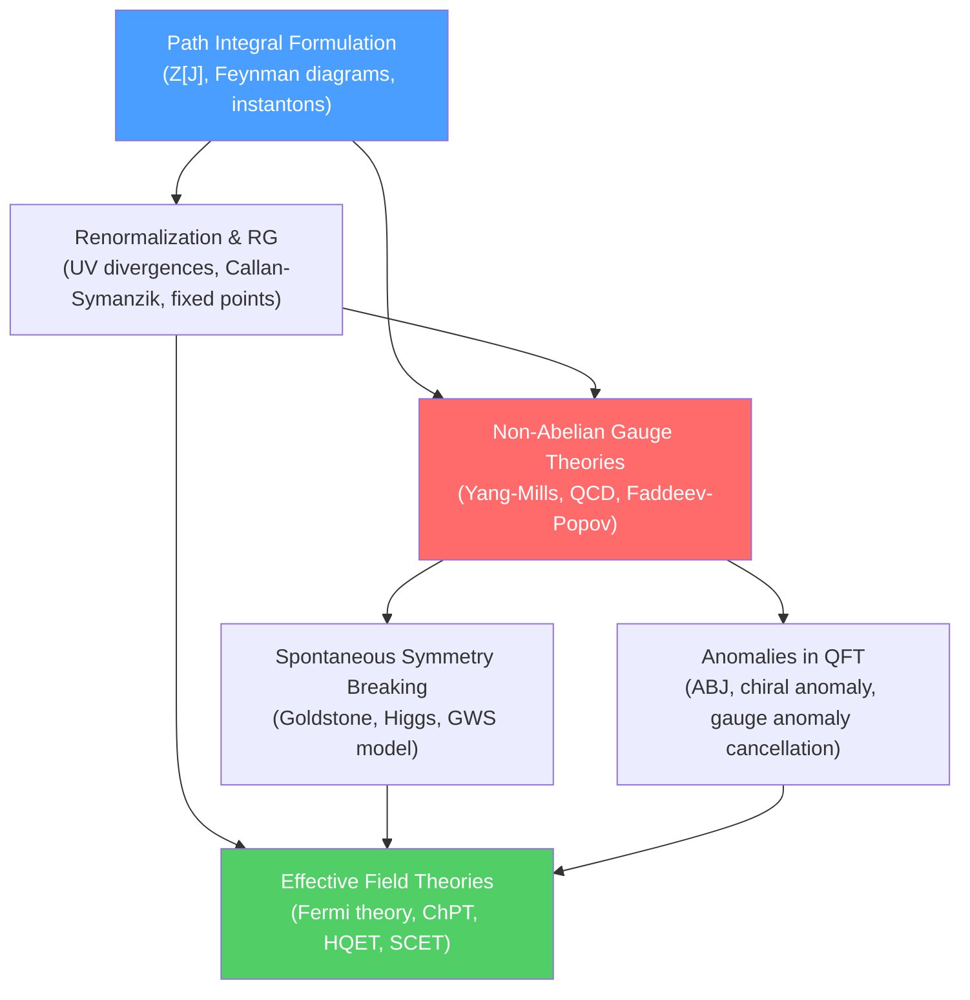

# 🌌 Advanced Quantum Field Theory — Map of Content

> [!abstract] Section Overview
> Quantum Field Theory (QFT) is the framework unifying quantum mechanics with special relativity. Every particle is an excitation of an underlying quantum field; interactions arise from gauge symmetries. This section covers the path-integral formulation (Feynman's sum over histories), the renormalization group (how physics changes with scale), non-Abelian gauge theories (the language of the Standard Model), spontaneous symmetry breaking with the Higgs mechanism, quantum anomalies (symmetries that survive classically but break at the quantum level), and effective field theories (the modern organizing principle for physics at any scale).

---

## Mermaid — How the Topics Connect

---

## Notes in This Section

| # | Note | Core Idea | Difficulty |
|---|------|-----------|------------|
| 1 | [[Path_Integral_Formulation]] | Sum over histories, Euclidean QFT, instantons | UG → Grad |
| 2 | [[Renormalization_and_RG]] | UV divergences, running couplings, Wilson RG | UG → Grad |
| 3 | [[Non_Abelian_Gauge_Theories]] | Yang-Mills, QCD, ghosts, asymptotic freedom | UG → Grad |
| 4 | [[Spontaneous_Symmetry_Breaking]] | Goldstone, Higgs mechanism, electroweak unification | UG → Grad |
| 5 | [[Anomalies_in_QFT]] | Chiral anomaly, $\pi^0 \to \gamma\gamma$, gauge anomaly cancellation | UG → Grad |
| 6 | [[Effective_Field_Theories]] | EFT philosophy, Fermi theory, ChPT, HQET, SM as EFT | UG → Grad |

---

## Recommended Learning Path

1. **[[Path_Integral_Formulation]]** — master the functional integral language; all modern QFT is done this way
2. **[[Renormalization_and_RG]]** — understand UV divergences, running couplings, and Wilsonian EFT
3. **[[Non_Abelian_Gauge_Theories]]** — QCD and the Yang-Mills structure; BRST, ghosts, asymptotic freedom
4. **[[Spontaneous_Symmetry_Breaking]]** — Goldstone's theorem, Higgs mechanism, electroweak model
5. **[[Anomalies_in_QFT]]** — quantum breakdowns of classical symmetry; ABJ anomaly, anomaly cancellation
6. **[[Effective_Field_Theories]]** — the modern synthesis: every QFT is an EFT; power counting, matching

---

## Key Equations at a Glance

| Concept | Equation |
|---------|----------|
| Path integral (QM) | $K = \int\mathcal{D}x\,e^{iS[x]/\hbar}$ |
| Generating functional | $Z[J] = \int\mathcal{D}\phi\,e^{i(S[\phi]+J\cdot\phi)}$ |
| Callan-Symanzik | $(\mu\partial_\mu + \beta\partial_g + n\gamma)\Gamma^{(n)} = 0$ |
| Yang-Mills field strength | $F^a_{\mu\nu} = \partial_\mu A^a_\nu - \partial_\nu A^a_\mu + gf^{abc}A^b_\mu A^c_\nu$ |
| Higgs VEV | $\langle\phi\rangle = v/\sqrt{2} = 174$ GeV |
| Chiral anomaly | $\partial_\mu j_5^\mu = \frac{g^2}{16\pi^2}F\tilde{F}$ |
| EFT expansion | $\mathcal{L} = \sum_n c_n \mathcal{O}_n/\Lambda^{n-4}$ |

---

## Connections to Other Sections

- [[_MOC_Quantum_Mechanics|05 Quantum Mechanics]] — QFT is the relativistic generalization
- [[_MOC_Nuclear_Particle|07 Nuclear and Particle Physics]] — the Standard Model is the QFT of particles
- [[_MOC_AMO_Physics|11 AMO Physics]] — cavity QED quantizes EM field (QED in a cavity)
- [[_MOC_Physics_Master|↑ Physics Master MOC]]

---

#physics #advanced-qft #quantum-field-theory #path-integral #renormalization #gauge-theory #Higgs #anomalies #effective-field-theory
