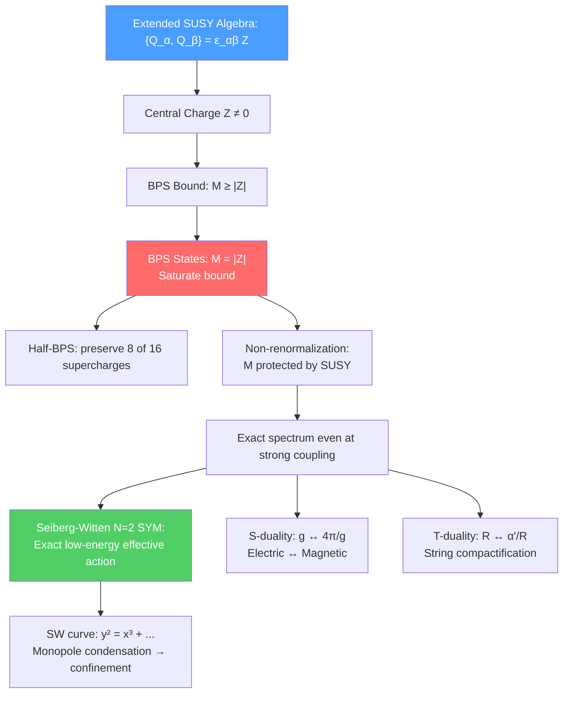

# 🔮 BPS States and Dualities

> [!abstract] TL;DR
> BPS states (Bogomolny-Prasad-Sommerfield) are special states in SUSY theories that saturate the bound $M \geq |Z|$, where $Z$ is the central charge of the SUSY algebra. They preserve exactly half the supercharges, and their masses are protected from quantum corrections by SUSY — making exact results possible. The Seiberg-Witten theory gives the exact low-energy effective action of $\mathcal{N}=2$ SYM, revealing that confinement arises from monopole condensation and that electric and magnetic degrees of freedom are dual. S-duality ($g \to 4\pi/g$) and T-duality ($R \to \alpha'/R$) connect the five string theories and form the backbone of the M-theory duality web.

## Intuition — analogy FIRST

Consider a stretched rubber band. It has a minimum energy for a given length — you can deform it, but the energy is bounded from below by its tension times its length. BPS states are like this: they saturate the minimum energy consistent with their conserved charges. You cannot continuously deform them to lower energy states without changing the charge. This "rigidity" is what makes BPS states so special — and so computable.

Duality is like discovering that two very different-looking maps describe the same territory. S-duality says the theory of strongly-coupled particles is equivalent to the theory of weakly-coupled monopoles. It's as if you learned that the difficult, strongly-interacting regime of QED (many real photons) is actually described by a simple, weakly-coupled theory — just written in different variables.

---

## How It Works

---

## Key Concepts / Details

### Undergraduate Level

**Central Charges in Extended SUSY**

In $\mathcal{N}=2$ SUSY, the anti-commutation relation between supercharges contains a new term:
$$\{Q^i_\alpha, Q^j_\beta\} = \epsilon_{\alpha\beta}\epsilon^{ij}Z$$

where $Z$ is the **central charge** — a conserved quantity (electric + magnetic charge: $Z = n_e e + n_m/e$). In $\mathcal{N}=1$ SUSY, central charges are absent.

**The BPS Bound**

For a state with central charge $|Z|$:
$$M \geq |Z|$$

This follows from the positivity of $\|Q|state\rangle\|^2 \geq 0$. States that saturate the bound, $M = |Z|$, are called **BPS states**. The bound is analogous to the Bogomolny bound in classical field theory for solitons.

**Properties of BPS States:**
1. Exactly half the supercharges annihilate the BPS state: $Q^\alpha|BPS\rangle = 0$ for some $\alpha$ — "half-BPS"
2. The mass is exactly protected from quantum corrections (since $M = |Z|$ and $Z$ is a conserved charge that cannot be renormalized)
3. BPS multiplets are shorter than generic (long) multiplets

**Magnetic Monopoles**

The Dirac monopole: a magnetic charge $n_m$ at the origin, with $B_r = n_m g/r^2$. Consistent with QM if $n_e n_m = 2\pi\mathbb{Z}$ (Dirac quantization condition). The 't Hooft-Polyakov monopole is a smooth, non-singular classical solution in Yang-Mills-Higgs theory: a soliton where the Higgs field winds around the sphere at spatial infinity, giving topological charge (magnetic charge).

In the BPS limit (Bogomolny, 1976), the 't Hooft-Polyakov monopole saturates the energy bound $E \geq M_{Higgs}|n_m|$, and satisfies the first-order Bogomolny equations $B_i = D_i\phi$.

### Graduate Level

**Electric-Magnetic Duality in $\mathcal{N}=4$ SYM**

Montonen-Olive duality (1977): conjectured that $\mathcal{N}=4$ SYM with coupling $g$ is exactly equivalent to the same theory with coupling $g_{dual} = 4\pi/g$. Under this S-duality:
- Electric charges $n_e$ ↔ Magnetic charges $n_m$
- Gauge group $G$ ↔ Langlands dual group $G^\vee$
- Coupling $\tau \to -1/\tau$ (where $\tau = \frac{\theta}{2\pi} + \frac{4\pi i}{g^2}$)

The full duality group is $SL(2,\mathbb{Z})$: $\tau \to \frac{a\tau + b}{c\tau + d}$ with $ad - bc = 1$, $a,b,c,d\in\mathbb{Z}$. S-duality is $\tau \to -1/\tau$; T-duality (in the string context) is $\tau \to \tau + 1$.

Evidence for Montonen-Olive: The BPS spectrum ($M = |Z|$) is exactly preserved under the duality (since it is fixed by charges). The short BPS multiplets map to each other correctly.

**Seiberg-Witten Theory ($\mathcal{N}=2$ SYM)**

Seiberg and Witten (1994) found the exact low-energy effective action of $\mathcal{N}=2$ SYM with gauge group $SU(2)$.

The key objects:
- **Moduli space:** The classical moduli space is parameterized by $u = \langle\text{Tr}\phi^2\rangle$, the Coulomb branch
- **Prepotential:** $\mathcal{N}=2$ SUGRA requires a single holomorphic function $\mathcal{F}(a)$ determining the metric and coupling: $\tau_{eff}(a) = \partial^2\mathcal{F}/\partial a^2$

**The Seiberg-Witten Curve:**

The exact solution is encoded in an algebraic curve (the "SW curve"):
$$y^2 = (x^2 - u)^2 - \Lambda^4$$

The periods of the SW curve give $(a, a_D)$, where $a$ is the electric VEV and $a_D = \partial\mathcal{F}/\partial a$ is its dual. The physical coupling is $\tau_{eff} = da_D/da$.

The exact effective coupling interpolates between:
- Weak coupling ($|u| \gg |\Lambda|^2$): $\tau_{eff} \approx \frac{4\pi i}{g^2} + \frac{1}{2\pi i}\ln\frac{u}{\Lambda^2}$ (logarithmic running)
- Strong coupling: two special singularities where a monopole or dyon becomes massless

**Physical Consequences of SW Theory:**
- **Confinement from monopole condensation:** Near the monopole singularity, monopoles become massless and condense (like Cooper pairs), generating a dual Meissner effect → electric flux tubes → quark confinement
- **Exact $\beta$-function:** SW provides the exact quantum effective coupling as a function of scale
- **Mass formula:** $M = |n_e a + n_m a_D|$ for all BPS dyons with $(n_e, n_m)$ charges — exact at quantum level

**S-Duality in String Theory**

| Duality | Type | Action |
|---------|------|--------|
| S-duality | Type IIB | $g_s \to 1/g_s$, $\tau \to -1/\tau$ |
| S-duality | Type I ↔ Heterotic $SO(32)$ | Strong coupling limit |
| T-duality | IIA ↔ IIB on $S^1$ | $R \to \alpha'/R$ (large ↔ small circle) |
| T-duality | Het $SO(32)$ ↔ Het $E_8\times E_8$ on $S^1$ | $R \to \alpha'/R$ |
| M-theory | IIA at strong coupling | 11D lift: $g_s = (R_{11}/l_s)^{3/2}$ |

**T-Duality in Detail**

Compactify one spatial dimension on a circle of radius $R$. String theory on $M^{9}\times S^1_R$ is equivalent to string theory on $M^9\times S^1_{\alpha'/R}$ — large and small circles are physically equivalent! This is uniquely stringy (no analogue for point particles).

The momentum $p = n/R$ (KK modes) and winding $p_W = mR/\alpha'$ are exchanged: $(n,m) \to (m,n)$ under $R \to \alpha'/R$. T-duality exchanges Neumann and Dirichlet boundary conditions → open string endpoints fixed on D-branes.

**Mirror Symmetry**

$\mathcal{N}=2$ theories in 3D are related by mirror symmetry: two different UV theories flow to the same IR fixed point, exchanging Coulomb and Higgs branches. Mirror symmetry in the 3D sense is the dimensional reduction of 4D S-duality.

---

## Real-World Notes

- **AdS/CFT and BPS states:** BPS operators in $\mathcal{N}=4$ SYM (protected from renormalization) correspond to bulk fields in $AdS_5\times S^5$. Their conformal dimensions are protected and can be computed exactly — one of the few exact predictions of AdS/CFT.
- **Seiberg-Witten and instanton counting:** Nekrasov (2003) showed that the SW prepotential can be computed by summing over instantons using localization — an exact calculation in a gauge theory, remarkable in 4D QFT.
- **BPS black holes:** In $\mathcal{N}=2$ SUGRA, extremal black holes (charge = mass in Planck units) are BPS. Their entropy can be computed exactly (from the microscopic string/M-theory perspective) — this is one of the successes of string theory as a quantum theory of gravity.

---

## Common Pitfalls

- **BPS states exist only in theories with extended SUSY ($\mathcal{N}\geq 2$).** The $\mathcal{N}=1$ SUSY algebra has no central charges; BPS bounds arise only when $\{Q^i, Q^j\} \ni Z^{ij}$ with $i\neq j$.
- **"Half-BPS" means half the supercharges are preserved, not half of the SUSY is broken.** A half-BPS state in $\mathcal{N}=4$ SYM preserves 8 of 16 real supercharges.
- **S-duality is a strong-coupling conjecture, not a theorem.** For $\mathcal{N}=4$ SYM, the evidence is overwhelming (BPS spectrum, partition functions, anomalies all match), but a rigorous proof does not exist.
- **T-duality requires a compact circle.** T-duality applies to a compact direction — it is not a statement about full string theory in non-compact space.

---

## Related Concepts

- [[Supergravity]] — SUGRA is the low-energy limit; BPS black holes are solutions
- [[SUSY_Lagrangians]] — $\mathcal{N}=2$ SYM from which SW theory is derived
- [[M_Theory_and_Dualities]] — Full duality web connecting all string theories
- [[AdS_CFT_Correspondence]] — BPS operators are protected and dual to bulk fields
- [[Topology_in_Physics]] — Magnetic monopoles and instantons have topological character
- [[_MOC_SUSY_Supergravity|↑ Section MOC]]

---

## Review Questions

1. **(Undergraduate)** Define a BPS state. Why is the BPS bound $M \geq |Z|$ saturated for BPS states? What does "half-BPS" mean in terms of supercharges?
2. **(Undergraduate)** What is the 't Hooft-Polyakov monopole? How does it differ from the Dirac monopole? Why is it called a BPS monopole in the Bogomolny limit?
3. **(Graduate)** Explain the Seiberg-Witten solution of $\mathcal{N}=2$ SYM. What does the SW curve encode? What are the singularities in the moduli space, and what physics happens at each singularity?
4. **(Graduate)** State Montonen-Olive S-duality for $\mathcal{N}=4$ SYM. How does the BPS mass formula transform under $g \to 4\pi/g$? What is the full $SL(2,\mathbb{Z})$ duality group acting on $\tau$?

---

## Sources

- Seiberg & Witten, "Electric-magnetic duality, monopole condensation and confinement in $\mathcal{N}=2$ supersymmetric Yang-Mills theory," *Nucl. Phys. B* 426, 19 (1994), arXiv:hep-th/9407190
- Seiberg & Witten, "Monopoles, duality and chiral symmetry breaking in $\mathcal{N}=2$ supersymmetric QCD," *Nucl. Phys. B* 431, 484 (1994), arXiv:hep-th/9408099
- Olive, "Exact electromagnetic duality," *Nucl. Phys. B Proc. Suppl.* 45, 88 (1996)
- Harvey, "Magnetic monopoles, duality and supersymmetry," arXiv:hep-th/9603086 — lecture notes
- Bilal, "Duality in $\mathcal{N}=2$ SUSY SU(2) Yang-Mills," arXiv:hep-th/9601007

#physics #BPS-states #Seiberg-Witten #S-duality #T-duality #magnetic-monopoles #central-charge #N2-SYM
