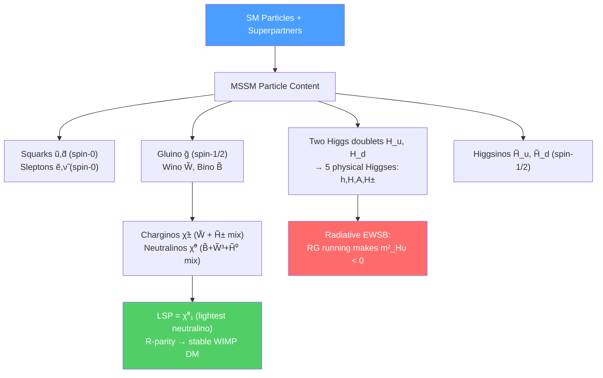

# 🔮 MSSM and Phenomenology

> [!abstract] TL;DR
> The Minimal Supersymmetric Standard Model (MSSM) is the minimal SUSY extension of the SM: every SM particle gets a superpartner, and two Higgs doublets ($H_u$, $H_d$) are required. The MSSM has 126 free parameters in general, reduced to 5 in the constrained CMSSM/mSUGRA. R-parity conservation makes the lightest supersymmetric particle (LSP) — typically the lightest neutralino $\tilde\chi^0_1$ — stable, making it a natural WIMP dark matter candidate. Electroweak symmetry breaking is driven radiatively by the large top Yukawa running $m_{H_u}^2$ negative. LHC Run 3 has excluded gluinos below $\sim 2.3$ TeV and squarks below $\sim 1.8$ TeV, putting the "little hierarchy problem" of natural SUSY under pressure.

## Intuition — analogy FIRST

The MSSM is to SUSY what the Standard Model is to electroweak theory: the minimal, most predictive implementation that is consistent with known physics. The key word is *minimal* — the MSSM adds the smallest possible number of new particles (exactly one superpartner per SM particle, plus one extra Higgs doublet required by consistency). Everything else — the spectrum, mixing angles, dark matter candidate, electroweak symmetry breaking mechanism — follows from the algebraic structure plus the soft-breaking parameters.

---

## How It Works

---

## Key Concepts / Details

### Undergraduate Level

**MSSM Particle Content**

Every SM particle gets a superpartner:

| SM Particle | Spin | Superpartner | Spin | Symbol |
|------------|------|-------------|------|--------|
| Quark $q$ | 1/2 | Squark | 0 | $\tilde{q}_{L,R}$ |
| Lepton $l$ | 1/2 | Slepton | 0 | $\tilde{l}_{L,R}$ |
| Neutrino $\nu$ | 1/2 | Sneutrino | 0 | $\tilde\nu$ |
| Gluon $g$ | 1 | Gluino | 1/2 | $\tilde{g}$ |
| $W^\pm, Z^0$ | 1 | Wino, Zino | 1/2 | $\tilde{W}^\pm, \tilde{Z}$ |
| Photon $\gamma$ | 1 | Photino | 1/2 | $\tilde\gamma$ |
| Higgs $H$ | 0 | Higgsino | 1/2 | $\tilde{H}$ |

Two Higgs doublets are required:
- $H_u$: gives mass to up-type quarks ($W_{MSSM} \ni y_u H_u Q u^c$)
- $H_d$: gives mass to down-type quarks and leptons ($W_{MSSM} \ni y_d H_d Q d^c + y_e H_d L e^c$)

This is forced by holomorphy of $W$ (can't use $H_u^*$ in a superpotential) and anomaly cancellation (the two doublets contribute equal and opposite gauge anomalies).

**The MSSM Superpotential**

$$W_{MSSM} = y_u H_u Q u^c + y_d H_d Q d^c + y_e H_d L e^c + \mu H_u H_d$$

where $y_{u,d,e}$ are $3\times3$ Yukawa matrices and $\mu$ is the supersymmetric Higgs mass. The $\mu$ term is crucial — it mixes $H_u$ and $H_d$ and gives masses to all four Higgsinos.

**Physical Higgs Bosons**

With two complex doublets (8 real degrees of freedom), after EWSB eating three Goldstone bosons ($\to W^\pm, Z$ longitudinal), the MSSM has 5 physical Higgs bosons:
- $h$: lighter CP-even (SM-like, $m_h \leq m_Z$ at tree level, $\leq 135$ GeV with loop corrections)
- $H$: heavier CP-even
- $A$: CP-odd (pseudoscalar)
- $H^\pm$: charged Higgses

The ratio of VEVs $\tan\beta = v_u/v_d$ is a key parameter. At tree level: $m_h^2 \leq m_Z^2\cos^2(2\beta)$ — so $m_h \leq m_Z = 91$ GeV. The observed $m_h = 125$ GeV requires large radiative corrections from heavy stops: $\delta m_h^2 \sim \frac{3y_t^4v^2}{4\pi^2}\log(m_{\tilde{t}}^2/m_t^2)$.

**R-Parity and Dark Matter**

R-parity is defined as:
$$R = (-1)^{3(B-L)+2S}$$

SM particles have $R = +1$; superpartners have $R = -1$. If R-parity is conserved:
1. Sparticles can only be produced in pairs (from R-even SM initial state)
2. The LSP is absolutely stable
3. Every sparticle decay chain ends at the LSP

The lightest neutralino $\tilde\chi^0_1$ (mixture of $\tilde{B}$, $\tilde{W}^3$, $\tilde{H}^0_u$, $\tilde{H}^0_d$) is the most natural LSP: neutral, weakly interacting, massive ($\sim 100$–$1000$ GeV) — a perfect WIMP dark matter candidate. Its relic density from thermal freeze-out matches $\Omega_{DM}h^2 \approx 0.12$ in wide regions of parameter space.

### Graduate Level

**Radiative Electroweak Symmetry Breaking**

At the GUT scale, all scalar soft masses can be equal: $m_{H_u}^2(M_{GUT}) = m_{H_d}^2(M_{GUT}) = m_0^2 > 0$. Running down to the EW scale, the large top Yukawa coupling $y_t \approx 1$ drives $m_{H_u}^2$ negative:
$$\frac{d m_{H_u}^2}{d\ln\mu} = \frac{3y_t^2}{8\pi^2}(m_{H_u}^2 + m_{Q_3}^2 + m_{u_3}^2 + A_t^2) - \ldots$$

This radiative breaking is elegant: EWSB is not put in by hand but driven by the top quark mass. The $Z$ boson mass is determined by:
$$\frac{m_Z^2}{2} = \frac{m_{H_d}^2 - m_{H_u}^2\tan^2\beta}{\tan^2\beta - 1} - \mu^2 \approx -m_{H_u}^2 - \mu^2$$

requiring $\mu^2 \approx -m_{H_u}^2(M_{EW}) - m_Z^2/2$ — this is the tuning condition (naturalness problem).

**Charginos and Neutralinos**

After EWSB, gauginos and Higgsinos mix. The **neutralino** mass matrix in the basis $(\tilde{B}, \tilde{W}^3, \tilde{H}^0_d, \tilde{H}^0_u)$:
$$\mathcal{M}_{\tilde\chi^0} = \begin{pmatrix}M_1 & 0 & -m_Z s_W c_\beta & m_Z s_W s_\beta \\ 0 & M_2 & m_Z c_W c_\beta & -m_Z c_W s_\beta \\ -m_Z s_W c_\beta & m_Z c_W c_\beta & 0 & -\mu \\ m_Z s_W s_\beta & -m_Z c_W s_\beta & -\mu & 0\end{pmatrix}$$

Four neutralino mass eigenstates $\tilde\chi^0_{1,2,3,4}$ (lightest = LSP). Two **chargino** mass eigenstates from $(\tilde{W}^\pm, \tilde{H}^\pm)$ mixing.

**CMSSM/mSUGRA Parameters**

Reducing the 126 free MSSM parameters using universality at $M_{GUT}$:

| Parameter | Description |
|-----------|-------------|
| $m_0$ | Universal scalar soft mass |
| $m_{1/2}$ | Universal gaugino soft mass |
| $A_0$ | Universal trilinear A-term |
| $\tan\beta$ | Ratio of Higgs VEVs |
| $\text{sgn}(\mu)$ | Sign of Higgsino mass parameter |

Gaugino mass ratios at EW scale: $M_1 : M_2 : M_3 \approx 1 : 2 : 6$ (from RG running, proportional to $\alpha_1 : \alpha_2 : \alpha_3$).

**LHC Signatures and Current Limits**

The canonical SUSY signature: hard jets + large missing transverse energy ($\slashed{E}_T$) from LSPs escaping the detector.

Current exclusions (ATLAS/CMS Run 3, $\sqrt{s} = 13.6$ TeV, $\sim 140$ fb$^{-1}$):
- Gluino: $m_{\tilde{g}} > 2.3$ TeV (for $m_{\tilde\chi^0_1} \lesssim 200$ GeV)
- First/second generation squarks: $m_{\tilde{q}} > 1.8$ TeV
- Stop (lightest): $m_{\tilde{t}_1} > 1.25$ TeV (for $m_{\tilde\chi^0_1} \lesssim 300$ GeV)
- Chargino/neutralino: $m_{\tilde\chi^\pm_1} > 600$ GeV (via WZ-mediated)
- Stau: $m_{\tilde\tau} > 450$ GeV

**The Little Hierarchy Problem**

Natural SUSY requires stops $m_{\tilde{t}} \lesssim 1$ TeV to avoid large fine-tuning. With current limits $m_{\tilde{t}} \gtrsim 1.25$ TeV:
$$\delta m_H^2 \sim \frac{3y_t^2}{8\pi^2}m_{\tilde{t}}^2\log\frac{\Lambda}{m_{\tilde{t}}} \sim (400 \text{ GeV})^2 \gg m_Z^2$$

This "little hierarchy" requires $\sim 10\%$ fine-tuning. Possible resolutions: compressed spectra, Dirac gauginos, NMSSM, RPV SUSY, focus-point scenarios.

---

## Real-World Notes

- **Gauge coupling unification:** At one loop, the three SM gauge couplings run toward (but don't quite meet) a unified value at $\sim 10^{16}$ GeV. With MSSM particle content (sparticles contribute to running), the three couplings meet exactly at $M_{GUT} \approx 2\times10^{16}$ GeV — a non-trivial success of the MSSM.
- **Higgs mass prediction:** The MSSM tree-level bound $m_h \leq m_Z$ raised by stop loops to $m_h \lesssim 135$ GeV is consistent with the observed $m_h = 125$ GeV — requires heavy stops ($m_{\tilde{t}} \sim 1$–$10$ TeV) or maximal stop mixing.
- **Dark matter direct detection:** LZ and XENONnT have probed Higgsino-like and bino-like neutralino dark matter. The "well-tempered neutralino" (right admixture of bino-Higgsino) gives $\Omega h^2 = 0.12$ and a spin-independent cross section near current LUX/LZ bounds.

---

## Common Pitfalls

- **R-parity is not a theorem.** R-parity is an assumption — the most minimal one. R-parity-violating (RPV) SUSY allows the LSP to decay, eliminates the DM candidate, but allows single sparticle production (different LHC signatures).
- **The MSSM Higgs mass $m_h \leq m_Z$ applies only at tree level.** Loop corrections from stop squarks can raise this to $\sim 125$ GeV, but require either large $m_{\tilde{t}}$ or large stop mixing ($A_t \sim \sqrt{6}m_{\tilde{t}}$).
- **Neutralino DM is not the only MSSM DM candidate.** Gravitino and sneutrino are alternatives; in GMSB the gravitino is always the LSP.
- **Naturalness $\neq$ low fine-tuning.** Fine-tuning metrics are scheme-dependent. Some measures favor electroweak fine-tuning $\Delta = \frac{\partial\ln m_Z^2}{\partial\ln p_i}$; others use Barbieri-Giudice measure. The "little hierarchy problem" is real but its severity is not uniquely defined.

---

## Related Concepts

- [[SUSY_Breaking]] — SUSY breaking generates the soft terms that split the MSSM spectrum
- [[SUSY_Algebra_and_Superspace]] — Superspace formulation of the MSSM Lagrangian
- [[Supergravity]] — SUGRA mediation is the most common scenario for soft term generation
- [[Beyond_Standard_Model]] — MSSM in the broader BSM landscape
- [[BPS_States_and_Dualities]] — MSSM at strong coupling connects to S-duality and BPS states
- [[_MOC_SUSY_Supergravity|↑ Section MOC]]

---

## Review Questions

1. **(Undergraduate)** List the five physical Higgs bosons of the MSSM and their quantum numbers. Why are two Higgs doublets required instead of one?
2. **(Undergraduate)** Define R-parity. Why does its conservation imply the stability of the LSP? Explain why the neutralino is a good WIMP dark matter candidate.
3. **(Graduate)** Explain radiative electroweak symmetry breaking in the MSSM. Which renormalization group equation drives $m_{H_u}^2$ negative, and what coupling is responsible?
4. **(Graduate)** Write the neutralino mass matrix in the $(\tilde{B}, \tilde{W}^3, \tilde{H}^0_d, \tilde{H}^0_u)$ basis. In the limit $M_1, M_2 \gg \mu$, what is the mass of the lightest neutralino, and what is its dominant composition?

---

## Sources

- Martin, "A Supersymmetry Primer," arXiv:hep-ph/9709356 — §3–4 for MSSM spectrum, §7 for mass spectrum
- Haber & Kane, "The Search for Supersymmetry: Probing Physics Beyond the Standard Model," *Phys. Rep.* 117, 75 (1985)
- ATLAS Collaboration, "Summary of ATLAS SUSY searches," https://atlas.web.cern.ch/Atlas/GROUPS/PHYSICS/CombinedSummaryPlots/SUSY/
- CMS Collaboration, "Summary of CMS SUSY searches," https://cms-results.web.cern.ch/cms-results/public-results/publications/SUS/
- Aitchison, *Supersymmetry in Particle Physics* (Cambridge, 2007), Ch. 9–11

#physics #MSSM #sparticles #neutralino #chargino #R-parity #dark-matter #LHC #SUSY-phenomenology #radiative-EWSB
