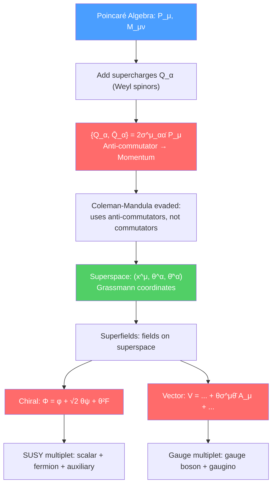

# 🔮 SUSY Algebra and Superspace

> [!abstract] TL;DR
> Supersymmetry extends the Poincaré algebra by adding fermionic generators (supercharges $Q_\alpha$) satisfying the anti-commutation relation $\{Q_\alpha, \bar{Q}_{\dot{\alpha}}\} = 2\sigma^\mu_{\alpha\dot{\alpha}}P_\mu$. This is the unique consistent extension of the spacetime symmetry algebra (Coleman-Mandula theorem is evaded because SUSY uses anti-commutators). Superspace extends ordinary spacetime $(x^\mu)$ with Grassmann coordinates $(\theta^\alpha, \bar{\theta}^{\dot{\alpha}})$; fields on superspace — called superfields — encode an entire SUSY multiplet in one object. The key tool is the chiral superfield $\Phi = \phi + \sqrt{2}\theta\psi + \theta^2 F$, which packages a complex scalar, a Weyl fermion, and an auxiliary field.

## Intuition — analogy FIRST

Ordinary spacetime translations are generated by the momentum $P^\mu$: moving in the $x$ direction means acting with $e^{iaP}$. SUSY adds a "fermionic direction" to spacetime. Just as translations in $x^\mu$ commute ($[P^\mu, P^\nu] = 0$), the supercharges $Q_\alpha$ anti-commute among themselves ($\{Q_\alpha, Q_\beta\} = 0$) but their mixed anti-commutator gives the momentum: $\{Q, \bar{Q}\} \sim P$.

Think of it this way: doing a SUSY transformation twice in different spinor directions lands you at a different spacetime point. SUSY "squares" to a translation. This is why SUSY fundamentally connects to gravity when made local (supergravity).

Superspace is the extension that makes this geometric: just as a spinor field $\psi(x)$ is a function of spacetime, a superfield $\Phi(x, \theta, \bar\theta)$ is a function of superspace. Taylor-expanding in $\theta$ (which terminates because $\theta^2 = 0$ for Grassmann numbers) gives a finite collection of ordinary fields — the SUSY multiplet.

---

## How It Works

---

## Key Concepts / Details

### Undergraduate Level

**The Hierarchy Problem — Why SUSY?**

The Higgs boson mass receives quadratic quantum corrections from every massive particle it couples to:
$$\delta m_H^2 \sim \frac{g^2}{16\pi^2}\Lambda^2$$

where $\Lambda$ is the UV cutoff (Planck scale $\sim 10^{19}$ GeV). Physical $m_H = 125$ GeV requires cancellation to 1 part in $10^{32}$ — extreme fine-tuning. SUSY solves this: every boson loop contributes $+\delta m_H^2$, every fermion loop contributes $-\delta m_H^2$ (from the fermion sign in the path integral). If each boson has a fermionic superpartner with the same mass and coupling, the quadratic divergences cancel exactly.

**The SUSY Algebra**

The Poincaré algebra is extended by adding spinorial generators $Q_\alpha$ (Weyl spinor, $\alpha = 1,2$) and $\bar{Q}_{\dot{\alpha}}$ (conjugate):

$$\{Q_\alpha, \bar{Q}_{\dot{\alpha}}\} = 2\sigma^\mu_{\alpha\dot{\alpha}}P_\mu$$
$$\{Q_\alpha, Q_\beta\} = 0, \qquad \{\bar{Q}_{\dot{\alpha}}, \bar{Q}_{\dot{\beta}}\} = 0$$
$$[Q_\alpha, P^\mu] = 0, \qquad [\bar{Q}_{\dot{\alpha}}, P^\mu] = 0$$

Here $\sigma^\mu = (\mathbf{1}, \vec{\sigma})$ are the Pauli matrices extended with the identity. The key relation says: doing two SUSY transformations gives a spacetime translation. SUSY is "the square root of translations."

**SUSY Multiplets**

In unbroken SUSY, all particles in a multiplet have the same mass. The basic $\mathcal{N}=1$ multiplets are:

| Multiplet | Bosons | Fermions | Example |
|-----------|--------|----------|---------|
| Chiral | $\phi$ (complex scalar) | $\psi$ (Weyl fermion) | Matter (quarks, leptons, Higgs) |
| Vector | $A_\mu$ (gauge boson) | $\lambda$ (Weyl gaugino) | Gauge sector (gluino, wino, bino) |
| Gravity | $g_{\mu\nu}$ (graviton) | $\psi_\mu$ (gravitino) | Supergravity |

**Why Superpartners?**

The Coleman-Mandula theorem (1967) proved that the most general symmetry of the S-matrix combining internal symmetries with Poincaré is their direct product — no mixing. SUSY evades this via the Haag-Łopuszański-Sohnius theorem: if you allow graded (super) Lie algebras with anti-commutators, SUSY is the unique extension.

### Graduate Level

**Superspace**

Extend spacetime to superspace by adding Grassmann-valued coordinates $\theta^\alpha$ and $\bar\theta^{\dot\alpha}$:
$$\text{Superspace:} \quad (x^\mu,\,\theta^\alpha,\,\bar\theta^{\dot\alpha})$$

Grassmann variables satisfy $\theta^\alpha\theta^\beta = -\theta^\beta\theta^\alpha$, so $(\theta^\alpha)^2 = 0$. Taylor expansion in $\theta$ terminates:
$$\Phi(x,\theta,\bar\theta) = \phi(x) + \sqrt{2}\theta\psi(x) + \theta\theta F(x) + \text{(terms with $\bar\theta$, $\partial_\mu$)}$$

**Chiral Superfield**

A chiral superfield satisfies $\bar{D}_{\dot\alpha}\Phi = 0$ (where $\bar{D}$ is the supercovariant derivative). In terms of $y^\mu = x^\mu + i\theta\sigma^\mu\bar\theta$:
$$\Phi(y,\theta) = \phi(y) + \sqrt{2}\theta^\alpha\psi_\alpha(y) + \theta^2 F(y)$$

- $\phi$: complex scalar (the physical matter scalar)
- $\psi_\alpha$: Weyl spinor (the fermionic partner)
- $F$: auxiliary field (no kinetic term; eliminates via equations of motion $F = -\partial W/\partial\phi$)

Under a SUSY transformation with parameter $\xi$:
$$\delta\phi = \sqrt{2}\xi\psi, \quad \delta\psi = \sqrt{2}\xi F + i\sqrt{2}\sigma^\mu\bar\xi\partial_\mu\phi, \quad \delta F = i\sqrt{2}\bar\xi\bar\sigma^\mu\partial_\mu\psi$$

**Vector Superfield**

A vector superfield satisfies $V = V^\dagger$ (reality). In Wess-Zumino gauge:
$$V = -\theta\sigma^\mu\bar\theta A_\mu + i\theta^2\bar\theta\bar\lambda - i\bar\theta^2\theta\lambda + \frac{1}{2}\theta^2\bar\theta^2 D$$

- $A_\mu$: gauge boson
- $\lambda$: gaugino (Weyl fermion superpartner)
- $D$: auxiliary field

The gauge field strength superfield $W_\alpha = -\frac{1}{4}\bar{D}^2 D_\alpha V$ gives the SUSY-invariant kinetic term $\int d^2\theta\,W^\alpha W_\alpha + \text{h.c.}$

**Extended SUSY**

$\mathcal{N}=2$ SUSY has two supercharges $Q^i_\alpha$ ($i=1,2$). Multiplets: vector multiplet (gauge boson + two gauginos + one complex scalar), hypermultiplet (two complex scalars + two Weyl fermions). Seiberg-Witten theory provides an exact solution of the $\mathcal{N}=2$ low-energy effective action.

$\mathcal{N}=4$ SUSY (maximal for renormalizable theories in 4D) has four supercharges. The $\mathcal{N}=4$ SYM theory is finite (no UV divergences at all!) and has an exact S-duality symmetry $g \to 4\pi/g$. It plays a central role in AdS/CFT.

**Off-Shell vs On-Shell**

Off-shell SUSY (superspace formulation): SUSY algebra closes without using equations of motion. Requires auxiliary fields ($F$, $D$). On-shell SUSY: algebra closes only on solutions; auxiliary fields eliminated, fermion/boson degrees of freedom match.

---

## Real-World Notes

- **LHC non-observation:** No superpartners found up to $m_{\tilde{g}} \gtrsim 2.3$ TeV, $m_{\tilde{q}} \gtrsim 1.8$ TeV. This pushes "natural" SUSY (stops $\lesssim$ TeV) into tension, but does not rule out SUSY with heavier spectrum.
- **$\mathcal{N}=4$ SYM at the LHC:** Although not directly observable, $\mathcal{N}=4$ SYM is the "hydrogen atom" of SUSY gauge theories — exact results calibrate perturbation theory methods used in real QCD calculations.
- **Twistor string theory:** Witten (2003) showed $\mathcal{N}=4$ SYM scattering amplitudes can be computed using twistor space, leading to the BCFW recursion relations that revolutionized perturbative QCD.

---

## Common Pitfalls

- **$\theta$ coordinates are not spacetime directions.** Superspace coordinates $\theta^\alpha$ are Grassmann-valued spinors, not real numbers. The Taylor expansion terminates at $\theta^2$ because $\theta^\alpha\theta^\beta = -\theta^\beta\theta^\alpha$ implies $(\theta^\alpha)^2 = 0$.
- **$F$ is not a dynamical field.** The auxiliary field $F$ has no kinetic term — it appears quadratically in the action and is eliminated algebraically. Its equation of motion is $F_i = -\partial W/\partial \phi^i$.
- **Unbroken SUSY predicts degenerate masses,** which is clearly wrong in nature. The absence of selectrons at the electron mass is evidence for SUSY breaking, not against SUSY itself.
- **$\mathcal{N}=1$ SUSY in 4D is special:** higher $\mathcal{N}$ is more constrained and cannot accommodate the chiral fermion content of the SM, so phenomenologically relevant SUSY is $\mathcal{N}=1$.

---

## Related Concepts

- [[SUSY_Lagrangians]] — Constructing SUSY-invariant actions from superfields
- [[SUSY_Breaking]] — Mechanisms for spontaneous SUSY breaking
- [[Beyond_Standard_Model]] — SUSY as a solution to the hierarchy problem
- [[Lie_Groups_and_Lie_Algebras]] — Lie superalgebras extend the SUSY algebra
- [[Intro_to_Quantum_Field_Theory]] — QFT prerequisite: spinors, path integrals, gauge theories
- [[_MOC_SUSY_Supergravity|↑ Section MOC]]

---

## Review Questions

1. **(Undergraduate)** State the Coleman-Mandula theorem. How does SUSY evade it? Write out the SUSY anti-commutation relation $\{Q_\alpha, \bar{Q}_{\dot\alpha}\}$ and explain physically what it means.
2. **(Undergraduate)** List the component fields of a chiral superfield. What is the role of the auxiliary field $F$? How many bosonic vs fermionic degrees of freedom does the multiplet contain (on-shell)?
3. **(Graduate)** Starting from the chiral superfield $\Phi(y,\theta) = \phi + \sqrt{2}\theta\psi + \theta^2 F$, derive the SUSY transformation laws $\delta\phi$, $\delta\psi$, $\delta F$ by acting with $\delta = \xi^\alpha Q_\alpha + \bar\xi_{\dot\alpha}\bar Q^{\dot\alpha}$.
4. **(Graduate)** Explain why $\mathcal{N}=4$ SYM is UV-finite. What is its $\beta$-function? How does S-duality act on its coupling constant?

---

## Sources

- Wess & Bagger, *Supersymmetry and Supergravity* (2nd ed., Princeton, 1992) — the canonical reference
- Martin, "A Supersymmetry Primer," arXiv:hep-ph/9709356 — comprehensive pedagogical review
- Aitchison, *Supersymmetry in Particle Physics* (Cambridge, 2007) — accessible introduction
- Terning, *Modern Supersymmetry* (Oxford, 2009) — graduate level with dualities
- Weinberg, *The Quantum Theory of Fields, Vol. III: Supersymmetry* (Cambridge, 2000)

#physics #SUSY #superspace #superfields #supersymmetry-algebra #hierarchy-problem
