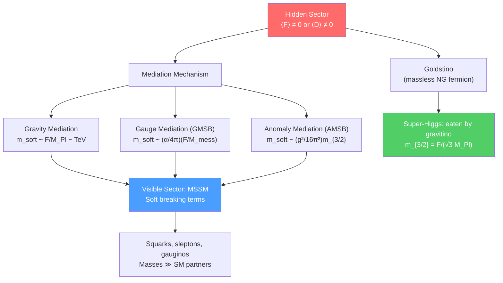

# 🔮 SUSY Breaking

> [!abstract] TL;DR
> SUSY must be broken in nature because no sparticles with the same mass as SM particles have been observed. Spontaneous SUSY breaking requires $\langle F\rangle \neq 0$ or $\langle D\rangle \neq 0$, and always produces a massless Nambu-Goldstone fermion — the **Goldstino**. In supergravity, the Goldstino is eaten by the gravitino (super-Higgs mechanism), which acquires mass $m_{3/2} = F/(\sqrt{3}M_{Pl})$. The key mediation mechanisms for transmitting SUSY breaking from a "hidden sector" to the visible MSSM sector are: **gravity mediation** ($m_{soft} \sim F/M_{Pl}$), **gauge mediation** ($m_{soft} \sim (\alpha/4\pi)(F/M_{mess})$), and **anomaly mediation** (AMSB, $m_{soft} \sim \frac{g^2}{16\pi^2}m_{3/2}$). "Soft" breaking terms preserve technical naturalness.

## Intuition — analogy FIRST

SUSY breaking is analogous to the Higgs mechanism for electroweak symmetry. In the Higgs mechanism, the ground state (Higgs vacuum) does not respect the $\text{SU}(2)\times\text{U}(1)$ symmetry even though the Lagrangian does — this is spontaneous symmetry breaking. Just as electroweak breaking generates gauge boson masses, SUSY breaking generates sparticle mass splittings.

The "hidden sector + mediation" picture is like a factory (hidden sector) that manufactures a product (SUSY-breaking vacuum energy $F$), which is then shipped via a courier service (the mediation mechanism) to stores (the visible sector/MSSM). The different couriers (gravity, gauge interactions, anomaly) determine the pattern of prices (soft masses) in the stores.

---

## How It Works

---

## Key Concepts / Details

### Undergraduate Level

**Why SUSY Must Be Broken**

In unbroken SUSY, every SM particle has a superpartner with identical mass. The selectron would have $m_{\tilde{e}} = m_e = 0.511$ MeV — but no such particle has ever been observed (LHC excludes sleptons below $\sim 700$ GeV). Therefore SUSY must be broken spontaneously, splitting the masses within each multiplet.

**F-term Breaking**

The vacuum energy is $V = \sum_i|F_i|^2 + \frac{1}{2}\sum_a D_a^2$. SUSY is unbroken iff $F_i = \langle\partial W/\partial\phi^i\rangle = 0$ for all $i$ (and all $D_a = 0$). SUSY is spontaneously broken iff there is no field configuration satisfying all these equations simultaneously — i.e., there is no SUSY vacuum.

**O'Raifeartaigh Model (1975)**

The first example of spontaneous F-term SUSY breaking. Superpotential:
$$W = \lambda X(A^2 - m^2) + \mu BY$$

where $X, A, B, Y$ are chiral superfields. The F-term equations:
$$F_X^* = \lambda(A^2 - m^2) = 0, \quad F_A^* = 2\lambda XA = 0, \quad F_B^* = \mu Y = 0, \quad F_Y^* = \mu B = 0$$

have no simultaneous solution (if $F_X = 0$ then $A = \pm m$, but then $F_A = 0$ requires $X = 0$, but then $F_X \neq 0$). So SUSY is necessarily broken, with $V_{min} = \lambda^2 m^4 > 0$.

**The Goldstino**

Broken SUSY (a fermionic symmetry) gives a massless Nambu-Goldstone fermion: the **Goldstino** $\tilde{G}$. In the O'Raifeartaigh model, the Goldstino is the fermionic component of $X$. It is an exact massless fermion in the global SUSY limit.

The Goldstino couples to matter with strength $\propto 1/F$ — extremely weakly for large $F$.

**Soft SUSY-Breaking Terms**

We cannot know the exact SUSY-breaking sector from first principles, so we parameterize our ignorance by adding "soft" SUSY-breaking terms to the MSSM Lagrangian by hand:
$$\mathcal{L}_{soft} = -\tilde{m}^2_{ij}\phi^{*i}\phi_j - \frac{1}{2}M_a\lambda^a\lambda^a - A_{ijk}\phi^i\phi^j\phi^k + \text{h.c.}$$

- $\tilde{m}^2_{ij}$: soft scalar (squark, slepton, Higgs) masses
- $M_a$: gaugino masses ($M_1, M_2, M_3$ for bino, wino, gluino)
- $A_{ijk}$: trilinear scalar couplings (A-terms)
- $B\mu$: bilinear Higgs mixing term

These terms are "soft" because they do not reintroduce quadratic divergences to the Higgs mass — technically natural SUSY breaking.

### Graduate Level

**The Super-Higgs Mechanism**

When SUSY is embedded in supergravity (local SUSY), the Goldstino is eaten by the gravitino $\psi_\mu$ (the spin-3/2 superpartner of the graviton) via the super-Higgs mechanism, in exact analogy with the Higgs mechanism where the Goldstone boson is eaten by the $W^\pm$.

The gravitino acquires mass:
$$m_{3/2} = \frac{F}{\sqrt{3}M_{Pl}} = \frac{e^{K/2M_{Pl}^2}|W|}{M_{Pl}^2}$$

where $M_{Pl} = 2.4\times10^{18}$ GeV is the reduced Planck mass. The gravitino is the LSP in many gauge-mediation scenarios.

**Gravity-Mediated SUSY Breaking (mSUGRA/CMSSM)**

SUSY breaking in the hidden sector ($F \neq 0$) is transmitted to the visible sector by Planck-scale-suppressed operators:
$$\mathcal{L} \supset \frac{F}{M_{Pl}}\bar\psi\psi + \frac{F^*}{M_{Pl}^2}|\phi|^2 + \ldots$$

leading to:
$$m_{soft} \sim \frac{F}{M_{Pl}} \sim m_{3/2}$$

For $m_{soft} \sim 1$ TeV, we need $F \sim 10^{11}$ GeV$^2$ (or $\sqrt{F} \sim 10^{10}$ GeV).

The minimal supergravity (mSUGRA) or constrained MSSM (CMSSM) assumes universal scalar mass $m_0$, universal gaugino mass $m_{1/2}$, and universal A-term $A_0$ at the GUT scale — reducing 126 MSSM parameters to 5: $(m_0, m_{1/2}, A_0, \tan\beta, \text{sgn}(\mu))$.

**Gauge-Mediated SUSY Breaking (GMSB)**

SUSY breaking is transmitted by ordinary gauge interactions through "messenger" fields $\Phi_M$ at mass scale $M_{mess}$ (messenger mass). Soft masses generated at one loop (gaugino) and two loops (scalars):
$$M_a \sim \frac{\alpha_a}{4\pi}\frac{F}{M_{mess}}, \qquad \tilde{m}^2 \sim \left(\frac{\alpha_a}{4\pi}\right)^2\frac{|F|^2}{M_{mess}^2}$$

Advantages: automatic flavor universality (gauge interactions are flavor-blind → no SUSY FCNC problem), gravitino is LSP with mass $m_{3/2} = F/(\sqrt{3}M_{Pl}) \ll M_{soft}$.

**Anomaly-Mediated SUSY Breaking (AMSB)**

Even in the absence of direct couplings between the hidden and visible sectors, the super-Weyl anomaly of conformal supergravity generates soft masses at loop level:
$$M_a = \frac{g_a^2}{16\pi^2}b_a m_{3/2}, \qquad \tilde{m}^2 = -\frac{1}{4}\left(\frac{\partial\gamma}{\partial g}\beta_g + \frac{\partial\gamma}{\partial y}\beta_y\right)m_{3/2}^2$$

where $b_a$ is the one-loop $\beta$-function coefficient and $\gamma$ is the anomalous dimension. AMSB gives a sequestered (flavor-safe) spectrum, but typically generates tachyonic sleptons — requiring modifications (e.g., deflected AMSB).

**The $\mu$ Problem**

The MSSM superpotential contains $\mu H_u H_d$ where $\mu$ is a dimensionful parameter. Phenomenology requires $\mu \sim m_{EW} \sim 100$ GeV. But $\mu$ is a SUSY-preserving parameter (appears in $W$), so why is it of order $m_{soft}$ rather than $M_{Pl}$?

Solutions:
- **Giudice-Masiero mechanism:** $\mu$ generated from Kähler potential $\delta K = cH_uH_d/M_{Pl} + \text{h.c.}$, giving $\mu = cF^*/M_{Pl} \sim m_{3/2}$ after SUGRA breaking.
- **NMSSM (Next-to-Minimal SSM):** Add singlet $S$ with $W \supset \lambda SH_uH_d$; $\mu_{eff} = \lambda\langle S\rangle$ generated dynamically when $S$ gets a VEV.

---

## Real-World Notes

- **LHC constraints on soft masses:** Gluino $m_{\tilde{g}} > 2.3$ TeV (ATLAS/CMS Run 3), squarks $m_{\tilde{q}} > 1.8$ TeV. Gaugino sector: charginos/neutralinos excluded below $\sim 600$ GeV in direct decays to $Z/h$.
- **Gravitino cosmology:** If $m_{3/2} < 1$ eV, the gravitino is the LSP and cosmologically stable. If $m_{3/2} \sim$ GeV–TeV, gravitino abundance from thermal production can overclose the universe (gravitino problem) — constraining the reheating temperature after inflation.
- **Fine-tuning vs. naturalness:** The "little hierarchy problem" — with stops now $\gtrsim 1$ TeV at LHC, the one-loop correction to $m_H^2$ is $\delta m_H^2 \sim \frac{3y_t^2}{8\pi^2}m_{\tilde{t}}^2\log(\Lambda/m_{\tilde{t}}) \sim (500 \text{ GeV})^2$ for $m_{\tilde{t}} \sim 1$ TeV — still requires $\sim 10\%$ fine-tuning.

---

## Common Pitfalls

- **SUSY breaking $\neq$ explicit breaking.** Adding soft terms to the MSSM Lagrangian is a parameterization of our ignorance about the breaking sector, not an explicit breaking that would destroy the renormalizability or naturalness.
- **The Goldstino is massless only in global SUSY.** In SUGRA, it is eaten by the gravitino.
- **Gravity mediation does not automatically give flavor universality.** Planck-suppressed Kähler potential terms can be flavor-non-universal, generating dangerous FCNC — a problem gravity mediation must address (e.g., by assuming a special structure of $K$).
- **D-term breaking.** FI D-term breaking ($\xi D$ for $\text{U}(1)$) is possible but generically inconsistent with quantum gravity (Fayet-Iliopoulos problem). Most phenomenologically viable models use F-term breaking.

---

## Related Concepts

- [[SUSY_Lagrangians]] — The SUSY-invariant Lagrangian that is deformed by soft terms
- [[MSSM_and_Phenomenology]] — MSSM soft spectrum and LHC phenomenology
- [[Supergravity]] — Super-Higgs mechanism and SUGRA-mediated breaking
- [[SUSY_Algebra_and_Superspace]] — SUSY algebra underlying the breaking condition
- [[_MOC_SUSY_Supergravity|↑ Section MOC]]

---

## Review Questions

1. **(Undergraduate)** State the condition for spontaneous SUSY breaking in terms of F-terms and D-terms. Explain the O'Raifeartaigh model and show that it has no SUSY vacuum.
2. **(Undergraduate)** What are "soft" SUSY-breaking terms? List the three types and explain why they are called "soft" (i.e., why do they not reintroduce quadratic divergences?).
3. **(Graduate)** Derive the gravitino mass in supergravity in terms of $F$ and $M_{Pl}$. Explain the super-Higgs mechanism: how does the gravitino become massive, and what happens to the Goldstino?
4. **(Graduate)** Compare gravity mediation and gauge mediation in terms of: (a) parametric form of soft masses, (b) gravitino mass, (c) FCNC constraints, (d) LSP identity. Which is more predictive and why?

---

## Sources

- Martin, "A Supersymmetry Primer," arXiv:hep-ph/9709356, §5–7
- Intriligator & Seiberg, "Lectures on Supersymmetry Breaking," arXiv:hep-ph/0702069
- Giudice & Rattazzi, "Theories with Gauge-Mediated Supersymmetry Breaking," *Phys. Rep.* 322, 419 (2000), arXiv:hep-ph/9801271
- Nilles, "Supersymmetry, Supergravity and Particle Physics," *Phys. Rep.* 110, 1 (1984)
- Randall & Sundrum, "Out-of-this-world supersymmetry breaking," arXiv:hep-th/9811232 (AMSB)

#physics #SUSY-breaking #Goldstino #soft-terms #gravity-mediation #gauge-mediation #AMSB #mu-problem
