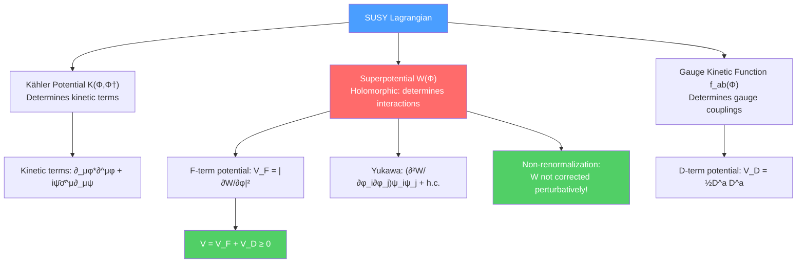

# 🔮 SUSY Lagrangians

> [!abstract] TL;DR
> Supersymmetric Lagrangians in $\mathcal{N}=1$ 4D are specified by two functions: the **Kähler potential** $K(\Phi^i, \Phi^{\dagger i})$, which determines kinetic terms, and the **superpotential** $W(\Phi^i)$, a holomorphic function that determines scalar interactions and Yukawa couplings. The F-term scalar potential is $V_F = |\partial W/\partial\phi^i|^2 \geq 0$. The key non-renormalization theorem states that $W$ receives no perturbative quantum corrections — it is protected by holomorphy. This enables exact results: Seiberg showed that non-perturbative corrections to $W$ are also controlled. The $\mathcal{N}=4$ SYM theory is UV-finite (zero $\beta$-function) and conformal.

## Intuition — analogy FIRST

In ordinary (non-SUSY) field theory, you can write down any Lagrangian you like — add any mass terms, quartic couplings, and counterterms the symmetries allow. In SUSY, however, the Lagrangian is essentially determined by two functions: the Kähler potential (like the kinetic energy) and the superpotential (like the potential energy), where the latter is a holomorphic function of the complex scalar fields. This holomorphy is extraordinarily restrictive.

Think of it this way: ordinary potential energy $V(\phi)$ is a real function of a real variable — it can have any shape. A holomorphic function $W(z)$ of a complex variable is far more constrained by the Cauchy-Riemann equations. The superpotential being holomorphic is what underlies the non-renormalization theorem: holomorphic functions cannot receive corrections from real diagrams.

---

## How It Works

---

## Key Concepts / Details

### Undergraduate Level

**The Wess-Zumino Model**

The simplest SUSY QFT: a single chiral superfield $\Phi$ containing a complex scalar $\phi$ and a Weyl fermion $\psi$. The action:
$$S = \int d^4x\left[\int d^4\theta\,\Phi^\dagger\Phi + \left(\int d^2\theta\,W(\Phi) + \text{h.c.}\right)\right]$$

The canonical Kähler potential $K = \Phi^\dagger\Phi$ gives standard kinetic terms. For superpotential:
$$W(\Phi) = \frac{1}{2}m\Phi^2 + \frac{1}{3}\lambda\Phi^3$$

this gives equal masses for $\phi$ and $\psi$: $m_\phi = m_\psi = m$. SUSY ensures boson-fermion mass degeneracy automatically.

**The Superpotential $W(\Phi^i)$**

The superpotential must be:
- Holomorphic (a function of $\Phi^i$, not $\Phi^{\dagger i}$)
- Gauge-invariant
- Renormalizable (at most cubic in $\Phi^i$ for renormalizable theories)

It determines:
- **Scalar potential:** $V_F = \sum_i|F_i|^2$, where $F_i = -\partial W/\partial\phi^i$
- **Yukawa couplings:** $\mathcal{L} \supset \frac{1}{2}\frac{\partial^2 W}{\partial\phi^i\partial\phi^j}\psi^i\psi^j + \text{h.c.}$
- **Scalar trilinear couplings:** from $\partial^3 W/\partial\phi^i\partial\phi^j\partial\phi^k$

**The Kähler Potential $K(\Phi^i, \Phi^{\dagger i})$**

A real function (not holomorphic) of both $\Phi^i$ and $\Phi^{\dagger i}$. The canonical choice $K = \Phi^{\dagger i}\Phi_i$ gives minimal (flat) Kähler metric $K_{i\bar{j}} = \delta_{i\bar{j}}$ and standard kinetic terms. Non-minimal Kähler potential appears in supergravity.

**F-terms and D-terms**

The full scalar potential in $\mathcal{N}=1$ global SUSY:
$$V = \sum_i\left|\frac{\partial W}{\partial\phi^i}\right|^2 + \frac{1}{2}\sum_a D^a D^a$$

where F-terms come from the superpotential and D-terms from the gauge sector:
$$D^a = g\phi^{*i}(T^a)_i{}^j\phi_j$$

This potential is always $\geq 0$. The vacuum energy $\langle V\rangle = 0$ iff $\langle F_i\rangle = 0$ and $\langle D^a\rangle = 0$ — i.e., SUSY is unbroken iff the potential vanishes.

### Graduate Level

**Non-Renormalization Theorem**

Seiberg's holomorphy argument: the superpotential $W$ is holomorphic in the chiral superfields and in the coupling constants (treated as background chiral superfields). Perturbation theory generates only integrals $\int d^4\theta(\ldots)$ (D-term corrections, allowed) but cannot generate $\int d^2\theta(\ldots)$ (F-term corrections, forbidden by holomorphy). Therefore:

> **$W$ receives no perturbative quantum corrections.** (Non-renormalization theorem)

Exact statement: The superpotential $W_{quantum} = W_{classical}$ to all orders in perturbation theory. The Kähler potential $K$ does receive corrections. Wavefunction renormalization enters through K.

**R-Symmetry**

An R-symmetry is a $\text{U}(1)$ symmetry that does not commute with SUSY: $[R, Q_\alpha] = -Q_\alpha$. Under R-symmetry, the superspace coordinate $\theta^\alpha \to e^{-i\alpha}\theta^\alpha$. The superpotential must have R-charge 2 (since $d^2\theta$ has R-charge $-2$, so $W$ must compensate).

R-symmetries constrain the superpotential and, if unbroken, forbid gaugino masses (so phenomenologically R-symmetry must be broken in the MSSM).

**$\mathcal{N}=4$ SYM**

The maximally supersymmetric gauge theory in 4D. Contains (in $\mathcal{N}=1$ language) one vector multiplet + three chiral multiplets, all in the adjoint representation. The action is:
$$\mathcal{L} = \text{Tr}\left(-\frac{1}{4}F^{\mu\nu}F_{\mu\nu} + |D_\mu\phi^i|^2 - \frac{g^2}{2}[\phi^i,\phi^j]^2 + \text{fermion terms}\right)$$

Key properties:
- Zero $\beta$-function to all orders: $\beta(g) = 0$ — conformal field theory
- No UV divergences: $\mathcal{N}=4$ SYM is UV-finite
- S-duality: $g \to 4\pi/g$ (Montonen-Olive duality)
- Crucial role in AdS/CFT: $\mathcal{N}=4$ SYM on boundary $\leftrightarrow$ IIB supergravity on $AdS_5\times S^5$

**Seiberg's Exact Superpotentials**

For $\mathcal{N}=1$ SQCD ($SU(N_c)$ with $N_f$ flavors), Seiberg determined the exact non-perturbative superpotential:

- $N_f < N_c - 1$: ADS superpotential $W = (N_c - N_f)\left(\frac{\Lambda^{3N_c-N_f}}{\det(Q\tilde{Q})}\right)^{1/(N_c-N_f)}$
- $N_f = N_c - 1$: quantum moduli space, modified constraint
- $N_f = N_c$: meson/baryon quantum moduli space
- $N_f = N_c + 1$: s-confining (no superpotential, confined spectrum)
- $\frac{3}{2}N_c \leq N_f \leq 3N_c$: Seiberg duality — IR equivalent to $SU(N_f - N_c)$ magnetic theory!

**Holomorphic Gauge Coupling**

In SUSY, the gauge kinetic term is:
$$\mathcal{L}_{gauge} = \frac{1}{4g^2}\int d^2\theta\,W^\alpha W_\alpha + \text{h.c.} = \frac{1}{4g^2}F_{\mu\nu}F^{\mu\nu} + \frac{\theta_{YM}}{32\pi^2}F_{\mu\nu}\tilde{F}^{\mu\nu} + \ldots$$

The holomorphic gauge coupling $\tau = \frac{\theta_{YM}}{2\pi} + \frac{4\pi i}{g^2}$ is a holomorphic function and transforms under S-duality as a modular parameter.

---

## Real-World Notes

- **MSSM superpotential:** $W_{MSSM} = y_u H_u Q u^c + y_d H_d Q d^c + y_e H_d L e^c + \mu H_u H_d$ — where $\mu$ is the Higgsino mass parameter. The $\mu$ problem is why $\mu \sim m_{EW}$ when it is a SUSY-preserving parameter.
- **Seiberg duality and QCD:** Seiberg duality gives a weakly-coupled dual description of strongly-coupled SQCD, analogous to what we'd love to have for real QCD. It is a controlled example of IR duality.
- **LHC bounds on soft terms:** The soft SUSY-breaking terms added to $\mathcal{L}_{MSSM}$ are constrained by LHC data; gaugino masses $M_{1,2,3}$ and scalar soft masses $\tilde{m}$ now exceed 1–2 TeV in most scenarios.

---

## Common Pitfalls

- **The Kähler potential is renormalized; the superpotential is not** (perturbatively). Don't confuse the two when counting quantum corrections.
- **D-terms are not zero in general.** The condition $\langle D^a\rangle = 0$ follows only from minimizing the potential; it is not automatic.
- **The non-renormalization theorem is perturbative.** Non-perturbative effects (instantons) can generate superpotential terms, as in the ADS superpotential.
- **R-symmetry is a symmetry of the action, not always of the vacuum.** R-symmetry breaking (spontaneous or explicit) is necessary for Majorana gaugino masses.

---

## Related Concepts

- [[SUSY_Algebra_and_Superspace]] — The algebraic framework and superfields underlying the Lagrangian
- [[SUSY_Breaking]] — Why and how the SUSY-invariant vacuum is not the physical vacuum
- [[MSSM_and_Phenomenology]] — The MSSM superpotential and its phenomenological consequences
- [[AdS_CFT_Correspondence]] — $\mathcal{N}=4$ SYM is the boundary CFT in AdS/CFT
- [[Conformal_Field_Theory]] — $\mathcal{N}=4$ SYM as an exact CFT
- [[_MOC_SUSY_Supergravity|↑ Section MOC]]

---

## Review Questions

1. **(Undergraduate)** Write the general $\mathcal{N}=1$ scalar potential in terms of F-terms and D-terms. Show that $V \geq 0$. What is the condition for unbroken SUSY?
2. **(Undergraduate)** For the Wess-Zumino model with $W = \frac{1}{2}m\Phi^2 + \frac{1}{3}\lambda\Phi^3$, find $F$ and derive the scalar potential $V(\phi)$.
3. **(Graduate)** State and prove the non-renormalization theorem for the superpotential using Seiberg's holomorphy argument. What role does treating coupling constants as spurion superfields play?
4. **(Graduate)** What is the Seiberg dual of $SU(N_c)$ SQCD with $N_f$ flavors in the range $N_c + 2 \leq N_f \leq \frac{3}{2}N_c$? What is the magnetic gauge group and matter content?

---

## Sources

- Wess & Bagger, *Supersymmetry and Supergravity* (Princeton, 1992)
- Seiberg, "Electric-magnetic duality, monopole condensation and confinement in $\mathcal{N}=2$ supersymmetric Yang-Mills theory," *Nucl. Phys. B* 426 (1994)
- Seiberg, "Electric-magnetic duality in supersymmetric nonabelian gauge theories," *Nucl. Phys. B* 435 (1995)
- Intriligator & Seiberg, "Lectures on SUSY breaking," arXiv:hep-ph/0702069
- Martin, "A Supersymmetry Primer," arXiv:hep-ph/9709356, §6–7

#physics #SUSY #superpotential #Kahler-potential #non-renormalization #Seiberg-duality #N4-SYM
