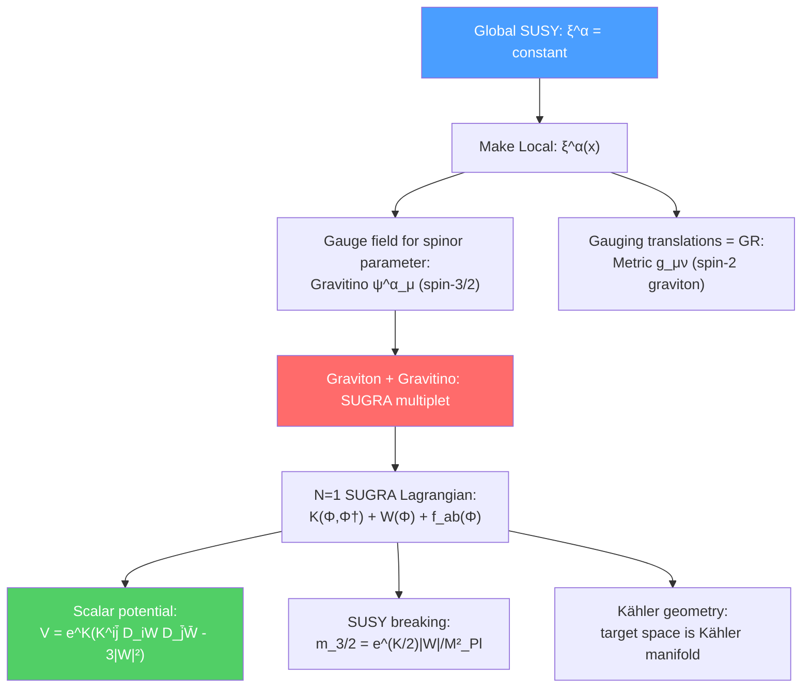

# 🔮 Supergravity

> [!abstract] TL;DR
> Supergravity (SUGRA) is obtained by making SUSY a local symmetry — the SUSY parameter $\xi^\alpha(x)$ becomes spacetime-dependent. Just as making global $\text{U}(1)$ local requires introducing a gauge field (photon), making global SUSY local requires a spin-3/2 gauge field — the **gravitino** $\psi_\mu^\alpha$ — together with the metric $g_{\mu\nu}$ (spin-2 graviton). The full $\mathcal{N}=1$ SUGRA action is specified by three functions: the Kähler potential $K$, the superpotential $W$, and the gauge kinetic function $f_{ab}$. The scalar potential becomes $V = e^K(K^{i\bar{j}}D_iWD_{\bar{j}}\bar{W} - 3|W|^2) + \frac{1}{2}D^aD_a$. $\mathcal{N}=8$ SUGRA (maximal, 4D) is conjectured to be UV-finite and is the low-energy limit of $\mathcal{N}=8$ string theory.

## Intuition — analogy FIRST

Global SUSY is like a global phase symmetry: $\psi \to e^{i\alpha}\psi$ with $\alpha$ constant everywhere. This is fine as an internal symmetry, but we know from general relativity that no symmetry can truly be global — spacetime is dynamical and curved. Making $\alpha \to \alpha(x)$ local requires a gauge field (the photon) to maintain gauge invariance.

Exactly the same logic applies to SUSY. Global SUSY has a constant Grassmann parameter $\xi^\alpha$. Making it local — $\xi^\alpha \to \xi^\alpha(x)$ — requires a new gauge field to maintain invariance. Since $\xi^\alpha$ is a spinor, the gauge field has one extra vector index: it is a spin-3/2 field $\psi_\mu^\alpha$, the gravitino. Moreover, because $\{Q, \bar{Q}\} \sim P$ and we are now gauging SUSY, we are also gauging translations — which is general relativity. **Local SUSY necessarily includes gravity.**

---

## How It Works

---

## Key Concepts / Details

### Undergraduate Level

**From Global to Local SUSY**

In global SUSY, the SUSY transformation parameter $\xi^\alpha$ is a constant spinor. Promoting it to a spacetime-dependent spinor $\xi^\alpha(x)$ is localization. The consequences:

1. A new gauge field $\psi_\mu^\alpha$ (gravitino) is required — it transforms as $\delta\psi_\mu = \partial_\mu\xi^\alpha + \ldots$
2. Because SUSY anti-commutators give $\{Q,\bar{Q}\} \sim P_\mu$ (momentum = translations), gauging SUSY gauges translations, which is general relativity — the graviton $g_{\mu\nu}$ is also required
3. The spin-2 graviton and spin-3/2 gravitino form the **SUGRA multiplet**

**The Vierbein (Frame Field)**

In curved spacetime, instead of the metric $g_{\mu\nu}$ directly, SUGRA uses the **vierbein** (or tetrad) $e^a_\mu$, which relates the curved coordinate frame to a locally flat (Lorentz) frame:
$$g_{\mu\nu} = e^a_\mu e^b_\nu \eta_{ab}$$

The vierbein is the "square root" of the metric. It is needed because spinors cannot be naturally defined on a general curved manifold without a local frame. The vierbein transforms under both diffeomorphisms (the $\mu$ index) and local Lorentz transformations (the $a$ index).

**The Gravitino**

The gravitino $\psi_\mu^\alpha$ is a spin-3/2 Rarita-Schwinger field. Key properties:
- In unbroken SUGRA: massless (like the photon in unbroken electromagnetism)
- After SUSY breaking (super-Higgs): acquires mass $m_{3/2} = e^{K/2M_{Pl}^2}|W|/M_{Pl}^2$
- For $\sqrt{F} \sim 10^{10}$ GeV: $m_{3/2} \sim F/(\sqrt{3}M_{Pl}) \sim 1$ TeV (gravity mediation)
- For $\sqrt{F} \sim 10^8$ GeV: $m_{3/2} \sim$ eV (gauge mediation — gravitino LSP)

**$\mathcal{N}=1$ SUGRA in Four Dimensions**

The theory is completely specified by three holomorphic functions:
- **Kähler potential** $K(\Phi^i, \Phi^{\dagger i})$: real function, determines sigma-model geometry
- **Superpotential** $W(\Phi^i)$: holomorphic, determines scalar potential and Yukawa couplings
- **Gauge kinetic function** $f_{ab}(\Phi^i)$: holomorphic, determines gauge coupling and gaugino masses

### Graduate Level

**The $\mathcal{N}=1$ SUGRA Scalar Potential**

Setting $M_{Pl} = 1$ (reduced Planck units), the scalar potential in $\mathcal{N}=1$ SUGRA is:
$$V = e^K\left(K^{i\bar{j}}D_iW D_{\bar{j}}\bar{W} - 3|W|^2\right) + \frac{1}{2}D^aD_a$$

where the **Kähler-covariant derivative** is:
$$D_iW = \frac{\partial W}{\partial\phi^i} + \frac{\partial K}{\partial\phi^i}W = W_i + K_iW$$

and $K^{i\bar{j}}$ is the inverse Kähler metric $K_{i\bar{j}} = \partial^2K/\partial\phi^i\partial\bar\phi^{\bar{j}}$.

Key difference from global SUSY: the $-3|W|^2$ term (a SUGRA correction). This means $V$ can be negative (anti-de Sitter vacua are allowed) — unlike global SUSY where $V \geq 0$ always.

The SUSY-breaking condition: $D_iW = 0$ for all $i$ AND $D^a = 0$. If $\langle D_iW\rangle \neq 0$ for some $i$, SUSY is broken with $F_i = e^{K/2}K^{i\bar{j}}D_{\bar{j}}\bar{W}$.

**No-Scale Models**

A special class of Kähler potentials where the $-3|W|^2$ term is cancelled by $K^{i\bar{j}}K_iK_{\bar{j}} = 3$:
$$K = -3\ln\left(T + \bar{T} - \sum_\alpha|\phi^\alpha|^2\right)$$

In no-scale models: $V_F = 0$ at the classical level for any value of $T$ (the modulus). The cosmological constant vanishes and the modulus is unfixed at tree level — modulus stabilization requires quantum corrections. No-scale Kähler potentials arise naturally from Kähler moduli in string compactifications.

**Kaluza-Klein Compactification**

SUGRA in higher dimensions reduces to 4D SUGRA upon compactification. For 11D SUGRA on a 7-manifold $M_7$:
$$\mathcal{N}_{4D} = \text{(number of covariantly constant spinors on $M_7$)} \times \frac{1}{2}$$

- $M_7 = T^7$ (7-torus): $\mathcal{N}_{4D} = 8$ (maximal)
- $M_7 = CY_3\times S^1$: $\mathcal{N}_{4D} = 2$
- $M_7 = G_2$ manifold (exceptional holonomy): $\mathcal{N}_{4D} = 1$

The Kaluza-Klein spectrum includes a tower of massive particles with masses $m_{KK} \sim 1/R$ where $R$ is the compactification radius.

**Extended Supergravity: $\mathcal{N}=8$ SUGRA**

The maximal supergravity in 4D has $\mathcal{N}=8$ (8 gravitinos, 56 vector fields, 70 real scalars, from dimensional reduction of 11D SUGRA on $T^7$). Properties:
- Unique theory (no free parameters in the kinetic terms)
- Global $E_{7(7)}$ symmetry (exceptional group) — duality symmetry
- Conjectured to be UV-finite to all loop orders (Bern, Dixon, Roiban, et al.) — surprising because naive power counting predicts divergences
- Low-energy limit of $\mathcal{N}=8$ string theory (M-theory on $T^7$)

If $\mathcal{N}=8$ SUGRA is UV-finite, it would be the first example of a consistent quantum theory of gravity (without string theory), though likely unrealistic phenomenologically.

**Connection to String Theory**

The low-energy limits of the five superstring theories and M-theory are all supergravity theories:

| Theory | Low-energy SUGRA | Dimension |
|--------|-----------------|-----------|
| Type IIA | $\mathcal{N}=(1,1)$ IIA SUGRA | 10D |
| Type IIB | $\mathcal{N}=(2,0)$ IIB SUGRA | 10D |
| Type I | $\mathcal{N}=1$ SUGRA + $SO(32)$ SYM | 10D |
| Heterotic $E_8\times E_8$ | $\mathcal{N}=1$ SUGRA + $E_8\times E_8$ SYM | 10D |
| M-theory | 11D SUGRA | 11D |

The 11D SUGRA (Cremmer-Julia-Scherk, 1978) is unique: no free parameters, no gauge group, just the metric, 3-form gauge field, and gravitino. This uniqueness is one reason M-theory is believed to be unique.

---

## Real-World Notes

- **SUGRA and cosmological constant:** The SUGRA scalar potential can have $\langle V\rangle < 0$ (AdS) or $\langle V\rangle > 0$ (dS). The observed $\Lambda \approx (2.3\times10^{-3}\text{eV})^4 > 0$ requires a de Sitter vacuum — notoriously difficult to achieve in a stable, controlled SUGRA/string setting (the KKLT debate).
- **Gravitino problem:** Gravitinos produced in the early universe can overclose it or disrupt BBN if $m_{3/2} \sim 100$ GeV–10 TeV. This constrains the reheating temperature after inflation: $T_{RH} \lesssim 10^9$–$10^{10}$ GeV for $m_{3/2} \sim 1$ TeV.
- **Swampland conjectures** place constraints on which SUGRA effective theories can arise from string theory (the "landscape" vs. the "swampland").

---

## Common Pitfalls

- **Gravitino is not the graviton.** The graviton is spin-2 ($g_{\mu\nu}$, bosonic), the gravitino is spin-3/2 ($\psi_\mu^\alpha$, fermionic). Both are in the SUGRA multiplet.
- **SUGRA does not predict $m_{3/2}$ without knowing $F$ and $K$.** The formula $m_{3/2} = e^{K/2}|W|/M_{Pl}^2$ requires knowledge of the vacuum expectation value of $W$.
- **The $-3|W|^2$ term in the SUGRA potential is crucial.** Forgetting it gives the wrong sign for the cosmological constant contribution. In global SUSY this term is absent.
- **$\mathcal{N}=8$ SUGRA is not phenomenologically realistic.** It has too much SUSY (all quarks/leptons would be in the same multiplet as the graviton), no chiral fermions, and no standard model gauge group.

---

## Related Concepts

- [[SUSY_Breaking]] — Super-Higgs mechanism and SUGRA-mediated soft masses
- [[SUSY_Algebra_and_Superspace]] — Global SUSY as the starting point for localization
- [[BPS_States_and_Dualities]] — SUGRA as the low-energy limit of string theory, BPS states
- [[Superstring_Theory]] — String theories reduce to SUGRA at low energy
- [[M_Theory_and_Dualities]] — 11D SUGRA as the low-energy limit of M-theory
- [[Differential_Geometry]] — Kähler geometry and Riemannian manifolds underlying SUGRA
- [[_MOC_SUSY_Supergravity|↑ Section MOC]]

---

## Review Questions

1. **(Undergraduate)** Explain why making SUSY local necessarily introduces both the gravitino and the graviton. What is the SUGRA multiplet?
2. **(Undergraduate)** What is the vierbein $e^a_\mu$? Why is it needed in supergravity rather than just the metric $g_{\mu\nu}$?
3. **(Graduate)** Write the $\mathcal{N}=1$ SUGRA scalar potential. What is the Kähler-covariant derivative $D_iW$? Compare the SUGRA potential to the global SUSY potential and identify the SUGRA corrections.
4. **(Graduate)** What is the low-energy limit of M-theory? Write the field content of 11-dimensional supergravity and explain how it gives rise to the five 10D superstring theories via compactification and duality.

---

## Sources

- Wess & Bagger, *Supersymmetry and Supergravity* (Princeton, 1992), Ch. XI–XII
- Cremmer, Julia & Scherk, "Supergravity theory in eleven dimensions," *Phys. Lett. B* 76, 409 (1978) — the original 11D SUGRA paper
- Freedman & Van Proeyen, *Supergravity* (Cambridge, 2012) — comprehensive modern reference
- Nilles, "Supersymmetry, Supergravity and Particle Physics," *Phys. Rep.* 110, 1 (1984)
- Becker, Becker & Schwarz, *String Theory and M-Theory: A Modern Introduction* (Cambridge, 2007), Ch. 8

#physics #supergravity #SUGRA #gravitino #vierbein #N8-SUGRA #Kahler-potential #super-Higgs
