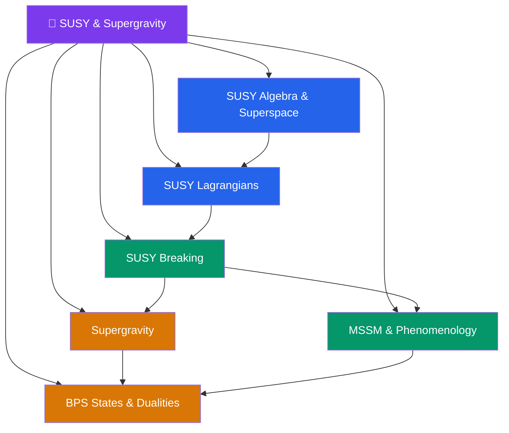

# 🔮 Supersymmetry & Supergravity — Section Map

> [!abstract] About This Section
> Supersymmetry (SUSY) is the unique extension of the Poincaré algebra that relates bosons and fermions. It solves the hierarchy problem, provides a dark matter candidate (the LSP), enables gauge coupling unification, and is the foundation of string theory. Supergravity (SUGRA) is the theory obtained by making SUSY a local symmetry — it necessarily includes gravity. This section covers the SUSY algebra and superspace formalism, SUSY Lagrangians, SUSY breaking mechanisms, the MSSM and its LHC phenomenology, $\mathcal{N}=1$ supergravity, and BPS states with the duality web connecting them.

## Section Architecture

## Notes in This Section

| Note | Core Topic | Level |
|------|-----------|-------|
| [[SUSY_Algebra_and_Superspace]] | Supercharges, Poincaré extension, superspace, superfields | UG → PhD |
| [[SUSY_Lagrangians]] | Wess-Zumino model, superpotential, Kähler potential, non-renormalization | UG → PhD |
| [[SUSY_Breaking]] | F/D-term breaking, O'Raifeartaigh, mediation mechanisms | UG → PhD |
| [[MSSM_and_Phenomenology]] | MSSM spectrum, R-parity, dark matter, LHC signatures | UG → PhD |
| [[Supergravity]] | Local SUSY, gravitino, SUGRA Lagrangian, Kaluza-Klein | UG → PhD |
| [[BPS_States_and_Dualities]] | BPS bound, Seiberg-Witten, S/T-duality | UG → PhD |

## Recommended Learning Path

1. [[SUSY_Algebra_and_Superspace]] — build the algebraic foundation and superspace language first
2. [[SUSY_Lagrangians]] — construct SUSY-invariant theories and learn holomorphy
3. [[SUSY_Breaking]] — understand why SUSY must be broken and how
4. [[MSSM_and_Phenomenology]] — the phenomenologically relevant model for LHC and cosmology
5. [[Supergravity]] — promote SUSY to a local symmetry, introduce gravity
6. [[BPS_States_and_Dualities]] — exact results and the duality web tying everything together

## Cross-Section Links

- [[Beyond_Standard_Model]] (Section 07) — SUSY motivation from the hierarchy problem; MSSM as the canonical BSM model
- [[Intro_to_Quantum_Field_Theory]] (Section 12) — QFT machinery prerequisite (path integrals, gauge theories, renormalization)
- [[_MOC_String_Theory]] (Section 14) — SUSY is a necessary ingredient of string theory; supergravity is its low-energy limit
- [[_MOC_Mathematical_Physics]] (Section 15) — Lie superalgebras, spinors, and differential geometry underlie the SUSY formalism
- [[_MOC_Physics_Master|↑ Physics Master MOC]]

#MOC #physics #SUSY #supergravity #section-moc
