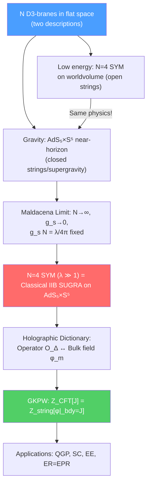

# 🌌 AdS/CFT Correspondence

> [!abstract] TL;DR
> The AdS/CFT correspondence (Maldacena, 1997) is the conjecture that **$\mathcal{N}=4$ $SU(N)$ Super Yang-Mills theory in 4D is exactly equivalent to Type IIB string theory on $AdS_5\times S^5$**. The two descriptions are dual: strong coupling ($\lambda = g_{YM}^2 N \gg 1$) in the CFT maps to weak coupling (classical supergravity) in the bulk, and vice versa. The holographic dictionary equates operators in the CFT with fields in the bulk, and CFT correlation functions with bulk S-matrix elements (GKPW prescription). Applications include: holographic QCD (strong-coupling QGP at RHIC/LHC), holographic superconductors, the Ryu-Takayanagi formula ($S_{EE} = A_{min}/4G_N$) for entanglement entropy, and the ER=EPR conjecture.

## Intuition — analogy FIRST

Imagine a snow globe. Inside the globe is a 3D world with all its physics. But all the information about this 3D world is encoded on the 2D surface of the globe — like a hologram. You can read off everything happening inside by examining the surface. This is holography: a quantum gravity theory in a $(d+1)$-dimensional spacetime is exactly equivalent to a quantum field theory (without gravity) on the $d$-dimensional boundary.

The deep reason: gravity has degrees of freedom that scale as area (Bekenstein-Hawking entropy $S \propto A$), not volume. A system with area-law entropy is like a lower-dimensional system. The boundary "knows" everything about the bulk, because the bulk entropy is bounded by boundary area.

AdS/CFT makes this precise for Anti-de Sitter spacetime: the bulk quantum gravity (string theory in $AdS_{d+1}$) = boundary CFT (in $d$ flat dimensions).

---

## How It Works

---

## Key Concepts / Details

### Undergraduate Level

**Two Descriptions of D3-Branes**

Take $N$ D3-branes in flat 10D spacetime. There are two equivalent descriptions:

**Open string description (low energy):** Open strings ending on the D3-branes give a $U(N)$ gauge theory. In the low-energy limit $E \ll 1/l_s$, this is $\mathcal{N}=4$ SYM with coupling $g_{YM}^2 = 4\pi g_s$. The bulk closed strings decouple.

**Closed string description (near-horizon geometry):** D3-branes source a curved geometry. The near-horizon limit of $N$ D3-branes gives the metric:
$$ds^2 = \frac{r^2}{L^2}\eta_{\mu\nu}dx^\mu dx^\nu + \frac{L^2}{r^2}dr^2 + L^2 d\Omega_5^2$$

This is $AdS_5\times S^5$ with radius $L^4 = 4\pi g_s N \alpha'^2$.

Both descriptions encode the same physics — they are two ways to look at the same object. Setting them equal gives the AdS/CFT correspondence.

**The Maldacena Conjecture**

$$\mathcal{N}=4 \text{ SYM (4D, gauge group } SU(N), \text{ coupling } g_{YM}) \quad \longleftrightarrow \quad \text{Type IIB string theory on } AdS_5\times S^5$$

Dictionary:
- $N$ (rank of gauge group) ↔ $N$ (number of D3-branes) ↔ $L^4/\alpha'^2 = 4\pi g_s N$
- $g_{YM}^2 = 4\pi g_s$
- $\lambda = g_{YM}^2 N = 4\pi g_s N$ (t'Hooft coupling)

**The t'Hooft Limit:**
$N\to\infty$, $\lambda = g_{YM}^2 N$ fixed (planar diagrams dominate — string topology = genus expansion).

**Strong-Weak Duality:**
- $\lambda \gg 1$ (CFT strongly coupled) ↔ small string curvature $L/l_s \gg 1$ (classical SUGRA valid)
- $\lambda \ll 1$ (CFT weakly coupled) ↔ $L/l_s \ll 1$ (strongly curved, full string theory needed)

This is the power and the challenge: AdS/CFT is most tractable when the two descriptions are in opposite coupling regimes.

**AdS Spacetime**

Anti-de Sitter space $AdS_{d+1}$ has constant negative curvature. In Poincaré coordinates:
$$ds^2 = \frac{L^2}{z^2}\left(-dt^2 + d\vec{x}^2 + dz^2\right), \quad z > 0$$

The boundary is at $z\to 0$ (UV in field theory); the bulk extends to $z\to\infty$ (IR). The isometry group of $AdS_5$ is $SO(4,2)$, which is the same as the conformal group in 3+1 dimensions — confirming that the boundary theory is a CFT.

### Graduate Level

**GKPW Prescription (Holographic Dictionary)**

Gubser-Klebanov-Polyakov (1998) and Witten (1998): the generating functional of CFT correlation functions equals the string theory partition function with prescribed boundary conditions:
$$Z_{CFT}[J] = \left\langle e^{\int d^4x\,J(x)\mathcal{O}(x)}\right\rangle = Z_{string}\left[\phi\big|_{\partial AdS} = J\right]$$

In the classical SUGRA approximation (large $N$, large $\lambda$):
$$Z_{CFT}[J] \approx e^{-S_{SUGRA}[\phi_{cl}]}$$

where $\phi_{cl}$ is the classical solution with boundary value $J$. CFT $n$-point functions:
$$\langle\mathcal{O}(x_1)\cdots\mathcal{O}(x_n)\rangle = \frac{\delta^n}{\delta J(x_1)\cdots\delta J(x_n)}\ln Z_{CFT}[J]\bigg|_{J=0}$$

**Holographic Dictionary: Operator $\leftrightarrow$ Bulk Field**

For a scalar field $\phi$ in $AdS_{d+1}$ with mass $m$, the near-boundary behavior:
$$\phi(z,x) \sim z^{d-\Delta}J(x) + z^\Delta\langle\mathcal{O}\rangle$$

where the conformal dimension $\Delta$ satisfies:
$$m^2 L^2 = \Delta(\Delta - d)$$

(BF bound: $m^2 L^2 \geq -d^2/4$ — negative mass squared is allowed in AdS!)

Key entries in the dictionary:

| CFT Operator | Bulk Field | Dimension |
|-------------|-----------|-----------|
| Stress tensor $T^{\mu\nu}$ | Graviton $g_{\mu\nu}$ | $\Delta = d$ |
| $\mathcal{N}=4$ SYM scalars $\mathcal{O}_k$ | Kaluza-Klein scalars from $S^5$ | $\Delta = k$ |
| Global current $J^\mu$ | Bulk gauge field $A_\mu$ | $\Delta = d-1$ |
| Deformation operator | Boundary condition for $\phi$ | source $J$ |

**Holographic Renormalization**

UV divergences in the CFT correspond to near-boundary ($z\to 0$) divergences in the bulk. Holographic renormalization: add counterterms to the bulk action, compute the regularized bulk action. The result reproduces the CFT renormalization group and Weyl anomaly.

**Applications of AdS/CFT**

**1. Holographic QCD (AdS/QCD)**

The quark-gluon plasma (QGP) produced at RHIC and LHC is strongly coupled at temperatures just above $T_c \approx 155$ MeV. Weak-coupling perturbation theory fails. AdS/CFT gives:
$$\frac{\eta}{s} = \frac{\hbar}{4\pi k_B}$$

(shear viscosity to entropy ratio = $1/4\pi$ in natural units) — the **KSS bound**. RHIC measurements give $\eta/s \approx 1/(4\pi)$ to $(2-3)/(4\pi)$ — remarkably close! This was the first "experimental test" of AdS/CFT.

**2. Holographic Superconductors**

Gubser (2008): A charged scalar field in $AdS_4$ condenses at low temperatures (Bose-Einstein condensation in AdS), dual to $s$-wave superconductivity on the boundary. The phase transition, condensate, and gap match BCS theory qualitatively. This gives a toy model of non-BCS (high-$T_c$) superconductors via holography.

**3. Ryu-Takayanagi Formula (Holographic Entanglement Entropy)**

For a subsystem $A$ in the CFT, the entanglement entropy:
$$S_{EE}(A) = \frac{\text{Area}(\gamma_A)}{4G_N}$$

where $\gamma_A$ is the minimal-area surface in the bulk $AdS$ homologous to $A$. This generalizes the Bekenstein-Hawking formula to entanglement entropy of subregions. It proves that entanglement entropy in the CFT equals geometry in the bulk — a profound connection.

**4. ER = EPR (Maldacena-Susskind)**

Maldacena's eternal AdS black hole (2001): two copies of the CFT in a thermofield double state $|\psi\rangle = \sum_n e^{-\beta E_n/2}|n\rangle_L|n\rangle_R$ are dual to an eternal (two-sided) AdS black hole with a wormhole (Einstein-Rosen bridge) connecting the two exterior regions.

Maldacena-Susskind (2013): ER = EPR conjecture — an Einstein-Rosen bridge (wormhole) is the geometric dual of Einstein-Podolsky-Rosen entanglement. Entanglement between quantum systems = geometric connectivity in the bulk.

---

## Real-World Notes

- **Precision tests:** Integrability of $\mathcal{N}=4$ SYM allows exact computation of anomalous dimensions (Bethe ansatz). These match string theory predictions for scaling dimensions — one of the most precise non-trivial checks of AdS/CFT.
- **AdS/CMT:** Condensed matter applications of holography (holographic metals, non-Fermi liquids, strange metal phase) are a major research direction. The strange metal phase of cuprate superconductors may be described by a holographic dual.
- **Information paradox:** The ER=EPR and island formula developments use AdS/CFT to argue for unitarity of black hole evaporation — the Page curve has been reproduced using quantum extremal surfaces in the bulk.

---

## Common Pitfalls

- **AdS/CFT is a conjecture, not a theorem.** There are overwhelming checks, but no mathematical proof. The hardest regime to check is when both sides are strongly coupled simultaneously.
- **The correspondence relates different limits.** At $\lambda\gg 1$, CFT is strongly coupled and SUGRA is the valid bulk description. At $\lambda\ll 1$, CFT is weakly coupled and the full string theory is needed — which is hard to compute.
- **The boundary CFT is not in AdS.** The CFT lives on flat Minkowski spacetime (or more precisely, on the conformal boundary of AdS, which is conformally equivalent to flat space).
- **Holographic entanglement entropy counts bulk area,** not bulk volume. This is consistent with the holographic principle: information is stored on surfaces, not in volumes.

---

## Related Concepts

- [[D_Branes]] — $N$ D3-branes → $AdS_5\times S^5$ near-horizon → AdS/CFT
- [[M_Theory_and_Dualities]] — AdS/CFT is a consequence of string theory; the bulk is Type IIB
- [[Conformal_Field_Theory]] — The boundary theory is a CFT; Virasoro algebra, OPE, bootstrap
- [[String_Cosmology_and_Landscape]] — AdS vacua are common in string landscape; de Sitter is harder
- [[Integrable_Systems]] — $\mathcal{N}=4$ SYM is integrable in the planar limit; Bethe ansatz
- [[Topology_in_Physics]] — Entanglement entropy and topological aspects of holography
- [[_MOC_String_Theory|↑ Section MOC]]

---

## Review Questions

1. **(Undergraduate)** State the Maldacena conjecture. What is the gauge theory? What is the bulk theory? What are the parameters on each side and how are they related?
2. **(Undergraduate)** Explain the holographic dictionary. What is a "source" $J$ in field theory terms, and what is its bulk interpretation? What is the KSS bound $\eta/s = 1/4\pi$, and why is it remarkable?
3. **(Graduate)** State the GKPW prescription. How does one compute a 2-point function of a scalar operator $\mathcal{O}_\Delta$ using the bulk-to-boundary propagator?
4. **(Graduate)** State the Ryu-Takayanagi formula. Verify it for the vacuum state of a 2D CFT: the entanglement entropy of an interval $[-\ell/2, \ell/2]$ is $S = \frac{c}{3}\ln(\ell/\epsilon)$ where $c$ is the central charge. Show this arises from the geodesic length in $AdS_3$.

---

## Sources

- Maldacena, "The large $N$ limit of superconformal field theories and supergravity," *Int. J. Theor. Phys.* 38, 1113 (1999), arXiv:hep-th/9711200 — the original paper (17,000+ citations)
- Gubser, Klebanov & Polyakov, "Gauge theory correlators from non-critical string theory," *Phys. Lett. B* 428, 105 (1998)
- Witten, "Anti de Sitter space and holography," *Adv. Theor. Math. Phys.* 2, 253 (1998)
- Ryu & Takayanagi, "Holographic derivation of entanglement entropy from AdS/CFT," *Phys. Rev. Lett.* 96, 181602 (2006)
- Hartnoll, Lucas & Sachdev, *Holographic Quantum Matter* (MIT Press, 2018) — condensed matter applications
- AHARONY, Gubser, Ooguri & Oz, "Large $N$ field theories, string theory and gravity," *Phys. Rep.* 323, 183 (2000), arXiv:hep-th/9905221 — the comprehensive review

#physics #AdS-CFT #holography #Maldacena #GKPW #Ryu-Takayanagi #KSS-bound #ER-EPR #holographic-entanglement-entropy
