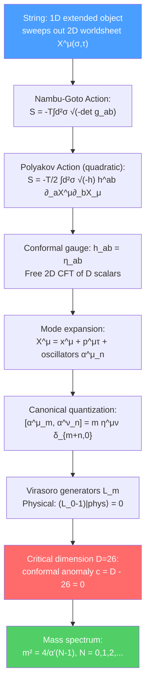

# 🌌 Bosonic String Theory

> [!abstract] TL;DR
> Bosonic string theory replaces point particles (whose worldline is a 1D curve) with 1D strings (whose worldsheet is a 2D surface). The Nambu-Goto action is the area of the worldsheet: $S = -T\int d^2\sigma\sqrt{-\det(g_{ab})}$. In conformal gauge, this becomes the Polyakov action — a free 2D CFT of $D$ scalar fields. Canonical quantization yields the Virasoro algebra with central charge $c = D$. Physical states require $c = 26$ ($D=26$) to cancel the conformal anomaly. The bosonic string mass spectrum has a tachyon (ground state), massless states (graviton, B-field, dilaton), and an infinite tower of massive states with spacing $m^2 = 4/\alpha'$. Interactions are encoded in vertex operators; modular invariance constrains the one-loop amplitude.

## Intuition — analogy FIRST

A point particle traces out a worldline as it moves through spacetime. The action is the proper length of this worldline. A string traces out a 2D surface — the worldsheet — as it sweeps through spacetime. The natural generalization of proper length to a surface is proper area. The Nambu-Goto action is simply:
$$S \propto -\text{Area of worldsheet}$$

This is as geometrically natural as you can get. The string has a tension $T$ (energy per unit length), and the action principle minimizes the worldsheet area — strings are "soap bubbles" in spacetime.

The surprising consequence: quantizing this simple geometric action produces a consistent quantum theory that necessarily includes a graviton (the massless spin-2 state) — string theory predicts gravity!

---

## How It Works

---

## Key Concepts / Details

### Undergraduate Level

**Strings vs. Particles**

| Point Particle | String |
|----------------|--------|
| 0-dimensional object | 1-dimensional object |
| Worldline (1D curve) | Worldsheet (2D surface) |
| Action $= -m\int d\tau$ | Action $= -T\int d^2\sigma\sqrt{-g}$ |
| Characterized by mass $m$ | Characterized by tension $T = 1/(2\pi\alpha')$ |
| UV divergences in loops | UV-finite (extended nature smooths divergences) |

The string length is $l_s = \sqrt{\alpha'}$, the fundamental length of string theory. At energies $E \ll 1/l_s$, strings look like point particles and reproduce ordinary QFT/GR.

**The Nambu-Goto Action**

The worldsheet is parameterized by $(\sigma^0, \sigma^1) = (\tau, \sigma)$ with $\sigma\in[0,\pi]$ (open) or $[0,2\pi)$ (closed). The embedding in spacetime: $X^\mu(\tau,\sigma)$. The induced metric:
$$g_{ab} = \eta_{\mu\nu}\frac{\partial X^\mu}{\partial\sigma^a}\frac{\partial X^\nu}{\partial\sigma^b}$$

Nambu-Goto action (area of worldsheet):
$$S_{NG} = -T\int d\tau\, d\sigma\,\sqrt{-\det g_{ab}}$$

with string tension $T = 1/(2\pi\alpha')$ and Regge slope $\alpha'$ (dimensions: length²).

**The Polyakov Action**

Introduce an intrinsic worldsheet metric $h_{ab}$. The classically equivalent (but easier to quantize) Polyakov action:
$$S_P = -\frac{T}{2}\int d^2\sigma\sqrt{-h}\,h^{ab}\partial_a X^\mu\partial_b X_\mu$$

This is a 2D non-linear sigma model. Varying $h_{ab}$: the stress-energy tensor $T_{ab} = 0$ (constraint), which enforces equivalence with Nambu-Goto.

The Polyakov action has three symmetries:
1. 2D reparametrizations (worldsheet diffeomorphisms)
2. Weyl invariance: $h_{ab} \to e^{2\omega(\sigma)}h_{ab}$
3. $D$-dimensional spacetime Poincaré symmetry

**Conformal Gauge and Mode Expansion**

Using diffeomorphisms and Weyl, choose **conformal gauge** $h_{ab} = \eta_{ab}$. The Polyakov action becomes:
$$S = \frac{T}{2}\int d^2\sigma\,\partial^a X^\mu\partial_a X_\mu$$

which is $D$ free scalar fields on the worldsheet. The equations of motion: $\Box X^\mu = 0$ (2D wave equation).

Mode expansion for closed strings:
$$X^\mu(\tau,\sigma) = x^\mu + \frac{p^\mu}{T}\tau + \frac{i}{\sqrt{2T}}\sum_{n\neq0}\frac{1}{n}\left(\alpha^\mu_n e^{-2in(\tau-\sigma)} + \tilde\alpha^\mu_n e^{-2in(\tau+\sigma)}\right)$$

Left-movers ($\tilde\alpha$) and right-movers ($\alpha$) are independent. Hermiticity: $(\alpha^\mu_n)^\dagger = \alpha^\mu_{-n}$.

**Virasoro Algebra**

The Virasoro generators are the Fourier modes of the worldsheet stress tensor:
$$L_m = \frac{1}{2}\sum_{n=-\infty}^{\infty}\alpha_{m-n}\cdot\alpha_n$$

The Virasoro algebra (quantum):
$$[L_m, L_n] = (m-n)L_{m+n} + \frac{c}{12}m(m^2-1)\delta_{m+n,0}$$

where $c$ is the **central charge**. For $D$ free scalar fields: $c = D$.

### Graduate Level

**Physical State Conditions**

The Virasoro constraints $T_{ab} = 0$ become physical state conditions:
$$(L_0 - a)|phys\rangle = 0, \quad L_n|phys\rangle = 0 \quad \text{for } n > 0$$

where $a$ is the normal ordering constant. For bosonic string: $a = 1$ (from normal ordering of $\alpha^\mu_0$).

The mass-shell condition from $L_0 = 1$:
$$m^2 = \frac{4}{\alpha'}\left(N - 1\right)$$

where $N = \sum_{n=1}^\infty\alpha_{-n}\cdot\alpha_n$ is the level number (oscillator excitation number).

**The Mass Spectrum:**
| Level $N$ | $m^2$ | States | Interpretation |
|-----------|-------|--------|---------------|
| 0 | $-4/\alpha'$ | $|0;p\rangle$ | Tachyon (unstable vacuum!) |
| 1 | 0 | $\alpha^\mu_{-1}\tilde\alpha^\nu_{-1}|0;p\rangle$ | Graviton $g_{\mu\nu}$ + Kalb-Ramond $B_{\mu\nu}$ + Dilaton $\phi$ |
| 2 | $4/\alpha'$ | Massive spin-2 and others | Stringy massive resonances |

The bosonic string has a **tachyon**: a state with $m^2 < 0$, indicating an unstable vacuum. This is cured in superstring theory by the GSO projection.

**Critical Dimension $D=26$**

The quantum Virasoro algebra has a central charge $c = D$ from the $D$ scalars, plus $c_{ghost} = -26$ from the reparametrization ghost system ($b,c$ fields). For BRST quantization to be consistent, the total central charge must vanish:
$$c_{total} = D + c_{ghost} = D - 26 = 0 \implies D = 26$$

Alternatively, from covariant quantization: the normal ordering constant $a = \frac{D-2}{24}$ must equal 1 (physical state condition at level 1 being massless) → $D = 26$.

**BRST Quantization**

The physical Hilbert space is the BRST cohomology: $\mathcal{H}_{phys} = \ker Q_{BRST}/\text{im}Q_{BRST}$, where $Q_{BRST}$ is the BRST charge built from the constraints $L_m$ and ghost fields $c^m, b_{mn}$:
$$Q_{BRST} = \sum_m c_{-m}L_m^{matter} + \frac{1}{2}\sum_{m,n}(m-n):c_{-m}c_{-n}b_{m+n}: - c_0$$

$Q_{BRST}^2 = 0$ iff $c_{total} = 0$ (i.e., $D = 26$).

**Open Strings and Chan-Paton Factors**

Open strings have endpoints with Neumann (free) or Dirichlet (fixed) boundary conditions. Adding $U(N)$ color charges ("Chan-Paton factors") to the endpoints gives a $U(N)$ gauge group — open strings describe gauge theory. The massless open string state: $\alpha^\mu_{-1}|0;p\rangle_i^{\bar j}$ → gauge boson $A^\mu_{ij}$ in adjoint of $U(N)$.

**String Interactions and Vertex Operators**

String interactions (splitting/joining) are described by vertex operators $V_k(\sigma) = e^{ik\cdot X(\sigma)}$ inserted on the worldsheet. The $n$-point amplitude:
$$\mathcal{A} = g_s^{n-2}\int_{\mathcal{M}_{g,n}}\langle V_1(\sigma_1)\cdots V_n(\sigma_n)\rangle$$

integrated over the moduli space $\mathcal{M}_{g,n}$ of Riemann surfaces of genus $g$ with $n$ punctures.

**Modular Invariance**

The one-loop amplitude is a path integral on the torus. The modular parameter $\tau$ labels inequivalent tori; modular invariance ($\tau \to \tau+1$, $\tau \to -1/\tau$) constrains the partition function. The one-loop partition function for the bosonic string:
$$Z(\tau) = \text{Tr}[q^{L_0-1}\bar{q}^{\tilde{L}_0-1}], \quad q = e^{2\pi i\tau}$$

---

## Real-World Notes

- **String length and colliders:** The string length $l_s = \sqrt{\alpha'} \sim 10^{-34}$ m (for $\alpha' \sim l_{Planck}^2$) is $10^{19}$ times smaller than what the LHC probes — strings look exactly like point particles at accessible energies.
- **Regge trajectories:** Spinning hadrons (mesons, baryons) lie on linear Regge trajectories $J \sim \alpha' m^2$. Before string theory was understood to describe gravity, it was proposed as a model of hadron scattering in the 1960s-70s.
- **Tachyon condensation:** The bosonic string tachyon is not physical instability but indicates the perturbative expansion is around a false vacuum. Sen's conjecture (tachyon condensation) describes the decay to the true vacuum — now proven in open string field theory.

---

## Common Pitfalls

- **The tachyon is not a superluminal particle.** $m^2 < 0$ means the field-theoretic tachyon (unstable vacuum), not a particle traveling faster than light.
- **$D=26$ is for the bosonic string; superstrings need $D=10$.** The two extra central charge units in superstrings (from worldsheet fermions) reduce the critical dimension by 16 to $D = 10$.
- **Open and closed strings are different theories.** Open string endpoints require boundary conditions — Neumann gives free endpoints, Dirichlet gives D-branes. Closed strings have no endpoints and naturally include gravity (graviton = closed string ground state at $N=1$).
- **Conformal gauge fixes worldsheet diffeomorphisms and Weyl, but leaves residual conformal symmetry** — the Virasoro algebra is precisely this residual symmetry.

---

## Related Concepts

- [[Superstring_Theory]] — Add worldsheet fermions to cure the tachyon and reduce to $D=10$
- [[Conformal_Field_Theory]] — The worldsheet theory in conformal gauge is a 2D CFT
- [[D_Branes]] — Dirichlet boundary conditions for open strings = D-branes
- [[Lie_Groups_and_Lie_Algebras]] — Virasoro algebra as infinite-dimensional Lie algebra
- [[Differential_Geometry]] — Worldsheet as a Riemann surface; moduli space
- [[_MOC_String_Theory|↑ Section MOC]]

---

## Review Questions

1. **(Undergraduate)** Write the Nambu-Goto and Polyakov actions for a bosonic string. What symmetries does each have? Show they are classically equivalent.
2. **(Undergraduate)** What is the mass spectrum of the bosonic closed string at levels $N=0,1,2$? Identify the physical interpretation of each level.
3. **(Graduate)** Derive the critical dimension $D=26$ from the requirement that the BRST charge is nilpotent ($Q_{BRST}^2 = 0$). Equivalently, derive it from the Virasoro algebra with central charge $c = D$.
4. **(Graduate)** What is modular invariance of the one-loop partition function, and why is it physically important? What does it imply about the string spectrum?

---

## Sources

- Polchinski, *String Theory, Vol. I: An Introduction to the Bosonic String* (Cambridge, 1998) — the definitive reference
- Green, Schwarz & Witten, *Superstring Theory, Vol. I* (Cambridge, 1987), Ch. 1–3
- Zwiebach, *A First Course in String Theory* (Cambridge, 2nd ed., 2009) — undergraduate accessible
- Tong, "String Theory," Cambridge Part III lecture notes, arXiv:0908.0333 — excellent free resource
- Di Francesco et al., *Conformal Field Theory* (Springer, 1997) — Virasoro algebra in CFT context

#physics #string-theory #bosonic-string #Nambu-Goto #Polyakov #Virasoro-algebra #critical-dimension #BRST
