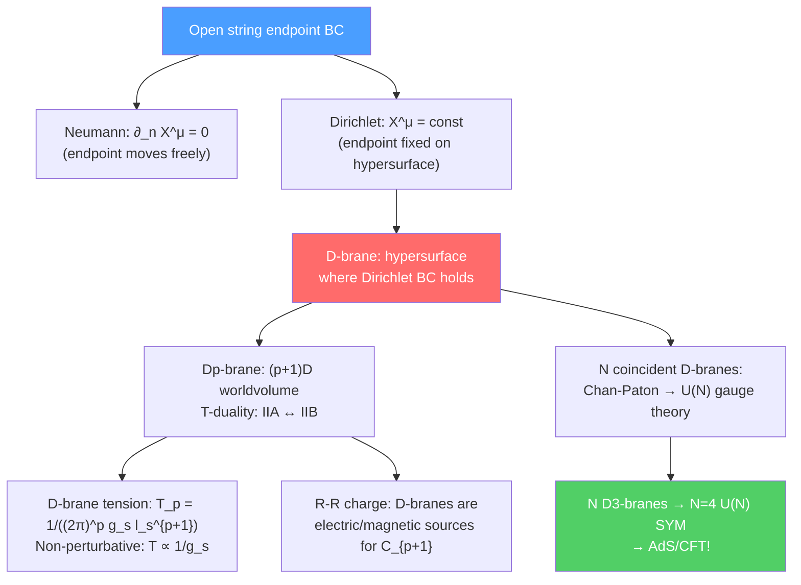

# 🌌 D-Branes

> [!abstract] TL;DR
> D-branes (Dirichlet branes) are hypersurfaces in spacetime on which open string endpoints are confined. A D$p$-brane has a $(p+1)$-dimensional worldvolume. They arise naturally from T-duality: compactifying a dimension with Dirichlet boundary conditions exchanges momentum with winding modes. D-branes carry R-R charges and are the non-perturbative counterparts of the perturbative string states: their tension scales as $T_p \propto 1/g_s$ (not $1/g_s^2$ like string-theory solitons) — they become light at strong coupling. The worldvolume theory of $N$ coincident D$p$-branes is a $(p+1)$-dimensional $\mathcal{N}=4$ $U(N)$ Yang-Mills theory. D-branes are central to modern string phenomenology, AdS/CFT, and our understanding of black hole entropy.

## Intuition — analogy FIRST

Imagine a fish pond. Fish (open strings) can swim freely through the water (spacetime), but they are confined to the water's surface — they cannot fly into the air. The surface of the pond is the D-brane. Open strings live in the bulk but their endpoints are stuck on the D-brane worldvolume. The D-brane itself can vibrate and move (it has collective coordinates), but it is a dynamical object, not a fixed background.

When $N$ fish ponds (D-branes) overlap, the fish can swim between ponds (off-diagonal open string states), generating $N^2 - 1$ new degrees of freedom (the adjoint of $U(N)$). This is how non-abelian gauge symmetry emerges in string theory.

---

## How It Works

---

## Key Concepts / Details

### Undergraduate Level

**Dirichlet Boundary Conditions**

For an open string with endpoints at $\sigma=0$ and $\sigma=\pi$, the boundary conditions for transverse coordinates $X^i$ ($i = p+1,\ldots,D-1$) can be:
- **Neumann:** $\partial_\sigma X^i|_{\sigma=0,\pi} = 0$ — endpoint is free to move
- **Dirichlet:** $\delta X^i|_{\sigma=0,\pi} = 0$ — endpoint is fixed to a surface (D-brane)

A D$p$-brane occupies directions $x^0, x^1,\ldots, x^p$ (Neumann) and the $D-p-1$ transverse directions $x^{p+1},\ldots,x^{D-1}$ are Dirichlet (fixed on the brane).

**T-Duality and D-Branes**

Consider compactifying $x^9$ on a circle of radius $R$. T-duality sends $R \to \alpha'/R$ and exchanges:
- Momentum modes $n/R$ ↔ Winding modes $mR/\alpha'$
- Neumann BC $\leftrightarrow$ Dirichlet BC

Under T-duality, a D$p$-brane along $x^9$ becomes a D$(p-1)$-brane (Dirichlet in $x^9$), and vice versa. This shows that D-branes are a necessary part of the consistent theory: T-duality maps between theories with different D-brane content (IIA↔IIB maps even↔odd D-branes).

**D-Brane Charges and Tensions**

D$p$-branes are electrically charged under the $(p+1)$-form R-R gauge field $C_{p+1}$:
$$S \supset \mu_p\int_{\mathcal{W}_{p+1}}C_{p+1}$$

where $\mu_p$ is the D-brane charge and $\mathcal{W}_{p+1}$ is the worldvolume. D-branes are BPS objects: they satisfy $T_p = \mu_p$ (tension = charge), preserving half the SUSY. The tension:
$$T_p = \frac{1}{(2\pi)^p g_s l_s^{p+1}}$$

Key feature: $T_p \propto 1/g_s$ — at weak coupling ($g_s \ll 1$), D-branes are very heavy. At strong coupling, they become light and dynamically important. This is unlike perturbative string states ($T_{string} \propto 1/l_s^2$, independent of $g_s$).

**D-Branes as Non-Perturbative Objects**

In the weak-coupling ($g_s \to 0$) perturbative expansion, D-branes are invisible (infinitely massive). They are non-perturbative in $g_s$: their contribution $\sim e^{-1/g_s}$ to amplitudes. Polchinski (1995) identified D-branes as the non-perturbative solitons that carry R-R charges, completing the understanding of type II string theories.

### Graduate Level

**Dirac-Born-Infeld Action**

The worldvolume theory on a single D$p$-brane is described by the Dirac-Born-Infeld (DBI) action:
$$S_{DBI} = -T_p\int d^{p+1}\xi\,e^{-\phi}\sqrt{-\det\left(g_{ab} + B_{ab} + 2\pi\alpha' F_{ab}\right)}$$

where:
- $g_{ab} = G_{\mu\nu}\partial_a X^\mu\partial_b X^\nu$: induced worldvolume metric (from bulk metric $G_{\mu\nu}$)
- $B_{ab}$: pullback of Kalb-Ramond 2-form
- $F_{ab} = \partial_a A_b - \partial_b A_a$: worldvolume gauge field strength
- $e^{-\phi}$: dilaton factor ($e^{-\phi} = 1/g_s$ at constant dilaton)

The DBI action reduces to the Maxwell action in the limit $\alpha'F \ll 1$:
$$S_{DBI} \approx -T_p\int d^{p+1}\xi\left(1 + \frac{(2\pi\alpha')^2}{4}F_{ab}F^{ab} + \ldots\right)$$

The full DBI action is Born-Infeld theory — an exact (in $\alpha'$) generalization of Maxwell electrodynamics that has a maximum field strength.

**Chern-Simons Worldvolume Terms**

In addition to DBI, D-branes have Wess-Zumino (Chern-Simons) worldvolume terms:
$$S_{WZ} = \mu_p\int_{\mathcal{W}_{p+1}}\sum_q C_q\wedge e^{B+2\pi\alpha'F}$$

These couple the D-brane to all R-R forms, not just $C_{p+1}$. A D$p$-brane with worldvolume gauge flux $F$ carries charges of lower-dimensional D-branes: a D$p$-brane with $\int F \neq 0$ contains a D$(p-2)$-brane charge — "D-brane polarization."

**Multiple D-Branes: Non-Abelian DBI**

For $N$ coincident D$p$-branes, the worldvolume fields are $N\times N$ matrices (Chan-Paton). The gauge field $A_\mu^{ij}$ ($i,j = 1,\ldots,N$) gives a $U(N)$ gauge theory. The scalars $\Phi^i_{ab}$ (transverse positions) are also matrices.

The non-abelian DBI action describes the matrix-valued fields. For $N$ D3-branes in flat space:
$$\mathcal{N}=4 \text{ } U(N) \text{ Yang-Mills theory in } 3+1D$$

with gauge coupling $g_{YM}^2 = 4\pi g_s$. This identification is the foundation of AdS/CFT.

**D-Brane Model Building**

D-branes provide a mechanism for generating the Standard Model gauge group and matter content:

**Intersecting D6-branes (Type IIA):** Place D6-branes at different angles in the compactification. Open strings stretched between two D6-branes that intersect with angle $\theta$ give chiral fermions — a robust mechanism for chirality in string phenomenology.

At intersection points, massless fermion zero modes appear. The matter content depends on:
- Number of brane intersections (determines multiplicity = number of generations)
- Representation = determined by which branes are intersected

**A toy "Standard Model" from D-branes:**
- Stack of 3 D-branes → $U(3) \supset SU(3)_c$ (QCD)
- Stack of 2 D-branes → $U(2) \supset SU(2)_L$ (weak)
- Single D-brane → $U(1)_Y$ (hypercharge)

**Anti-D-Branes**

Anti-D-branes (denoted $\overline{\text{D}p}$) carry opposite R-R charge. They are not BPS — a D$p$-$\overline{\text{D}p}$ pair is unstable (attractive force), eventually annihilating via open string tachyon condensation. Anti-D-branes are used in KKLT de Sitter construction: a $\overline{\text{D3}}$-brane in a warped throat uplifts an AdS vacuum to de Sitter.

**D-Branes and Black Holes (Microscopic Entropy)**

Strominger & Vafa (1996): the entropy of the extremal $d=5$ BPS black hole in string theory can be computed exactly by counting D-brane microstates:
$$S = 2\pi\sqrt{n_1 n_5 N}$$

This matched Bekenstein-Hawking $S_{BH} = A/4G_N$ exactly — the first microscopic derivation of black hole entropy in quantum gravity. Here $n_1$ D1-branes, $n_5$ D5-branes, and $N$ units of momentum give the black hole configuration.

---

## Real-World Notes

- **LHC and extra dimensions:** D-branes in large extra dimensions predict Kaluza-Klein graviton resonances and possibly string-scale physics at TeV — searched for at LHC (no signals yet).
- **D-brane inflation:** The KKLMMT model of inflation uses D3-$\overline{\text{D3}}$ brane-antibrane attraction as the inflationary potential. Constraints from Planck + BICEP rule out many large-field string inflation models.
- **AdS/CFT applications:** D3-branes in $AdS_5\times S^5$ give the duality between $\mathcal{N}=4$ SYM and IIB string theory — the most studied case of AdS/CFT. The near-horizon geometry of $N$ D3-branes is exactly $AdS_5\times S^5$.

---

## Common Pitfalls

- **D-branes are not fixed boundaries.** They are dynamical objects — they can fluctuate, move, and interact. Their positions are encoded in the VEVs of the worldvolume scalar fields.
- **D-brane tension scales as $1/g_s$, not $1/g_s^2$.** Perturbative string solitons (worldsheet instantons) scale as $e^{-1/g_s}$, but D-branes scale as $e^{-1/g_s}$ for their mass and as $T \sim 1/g_s$ for their tension — this is the non-perturbative character.
- **Not all D-brane pairs are BPS.** Only D$p$-D$p$ pairs (same type, same orientation) are mutually BPS. D$p$-$\overline{\text{D}q}$ pairs (opposite charge) attract and annihilate.
- **The worldvolume gauge field is not a fundamental gauge field.** It is the collective mode of the open string — an emergent degree of freedom at low energies.

---

## Related Concepts

- [[Bosonic_String_Theory]] — Open string boundary conditions: origin of D-branes
- [[Superstring_Theory]] — D-branes carry R-R charges; essential in Type II theories
- [[M_Theory_and_Dualities]] — D-branes under S/T-duality: M2/M5-branes in M-theory
- [[AdS_CFT_Correspondence]] — $N$ D3-branes → $AdS_5\times S^5$ near-horizon geometry
- [[Fiber_Bundles_and_Gauge_Theory]] — Worldvolume gauge theory: $U(N)$ from Chan-Paton factors
- [[_MOC_String_Theory|↑ Section MOC]]

---

## Review Questions

1. **(Undergraduate)** What is a D$p$-brane? What are Dirichlet boundary conditions? How does T-duality relate Neumann and Dirichlet boundary conditions?
2. **(Undergraduate)** Why do $N$ coincident D$p$-branes give a $U(N)$ gauge theory on their worldvolume? What are the Chan-Paton factors?
3. **(Graduate)** Write the DBI action for a D$p$-brane. Show that it reduces to the Maxwell action at weak field strength. What is the physical meaning of the maximum field strength in Born-Infeld theory?
4. **(Graduate)** Explain the Strominger-Vafa calculation of black hole entropy using D-branes. Why is this a non-trivial test of string theory as a quantum theory of gravity?

---

## Sources

- Polchinski, "Dirichlet Branes and Ramond-Ramond Charges," *Phys. Rev. Lett.* 75, 4724 (1995), arXiv:hep-th/9510017 — the seminal paper
- Polchinski, *String Theory, Vol. II* (Cambridge, 1998), Ch. 8–13
- Johnson, *D-Branes* (Cambridge, 2003) — comprehensive dedicated textbook
- Strominger & Vafa, "Microscopic origin of the Bekenstein-Hawking entropy," *Phys. Lett. B* 379, 99 (1996), arXiv:hep-th/9601029
- Clifford Johnson, "D-brane Primer," arXiv:hep-th/0007170 — excellent lecture notes

#physics #D-branes #DBI-action #R-R-charge #Chan-Paton #non-abelian-gauge-theory #Strominger-Vafa #T-duality
