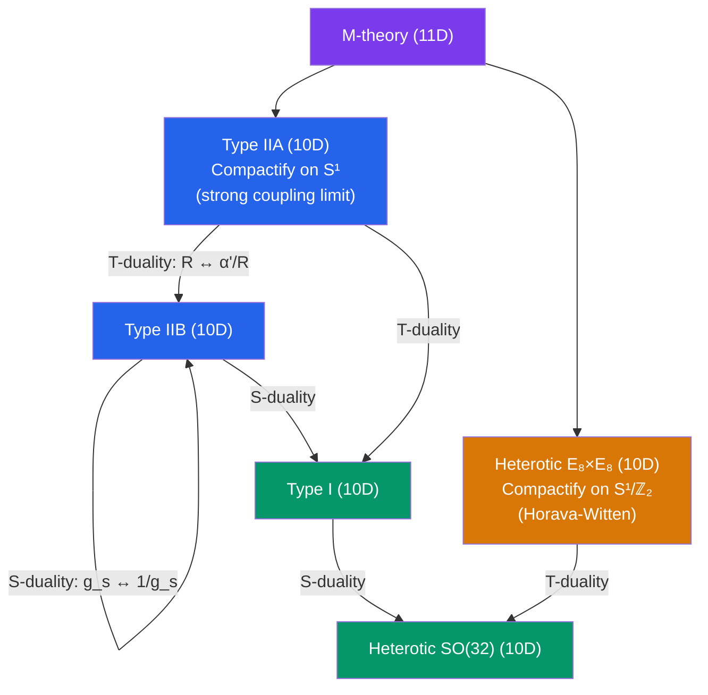

# 🌌 M-Theory and Dualities

> [!abstract] TL;DR
> The five superstring theories are not five distinct theories but five perturbative descriptions of a single underlying 11-dimensional theory called **M-theory**. They are connected by S-duality (strong ↔ weak coupling) and T-duality (large ↔ small compactification radius). The strong coupling limit of Type IIA string theory reveals an 11th dimension of size $R_{11} = g_s l_s$: M-theory. Its low-energy limit is 11D SUGRA, and its fundamental objects are M2-branes and M5-branes (no strings at the fundamental level). Compactifying M-theory on $S^1/\mathbb{Z}_2$ gives Heterotic $E_8\times E_8$ (Horava-Witten). U-duality combines S and T-duality into a larger discrete symmetry group $E_{n(n)}(\mathbb{Z})$.

## Intuition — analogy FIRST

Imagine you are studying the physics of water at room temperature. From different directions — ice, steam, liquid — the substance looks completely different. Ice has a rigid crystal structure, steam is a gas, liquid flows freely. Yet all three are the same underlying compound: $H_2O$. The five string theories are like ice, steam, and water seen in different thermodynamic limits (different values of $g_s$ and compactification radii). M-theory is the underlying compound, and the dualities are the "phase transitions" connecting the different descriptions.

The remarkable fact is that the strong coupling limit of one string theory gives a *different* string theory at weak coupling — not just the same theory with a different coupling constant, but a genuinely different perturbative expansion.

---

## How It Works

---

## Key Concepts / Details

### Undergraduate Level

**The Five Theories and Their Connections**

The duality web connecting the five superstring theories:

**T-duality:**
- Type IIA on $S^1_R$ ↔ Type IIB on $S^1_{\alpha'/R}$: compactify IIA on a circle of radius $R$, T-dualize, get IIB on circle of radius $\tilde{R} = \alpha'/R$. The D-brane content transforms: D$p$-brane along the circle → D$(p-1)$-brane.
- Heterotic $SO(32)$ on $S^1_R$ ↔ Heterotic $E_8\times E_8$ on $S^1_{\alpha'/R}$

**S-duality:**
- Type IIB is self-dual: $g_s \to 1/g_s$ maps IIB to itself. F-strings (fundamental strings) ↔ D1-branes under S-duality.
- Type I ↔ Heterotic $SO(32)$: strong coupling Type I = weakly coupled Het $SO(32)$ (and vice versa).

**These dualities imply:** No one of the five theories is more fundamental; they are all perturbative windows into a single theory.

**Why M-Theory?**

Take Type IIA string theory and increase the string coupling $g_s \to \infty$ (strong coupling limit). The dilaton field $\phi$ appears in the IIA action; at strong coupling, $e^\phi = g_s \to \infty$. This is not merely a quantitative change — an 11th spatial dimension opens up, with radius:
$$R_{11} = g_s l_s = g_s\sqrt{\alpha'}$$

At weak coupling $g_s \ll 1$: $R_{11} \ll l_s$ — the 11th dimension is invisible, and IIA string theory is a valid description. At strong coupling $g_s \gg 1$: $R_{11} \gg l_s$ — the 11th dimension decompactifies, and we enter M-theory.

The IIA fundamental string (F1) corresponds to an M2-brane wrapped on the 11th circle. The IIA D0-brane (Kaluza-Klein graviton) is the lightest Kaluza-Klein mode of 11D gravity. The IIA D2-brane = M2-brane.

**M-Theory Basics**

M-theory is an 11D theory with:
- **No free parameters** (no dilaton, no string coupling constant)
- **No strings** (the fundamental 1D objects of 10D strings are not fundamental in 11D)
- **Two types of branes:** M2-brane (2+1D worldvolume) and M5-brane (5+1D worldvolume)
- **Low-energy limit:** 11D SUGRA (the unique maximum-rank SUGRA)

The name "M-theory" was coined by Witten at the 1995 Strings conference, with "M" standing variously for "mystery," "membrane," or "mother."

### Graduate Level

**T-Duality in Detail**

Compactify $x^9$ on $S^1_R$. The string worldsheet coordinate $X^9$ has mode expansion:
$$X^9 = x^9 + \frac{n\alpha'}{R}\tau + \frac{mR}{\pi\alpha'}\sigma + \text{oscillators}$$

with $n$ = momentum quantum number and $m$ = winding number. The mass spectrum:
$$m^2 = \frac{n^2}{R^2} + \frac{m^2 R^2}{\alpha'^2} + \frac{2}{\alpha'}(N + \tilde{N} - 2)$$

T-duality $R \to \alpha'/R$ swaps $(n,m) \to (m,n)$: momentum ↔ winding. The full theory (including all string interactions) is invariant. The T-dual coordinate $\tilde{X}^9 = X^9_L - X^9_R$ (instead of $X^9_L + X^9_R$) — this exchanges Neumann and Dirichlet boundary conditions for open strings, mapping D$p$ to D$(p\pm 1)$.

**S-Duality of Type IIB**

Type IIB has a $\text{SL}(2,\mathbb{Z})$ S-duality acting on the complexified coupling $\tau = C_0 + ie^{-\phi}$:
$$\tau \to \frac{a\tau + b}{c\tau + d}, \quad \begin{pmatrix}a & b\\ c & d\end{pmatrix} \in \text{SL}(2,\mathbb{Z})$$

The elementary transformation $S: \tau \to -1/\tau$ sends $g_s \to 1/g_s$ and exchanges the NS-NS 2-form $B_{\mu\nu}$ with the R-R 2-form $C_{\mu\nu}$ (and thus F-strings ↔ D1-branes). The spectrum of $(p,q)$ strings = bound states of $p$ F-strings and $q$ D1-branes is $\text{SL}(2,\mathbb{Z})$-invariant (BPS states have $M \propto |p\tau + q|$).

**Horava-Witten: M-theory on $S^1/\mathbb{Z}_2$**

Compactify M-theory on an interval $S^1/\mathbb{Z}_2$ (orbifold). The $\mathbb{Z}_2$ reflection $x^{11} \to -x^{11}$ creates two 10D "walls" (boundaries) at $x^{11} = 0$ and $x^{11} = \pi\rho$. Each wall carries an $E_8$ gauge multiplet. The result: Heterotic $E_8\times E_8$ string theory! The interval length $\pi\rho = g_s^{2/3}l_s$ (in M-theory units).

The Horava-Witten scenario provides a geometric explanation for the two $E_8$ factors and makes heterotic M-theory phenomenology geometrically transparent.

**U-Duality**

On compactification of M-theory on $T^n$ (an $n$-torus), the low-energy 4D theory has a classical global symmetry $E_{n(n)}(\mathbb{R})$ (exceptional group). Quantum corrections (from branes wrapping cycles) break this to the discrete U-duality group $E_{n(n)}(\mathbb{Z})$. For example:

- M-theory on $T^7$ → 4D $\mathcal{N}=8$ SUGRA: U-duality group $E_{7(7)}(\mathbb{Z})$
- M-theory on $T^6$ → 5D: $E_{6(6)}(\mathbb{Z})$

U-duality combines S-duality and T-duality into a larger discrete symmetry, unifying all perturbative and non-perturbative dualities.

**F-Theory**

F-theory is a 12-dimensional formalism (with two time-like dimensions, one compactified) for describing non-perturbative Type IIB configurations. An elliptic fibration over a base manifold $B$ gives the physical spacetime; the modular parameter $\tau$ of the elliptic fiber equals the IIB axio-dilaton:
$$\tau = C_0 + ie^{-\phi} = \frac{\text{complex structure of fiber torus}}{1}$$

F-theory compactifications on Calabi-Yau 4-folds give $\mathcal{N}=1$ in 4D with non-perturbative gauge symmetries (from 7-brane stacks). The gauge group can be $E_8$, $E_7$, or any ADE-type — controlled by the singularity type of the fibration.

**Matrix Theory (BFSS)**

Banks-Fischler-Shenker-Susskind (1997): M-theory in flat 11D spacetime is equivalent, in the infinite momentum frame, to the $N\to\infty$ limit of the quantum mechanics of $N\times N$ matrices (D0-branes):
$$H = \text{Tr}\left(\frac{1}{2}P_i^2 - \frac{1}{4}[X^i, X^j]^2 + \text{fermions}\right)$$

This gives a non-perturbative, background-independent definition of M-theory (in the DLCQ limit). Gravitons are described by clusters of D0-branes; M2-branes emerge as non-commutative matrix configurations.

---

## Real-World Notes

- **The Second Superstring Revolution (1995):** Witten's identification of M-theory and the web of dualities (presented at Strings 1995) fundamentally changed the field. It showed that all five theories are consistent quantum gravity theories, but none is more fundamental than the others — M-theory is.
- **M-theory and compactification phenomenology:** Compactifying M-theory on a smooth $G_2$ manifold gives $\mathcal{N}=1$ in 4D with no gauge group. Singularities of the $G_2$ manifold give ADE gauge groups; codimension-7 singularities give chiral matter. This is a promising framework for SM-like models.
- **Status of M-theory:** M-theory lacks a complete non-perturbative definition (Matrix Theory is limited to specific backgrounds). Finding M-theory's "action" or "Lagrangian" is a major open problem.

---

## Common Pitfalls

- **M-theory is not just 11D SUGRA.** 11D SUGRA is the low-energy effective theory; M-theory is the full UV-complete quantum theory, including all the non-perturbative corrections from M2 and M5 branes.
- **T-duality swaps large and small circles, not strong and weak coupling.** S-duality swaps strong and weak coupling.
- **F-theory is not a 12D theory with 12 physical dimensions.** The two "extra" F-theory dimensions are the torus fiber, and one is compact; F-theory is a way of geometrizing the IIB dilaton-axion.
- **U-duality is a discrete group $E_{n(n)}(\mathbb{Z})$, not the continuous group.** The classical continuous symmetry is broken by quantum effects (brane charges are quantized) to the discrete subgroup.

---

## Related Concepts

- [[Superstring_Theory]] — Five superstring theories are the five corners of M-theory
- [[D_Branes]] — D-branes under S/T-duality become M2/M5-branes in M-theory
- [[Supergravity]] — 11D SUGRA is the low-energy limit of M-theory
- [[BPS_States_and_Dualities]] — BPS states underpin the evidence for dualities
- [[AdS_CFT_Correspondence]] — D3-branes and the IIB near-horizon geometry → holography
- [[_MOC_String_Theory|↑ Section MOC]]

---

## Review Questions

1. **(Undergraduate)** State the T-duality relation between Type IIA and Type IIB. How does the radius transform? How do D-branes transform under T-duality?
2. **(Undergraduate)** What is M-theory? How does it arise as the strong coupling limit of Type IIA? What is the radius of the 11th dimension in terms of $g_s$ and $l_s$?
3. **(Graduate)** Explain Horava-Witten theory. How does M-theory on $S^1/\mathbb{Z}_2$ give Heterotic $E_8\times E_8$? What sits at the two boundaries?
4. **(Graduate)** What is the U-duality group of M-theory on $T^7$? How does U-duality combine S-duality and T-duality? What does the discreteness of $E_{7(7)}(\mathbb{Z})$ (vs. the classical continuous group) reflect physically?

---

## Sources

- Witten, "String theory dynamics in various dimensions," *Nucl. Phys. B* 443, 85 (1995), arXiv:hep-th/9503124 — the M-theory paper
- Horava & Witten, "Eleven-dimensional supergravity on a manifold with boundary," *Nucl. Phys. B* 475, 94 (1996), arXiv:hep-th/9603142
- Polchinski, *String Theory, Vol. II* (Cambridge, 1998), Ch. 12–14
- Hull & Townsend, "Unity of superstring dualities," *Nucl. Phys. B* 438, 109 (1995), arXiv:hep-th/9410167 — U-duality
- Banks, Fischler, Shenker & Susskind, "M theory as a matrix model," *Phys. Rev. D* 55, 5112 (1997), arXiv:hep-th/9610043 — Matrix Theory

#physics #M-theory #S-duality #T-duality #U-duality #Horava-Witten #F-theory #Matrix-Theory #duality-web
