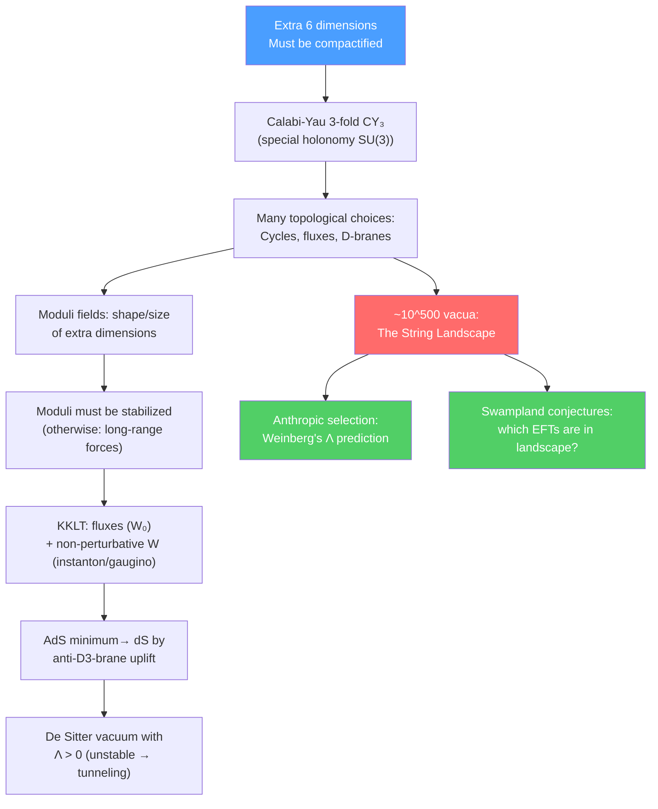

# 🌌 String Cosmology and the Landscape

> [!abstract] TL;DR
> String theory has $\sim 10^{500}$ meta-stable vacua — the "string landscape" — arising from different choices of fluxes on Calabi-Yau compactifications. Each vacuum has different low-energy physics (different gauge groups, particle masses, cosmological constant $\Lambda$). The KKLT mechanism stabilizes all moduli and obtains de Sitter vacua using fluxes + anti-D3-branes. Weinberg's 1987 anthropic prediction of $\Lambda$ (before its observational discovery) uses the landscape + anthropic selection. The swampland program attempts to determine which effective field theories can be UV-completed in quantum gravity — key conjectures include the Distance Conjecture, de Sitter Conjecture, and Trans-Planckian Censorship Conjecture, which constrain inflation and cosmology.

## Intuition — analogy FIRST

The energy landscape of a protein has a huge number of local minima (folded configurations). Each minimum has different properties (shape, binding affinity, enzymatic activity). The protein finds its functional folded state by rolling downhill through this landscape — but different proteins find different minima. The string landscape is the same: $\sim 10^{500}$ minima of the effective potential, each giving a universe with different physics. In a multiverse picture (eternal inflation + landscape), different regions of the universe are in different vacua — we happen to be in one where the cosmological constant is small enough for galaxies to form.

The swampland is the "outside" of the landscape: effective field theories that look consistent at low energies but cannot be UV-completed in quantum gravity. Swampland conjectures identify the "cliffs" beyond which you fall out of the string landscape.

---

## How It Works

---

## Key Concepts / Details

### Undergraduate Level

**Why Extra Dimensions Must Be Compactified**

String theory requires $D=10$ (or 11 for M-theory). We observe 3+1 spacetime dimensions. The extra 6 (or 7) dimensions must be "curled up" — compact, with size $R \sim l_s \sim 10^{-34}$ m (far below experimental resolution).

**Calabi-Yau Compactification**

For $\mathcal{N}=1$ SUSY in 4D, the compact 6D space must be a **Calabi-Yau 3-fold** (CY$_3$): a complex 3-dimensional Kähler manifold with $SU(3)$ holonomy and vanishing first Chern class (Ricci-flat). Key properties:
- Euler characteristic $\chi = 2(h^{1,1} - h^{2,1})$ (Hodge numbers count independent cycles)
- $h^{1,1}$: Kähler moduli (sizes of 2-cycles → volumes of D-branes)
- $h^{2,1}$: complex structure moduli (shape of CY)
- Typical: hundreds of moduli fields

Vast number of topologically distinct CY$_3$ manifolds (estimates: $10^9$–$10^{15}$ distinct topologies, each with a landscape of fluxes).

**Moduli Fields and the Moduli Problem**

Moduli are massless scalar fields parameterizing the shape and size of the compact space. If massless, they would:
1. Mediate long-range scalar forces (fifth forces — excluded by experiment)
2. Have no fixed value — the low-energy physics would be indeterminate

Solution: moduli stabilization — find a mechanism that generates a potential for all moduli, fixing them to specific values.

**The KKLT Mechanism**

Kachru-Kallosh-Linde-Trivedi (2003): A controlled procedure to stabilize all moduli and get a de Sitter vacuum in string theory.

Step 1: **Flux compactification.** Turn on quantized 3-form fluxes $(H_3, F_3)$ through 3-cycles of CY. These fluxes generate a superpotential $W_0 = \int(F_3 - \tau H_3)\wedge\Omega$ (Gukov-Vafa-Witten potential), fixing the dilaton and complex structure moduli. This gives an AdS minimum.

Step 2: **Kähler moduli stabilization.** Non-perturbative effects (D3-brane instantons or gaugino condensation on D7-branes) generate $W_{np} = A e^{-aT}$ for the Kähler modulus $T$. Combined with $W_0$, the full $W = W_0 + Ae^{-aT}$ generates a stable AdS minimum for $T$.

Step 3: **Uplift to de Sitter.** Add an anti-D3-brane ($\overline{\text{D3}}$) in a warped throat (Klebanov-Strassler geometry). The anti-brane contributes $+V_{anti-D3}$ to the potential, uplifting the AdS minimum to a de Sitter minimum with $\Lambda > 0$.

The KKLT de Sitter vacuum is metastable — it can tunnel to the true AdS vacuum (or the Dine-Seiberg runaway), but with an extremely long lifetime.

**The Number $10^{500}$**

Different choices of fluxes (integers $n_i$ for each 3-cycle) give different values of $W_0$, stabilizing moduli at different values with different $\Lambda$. With $\sim 300$ independent 3-cycles and flux integers $\sim 10$–$100$, the number of distinct flux vacua is:
$$N_{vacua} \sim 10^{300} \text{ to } 10^{500}$$

Each vacuum gives different low-energy physics: different gauge groups, particle masses, Yukawa couplings, and cosmological constant.

### Graduate Level

**Weinberg's Anthropic Prediction of $\Lambda$ (1987)**

Before the observational discovery of $\Lambda$ in 1998, Weinberg (1987) used the anthropic principle:
- In a landscape with many values of $\Lambda$, only those with $\Lambda$ small enough for galaxies to form can be observed (the observers must be in such a universe)
- Structure forms if $\Lambda \lesssim \rho_{matter}$ at $z \sim$ few (matter-dark energy equality)
- This gives: $\Lambda \lesssim (few)\times 10^{-122} M_{Pl}^4$

The observed value $\Lambda \approx 3\times10^{-122}M_{Pl}^4$ falls just within this bound — correctly predicted by the anthropic argument! This was a non-trivial success of the landscape picture.

**The Swampland Program**

Not all effective field theories (EFTs) can arise as low-energy limits of consistent quantum gravity (string theory). The swampland is the set of EFTs that look internally consistent but cannot be UV-completed in quantum gravity. Swampland conjectures:

**1. Distance Conjecture (Ooguri-Vafa, 2006):**
When a scalar field moves a distance $\Delta\phi \gtrsim M_{Pl}$ in field space, an infinite tower of states (KK or winding modes) becomes exponentially light: $m \sim m_0 e^{-\alpha\Delta\phi/M_{Pl}}$. This means you cannot move to parametrically large field values in quantum gravity without encountering new physics.

**2. de Sitter Conjecture (2018):**
For any scalar potential $V(\phi)$ arising from a consistent quantum gravity theory:
$$|\nabla V| \geq \frac{c}{M_{Pl}} V \quad \text{or} \quad \min(\nabla\nabla V) \leq -\frac{c'}{M_{Pl}^2} V$$

for some $\mathcal{O}(1)$ constants $c, c'$. This implies that stable de Sitter vacua (where $\nabla V = 0$ and $V > 0$) violate the conjecture — if true, it challenges KKLT and the existence of a positive cosmological constant in string theory!

**3. Trans-Planckian Censorship Conjecture (TCC, 2019):**
Modes that start shorter than the Planck length should not be stretched to super-Hubble scales by inflation:
$$a_f/a_i < M_{Pl}/H$$

This limits the number of e-folds of inflation, constraining the tensor-to-scalar ratio: $r < 10^{-32}(V/V_{CMB})$ for large-field inflation — much stronger than Planck bounds and rules out most large-field inflation models.

**String Inflation Models**

Various string theory constructions for inflation:

| Model | Mechanism | $n_s$ | $r$ |
|-------|-----------|-------|-----|
| KKLMMT (D3/D7) | D3-$\overline{\text{D3}}$ brane distance | $\sim 0.96$ | $\ll 0.1$ |
| Axion monodromy | Slow roll on wrapped D-brane | $\sim 0.97$ | $\sim 0.07$ |
| Higgs inflation from SUGRA | No-scale Kähler | $\sim 0.965$ | $\sim 0.003$ |
| Natural inflation | Axion as inflaton, $f > M_{Pl}$ | $\sim 0.96$ | $0.03$–$0.1$ |

The Planck 2018 + BICEP/Keck measurement: $n_s = 0.9649 \pm 0.0042$, $r < 0.036$ — consistent with low-$r$ string inflation models, rules out large-field axion monodromy.

**Eternal Inflation and the Multiverse**

Many string landscape vacua have $V > 0$ — they produce inflation. In these regions, the universe inflates faster than it decays to the true vacuum, producing a "multiverse": an infinite number of "pocket universes," each in a different vacuum of the landscape. The landscape + eternal inflation = the multiverse.

Observable consequences (if any): collisions of bubble universes could leave imprints in the CMB. No such signals found in Planck data.

---

## Real-World Notes

- **Flux compactifications are concrete:** The Bousso-Polchinski (2000) model was the first to estimate the number of flux vacua and the probability distribution of $\Lambda$ — showing that values near zero are not statistically suppressed in a uniform distribution (flat prior), making the anthropic argument statistically viable.
- **KKLT controversy:** Some argue the KKLT construction doesn't satisfy its own consistency conditions (the "strong CP problem" for the landscape). This is an active research debate; alternative de Sitter constructions (LVS — Large Volume Scenario) exist.
- **Swampland vs. inflation:** If the de Sitter conjecture is correct, slow-roll inflation requires fine-tuning; quintessence (rolling scalar field dark energy) would be preferred over $\Lambda$. Current observational limits on the dark energy equation of state $w$ already test this.

---

## Common Pitfalls

- **The landscape is not a prediction of no physics.** The landscape predicts a distribution over observables; anthropic selection is a well-defined probability calculation (if one defines the measure). The real problem is the **measure problem** — how to compute probabilities in an infinite multiverse.
- **Calabi-Yau is not the only option.** Non-CY compactifications (e.g., $G_2$ manifolds, twisted compactifications with fluxes, non-geometric backgrounds) also arise in string theory, further enlarging the landscape.
- **KKLT is a controlled approximation,** not an exact construction. The uplift step (anti-D3-brane) breaks SUSY, and the validity of SUSY effective field theory near this uplift is debated.
- **Swampland conjectures are conjectures,** not theorems. They are motivated by string theory examples but not proven in full generality.

---

## Related Concepts

- [[M_Theory_and_Dualities]] — Compactification of M-theory is the framework for the landscape
- [[Supergravity]] — SUGRA is the 4D effective theory after compactification
- [[AdS_CFT_Correspondence]] — Most string vacua are AdS; de Sitter is the exception
- [[Cosmology_and_Expanding_Universe]] — Dark energy, inflation, and the cosmological constant problem
- [[Differential_Geometry]] — Calabi-Yau manifolds require Ricci-flat geometry
- [[Topology_in_Physics]] — Topology of extra dimensions determines flux vacua
- [[_MOC_String_Theory|↑ Section MOC]]

---

## Review Questions

1. **(Undergraduate)** What is a Calabi-Yau 3-fold? Why is it the natural compactification space for $\mathcal{N}=1$ SUSY in 4D? What are the moduli fields?
2. **(Undergraduate)** Describe the three steps of the KKLT mechanism. What does each step stabilize? Why is an anti-D3-brane needed?
3. **(Graduate)** State the Distance Conjecture and the de Sitter Conjecture. What do they imply for: (a) the validity of effective field theory at trans-Planckian field values, (b) the existence of de Sitter vacua in string theory?
4. **(Graduate)** How did Weinberg predict the cosmological constant using the anthropic principle, before its observational discovery? What is the "measure problem" in eternal inflation, and why does it make anthropic arguments controversial?

---

## Sources

- Kachru, Kallosh, Linde & Trivedi (KKLT), "de Sitter Vacua in String Theory," *Phys. Rev. D* 68, 046005 (2003), arXiv:hep-th/0301240
- Bousso & Polchinski, "Quantization of four-form fluxes and dynamical neutralization of the cosmological constant," *JHEP* 0006, 006 (2000), arXiv:hep-th/0004134
- Weinberg, "Anthropic bound on the cosmological constant," *Phys. Rev. Lett.* 59, 2607 (1987)
- Ooguri & Vafa, "On the geometry of the string landscape and the swampland," *Nucl. Phys. B* 766, 21 (2007), arXiv:hep-th/0605264
- Becker, Becker & Schwarz, *String Theory and M-Theory: A Modern Introduction* (Cambridge, 2007), Ch. 10–14
- Denef & Douglas, "Distributions of flux vacua," *JHEP* 0405, 072 (2004) — statistics of the landscape

#physics #string-cosmology #landscape #swampland #KKLT #Calabi-Yau #moduli-stabilization #anthropic #de-Sitter-conjecture
