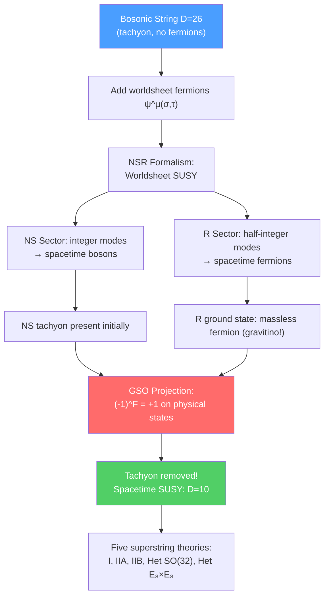

# 🌌 Superstring Theory

> [!abstract] TL;DR
> Superstring theory adds worldsheet fermions $\psi^\mu(\sigma,\tau)$ to the bosonic string, making the worldsheet theory superconformal. The Neveu-Schwarz-Ramond (NSR) formalism has two sectors: NS (periodic fermions → spacetime bosons) and R (anti-periodic → spacetime fermions). The GSO projection removes the tachyon and selects a spacetime-supersymmetric spectrum. The critical dimension drops from $D=26$ to $D=10$ (worldsheet fermions contribute $c=D/2$ to the central charge). There are exactly five consistent superstring theories in 10D (Type I, Type IIA, Type IIB, Heterotic $SO(32)$, Heterotic $E_8\times E_8$), all related by dualities. The Green-Schwarz anomaly cancellation mechanism (1984) singled out $SO(32)$ and $E_8\times E_8$ as the unique gauge groups for consistent heterotic string theory.

## Intuition — analogy FIRST

The bosonic string is like a classical guitar: it has a tachyon (unstable ground state) and no fermions in its spectrum — just bosons (like notes of integer frequency). Adding worldsheet fermions is like upgrading to a supersymmetric guitar: each bosonic mode (boson in spacetime) has a fermionic mode partner. The GSO projection is like throwing away half the strings (the tachyonic and wrong-parity ones) to keep only the harmonious, tachyon-free, supersymmetric combination.

The result is five consistent theories in $D=10$. These five look very different in their perturbative description — different gauge groups, different chirality, open vs. closed strings — but are secretly the same theory seen from five different corners of a large space of vacua (M-theory).

---

## How It Works

---

## Key Concepts / Details

### Undergraduate Level

**Worldsheet Fermions — NSR Formalism**

Add Majorana-Weyl fermions $\psi^\mu_L(\tau-\sigma)$ and $\psi^\mu_R(\tau+\sigma)$ ($\mu = 0,\ldots,D-1$) to the worldsheet. The action:
$$S = -\frac{T}{2}\int d^2\sigma\left(\partial^a X^\mu\partial_a X_\mu - i\bar\psi^\mu\rho^a\partial_a\psi_\mu\right)$$

This action has 2D worldsheet supersymmetry (superconformal symmetry). The worldsheet supercurrent $T_F$ and stress tensor $T_B$ form the super-Virasoro algebra.

**NS and R Sectors**

The fermions can have two sets of boundary conditions around the worldsheet cylinder:
- **Neveu-Schwarz (NS):** $\psi^\mu(\sigma+2\pi) = -\psi^\mu(\sigma)$ — anti-periodic (integer modes $r\in\mathbb{Z}+\frac{1}{2}$)
- **Ramond (R):** $\psi^\mu(\sigma+2\pi) = +\psi^\mu(\sigma)$ — periodic (half-integer modes $r\in\mathbb{Z}$)

Mode expansion:
$$\psi^\mu(\tau,\sigma) = \sum_{r\in\mathbb{Z}+\nu}b^\mu_r e^{-ir(\tau-\sigma)}, \quad \nu = \begin{cases}1/2 & \text{NS}\\ 0 & \text{R}\end{cases}$$

Anti-commutation: $\{b^\mu_r, b^\nu_s\} = \eta^{\mu\nu}\delta_{r+s,0}$.

**NS Sector Spectrum**

Ground state: $b^\mu_r|0\rangle_{NS}$ for $r > 0$ (removes a NS quantum). The NS vacuum $|0\rangle_{NS}$ has $m^2 = -1/(2\alpha')$ — a tachyon.

First excited state: $b^\mu_{-1/2}|0\rangle_{NS}$ has $m^2 = 0$ — a massless vector (gauge boson $A^\mu$).

**R Sector Spectrum**

The R ground state is a spinor of $SO(1,9)$ (or $SO(9,1)$) — a **massless spacetime fermion**. The R Dirac equation gives the Ramond ground states as 32-component Majorana-Weyl spinors, reducible to two 16-component spinors of opposite chirality.

**GSO Projection (Gliozzi-Scherk-Olive, 1977)**

Project onto states with definite worldsheet fermion number:
$$(-1)^F = +1 \quad \text{(NS sector)}, \qquad \text{choose chirality} \quad \text{(R sector)}$$

Effect of GSO projection:
- NS sector: tachyon removed (it has $(-1)^F = -1$), massless vector kept
- R sector: selects one chirality of the massless fermion

Result: spacetime-supersymmetric spectrum — equal numbers of bosonic and fermionic states at every mass level. The tachyon is gone.

**Critical Dimension for Superstrings**

Central charges: $c_{matter} = D + D/2 = 3D/2$ (bosons + fermions), $c_{ghosts} = -26 + 11 = -15$. Cancellation: $3D/2 - 15 = 0 \implies D = 10$.

### Graduate Level

**The Five Superstring Theories**

| Theory | Gauge Group | Open/Closed | Chirality | SUSY |
|--------|------------|-------------|-----------|------|
| Type I | $SO(32)$ | Open + closed | Non-chiral worldsheet, chiral 10D | $\mathcal{N}=(1,0)$ |
| Type IIA | None (U(1)) | Closed | Non-chiral | $\mathcal{N}=(1,1)$ |
| Type IIB | None | Closed | Chiral | $\mathcal{N}=(2,0)$ |
| Heterotic $SO(32)$ | $SO(32)$ | Closed | Chiral | $\mathcal{N}=(1,0)$ |
| Heterotic $E_8\times E_8$ | $E_8\times E_8$ | Closed | Chiral | $\mathcal{N}=(1,0)$ |

**Type IIA and IIB**

Closed superstrings have independent GSO projections for left- and right-movers:
- **Type IIA:** opposite GSO projections ($\mathcal{N}=(1,1)$, non-chiral) — low-energy limit: IIA SUGRA. D-branes of even dimension (D0, D2, D4, D6, D8).
- **Type IIB:** same GSO projection ($\mathcal{N}=(2,0)$, chiral) — self-dual under S-duality ($g_s \to 1/g_s$). D-branes of odd dimension (D1, D3, D5, D7, D9).

**Heterotic String Theory**

Heterotic strings are unique to string theory: the left-movers are the bosonic string (26D), the right-movers are the superstring (10D). The 16 extra left-moving bosonic dimensions are compactified on a torus; consistency (modular invariance) requires the lattice to be even self-dual. In $D=10$, only two even self-dual lattices exist in 16 dimensions:
- $\Gamma_8 \oplus \Gamma_8$: gives $E_8\times E_8$ gauge group
- $\Gamma_{16}$: gives $SO(32)$ gauge group

Hence exactly two heterotic theories — and both are consistent.

**Green-Schwarz Anomaly Cancellation (1984)**

In 10D $\mathcal{N}=1$ SUGRA with gauge group $G$, quantum anomalies (gauge, gravitational, mixed) must cancel. The anomaly 12-form:
$$I_{12} = I_{grav} + I_{gauge} + I_{mixed}$$

For $I_{12}$ to factorize (Green-Schwarz mechanism via $B\wedge X_8$), the only consistent gauge groups in 10D are $SO(32)$ and $E_8\times E_8$. This calculation (1984) reignited the "First Superstring Revolution" — string theory became a serious candidate for quantum gravity.

**Massless Spectra**

Type IIB massless fields:
- Gravity sector (NS-NS): $g_{\mu\nu}$ (graviton), $B_{\mu\nu}$ (Kalb-Ramond), $\phi$ (dilaton)
- R-R sector: $C_0$ (axion), $C_{\mu\nu}$ (2-form), $C_{\mu\nu\rho\sigma}^+$ (self-dual 4-form)
- Fermion sector: two gravitinos, two dilatinos (chiral)

Heterotic $E_8\times E_8$ massless fields:
- NS-NS: $g_{\mu\nu}$, $B_{\mu\nu}$, $\phi$
- $E_8\times E_8$ gauge bosons $A_\mu^a$ and gauginos $\lambda^a$
- Gravitino $\psi_\mu$, dilatino $\chi$

**Spacetime SUSY from GSO**

The GSO-projected closed string has equal numbers of bosonic and fermionic states at every mass level (provable by Jacobi's abstruse identity). The resulting spacetime theory has $\mathcal{N}=2$ (Type II) or $\mathcal{N}=1$ (Heterotic, Type I) supersymmetry in 10D. This is the origin of target-space SUSY from worldsheet symmetry.

---

## Real-World Notes

- **Heterotic $E_8\times E_8$ and grand unification:** Compactifying on a Calabi-Yau 3-fold reduces to $\mathcal{N}=1$ SUSY in 4D with gauge group $E_8\times E_8 \to E_6\times E_8$ or $SU(3)\times SU(2)\times U(1)$ after symmetry breaking. Heterotic string on CY is historically the most natural string phenomenology framework.
- **Type I and D-branes:** Type I open strings end on a D9-brane (fills all 10D space). Its worldvolume theory includes $SO(32)$ gauge theory — consistent with the Green-Schwarz requirement.
- **Anomaly cancellation as a discovery:** Before 1984, string theory had many consistent sectors; the Green-Schwarz mechanism uniquely singled out $SO(32)$ and $E_8\times E_8$, giving string theory its first powerful constraint from internal consistency.

---

## Common Pitfalls

- **There are five superstring theories in 10D, not one.** They are all related by dualities (the M-theory web), but perturbatively they look very different.
- **The GSO projection is not optional.** Without it, the string spectrum contains a tachyon and is not spacetime-supersymmetric. The GSO projection is required for a consistent, stable superstring.
- **Type IIA and IIB are distinct theories,** though T-duality relates them when one dimension is compactified: IIA on $S^1_R$ ↔ IIB on $S^1_{\alpha'/R}$.
- **Heterotic strings are not fermionized bosonic strings.** The left-right asymmetry is fundamental: left-movers are genuinely bosonic ($D=26$), right-movers are superstring ($D=10$), with 16 left-moving bosonic dimensions compactified on an even self-dual lattice.

---

## Related Concepts

- [[Bosonic_String_Theory]] — Foundation: quantization methods and Virasoro algebra
- [[D_Branes]] — Open string endpoints fixed on D-branes; natural in Type I, IIA, IIB
- [[M_Theory_and_Dualities]] — Five theories unified by dualities and M-theory
- [[SUSY_Algebra_and_Superspace]] — Spacetime SUSY is a consequence of worldsheet SUSY + GSO
- [[Conformal_Field_Theory]] — Worldsheet theory is a superconformal field theory
- [[Lie_Groups_and_Lie_Algebras]] — $E_8\times E_8$ and $SO(32)$ gauge groups from even self-dual lattices
- [[_MOC_String_Theory|↑ Section MOC]]

---

## Review Questions

1. **(Undergraduate)** What are the NS and R sectors of superstring theory? What does the GSO projection do, and why is it necessary?
2. **(Undergraduate)** List the five superstring theories and their gauge groups. Which are chiral? Which have open strings?
3. **(Graduate)** Derive the critical dimension $D=10$ for superstrings using central charge counting. Include contributions from the bosons, fermions, and ghosts.
4. **(Graduate)** Explain the Green-Schwarz anomaly cancellation mechanism. Why does it single out $SO(32)$ and $E_8\times E_8$ as the only consistent gauge groups in 10D $\mathcal{N}=1$ SUGRA?

---

## Sources

- Green, Schwarz & Witten, *Superstring Theory, Vol. I & II* (Cambridge, 1987) — the original comprehensive reference
- Polchinski, *String Theory, Vol. II: Superstring Theory and Beyond* (Cambridge, 1998)
- Green & Schwarz, "Anomaly cancellations in supersymmetric $D=10$ gauge theory and superstring theory," *Phys. Lett. B* 149, 117 (1984) — the anomaly cancellation paper
- Tong, "String Theory," Cambridge lecture notes, arXiv:0908.0333
- Kiritsis, *String Theory in a Nutshell* (Princeton, 2007)

#physics #superstring-theory #NSR-formalism #GSO-projection #Type-IIA #Type-IIB #Heterotic #Green-Schwarz-anomaly #critical-dimension-10
