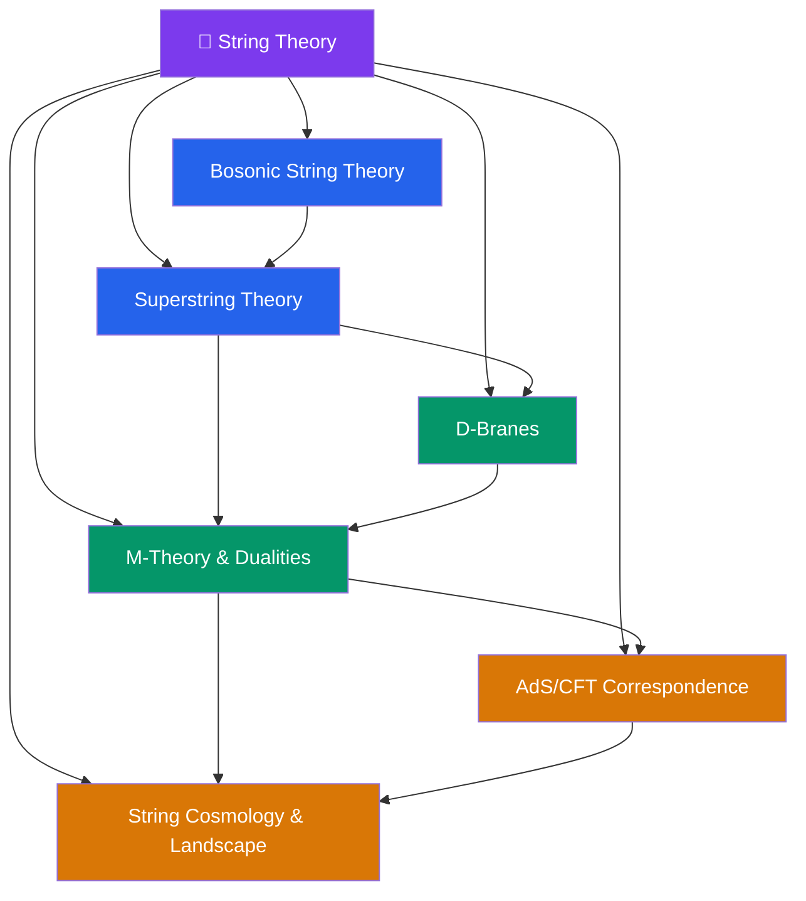

# 🌌 String Theory — Section Map

> [!abstract] About This Section
> String theory replaces point particles with one-dimensional extended objects — strings — whose vibrational modes give rise to all elementary particles (including the graviton). The theory requires extra spatial dimensions and is UV-finite. There are five consistent superstring theories in 10D, all connected by dualities and unified by the conjectured 11-dimensional M-theory. The AdS/CFT correspondence — the most precisely tested conjecture in modern theoretical physics — equates string theory in Anti-de Sitter space to a conformal field theory on the boundary. This section covers the classical and quantum mechanics of strings, D-branes, the duality web, AdS/CFT, and string cosmology.

## Section Architecture

## Notes in This Section

| Note | Core Topic | Level |
|------|-----------|-------|
| [[Bosonic_String_Theory]] | Nambu-Goto/Polyakov action, Virasoro algebra, critical dimension $D=26$ | UG → PhD |
| [[Superstring_Theory]] | NSR formalism, GSO projection, five superstring theories, anomaly cancellation | UG → PhD |
| [[D_Branes]] | Dirichlet boundary conditions, DBI action, D-brane charges, worldvolume gauge theory | UG → PhD |
| [[M_Theory_and_Dualities]] | S/T-duality web, 11D SUGRA, M2/M5-branes, F-theory | UG → PhD |
| [[AdS_CFT_Correspondence]] | Maldacena conjecture, holographic dictionary, applications | UG → PhD |
| [[String_Cosmology_and_Landscape]] | Compactification, moduli stabilization, landscape, swampland | UG → PhD |

## Recommended Learning Path

1. [[Bosonic_String_Theory]] — master the string quantization and Virasoro algebra before adding fermions
2. [[Superstring_Theory]] — add worldsheet fermions, GSO projection, arrive at the five theories
3. [[D_Branes]] — non-perturbative objects, open string endpoints, worldvolume physics
4. [[M_Theory_and_Dualities]] — the unification of all five theories via dualities
5. [[AdS_CFT_Correspondence]] — the deepest consequence of string theory: holography
6. [[String_Cosmology_and_Landscape]] — string theory meets cosmology and the CC problem

## Cross-Section Links

- [[_MOC_SUSY_Supergravity]] (Section 13) — SUSY is required for consistent superstring theory; SUGRA is the low-energy limit
- [[_MOC_Mathematical_Physics]] (Section 15) — differential geometry, fiber bundles, and CFT are essential mathematical tools
- [[Intro_to_Quantum_Field_Theory]] (Section 12) — QFT prerequisites: path integrals, anomalies, renormalization
- [[_MOC_Relativity]] (Section 06) — GR as the low-energy limit of closed string theory
- [[_MOC_Physics_Master|↑ Physics Master MOC]]

#MOC #physics #string-theory #section-moc
