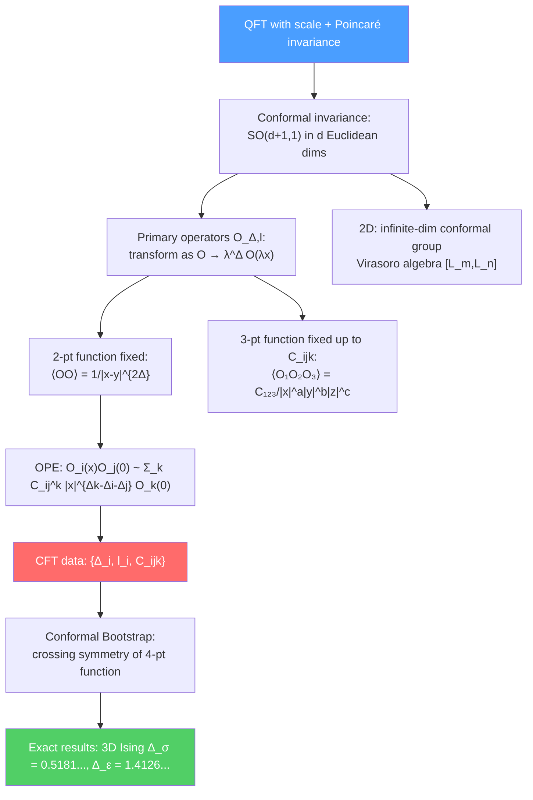

# 📐 Conformal Field Theory

> [!abstract] TL;DR
> A conformal field theory (CFT) is a quantum field theory invariant under conformal transformations — angle-preserving maps that include translations, rotations, dilations, and special conformal transformations. The conformal group in $d$ dimensions is $SO(d+1,1)$ (Euclidean) or $SO(d,2)$ (Minkowski). In 2D, conformal invariance is infinite-dimensional (Virasoro algebra), enabling exact solvability. CFT data — the set of primary operators $\{\mathcal{O}_i\}$ with dimensions $\Delta_i$ and spins $l_i$, and OPE coefficients $C_{ijk}$ — completely specifies the theory. The conformal bootstrap (crossing symmetry of 4-point functions) gives exact results for 3D critical exponents (Ising model!). CFTs appear as worldsheet theories in string theory, as boundary theories in AdS/CFT, and as universality classes at second-order phase transitions.

## Intuition — analogy FIRST

At a second-order phase transition (e.g., water at its critical point at $T_c = 374°C$, $P_c = 218$ atm), the correlation length $\xi \to \infty$ — the system looks the same at all length scales. This scale invariance, combined with Lorentz/rotation invariance, implies the full conformal symmetry. The theory at the critical point is a CFT: no dimensionful parameters, all observables are power laws.

The remarkable fact: a CFT is completely determined by its "spectrum data" — which operators exist and how they multiply (OPE coefficients). You don't need to know the Lagrangian or the microscopic details. The conformal bootstrap uses self-consistency of the OPE to determine the CFT data, giving exact critical exponents like $\nu = 0.6299$ for the 3D Ising model — better than any perturbative calculation.

---

## How It Works

---

## Key Concepts / Details

### Undergraduate Level

**Conformal Transformations**

A conformal transformation is a diffeomorphism $x\to x'(x)$ that preserves the metric up to a local scale factor:
$$g_{\mu\nu}'(x') = \Omega^2(x)g_{\mu\nu}(x)$$

In flat $\mathbb{R}^{d,1}$ (or $\mathbb{R}^d$ Euclidean), the conformal transformations are:
1. Translations: $x^\mu \to x^\mu + a^\mu$ ($d$ generators)
2. Rotations/Lorentz: $x^\mu \to \Lambda^\mu{}_\nu x^\nu$ ($d(d-1)/2$ generators)
3. Dilatation: $x^\mu \to \lambda x^\mu$ (1 generator $D$)
4. Special conformal transformations (SCT): $x^\mu \to \frac{x^\mu + b^\mu x^2}{1 + 2b\cdot x + b^2 x^2}$ ($d$ generators $K^\mu$)

Total: $\frac{(d+2)(d+1)}{2}$ generators, forming $\mathfrak{so}(d+1,1)$ (Euclidean) or $\mathfrak{so}(d,2)$ (Minkowski).

In $d=2$: the local conformal group is infinite-dimensional (any holomorphic function $z\to f(z)$ is locally conformal).

**Primary Operators**

An operator $\mathcal{O}$ is **primary** if it transforms simply under conformal transformations:
- Under dilatations: $\mathcal{O}(x) \to \lambda^\Delta\mathcal{O}(\lambda x)$ — $\Delta$ is the **conformal dimension**
- Under SCT: $[K^\mu, \mathcal{O}(0)] = 0$ (primary condition)
- **Spin $l$**: $\mathcal{O}$ transforms in the $(l/2,l/2)$ representation of $SO(d)$

Examples:
- Scalar: $l=0$. In 3D Ising: $\sigma$ (spin, $\Delta_\sigma \approx 0.518$), $\epsilon$ (energy, $\Delta_\epsilon \approx 1.413$)
- Stress tensor: $l=2$, $\Delta = d$ (exactly, from Ward identity)
- Current: $l=1$, $\Delta = d-1$ (conserved)

**Correlation Functions**

Conformal symmetry highly constrains correlation functions:

**2-point function** (completely fixed by symmetry):
$$\langle\mathcal{O}(x)\mathcal{O}(0)\rangle = \frac{1}{|x|^{2\Delta}}$$

(Up to normalization; $\Delta_1 \neq \Delta_2 \Rightarrow \langle\mathcal{O}_1\mathcal{O}_2\rangle = 0$)

**3-point function** (fixed up to OPE coefficient $C_{ijk}$):
$$\langle\mathcal{O}_1(x_1)\mathcal{O}_2(x_2)\mathcal{O}_3(x_3)\rangle = \frac{C_{123}}{|x_{12}|^{\Delta_1+\Delta_2-\Delta_3}|x_{23}|^{\Delta_2+\Delta_3-\Delta_1}|x_{13}|^{\Delta_1+\Delta_3-\Delta_2}}$$

**4-point function**: fixed up to a function of cross-ratios $u = \frac{x_{12}^2 x_{34}^2}{x_{13}^2 x_{24}^2}$, $v = \frac{x_{14}^2 x_{23}^2}{x_{13}^2 x_{24}^2}$.

**Operator Product Expansion (OPE)**

Two local operators can be expanded as a sum of local operators when their positions approach:
$$\mathcal{O}_i(x)\mathcal{O}_j(0) \sim \sum_k C_{ij}^k\,|x|^{\Delta_k-\Delta_i-\Delta_j}\left[\mathcal{O}_k(0) + \text{descendants}\right]$$

The OPE is an operator equation (convergent inside correlation functions). The **CFT data** $\{(\Delta_i, l_i)\text{ — spectrum}\} \cup \{C_{ijk}\text{ — OPE coefficients}\}$ completely determines all $n$-point functions via repeated use of the OPE.

### Graduate Level

**Virasoro Algebra (2D CFT)**

In 2D, the stress tensor $T(z) = \sum_n L_n z^{-n-2}$ has modes $L_n$ satisfying the **Virasoro algebra**:
$$[L_m, L_n] = (m-n)L_{m+n} + \frac{c}{12}m(m^2-1)\delta_{m+n,0}$$

where $c$ is the **central charge** (a fundamental parameter characterizing the 2D CFT).

The central charge measures:
- The total number of degrees of freedom: $c = 1$ per free boson, $c = 1/2$ per free Majorana fermion
- The Weyl anomaly: $\langle T^\mu_\mu\rangle = \frac{c}{12}R$ (Liouville action on a curved worldsheet)
- UV divergences in AdS/CFT: $c$ is proportional to $N^2$ for $\mathcal{N}=4$ SYM

**Minimal Models**

For rational values of $c < 1$, the CFT has a **finite** number of Virasoro primary fields — these are the **minimal models** $\mathcal{M}(p,p')$. The central charge:
$$c = 1 - \frac{6(p-p')^2}{pp'}$$

The scaling dimensions of primary fields:
$$h_{r,s} = \frac{(pr-p's)^2-(p-p')^2}{4pp'}$$

Examples:
- $\mathcal{M}(3,4)$ ($c=1/2$): the 2D Ising model at $T_c$ — exactly solved!
- $\mathcal{M}(4,5)$ ($c=7/10$): tricritical Ising
- $\mathcal{M}(5,6)$ ($c=4/5$): 3-state Potts model

**Kac-Moody Algebras (Affine Lie Algebras)**

A Kac-Moody algebra $\hat{\mathfrak{g}}_k$ is an affine extension of a Lie algebra $\mathfrak{g}$ at level $k$:
$$[J^a_m, J^b_n] = if^{abc}J^c_{m+n} + km\delta^{ab}\delta_{m+n,0}$$

The **Wess-Zumino-Witten (WZW) model** on a Lie group $G$ at level $k$ has Kac-Moody symmetry $\hat{\mathfrak{g}}_k$ and central charge:
$$c = \frac{k\dim(G)}{k + h^\vee}$$

where $h^\vee$ is the dual Coxeter number. WZW models are exactly solvable RCFTs and describe the worldsheet theory of strings on Lie group manifolds.

**Conformal Bootstrap**

The 4-point function $\langle\mathcal{O}\mathcal{O}\mathcal{O}\mathcal{O}\rangle$ can be decomposed in two ways (two OPE channels):
$$\langle\mathcal{O}\mathcal{O}\mathcal{O}\mathcal{O}\rangle = \sum_k|C_{\mathcal{O}\mathcal{O}k}|^2 g_{\Delta_k,l_k}(u,v) = \sum_k|C_{\mathcal{O}\mathcal{O}k}|^2 g_{\Delta_k,l_k}(v,u)$$

**Crossing symmetry** (consistency of the two decompositions) gives functional equations for the CFT data. The **numerical bootstrap** (Rattazzi-Rychkov-Tonni-Vichi, 2008; and subsequent work) uses semidefinite programming to:
1. Exclude regions of CFT data that violate crossing symmetry
2. Identify "kinks" in exclusion plots where known theories sit
3. Derive exact bounds on operator dimensions

**3D Ising Model Bootstrap Results** (Kos-Poland-Simmons-Duffin-Vichi, 2014):
$$\Delta_\sigma = 0.5181489(10), \quad \Delta_\epsilon = 1.412625(10)$$

These are the most precise determinations of 3D Ising critical exponents, far surpassing Monte Carlo and $\epsilon$-expansion results.

**Applications of CFT**

| Application | CFT Context |
|-------------|------------|
| String theory | Worldsheet theory in conformal gauge: 2D CFT with $c=26$ (bosonic) or $c=10$ (super) |
| AdS/CFT | Boundary theory is a $d$-dimensional CFT |
| Critical phenomena | $\phi^4$ theory at the Wilson-Fisher fixed point = 3D Ising CFT |
| Condensed matter | 1+1D quantum criticality (Tomonaga-Luttinger liquid = $c=1$ CFT) |
| Quantum gravity | Black hole entropy = CFT density of states via Cardy formula |

**Cardy Formula**

In 2D CFT, the density of states at large energy $\Delta \gg c$:
$$\rho(\Delta) \approx e^{2\pi\sqrt{c\Delta/6}}$$

The Bekenstein-Hawking entropy of a BTZ (2+1D) black hole matches:
$$S_{BH} = \frac{A}{4G_3} = 2\pi\sqrt{\frac{cL_0}{6}} = S_{Cardy}$$

This is a precise test of AdS/CFT in 3D.

---

## Real-World Notes

- **3D Ising universality class:** The critical exponents of water, iron, and uniaxial magnets at their second-order transitions all fall in the 3D Ising universality class. Bootstrap results match experimental measurements ($\nu = 0.6300\pm0.0015$ from experiment vs. $0.6299709(40)$ from bootstrap).
- **Conformal bootstrap revolution:** The modern bootstrap (2008–present) transformed CFT from a theoretical tool to a precision computation framework. It won Simmons-Duffin, Poland, and Rychkov the New Horizons in Physics Prize (2022).
- **$c$-theorem:** Zamolodchikov (1986) proved that in 2D, the central charge $c$ decreases along RG flows: $c_{UV} \geq c_{IR}$. In higher dimensions, the $a$-theorem (proven in 4D by Komargodski-Schwimmer, 2011) plays the analogous role.

---

## Common Pitfalls

- **The local conformal group in 2D ($\text{Diff}(S^1)$) is not a symmetry of the full theory.** Only a global $\text{SL}(2,\mathbb{C}) \cong SO(3,1)$ subgroup (Möbius transformations) acts consistently on the full Hilbert space. The Virasoro algebra is the central extension.
- **Descendants are not primary operators.** Acting with $L_{-n}$ ($n>0$) on a primary gives a "descendant" — part of the Virasoro module. Only primaries appear in the OPE independently.
- **Central charge $c$ is not the number of fields.** For interacting CFTs, $c$ can be irrational and is not simply proportional to the number of fields.
- **Bootstrap equations are necessary but not sufficient** conditions for consistency. They give bounds on CFT data, but isolated solutions could still be non-unitary or have other inconsistencies.

---

## Related Concepts

- [[Bosonic_String_Theory]] — Worldsheet theory is a 2D CFT at $c=26$; Virasoro algebra
- [[AdS_CFT_Correspondence]] — Boundary theory is a CFT; GKPW prescription
- [[Integrable_Systems]] — Minimal models and WZW models are integrable 2D QFTs
- [[Lie_Groups_and_Lie_Algebras]] — Kac-Moody algebras are affine extensions of Lie algebras
- [[Topology_in_Physics]] — Chern-Simons theory related to WZW CFT by holography
- [[_MOC_Mathematical_Physics|↑ Section MOC]]

---

## Review Questions

1. **(Undergraduate)** List the generators of the conformal group in $d$ dimensions. What is the total number of generators? What group is this isomorphic to?
2. **(Undergraduate)** Write the 2-point and 3-point functions of scalar primary operators, and show how conformal symmetry fixes their form (up to the OPE coefficient for the 3-point function).
3. **(Graduate)** State the Virasoro algebra. What is the central charge $c$? What are minimal models, and why is the 2D Ising model at $T_c$ a minimal model with $c=1/2$?
4. **(Graduate)** Explain the conformal bootstrap. What is crossing symmetry of the 4-point function? How does the numerical bootstrap give exact results for the 3D Ising critical exponents?

---

## Sources

- Di Francesco, Mathieu & Sénéchal, *Conformal Field Theory* (Springer, 1997) — the comprehensive reference
- Poland, Rychkov & Vichi, "The conformal bootstrap: Theory, numerical techniques, and applications," *Rev. Mod. Phys.* 91, 015002 (2019), arXiv:1805.04405
- Kos, Poland, Simmons-Duffin & Vichi, "Precision islands in the Ising and $O(N)$ models," *JHEP* 08, 036 (2016), arXiv:1603.04436
- Ginsparg, "Applied Conformal Field Theory," Les Houches lectures (1988), arXiv:hep-th/9108028 — classic review
- Polchinski, *String Theory, Vol. I* (Cambridge, 1998), Ch. 2 — string theory applications

#physics #CFT #conformal-field-theory #Virasoro-algebra #OPE #conformal-bootstrap #minimal-models #Kac-Moody #Cardy-formula
