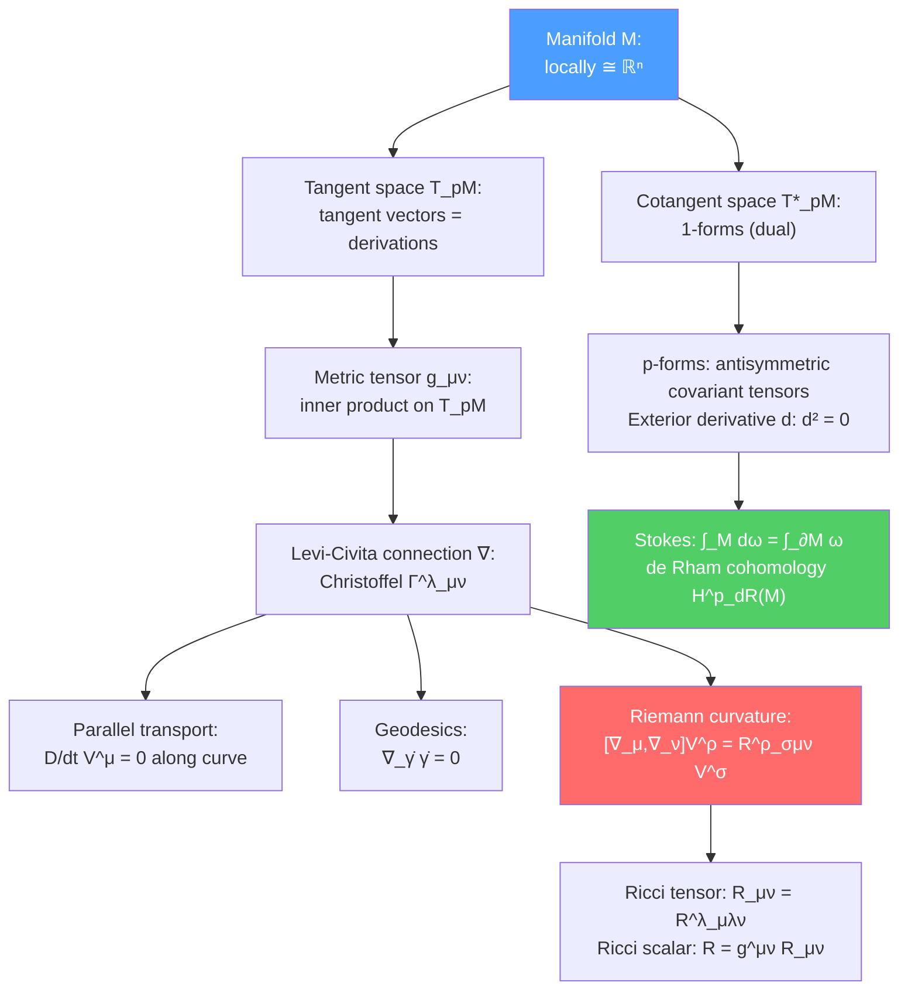

# 📐 Differential Geometry

> [!abstract] TL;DR
> Differential geometry provides the mathematical language for curved spacetime (GR), gauge theories, and string theory compactifications. A **manifold** is a topological space locally homeomorphic to $\mathbb{R}^n$. Tangent vectors are derivations; tensors are multilinear maps on tangent/cotangent spaces. The **Levi-Civita connection** $\nabla$ (determined by the metric) defines parallel transport and geodesics. The **Riemann curvature tensor** $R^\rho{}_{\sigma\mu\nu}$ measures the non-commutativity of parallel transport: $[\nabla_\mu,\nabla_\nu]V^\rho = R^\rho{}_{\sigma\mu\nu}V^\sigma$. Differential forms ($p$-forms) with exterior derivative $d$ and integration via Stokes' theorem give de Rham cohomology — topological invariants of the manifold.

## Intuition — analogy FIRST

Place an ant on a sphere. Locally, the ant sees flat ground (a flat patch homeomorphic to $\mathbb{R}^2$). But globally, if the ant walks in a "straight" line (geodesic), it curves around and comes back. If the ant carries an arrow and parallel-transports it around a closed path, the arrow comes back rotated — the rotation angle encodes the **curvature** of the sphere.

Differential geometry makes "locally flat, globally curved" precise. A manifold is built by patching together flat charts (like the Earth's atlas). The metric encodes distances. The connection encodes "straight" paths (parallel transport). The curvature tensor encodes the failure of parallel transport to be path-independent.

---

## How It Works

---

## Key Concepts / Details

### Undergraduate Level

**Manifolds**

A **smooth manifold** $M$ of dimension $n$ is a topological space with a collection of charts $(U_\alpha, \phi_\alpha)$ where $\phi_\alpha: U_\alpha \to \mathbb{R}^n$ are homeomorphisms, and transition maps $\phi_\beta\circ\phi_\alpha^{-1}$ are smooth (infinitely differentiable). Examples:
- $\mathbb{R}^n$: trivial, single chart
- $S^2$ (2-sphere): two charts (stereographic projections from north/south poles)
- $T^2$ (torus): product of two circles
- Lorentzian manifold: signature $(-,+,\ldots,+)$ — spacetime in GR

**Tangent Vectors**

At point $p\in M$, the **tangent space** $T_pM$ is the space of directional derivatives. A tangent vector $X\in T_pM$ acts on smooth functions: $X[f] = X^\mu\partial_\mu f$ in local coordinates. The basis $\{\partial_\mu\}$ spans $T_pM$.

The **cotangent space** $T^*_pM$ consists of 1-forms $\omega = \omega_\mu dx^\mu$ with $dx^\mu(\partial_\nu) = \delta^\mu_\nu$. A general **tensor** of type $(p,q)$:
$$T = T^{\mu_1\ldots\mu_p}{}_{\nu_1\ldots\nu_q}\,\partial_{\mu_1}\otimes\cdots\otimes\partial_{\mu_p}\otimes dx^{\nu_1}\otimes\cdots\otimes dx^{\nu_q}$$

**The Metric Tensor**

A **Riemannian metric** is a symmetric, positive-definite $(0,2)$ tensor $g = g_{\mu\nu}dx^\mu\otimes dx^\nu$. It defines:
- Inner product: $g(X,Y) = g_{\mu\nu}X^\mu Y^\nu$
- Lengths: $|X|^2 = g(X,X)$
- Raising/lowering indices: $V_\mu = g_{\mu\nu}V^\nu$
- Volume form: $\text{vol} = \sqrt{|g|}\,d^nx$

**The Levi-Civita Connection**

The unique connection $\nabla$ that is (1) torsion-free: $\nabla_\mu\partial_\nu - \nabla_\nu\partial_\mu = 0$, and (2) metric-compatible: $\nabla g = 0$. In components:
$$\nabla_\mu V^\nu = \partial_\mu V^\nu + \Gamma^\nu_{\mu\lambda}V^\lambda$$

where the Christoffel symbols:
$$\Gamma^\lambda_{\mu\nu} = \frac{1}{2}g^{\lambda\sigma}(\partial_\mu g_{\nu\sigma} + \partial_\nu g_{\mu\sigma} - \partial_\sigma g_{\mu\nu})$$

**Geodesics**

A **geodesic** is the "straightest" curve: $\nabla_{\dot\gamma}\dot\gamma = 0$, i.e.:
$$\frac{d^2x^\mu}{d\tau^2} + \Gamma^\mu_{\nu\lambda}\frac{dx^\nu}{d\tau}\frac{dx^\lambda}{d\tau} = 0$$

In GR, freely falling particles follow geodesics of the spacetime metric — gravity is geometry.

### Graduate Level

**Riemann Curvature Tensor**

The failure of parallel transport to commute:
$$[\nabla_\mu, \nabla_\nu]V^\rho = R^\rho{}_{\sigma\mu\nu}V^\sigma + T^\lambda{}_{\mu\nu}\nabla_\lambda V^\rho$$

For Levi-Civita ($T = 0$), the Riemann tensor:
$$R^\rho{}_{\sigma\mu\nu} = \partial_\mu\Gamma^\rho_{\nu\sigma} - \partial_\nu\Gamma^\rho_{\mu\sigma} + \Gamma^\rho_{\mu\lambda}\Gamma^\lambda_{\nu\sigma} - \Gamma^\rho_{\nu\lambda}\Gamma^\lambda_{\mu\sigma}$$

Symmetries:
- $R_{\rho\sigma\mu\nu} = -R_{\sigma\rho\mu\nu}$ (antisymmetric in first two)
- $R_{\rho\sigma\mu\nu} = -R_{\rho\sigma\nu\mu}$ (antisymmetric in last two)
- $R_{\rho\sigma\mu\nu} = R_{\mu\nu\rho\sigma}$ (pair symmetry)
- First Bianchi identity: $R^\rho{}_{\sigma[\mu\nu;\lambda]} = 0$
- Second Bianchi identity: $\nabla_{[\lambda}R^\rho{}_{|\sigma|\mu\nu]} = 0$ → $\nabla_\mu G^{\mu\nu} = 0$ (Einstein tensor is divergence-free)

**Ricci Tensor and Einstein Equations**

$$R_{\mu\nu} = R^\lambda{}_{\mu\lambda\nu}, \quad R = g^{\mu\nu}R_{\mu\nu}$$
$$G_{\mu\nu} = R_{\mu\nu} - \frac{1}{2}g_{\mu\nu}R = 8\pi G_N T_{\mu\nu}$$

**Geodesic Deviation (Tidal Forces)**

Two nearby geodesics separated by a deviation vector $J^\mu$:
$$\frac{D^2J^\mu}{d\tau^2} = R^\mu{}_{\nu\rho\sigma}\dot\gamma^\nu\dot\gamma^\rho J^\sigma$$

This is the **Jacobi equation**: tidal forces in GR are encoded in $R^\mu{}_{\nu\rho\sigma}$. In the Newtonian limit, $R^i{}_{0j0} = \partial_i\partial_j\Phi$ (second derivatives of Newton's potential).

**Differential Forms**

A $p$-form is a completely antisymmetric $(0,p)$ tensor. The space of $p$-forms on $M$ is $\Omega^p(M)$:
$$\omega = \frac{1}{p!}\omega_{\mu_1\ldots\mu_p}dx^{\mu_1}\wedge\cdots\wedge dx^{\mu_p}$$

The **exterior derivative** $d: \Omega^p \to \Omega^{p+1}$:
$$d\omega = \frac{1}{p!}\partial_{[\nu}\omega_{\mu_1\ldots\mu_p]}dx^\nu\wedge dx^{\mu_1}\wedge\cdots\wedge dx^{\mu_p}$$

Key property: $d^2 = 0$ (exact $\Rightarrow$ closed, i.e., $d(d\omega) = 0$).

**The Hodge Star $\star$**

In $n$-dimensional Riemannian manifold, the Hodge dual $\star: \Omega^p \to \Omega^{n-p}$:
$$(\star\omega)_{\mu_{p+1}\ldots\mu_n} = \frac{\sqrt{|g|}}{p!}\epsilon^{\mu_1\ldots\mu_p}{}_{\mu_{p+1}\ldots\mu_n}\omega_{\mu_1\ldots\mu_p}$$

The codifferential: $\delta = (-1)^{n(p+1)+1}\star d\star$. The Laplace-Beltrami operator: $\Delta = d\delta + \delta d$. Harmonic forms: $\Delta\omega = 0$ (both closed and coclosed).

**Stokes' Theorem and de Rham Cohomology**

**Stokes' theorem** on a manifold with boundary:
$$\int_M d\omega = \int_{\partial M}\omega$$

This generalizes the fundamental theorem of calculus, Green's theorem, and Gauss's theorem.

**de Rham cohomology:** $H^p_{dR}(M) = \ker(d:\Omega^p\to\Omega^{p+1})/\text{im}(d:\Omega^{p-1}\to\Omega^p)$ (closed $p$-forms modulo exact). The Betti numbers $b_p = \dim H^p_{dR}(M)$ are topological invariants (independent of metric). Euler characteristic: $\chi(M) = \sum_p(-1)^p b_p$.

By de Rham's theorem: $H^p_{dR}(M) \cong H^p(M;\mathbb{R})$ (singular cohomology with real coefficients).

**Kähler Manifolds**

A Kähler manifold is a complex manifold with a compatible symplectic form $\omega = ig_{i\bar{j}}dz^i\wedge d\bar{z}^{\bar{j}}$ (the Kähler form, closed: $d\omega = 0$). Kähler manifolds appear in SUGRA (target space of $\mathcal{N}=1$ scalar fields), Calabi-Yau compactifications, and moduli spaces of supersymmetric theories.

---

## Real-World Notes

- **GR as differential geometry:** Einstein's equations are a statement about the Ricci tensor of a Lorentzian manifold. Gravitational waves (LIGO) are ripples in the metric — perturbations $g_{\mu\nu} = \eta_{\mu\nu} + h_{\mu\nu}$.
- **Calabi-Yau manifolds:** The compact dimensions in string compactifications are Ricci-flat Kähler manifolds (Calabi-Yau). Their topology (Hodge numbers $h^{p,q}$) determines the low-energy physics.
- **Gauge theory:** Maxwell's equations in vacuum: $dF = 0$ (Bianchi identity), $d\star F = 0$ (equations of motion). The most elegant formulation is in terms of differential forms.

---

## Common Pitfalls

- **Tensors transform; coordinates don't.** A tensor is a geometric object independent of coordinate choice. Its components $T^{\mu}{}_\nu$ change with coordinates, but the tensor $T$ does not.
- **Christoffel symbols are not tensors.** $\Gamma^\lambda_{\mu\nu}$ has a non-tensorial transformation law (hence covariant derivatives, not partial derivatives, appear in physics equations).
- **$d^2 = 0$ is the key identity.** It implies that exact forms are closed ($d(df) = 0$) and that the exterior derivative squares to zero — the foundation of de Rham cohomology and the Bianchi identities in gauge theory.
- **Parallel transport is path-dependent on a curved manifold.** The holonomy (overall rotation after parallel transport around a closed loop) measures curvature — this is the Wilson loop in gauge theory.

---

## Related Concepts

- [[Fiber_Bundles_and_Gauge_Theory]] — Principal bundles generalize parallel transport; gauge field = connection
- [[Topology_in_Physics]] — de Rham cohomology meets homotopy; characteristic classes
- [[Supergravity]] — SUGRA uses Kähler geometry and the vierbein formalism
- [[String_Cosmology_and_Landscape]] — Calabi-Yau compactifications require Ricci-flat manifolds
- [[Conformal_Field_Theory]] — The Riemann surface is the string theory worldsheet
- [[_MOC_Mathematical_Physics|↑ Section MOC]]

---

## Review Questions

1. **(Undergraduate)** Define a smooth manifold. Give two examples. What is the tangent space at a point, and how is a tangent vector defined as a derivation?
2. **(Undergraduate)** State the Stokes' theorem on manifolds. Show that it reduces to Green's theorem in 2D and the Gauss divergence theorem in 3D.
3. **(Graduate)** Derive the Riemann curvature tensor as the commutator of covariant derivatives. Show that $R^\rho{}_{\sigma\mu\nu}$ measures the failure of parallel transport around an infinitesimal loop.
4. **(Graduate)** Define de Rham cohomology $H^p_{dR}(M)$. Compute $H^*_{dR}(S^2)$ (i.e., find all Betti numbers for the 2-sphere). What is the Euler characteristic of $S^2$?

---

## Sources

- Nakahara, *Geometry, Topology and Physics* (IOP, 2nd ed., 2003) — the standard physics reference
- Carroll, *Spacetime and Geometry* (Addison-Wesley, 2004), Ch. 2–3 — excellent GR motivation
- Wald, *General Relativity* (Chicago, 1984), Appendix B — rigorous treatment
- Bott & Tu, *Differential Forms in Algebraic Topology* (Springer, 1982) — de Rham cohomology
- Eguchi, Gilkey & Hanson, "Gravitation, gauge theories and differential geometry," *Phys. Rep.* 66, 213 (1980) — classic physics-oriented review

#physics #differential-geometry #manifolds #Riemann-curvature #differential-forms #de-Rham-cohomology #Stokes-theorem #geodesics
