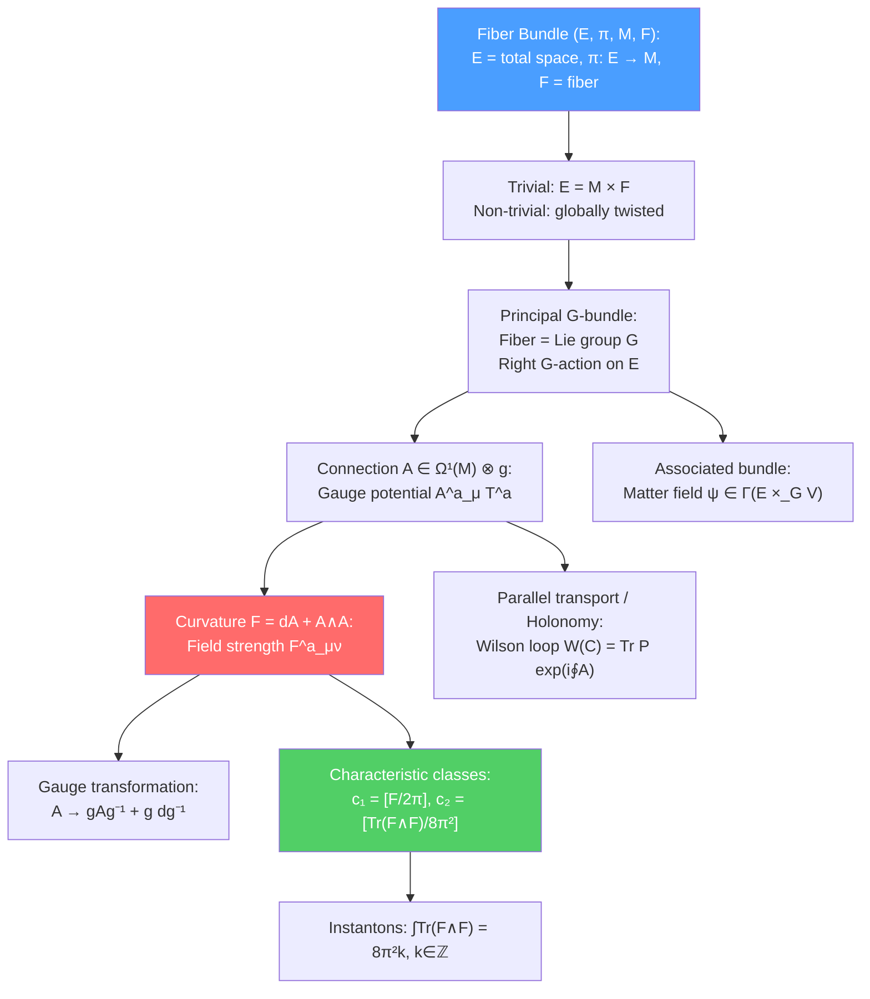

# 📐 Fiber Bundles and Gauge Theory

> [!abstract] TL;DR
> A **fiber bundle** is a space that locally looks like a product $U\times F$ (base $\times$ fiber) but is globally twisted. **Principal $G$-bundles** have the Lie group $G$ as the fiber; a **connection** on a principal bundle is a Lie-algebra-valued 1-form $A = A_\mu^a T^a dx^\mu$ (the gauge potential). The **curvature** $F = dA + A\wedge A$ (field strength) measures the non-commutativity of parallel transport in the fiber. Gauge invariance = freedom to choose a section (trivialization) of the bundle. Characteristic classes (Chern, Pontryagin) are topological invariants: the first Chern class $c_1 = [F/2\pi]$ counts magnetic monopoles; the instanton number $k = \frac{1}{8\pi^2}\int\text{Tr}(F\wedge F)\in\mathbb{Z}$ is a topological charge.

## Intuition — analogy FIRST

A Möbius strip is a fiber bundle: the base is a circle ($S^1$), the fiber is a line segment, and the bundle is twisted — you can't define a global orientation (section) for the fiber. A cylinder is the trivial bundle $S^1\times[0,1]$ — no twist.

In gauge theory, the fiber is a Lie group $G$ and the "twist" at each point is the gauge field. An electron at position $x$ has a "phase" living in $\text{U}(1)$ — the fiber above $x$. Moving the electron around a loop, the phase accumulates: $e^{i\oint A}$ (Aharonov-Bohm effect). If the bundle is non-trivially twisted (non-zero magnetic flux through the loop), this phase is non-trivial — the bundle has a non-trivial Chern class.

---

## How It Works

---

## Key Concepts / Details

### Undergraduate Level

**Fiber Bundles**

A **fiber bundle** $(E, \pi, M, F)$ consists of:
- $E$: total space
- $M$: base manifold
- $\pi: E\to M$: projection ($\pi^{-1}(p) \cong F$ for each $p\in M$)
- $F$: typical fiber

Local triviality: each point has a neighborhood $U\subset M$ with $\pi^{-1}(U) \cong U\times F$. Globally, the bundle may be twisted — encoded in transition functions $g_{\alpha\beta}: U_\alpha\cap U_\beta \to G$ (for a $G$-bundle, $G$ acts on $F$).

**Principal $G$-Bundle**

The fiber $F = G$ (a Lie group), with $G$ acting on the right: $p\cdot g$ for $p\in E$, $g\in G$. The gauge group is the group of bundle automorphisms. Key examples:
- $\text{U}(1)$ bundle: electromagnetism ($F_{\mu\nu} = \partial_\mu A_\nu - \partial_\nu A_\mu$)
- $\text{SU}(2)$ bundle: weak force
- $\text{SU}(3)$ bundle: strong force (QCD)
- Frame bundle: $GL(n)$ bundle encoding the tangent bundle of a Riemannian manifold

**The Gauge Potential as a Connection**

A **connection** on a principal $G$-bundle: $\mathcal{A} \in \Omega^1(P)\otimes\mathfrak{g}$ (a $\mathfrak{g}$-valued 1-form on the total space $P$). Pulled back to the base via a local section $s: U\to P$:
$$A = s^*\mathcal{A} = A_\mu^a T^a dx^\mu$$

The connection specifies how to "parallel transport" in the fiber direction. Under a gauge transformation $g(x) \in G$:
$$A_\mu \to g A_\mu g^{-1} + g\partial_\mu g^{-1}$$

**The Field Strength (Curvature)**

The curvature 2-form:
$$F = dA + A\wedge A = \left(\frac{1}{2}F_{\mu\nu}^a T^a\right)dx^\mu\wedge dx^\nu$$

where $F_{\mu\nu}^a = \partial_\mu A_\nu^a - \partial_\nu A_\mu^a + f^{abc}A_\mu^b A_\nu^c$. Under gauge transformation: $F \to gFg^{-1}$ — covariant, not invariant.

The Bianchi identity: $DF = dF + [A, F] = 0$ (from $D^2 = 0$), which gives $D_{[\lambda}F_{\mu\nu]} = 0$ — the non-abelian generalization of $\partial_{[\lambda}F_{\mu\nu]} = 0$.

**Gauge Invariance = Section Choice**

A "gauge transformation" is equivalent to choosing a different local section (trivialization) of the principal bundle. Physical observables must be section-independent (gauge invariant). The Yang-Mills action $S = \frac{1}{4g^2}\int\text{Tr}(F_{\mu\nu}F^{\mu\nu})$ is gauge invariant because $F \to gFg^{-1}$ and the trace is invariant.

### Graduate Level

**Associated Bundles and Matter Fields**

Given a principal $G$-bundle $P$ and a representation $\rho: G\to GL(V)$, the **associated bundle** $E = P\times_G V$ has matter fields as sections: $\psi: M\to E$ is a "charged" field transforming in representation $V$. For a quark in QCD: $V = \mathbf{3}$ (fundamental of $SU(3)$), $\psi(x)$ is a color triplet.

The **covariant derivative** of a section $\psi$:
$$D_\mu\psi = \partial_\mu\psi + A_\mu^a\rho(T^a)\psi$$

ensures that $D_\mu\psi$ transforms covariantly under gauge transformations: $D_\mu\psi \to g(x)D_\mu\psi$.

**Wilson Loops and Holonomy**

The **holonomy** of the connection around a closed loop $C$:
$$W(C) = \text{Tr}\,\mathcal{P}\exp\left(i\oint_C A_\mu dx^\mu\right)$$

is a gauge-invariant observable (Wilson loop). Physical significance:
- In QED: Aharonov-Bohm phase $W(C) = e^{i\oint A}$
- In QCD: for large loops, $\langle W(C)\rangle \sim e^{-\sigma\cdot\text{Area}(C)}$ (**area law**) — signature of confinement; for small loops, $\langle W(C)\rangle \sim e^{-\lambda\cdot\text{Perimeter}(C)}$ (**perimeter law**) in the deconfined phase

**Characteristic Classes**

Topological invariants of fiber bundles, defined via curvature forms:

**First Chern Class** $c_1(E)$:
$$c_1 = \frac{i}{2\pi}F \in H^2(M;\mathbb{Z})$$

For a $\text{U}(1)$ bundle: $c_1 = [F/2\pi]$ — counts the magnetic monopole charge enclosed. $\int_S c_1 \in \mathbb{Z}$ for any closed surface $S$.

**Second Chern Class (Instanton Number)**:
$$c_2 = \frac{1}{8\pi^2}\text{Tr}(F\wedge F) \in H^4(M;\mathbb{Z})$$

The **instanton number** $k = \int_M c_2 \in \mathbb{Z}$ for $\text{SU}(2)$ or $\text{SU}(N)$ gauge theories. Instantons are (anti-)self-dual solutions to Yang-Mills equations ($F = \pm\star F$, $k = \pm 1$) that minimize the action.

**Chern-Simons Form**

The Chern-Simons 3-form:
$$\omega_{CS} = \text{Tr}\left(A\wedge dA + \frac{2}{3}A\wedge A\wedge A\right)$$

satisfies $d\omega_{CS} = \text{Tr}(F\wedge F)$. The Chern-Simons action in 3D:
$$S_{CS} = \frac{k}{4\pi}\int_M\text{Tr}\left(A\wedge dA + \frac{2}{3}A^3\right)$$

is a topological QFT (no metric needed): its partition function and observables (Wilson loops) are topological invariants (knot polynomials, Jones polynomial). Applications: quantum Hall effect, topological insulators, string theory (Green-Schwarz term).

**Atiyah-Singer Index Theorem**

The index of the Dirac operator $\slashed{D}$ on a $4n$-manifold:
$$\text{ind}(\slashed{D}) = n_+ - n_- = \int_M\hat{A}(R)\wedge\text{ch}(F)$$

where $n_\pm$ are the numbers of positive/negative chirality zero modes, $\hat{A}(R)$ is the Dirac genus (from curvature), and $\text{ch}(F)$ is the Chern character of the gauge bundle. This is a deep result connecting analysis (spectrum of $\slashed{D}$) to topology (characteristic classes).

In physics: the Atiyah-Singer theorem counts fermionic zero modes in an instanton background ($n_+ - n_- = k$ for instanton number $k$) — relevant for anomalies and non-perturbative effects.

---

## Real-World Notes

- **Dirac magnetic monopole:** A monopole of charge $n_m$ corresponds to a $\text{U}(1)$ bundle over $S^2$ with first Chern number $c_1 = n_m$. Dirac's quantization condition $n_e n_m \in 2\pi\mathbb{Z}$ is the statement that the bundle is topologically consistent.
- **QCD instantons and the $\theta$-vacuum:** The strong CP problem involves the QCD $\theta$-angle $\theta\int\text{Tr}(F\wedge F)/32\pi^2$. Instantons interpolate between different $\theta$-vacua; the axion solves the strong CP problem by making $\theta$ dynamical.
- **Topological insulators:** The $\mathbb{Z}_2$ topological invariant of a topological insulator is a Chern number computed from the Berry curvature of filled bands — a direct application of the theory of connections on vector bundles.

---

## Common Pitfalls

- **The gauge field is a connection, not a tensor.** $A_\mu$ is not gauge-covariant ($A_\mu \to gA_\mu g^{-1} + g\partial_\mu g^{-1}$); only $F_{\mu\nu}$ is covariant. Physical observables must be built from $F$ or Wilson loops.
- **The Chern-Simons form is not gauge-invariant.** Under a gauge transformation: $\omega_{CS} \to \omega_{CS} + d(\ldots) + k\cdot$(winding number term). The Chern-Simons action is gauge-invariant only modulo $2\pi k$ — consistent for the path integral if $k$ is quantized.
- **Instantons live in Euclidean space.** Self-dual solutions $F = \star F$ require Euclidean signature. In Lorentzian signature, self-duality would require imaginary field strengths.
- **Chern classes are integral cohomology classes.** $c_n \in H^{2n}(M;\mathbb{Z})$ — the integrality is the statement that the bundle is classified by an integer topological charge.

---

## Related Concepts

- [[Differential_Geometry]] — Connections on principal bundles generalize the Levi-Civita connection
- [[Lie_Groups_and_Lie_Algebras]] — $G$ and $\mathfrak{g}$ are the structure group and algebra of the bundle
- [[Topology_in_Physics]] — Characteristic classes, homotopy classification, topological defects
- [[Intro_to_Quantum_Field_Theory]] — Gauge theories as the physical realization of fiber bundles
- [[SUSY_Lagrangians]] — SUSY gauge theories use vector superfields = connections on super-bundles
- [[_MOC_Mathematical_Physics|↑ Section MOC]]

---

## Review Questions

1. **(Undergraduate)** Define a principal $G$-bundle. What is the gauge potential $A_\mu$? Show how it transforms under a gauge transformation.
2. **(Undergraduate)** Compute the field strength $F_{\mu\nu}$ from $A_\mu$ for $\text{U}(1)$ electromagnetism. Show that it satisfies the Bianchi identity $\partial_{[\lambda}F_{\mu\nu]} = 0$.
3. **(Graduate)** Define the first and second Chern classes using the curvature 2-form $F$. What is the physical interpretation of $c_1$ for a $\text{U}(1)$ bundle over $S^2$? What is the instanton number $k$ for an $\text{SU}(2)$ gauge theory on $S^4$?
4. **(Graduate)** State the Atiyah-Singer index theorem for the Dirac operator on a 4-manifold. What does it imply for the number of fermionic zero modes in an instanton background of topological charge $k$?

---

## Sources

- Nakahara, *Geometry, Topology and Physics* (IOP, 2003), Ch. 9–11 — the standard physics reference
- Eguchi, Gilkey & Hanson, "Gravitation, gauge theories and differential geometry," *Phys. Rep.* 66, 213 (1980)
- Atiyah & Singer, "The index of elliptic operators I–V," *Ann. Math.* (1968–1971)
- Weinberg, *The Quantum Theory of Fields, Vol. II* (Cambridge, 1996), Ch. 15–16 — gauge theories
- Chern, "Characteristic classes of Hermitian manifolds," *Ann. Math.* 47, 85 (1946) — original paper

#physics #fiber-bundles #gauge-theory #principal-bundle #connection #Chern-class #Wilson-loop #instanton #Chern-Simons #Atiyah-Singer
