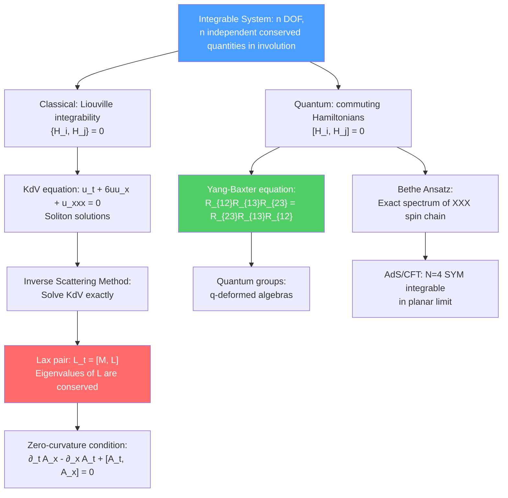

# 📐 Integrable Systems

> [!abstract] TL;DR
> An integrable system has exactly enough conserved quantities to be solved exactly — no approximations needed. For a classical system with $n$ degrees of freedom, Liouville integrability requires $n$ independent, Poisson-commuting conserved quantities. The KdV equation $u_t + 6uu_x + u_{xxx} = 0$ is the paradigmatic integrable PDE, admitting **soliton** solutions that maintain shape and speed after collision. The **Lax pair** formalism $(L_t = [M,L])$ encodes integrability algebraically; the **inverse scattering method** solves the Cauchy problem exactly. The **Bethe ansatz** gives the exact energy spectrum of quantum integrable models like the XXX Heisenberg spin chain. The **Yang-Baxter equation** $R_{12}R_{13}R_{23} = R_{23}R_{13}R_{12}$ is the fundamental consistency condition for integrability and underlies quantum groups.

## Intuition — analogy FIRST

Most differential equations describing physical systems are non-linear and have no exact solutions — we resort to perturbation theory or numerics. But some special systems are "too symmetric" to be chaotic: they have so many conserved quantities that the motion is completely constrained. These are integrable systems.

A soliton is the most vivid example: a water wave discovered by John Scott Russell in 1834, who watched a solitary wave roll along a Scottish canal for miles without dispersing. Unlike typical waves that spread out and deform, a soliton maintains its exact shape. When two solitons collide, they pass through each other and emerge unchanged — the only trace of the collision being a phase shift. This "elastic" scattering is the hallmark of integrability.

---

## How It Works

---

## Key Concepts / Details

### Undergraduate Level

**Liouville Integrability**

A classical Hamiltonian system with $n$ degrees of freedom is **Liouville-integrable** if it has $n$ independent conserved quantities $H_1 = H, H_2, \ldots, H_n$ in involution:
$$\{H_i, H_j\} = 0 \quad \text{for all } i,j$$

(where $\{\cdot,\cdot\}$ is the Poisson bracket). By the Liouville-Arnold theorem, the motion takes place on invariant tori $T^n$ in phase space — quasi-periodic motion (no chaos).

Examples of integrable systems:
- Harmonic oscillator: $H = \frac{p^2}{2m} + \frac{1}{2}m\omega^2 q^2$ — trivially integrable
- Kepler problem (gravitational 2-body): conserved energy + angular momentum + Laplace-Runge-Lenz vector
- Euler top (rigid body without gravity): 3 conserved quantities for 3 DOF
- Calogero-Moser system: $n$ particles on a line with $1/r^2$ potential — $n$ conserved quantities

**The KdV Equation**

The Korteweg-de Vries (KdV) equation:
$$u_t + 6uu_x + u_{xxx} = 0$$

(where $u = u(x,t)$ is a wave height). This combines:
- $6uu_x$: non-linear steepening (like a shock wave)
- $u_{xxx}$: dispersive spreading

These two effects balance exactly in a soliton solution. The one-soliton:
$$u(x,t) = -\frac{v}{2}\,\text{sech}^2\left(\frac{\sqrt{v}}{2}(x - vt - x_0)\right)$$

parameterized by velocity $v > 0$ (faster = taller = narrower). Key property: faster solitons are taller and narrower, so $\text{height}\times\text{width}^2 = \text{const}$.

**Soliton Collision**

Two-soliton solution: two solitons ($v_1 > v_2$, faster one catches up) pass through each other with unchanged velocities, emerging with only a phase shift $\delta = \frac{1}{2}\ln\left|\frac{v_1-v_2}{v_1+v_2}\right|$. No energy is lost; the collision is perfectly elastic. This remarkable property follows from the infinite tower of conservation laws of KdV.

**Conservation Laws of KdV**

KdV has infinitely many conserved quantities $H_n = \int \rho_n\,dx$:
- $H_0 = \int u\,dx$ (mass)
- $H_1 = \int u^2\,dx$ (momentum)
- $H_2 = \int(u^3 - \frac{1}{2}u_x^2)\,dx$ (energy)
- $H_3, H_4, \ldots$ (higher conservation laws)

The existence of infinitely many conservation laws is the hallmark of integrability in PDEs.

### Graduate Level

**The Lax Pair Formulation**

Lax (1968) reformulated KdV integrability: find a pair of linear operators $L$ (a Schrödinger-like operator) and $M$ such that the evolution equation is equivalent to:
$$\frac{dL}{dt} = [M, L]$$

For KdV: $L = -\partial_x^2 + u(x,t)$ and $M = -4\partial_x^3 + 6u\partial_x + 3u_x$.

The eigenvalue equation $L\psi = \lambda\psi$ with $L_t = [M,L]$ implies that $\lambda_t = 0$ — the eigenvalues of $L$ are **conserved quantities**! These are the $H_n$.

The Lax pair reformulation is powerful: it converts the non-linear PDE into an isospectral deformation problem of a linear operator.

**Inverse Scattering Method**

The inverse scattering method solves the KdV Cauchy problem $u(x,0) = u_0(x)$ exactly:

1. **Direct problem:** Compute the scattering data $\{k_n, c_n, R(k)\}$ of $L = -\partial_x^2 + u_0$ at $t=0$ — eigenvalues $\lambda_n = -k_n^2$ and reflection coefficient $R(k)$.
2. **Time evolution:** The scattering data evolves trivially: $k_n(t) = k_n$, $c_n(t) = c_n e^{4k_n^3 t}$, $R(k,t) = R(k,0)e^{8ik^3t}$.
3. **Inverse problem:** Reconstruct $u(x,t)$ from the time-evolved scattering data via the Gel'fand-Levitan-Marchenko integral equation.

Solitons correspond to bound states ($k_n^2 < 0$); the $N$-soliton solution is obtained from $N$ discrete eigenvalues.

**Zero-Curvature Condition**

For integrable equations in general, the Lax pair can be written as a gauge connection $(A_x, A_t)$ on a fiber bundle. The equation of motion is:
$$\partial_t A_x - \partial_x A_t + [A_t, A_x] = 0$$

This is the **zero-curvature condition** (flat connection). The spectral parameter $\lambda$ (in $A_{x,t}(\lambda)$) generates the infinite tower of conservation laws by expansion in $\lambda$.

This viewpoint makes integrability a geometric statement: the equations of motion = flatness of a gauge connection.

**Bethe Ansatz**

The **XXX Heisenberg spin chain**: $N$ spin-1/2 sites on a ring with exchange coupling:
$$H = -J\sum_{i=1}^N\vec{S}_i\cdot\vec{S}_{i+1}$$

The Bethe ansatz assumes a wave function of the form:
$$|\psi\rangle = \sum_{x_1<\ldots<x_M}\psi(x_1,\ldots,x_M)|x_1,\ldots,x_M\rangle$$

where $M$ flipped spins move with momenta $k_j$. The key equation: **Bethe equations**:
$$e^{ik_j L} = \prod_{m\neq j}\frac{k_j - k_m + i}{k_j - k_m - i}$$

(from periodic boundary conditions + two-body scattering). The energy:
$$E = -2J\sum_{j=1}^M(\cos k_j - 1)$$

The Bethe ansatz gives the **exact energy spectrum** of the spin chain for any $N$ — no approximations. The $S$-matrix is simply $S(k_j, k_m) = (k_j - k_m + i)/(k_j - k_m - i)$ (rationally dependent on momenta).

**Yang-Baxter Equation**

The key consistency condition for Bethe ansatz integrability: for three particles with momenta, the $S$-matrix $R_{12}(\lambda)$ (acting on particles 1 and 2 with spectral parameter $\lambda$) satisfies:
$$R_{12}(\lambda-\mu)R_{13}(\lambda)R_{23}(\mu) = R_{23}(\mu)R_{13}(\lambda)R_{12}(\lambda-\mu)$$

(acting on $V\otimes V\otimes V$). The Yang-Baxter equation (YBE) is the "master equation" of integrability: any solution $R(\lambda)$ of YBE gives an integrable system.

Solutions of YBE include:
- Rational: $R = I + \frac{\eta P}{\lambda}$ (XXX chain)
- Trigonometric: $R = \sin(\lambda+\eta)I + \sin\eta\, P$ (XXZ chain)
- Elliptic: (XYZ chain)

**Quantum Groups**

Taking the limit of the YBE as the deformation parameter $q \to 1$, one obtains Lie algebra symmetry. For $q \neq 1$, the symmetry is a **quantum group** $U_q(\mathfrak{g})$ — a $q$-deformation of the universal enveloping algebra. Quantum groups classify all rational solutions of YBE. They appear in:
- Integrable spin chains (anisotropic XXZ model: $q = e^{i\gamma}$)
- Topological QFT (Chern-Simons with rational $k$ → quantum $\text{SU}(2)$ at level $k$)
- Knot theory (quantum group invariants generalize the Jones polynomial)

**Sine-Gordon and Massive Thirring Duality**

The sine-Gordon equation:
$$\phi_{tt} - \phi_{xx} + \sin\phi = 0$$

has kink solutions ($\phi: 0\to 2\pi$) and antikinks ($\phi: 2\pi\to 0$) with elastic scattering. Coleman (1975): sine-Gordon theory is exactly dual to the massive Thirring model (a fermionic theory) via bosonization — one of the first non-trivial examples of a strong-weak duality in 2D QFT.

**AdS/CFT and Integrability**

A spectacular application: $\mathcal{N}=4$ SYM in the planar limit ($N\to\infty$) is integrable! The anomalous dimensions of operators can be computed using a spin chain Bethe ansatz (Minahan-Zarembo, 2002, for the $SO(6)$ sector). The full asymptotic Bethe ansatz for the planar spectrum was developed in 2004–2006.

This means: all single-trace operator dimensions in $\mathcal{N}=4$ SYM (at any $\lambda$, in the planar limit) can be computed exactly from a generalized spin chain — a remarkable connection between AdS/CFT and integrability.

---

## Real-World Notes

- **Fiber optics and solitons:** The non-linear Schrödinger equation (NLS) $i\psi_t + \psi_{xx} + |\psi|^2\psi = 0$ is integrable and admits optical solitons. Soliton pulse propagation in optical fibers (with Kerr non-linearity + dispersion balanced) is the foundation of long-distance fiber optic communication.
- **Bethe ansatz in condensed matter:** Exact solutions of 1D quantum systems (Bose gas, Hubbard model, Kondo problem) use the Bethe ansatz. The Hubbard model in 1D (electrons on a lattice with on-site repulsion $U$) was solved exactly by Lieb and Wu (1968) using Bethe ansatz.
- **Quantum computing:** The Yang-Baxter equation appears in topological quantum computing via anyons and braid groups. Unitary solutions of YBE give quantum gates that are inherently fault-tolerant.

---

## Common Pitfalls

- **Integrability is fragile.** Adding even a small perturbation to an integrable system generically destroys integrability — the KAM theorem shows that most of the invariant tori survive small perturbations, but the integrability structure (infinitely many conserved quantities) is destroyed.
- **Soliton collisions are elastic, but not trivial.** After collision, solitons re-emerge with a phase shift — the position of each soliton is shifted compared to where it would have been without collision.
- **The Bethe ansatz requires periodic boundary conditions** (or twist). For open chains, a modified (boundary) Bethe ansatz applies. The Bethe equations are exact only in the thermodynamic $N\to\infty$ limit for many purposes.
- **The Yang-Baxter equation is necessary but not sufficient for exact solvability** of the full model. You also need boundary conditions, the Hilbert space structure, and the physical interpretation of the $R$-matrix.

---

## Related Concepts

- [[Conformal_Field_Theory]] — Minimal models and WZW models are integrable 2D CFTs; CFT describes gapless integrable systems
- [[Topology_in_Physics]] — Topological charges of solitons; Chern-Simons from CS/WZW correspondence
- [[AdS_CFT_Correspondence]] — $\mathcal{N}=4$ SYM integrable in planar limit; Bethe ansatz for anomalous dimensions
- [[Differential_Geometry]] — Zero-curvature condition as a geometric formulation of integrability
- [[Fiber_Bundles_and_Gauge_Theory]] — Lax pair as gauge connection; integrability = flat connection
- [[_MOC_Mathematical_Physics|↑ Section MOC]]

---

## Review Questions

1. **(Undergraduate)** What is a soliton? State the 1-soliton solution of the KdV equation. What happens when two solitons collide?
2. **(Undergraduate)** Define Liouville integrability for a classical Hamiltonian system. Give three physical examples of integrable systems.
3. **(Graduate)** State the Lax pair formulation of KdV integrability. Show that the Lax equation $L_t = [M,L]$ implies that the eigenvalues of $L$ are conserved.
4. **(Graduate)** State the Yang-Baxter equation. What is a quantum group, and how does it arise as a $q$-deformation of a Lie algebra? Explain the role of the YBE in the Bethe ansatz solution of the XXX spin chain.

---

## Sources

- Drazin & Johnson, *Solitons: an Introduction* (Cambridge, 1989) — classical reference
- Gardner, Greene, Kruskal & Miura, "Method for solving the Korteweg-de Vries equation," *Phys. Rev. Lett.* 19, 1095 (1967) — the inverse scattering paper
- Yang, "Some exact results for the many-body problem in one dimension with repulsive delta-function interaction," *Phys. Rev. Lett.* 19, 1312 (1967) — YBE origins
- Baxter, *Exactly Solved Models in Statistical Mechanics* (Academic Press, 1982)
- Beisert et al., "Review of AdS/CFT integrability," *Lett. Math. Phys.* 99, 3–32 (2012), arXiv:1012.3982 — integrability in AdS/CFT

#physics #integrable-systems #solitons #KdV #Lax-pair #inverse-scattering #Bethe-ansatz #Yang-Baxter #quantum-groups #spin-chain
