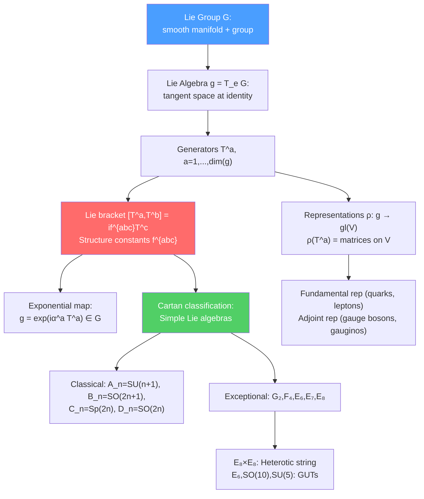

# 📐 Lie Groups and Lie Algebras

> [!abstract] TL;DR
> A **Lie group** is a smooth manifold that is also a group — symmetries that can be continuously varied ($SO(3)$, $SU(2)$, $SU(3)$, etc.). Its **Lie algebra** $\mathfrak{g}$ is the tangent space at the identity, with the Lie bracket (commutator) as the algebraic operation. Generators $T^a$ satisfy $[T^a, T^b] = if^{abc}T^c$ (structure constants). The exponential map $g = e^{i\alpha^a T^a}$ connects algebra to group. Cartan's classification identifies all simple Lie algebras: four infinite families ($A_n, B_n, C_n, D_n$) and five exceptionals ($G_2, F_4, E_6, E_7, E_8$). The $E_8\times E_8$ algebra appears in heterotic string theory; $SU(5)$ and $SO(10)$ in GUTs; root and weight systems classify representations geometrically.

## Intuition — analogy FIRST

Think of rotations in 3D. Rotating by angle $\theta$ around the $z$-axis is parameterized by a continuous parameter $\theta\in[0, 2\pi)$. You can combine rotations (group multiplication) and the combination is smooth (differentiable). The set of all 3D rotations is $SO(3)$ — a Lie group.

For very small rotations, $R(\vec\theta) \approx \mathbf{1} + i\vec\theta\cdot\vec{J}$ where $\vec{J}$ are the generators (angular momentum operators in QM). These generators form the Lie algebra $\mathfrak{so}(3)$ with commutation relations $[J^i, J^j] = i\epsilon^{ijk}J^k$. The Lie algebra captures the local structure of the group; the global topology distinguishes $SO(3)$ from $SU(2)$ (which is its double cover).

---

## How It Works

---

## Key Concepts / Details

### Undergraduate Level

**Lie Groups in Physics**

| Lie Group | Dimension | Physical Role |
|-----------|-----------|--------------|
| $\text{U}(1)$ | 1 | Electromagnetism |
| $\text{SU}(2)$ | 3 | Weak isospin |
| $\text{SU}(3)$ | 8 | QCD color |
| $\text{SU}(2)\times\text{U}(1)$ | 4 | Electroweak |
| $\text{SU}(3)\times\text{SU}(2)\times\text{U}(1)$ | 12 | Standard Model gauge group |
| $SO(3)$ | 3 | 3D rotations |
| $SO(3,1)$ | 6 | Lorentz group |
| $\text{Sp}(2n)$ | $n(2n+1)$ | Hamiltonian mechanics |
| $E_8\times E_8$ | 496 | Heterotic string gauge group |

**Lie Algebra and Structure Constants**

The **Lie algebra** $\mathfrak{g}$ of a Lie group $G$ is the tangent space at the identity $e$, equipped with the **Lie bracket** $[\cdot,\cdot]: \mathfrak{g}\times\mathfrak{g}\to\mathfrak{g}$. In a basis $\{T^a\}$:
$$[T^a, T^b] = if^{abc}T^c$$

where $f^{abc}$ are the **structure constants** (antisymmetric in $a,b$, satisfying the Jacobi identity $f^{abe}f^{ecd} + f^{bce}f^{ead} + f^{cae}f^{ebd} = 0$).

For $\mathfrak{su}(2)$: generators $T^a = \frac{1}{2}\sigma^a$ (Pauli matrices), $f^{abc} = \epsilon^{abc}$.
For $\mathfrak{su}(3)$: generators $T^a = \frac{1}{2}\lambda^a$ (Gell-Mann matrices), $f^{abc}$ the $\text{SU}(3)$ structure constants.

**The Exponential Map**

Group elements near the identity: $g = e^{i\alpha^a T^a}$ where $\alpha^a$ are real parameters. For compact groups, every element is of this form. The exponential map $\exp: \mathfrak{g}\to G$ is a local diffeomorphism.

**Representations**

A **representation** $\rho: G\to GL(V)$ assigns an invertible linear map on vector space $V$ to each group element, with $\rho(g_1 g_2) = \rho(g_1)\rho(g_2)$. Important representations:
- **Trivial:** $\rho(g) = 1$ (singlet)
- **Fundamental:** smallest faithful representation (quarks: **3** of $\text{SU}(3)$)
- **Anti-fundamental:** complex conjugate (**$\bar{3}$** of $\text{SU}(3)$)
- **Adjoint:** $\rho_{adj}(T^a)^b{}_c = -if^{abc}$ (gauge bosons: **8** of $\text{SU}(3)$)

**$\text{SU}(2)$ and Angular Momentum**

$\mathfrak{su}(2)$ has generators $J_x, J_y, J_z$ with $[J_i, J_j] = i\epsilon_{ijk}J_k$. Representations labeled by spin $j = 0, \frac{1}{2}, 1, \frac{3}{2}, \ldots$ with dimension $2j+1$.

**Clebsch-Gordan Decomposition**

Tensor product of representations: $\mathbf{j_1}\otimes\mathbf{j_2} = \bigoplus_{j=|j_1-j_2|}^{j_1+j_2}\mathbf{j}$. For $\text{SU}(3)$: $\mathbf{3}\otimes\mathbf{3} = \mathbf{6}\oplus\mathbf{\bar{3}}$, $\mathbf{3}\otimes\mathbf{\bar{3}} = \mathbf{8}\oplus\mathbf{1}$ (octet + singlet — mesons!), $\mathbf{3}\otimes\mathbf{3}\otimes\mathbf{3} = \mathbf{10}\oplus\mathbf{8}\oplus\mathbf{8}\oplus\mathbf{1}$ (decuplet + octets + singlet — baryons!).

### Graduate Level

**Cartan Subalgebra and Root Systems**

The **Cartan subalgebra** $\mathfrak{h}\subset\mathfrak{g}$ is the maximal abelian subalgebra (rank $r = \dim\mathfrak{h}$). Simultaneously diagonalizable generators $H_i$ ($i = 1,\ldots,r$) are the Cartan generators.

The remaining generators $E_\alpha$ (for root $\alpha$) satisfy:
$$[H_i, E_\alpha] = \alpha_i E_\alpha, \qquad [E_\alpha, E_{-\alpha}] = \alpha^i H_i$$

The **root system** $\Delta = \{\alpha\}$ is the set of all roots — a discrete set of vectors in $\mathbb{R}^r$ with special geometric properties (Weyl reflections, length ratios).

**Dynkin Diagrams**

Each simple Lie algebra is encoded in a **Dynkin diagram**: nodes = simple roots, lines = inner product (angle) between simple roots. The complete classification:

| Dynkin Label | Lie Algebra | Physics |
|-------------|------------|---------|
| $A_n$ | $\mathfrak{su}(n+1)$ | SM, GUTs |
| $B_n$ | $\mathfrak{so}(2n+1)$ | Spinors, SO(5) |
| $C_n$ | $\mathfrak{sp}(2n)$ | Symplectic mechanics |
| $D_n$ | $\mathfrak{so}(2n)$ | $\mathfrak{so}(10)$ GUT |
| $E_6$ | Exceptional, rank 6 | Candidate GUT group |
| $E_7$ | Exceptional, rank 7 | $\mathcal{N}=2$ SUGRA |
| $E_8$ | Exceptional, rank 8 | Heterotic string, $\mathcal{N}=8$ SUGRA |
| $F_4$ | Exceptional, rank 4 | Octonions |
| $G_2$ | Exceptional, rank 2 | $G_2$ holonomy M-theory |

**$\text{SU}(3)$ in Detail**

$\mathfrak{su}(3)$ has rank 2 (two Cartan generators $H_1 = T^3$, $H_2 = T^8$). The 6 non-zero roots form a regular hexagon in $\mathbb{R}^2$. The representation theory uses weight diagrams (points in the weight lattice):
- Fundamental **3**: weights $(1,0)$, $(-1/2, \sqrt{3}/2)$, $(-1/2,-\sqrt{3}/2)$ — quarks $u,d,s$
- Anti-fundamental **$\bar{3}$**: complex conjugate — anti-quarks
- Adjoint **8**: 6 non-zero roots + 2 zeros (gluons)

**$E_8$ and Heterotic String**

$E_8$ has rank 8, dimension 248. Its root lattice is the unique 8-dimensional even self-dual lattice $\Gamma_8$. The $E_8\times E_8$ algebra (dimension 496) is the gauge algebra of heterotic string theory.

$E_8$ contains $SO(16) \supset SO(10)\times SO(6)$ — used in GUT model building. The decomposition $\mathbf{248} = (\mathbf{78},\mathbf{1}) + (\mathbf{1},\mathbf{78}) + (\mathbf{27},\mathbf{27}) + \ldots$ under $E_8 \supset E_6\times SU(3)$ gives chiral matter in $E_6$ GUT models from heterotic compactification.

**Highest Weight Representations**

For any simple Lie algebra, irreducible representations are classified by their **highest weight** $\Lambda = \sum_i \Lambda_i\omega_i$ (Dynkin labels $\Lambda_i \in \mathbb{Z}_{\geq 0}$, $\omega_i$ fundamental weights). The **Weyl character formula** gives the character (trace of representation matrix):
$$\chi_\Lambda = \frac{\sum_{w\in W}\text{sgn}(w)e^{w(\Lambda+\rho)}}{\sum_{w\in W}\text{sgn}(w)e^{w(\rho)}}$$

where $W$ is the Weyl group and $\rho$ is the Weyl vector (half-sum of positive roots). The **Weyl dimension formula**: $\dim V_\Lambda = \prod_{\alpha>0}\frac{\langle\Lambda+\rho,\alpha\rangle}{\langle\rho,\alpha\rangle}$.

---

## Real-World Notes

- **Color confinement and $\text{SU}(3)$:** Quarks transform in the fundamental **3** of $\text{SU}(3)$; gluons in the adjoint **8**. Color singlet states (hadrons) correspond to $\text{SU}(3)$-invariant tensors: mesons $q\bar{q}$ ($\mathbf{3}\otimes\mathbf{\bar{3}} \supset \mathbf{1}$), baryons $qqq$ ($\mathbf{3}^{\otimes3} \supset \mathbf{1}$).
- **GUT symmetry breaking:** $\text{SU}(5) \supset \text{SU}(3)\times\text{SU}(2)\times\text{U}(1)$: all SM fermions of one generation fit in $\mathbf{\bar{5}} + \mathbf{10}$ of $\text{SU}(5)$. $\text{SO}(10) \supset \text{SU}(5)\times\text{U}(1)$: all SM fermions + right-handed neutrino fit in the spinorial **16** of $\text{SO}(10)$.
- **Kac-Moody algebras:** Affine extensions of simple Lie algebras (infinite-dimensional) appear in 2D CFT (WZW models) and string theory. The affine $\widehat{E}_8$ appears in the heterotic string.

---

## Common Pitfalls

- **$\text{SU}(2)$ and $\text{SO}(3)$ have the same Lie algebra but different global topology.** $\text{SU}(2) \cong S^3$ is simply connected; $\text{SO}(3) \cong \mathbb{RP}^3$ has $\pi_1 = \mathbb{Z}_2$. Spinor representations of $\text{SO}(3)$ are actually representations of $\text{SU}(2)$.
- **The adjoint representation has dimension = dim($G$).** For $\text{SU}(N)$: $\dim = N^2-1$. For $\text{SO}(N)$: $\dim = N(N-1)/2$.
- **Structure constants $f^{abc}$ depend on the basis.** Different normalizations (e.g., $\text{Tr}(T^a T^b) = \frac{1}{2}\delta^{ab}$ vs. $\delta^{ab}$) give different numerical values of $f^{abc}$.
- **Not all representations are complex.** Real (e.g., adjoint of $\text{SU}(2)$: $\mathbf{3}$), pseudo-real (e.g., fundamental of $\text{SU}(2)$: $\mathbf{2}$), and complex (e.g., fundamental of $\text{SU}(3)$: $\mathbf{3}\neq\mathbf{\bar{3}}$) representations behave differently under charge conjugation.

---

## Related Concepts

- [[Fiber_Bundles_and_Gauge_Theory]] — $G$ is the structure group of a principal bundle
- [[SUSY_Algebra_and_Superspace]] — Lie superalgebras extend Lie algebras with odd (fermionic) generators
- [[Superstring_Theory]] — $E_8\times E_8$ and $SO(32)$ as heterotic string gauge groups
- [[Conformal_Field_Theory]] — Kac-Moody algebras (affine Lie algebras) in WZW models
- [[Topology_in_Physics]] — Homotopy groups $\pi_n(G)$ classify topological defects for breaking $G\to H$
- [[_MOC_Mathematical_Physics|↑ Section MOC]]

---

## Review Questions

1. **(Undergraduate)** Define a Lie algebra. Write the commutation relations for $\mathfrak{su}(2)$ and $\mathfrak{su}(3)$. What are the structure constants in each case?
2. **(Undergraduate)** What representations of $\text{SU}(3)$ do quarks, antiquarks, and gluons transform under? Using Clebsch-Gordan, decompose $\mathbf{3}\otimes\mathbf{\bar{3}}$ and explain the physical interpretation.
3. **(Graduate)** Define the root system and Cartan subalgebra of a simple Lie algebra. Draw the root diagram for $\mathfrak{su}(3)$ and identify the simple roots, positive roots, and Cartan generators.
4. **(Graduate)** State Cartan's classification of simple Lie algebras. Why does $E_8\times E_8$ appear in heterotic string theory? What special property of the $E_8$ root lattice is responsible?

---

## Sources

- Georgi, *Lie Algebras in Particle Physics* (Westview, 2nd ed., 1999) — the physicist's reference
- Humphreys, *Introduction to Lie Algebras and Representation Theory* (Springer, 1972) — mathematical treatment
- Fuchs & Schweigert, *Symmetries, Lie Algebras and Representations* (Cambridge, 1997)
- Di Francesco, Mathieu & Sénéchal, *Conformal Field Theory* (Springer, 1997), Ch. 13–15 — Kac-Moody algebras
- Slansky, "Group theory for unified model building," *Phys. Rep.* 79, 1 (1981) — tables of representations

#physics #Lie-groups #Lie-algebras #root-systems #Dynkin-diagrams #Cartan-classification #E8 #SU3 #representation-theory
