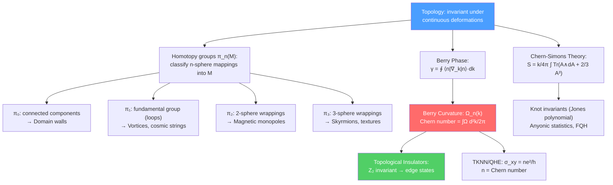

# 📐 Topology in Physics

> [!abstract] TL;DR
> Topology classifies properties of physical systems that are invariant under continuous deformations — no smooth deformation can change the topological class, making topological quantities robust and quantized. **Homotopy groups** $\pi_n(M)$ classify topological defects: $\pi_0$ (domain walls), $\pi_1$ (vortices/strings), $\pi_2$ (monopoles), $\pi_3$ (textures/Skyrmions). **Topological insulators** have a bulk $\mathbb{Z}_2$ invariant (from Chern number / Berry phase of filled bands) that guarantees gapless edge states. The **Berry phase** $\gamma = \oint\langle n|\nabla_k|n\rangle\cdot dk$ is a geometric phase with topological character. **Chern-Simons theory** is a topological QFT whose observables are knot invariants (Jones polynomial), with applications to the fractional quantum Hall effect and anyon statistics.

## Intuition — analogy FIRST

A coffee cup and a donut are topologically equivalent — one can be continuously deformed into the other (both have one hole). But neither can be deformed into a sphere (no holes). The number of holes (genus) is a topological invariant — it cannot change under continuous deformations.

In physics, the "holes" are replaced by conserved topological charges. A magnetic monopole carries a topological charge $n_m = \int B\cdot dS/(4\pi) \in \mathbb{Z}$ that counts how many times the magnetic field "wraps" around the sphere at infinity. No smooth field configuration can change this wrapping number — monopoles are topologically stable. This is what makes topological phases robust to perturbations: the protected property is not a symmetry charge but a topological invariant.

---

## How It Works

---

## Key Concepts / Details

### Undergraduate Level

**What is Topology?**

Topology studies properties preserved under continuous deformations (homeomorphisms). Two spaces are homeomorphic if one can be continuously deformed into the other without tearing or gluing. Topological invariants (Euler characteristic, fundamental group, Chern number) do not change under such deformations.

Key examples in physics:
- Sphere $S^2$: $\pi_1 = 0$ (simply connected), $\pi_2 = \mathbb{Z}$
- Torus $T^2$: $\pi_1 = \mathbb{Z}\times\mathbb{Z}$ (loops winding around each circle)
- $\text{SU}(2) \cong S^3$: $\pi_3(S^3) = \mathbb{Z}$ (Hopf fibration)

**Homotopy Groups and Topological Defects**

When a symmetry group $G$ breaks to a subgroup $H$, the order parameter lives in the coset space $G/H$. Topological defects are classified by $\pi_n(G/H)$:

| Homotopy Group | Topological Defect | Example |
|---------------|--------------------|---------|
| $\pi_0(G/H)$ | Domain walls (2D) | Ising model, axion domain walls |
| $\pi_1(G/H)$ | Vortices/cosmic strings (1D) | Abrikosov vortices: $\pi_1(\text{U}(1)) = \mathbb{Z}$ |
| $\pi_2(G/H)$ | Magnetic monopoles (0D) | 't Hooft-Polyakov: $\pi_2(\text{SU}(2)/\text{U}(1)) = \mathbb{Z}$ |
| $\pi_3(G/H)$ | Skyrmions/textures | Nuclear Skyrmion: $\pi_3(S^3) = \mathbb{Z}$ |

**Abrikosov Vortices**

In a superconductor, the order parameter $\psi = |\psi|e^{i\theta}$. For a vortex, $\theta$ winds by $2\pi n$ around the vortex core:
$$\oint\nabla\theta\cdot d\vec{l} = 2\pi n$$

The magnetic flux is quantized: $\Phi = n\Phi_0$ where $\Phi_0 = h/2e$ (the flux quantum). This follows from $\pi_1(\text{U}(1)) = \mathbb{Z}$.

**Magnetic Monopoles**

For a gauge theory with gauge group $G$ broken to $H$: monopoles exist if $\pi_2(G/H) \neq 0$. For $G = \text{SU}(2)$, $H = \text{U}(1)$: $\pi_2(\text{SU}(2)/\text{U}(1)) = \pi_2(S^2) = \mathbb{Z}$ — monopoles with integer magnetic charge exist.

**Skyrmions**

A Skyrmion is a topological soliton in theories where the field $U(x)$ maps $S^3_{\text{space}} \to S^3_G = \text{SU}(2)$. The topological charge:
$$B = \frac{1}{24\pi^2}\int\epsilon^{ijk}\text{Tr}(U^\dagger\partial_i U\,U^\dagger\partial_j U\,U^\dagger\partial_k U)\,d^3x \in \mathbb{Z}$$

is the baryon number in the Skyrme model of nuclear physics. Skyrmions with $B=1$ are used as models for protons and neutrons.

### Graduate Level

**Berry Phase and Berry Curvature**

Consider a quantum system with Hamiltonian $H(\vec{k})$ depending on parameters $\vec{k}$ (e.g., crystal momentum). For the $n$-th eigenstate $|n,\vec{k}\rangle$, the **Berry connection** (a gauge potential in parameter space):
$$\mathcal{A}_n^i(\vec{k}) = i\langle n,\vec{k}|\partial_{k^i}|n,\vec{k}\rangle$$

The **Berry phase** accumulated as $\vec{k}$ traverses a closed loop $C$:
$$\gamma_n = \oint_C\mathcal{A}_n\cdot d\vec{k}$$

is gauge-invariant (up to $2\pi\mathbb{Z}$) and has observable consequences (Aharonov-Bohm type effect in parameter space).

The **Berry curvature** (field strength of $\mathcal{A}_n$):
$$\Omega_n^{ij}(\vec{k}) = \partial_{k^i}\mathcal{A}_n^j - \partial_{k^j}\mathcal{A}_n^i$$

In 2D: $\Omega_n(\vec{k}) = -2\,\text{Im}\sum_{m\neq n}\frac{\langle n|\partial_{k_x}H|m\rangle\langle m|\partial_{k_y}H|n\rangle}{(E_n-E_m)^2}$

**Chern Number and Quantum Hall Effect**

The first **Chern number** (TKNN invariant) of the $n$-th band:
$$C_n = \frac{1}{2\pi}\int_{BZ}\Omega_n(\vec{k})\,d^2k \in \mathbb{Z}$$

The Hall conductivity:
$$\sigma_{xy} = \frac{e^2}{h}\sum_{\text{filled bands}}C_n$$

This is the **TKNN formula** (Thouless-Kohmoto-Nightingale-den Nijs, 1982): the Hall conductance is quantized in units of $e^2/h$, robust against disorder, because it is a topological invariant. Each filled band contributes its Chern number to $\sigma_{xy}$.

**$\mathbb{Z}_2$ Topological Insulators**

Time-reversal invariant systems (with $T^2 = -1$ for spin-1/2 particles) have a $\mathbb{Z}_2$ topological invariant $\nu \in \{0, 1\}$:
- $\nu = 0$: trivial insulator (no edge states)
- $\nu = 1$: topological insulator (gapless edge states protected by time-reversal symmetry)

In 3D: four $\mathbb{Z}_2$ invariants $(\nu_0;\nu_1,\nu_2,\nu_3)$. "Strong" topological insulators ($\nu_0 = 1$) have an odd number of Dirac cones on each surface — protected against backscattering.

Physical examples: HgTe/CdTe quantum wells (2D TI, 2007), $\text{Bi}_2\text{Se}_3$, $\text{Bi}_2\text{Te}_3$ (3D TI). The surface states are helical: spin-momentum locked, protected by time-reversal.

**Bulk-Boundary Correspondence**

A central principle: the topological invariant of the bulk determines the number of gapless boundary modes:
$$\text{Number of edge modes} = |C_n|$$

(For QHE: $n$ filled Landau levels → $n$ chiral edge modes.)

This correspondence is robust: you cannot gap out the edge states without closing the bulk gap or breaking the protecting symmetry. It is the key principle underlying all topological phases of matter.

**Chern-Simons Theory**

The Chern-Simons action in 3D:
$$S_{CS}[A] = \frac{k}{4\pi}\int_M\text{Tr}\left(A\wedge dA + \frac{2}{3}A\wedge A\wedge A\right)$$

is a topological QFT: it requires no metric ($\sqrt{g}$ is absent) and is invariant under diffeomorphisms. Properties:
- The equations of motion: $F_{\mu\nu} = 0$ (flat connections on $M$)
- The partition function $Z(M)$ depends only on the topology of $M$
- Wilson loop expectation values = knot invariants (Jones polynomial for $k=1$ $\text{SU}(2)$ CS)
- Ground state degeneracy = $k+1$ on the torus (for $\text{U}(1)$ at level $k$)

**Fractional Quantum Hall and Anyons**

At filling fraction $\nu = 1/m$ ($m$ odd), the FQH state is described by $\text{U}(1)$ CS at level $k=m$:
$$S = \frac{m}{4\pi}\int a\wedge da + \frac{1}{2\pi}\int A\wedge da$$

The quasi-particles carry fractional charge $e^* = e/m$ and **anyonic statistics**: exchanging two quasiparticles gives a phase $e^{i\pi/m}$ (not $+1$ or $-1$ as for bosons/fermions). Non-abelian anyons ($m=5/2$ FQH) are candidates for topological quantum computing.

**Linking and Winding Numbers**

The **linking number** of two closed curves $C_1$, $C_2$ in $\mathbb{R}^3$:
$$\text{Link}(C_1,C_2) = \frac{1}{4\pi}\oint_{C_1}\oint_{C_2}\frac{(\vec{r}_1-\vec{r}_2)\cdot(d\vec{r}_1\times d\vec{r}_2)}{|\vec{r}_1-\vec{r}_2|^3} \in \mathbb{Z}$$

(Gauss linking integral). In Chern-Simons theory, $\langle W(C_1)W(C_2)\rangle$ computes the linking number.

**Hopf Fibration $S^3\to S^2$**

The Hopf fibration: $S^3$ fibers over $S^2$ with fiber $S^1$. In physics: the unit quaternion $q\in S^3$ maps to the unit vector $\hat{n} = q\hat{k}q^{-1}\in S^2$ (a point on the 2-sphere of spin orientations). The Hopf invariant classifies maps $S^3\to S^2$: $\pi_3(S^2) = \mathbb{Z}$.

---

## Real-World Notes

- **Experimental topological insulators:** ARPES (angle-resolved photoemission) directly images the surface Dirac cone of $\text{Bi}_2\text{Se}_3$ — the "smoking gun" of a 3D TI.
- **Topological superconductors:** Majorana zero modes at vortex cores or wire ends in topological superconductors are non-abelian anyons. Microsoft's topological qubit program is based on braiding Majorana fermions for fault-tolerant quantum computing.
- **Axion domain walls and cosmology:** If the PQ symmetry breaks after inflation, the axion field takes different values in different Hubble patches, separated by domain walls (classified by $\pi_0$). Domain wall networks are a cosmological problem — solved if PQ breaks before inflation.

---

## Common Pitfalls

- **Topological protection requires a symmetry or energy gap.** Edge states are protected by the bulk gap + the protecting symmetry (time-reversal for TI, charge conservation for QH). Breaking the protecting symmetry gaps out the edge states.
- **$\pi_n(M) \neq H_n(M)$ in general.** The Hurewicz theorem relates them only for simply connected spaces and low $n$. In general, homotopy and homology groups are independent.
- **Chern numbers require filled bands.** The TKNN formula applies to insulating states (filled bands). Metals have partially filled bands; Chern number is not well-defined without a gap.
- **Anyons exist only in 2+1D.** In 3+1D, the exchange of particles (around a loop) is contractible and gives $\pm 1$ (boson/fermion). In 2+1D, the braid group is non-trivial → anyons.

---

## Related Concepts

- [[Differential_Geometry]] — de Rham cohomology and differential forms underlie characteristic classes
- [[Fiber_Bundles_and_Gauge_Theory]] — Berry connection = connection on the Berry bundle; Chern classes
- [[Lie_Groups_and_Lie_Algebras]] — $\pi_n(G)$ classifies defects in $G$-symmetric theories
- [[Conformal_Field_Theory]] — Chern-Simons theory is related to 2D CFT (WZW models) by holography
- [[Integrable_Systems]] — Topological charges in integrable soliton systems
- [[_MOC_Mathematical_Physics|↑ Section MOC]]

---

## Review Questions

1. **(Undergraduate)** Define the fundamental homotopy group $\pi_1(M)$. Compute $\pi_1(\text{U}(1))$. How does this classify vortices in a superfluid?
2. **(Undergraduate)** What is the Berry phase? Give an example of a physical system where it is observable. Why is it a topological quantity?
3. **(Graduate)** Define the Chern number of an energy band. State the TKNN formula and explain why the quantum Hall conductance is quantized and robust against disorder.
4. **(Graduate)** Describe Chern-Simons theory in 3D. What is the meaning of the level $k$? How does the theory compute knot invariants, and what is the physical interpretation of the Wilson loop observable?

---

## Sources

- Nakahara, *Geometry, Topology and Physics* (IOP, 2003), Ch. 4–5 — homotopy and homology
- Thouless, Kohmoto, Nightingale & den Nijs, "Quantized Hall conductance in a two-dimensional periodic potential," *Phys. Rev. Lett.* 49, 405 (1982)
- Hasan & Kane, "Colloquium: Topological insulators," *Rev. Mod. Phys.* 82, 3045 (2010), arXiv:0902.3537
- Witten, "Quantum field theory and the Jones polynomial," *Commun. Math. Phys.* 121, 351 (1989)
- Bernevig & Hughes, *Topological Insulators and Topological Superconductors* (Princeton, 2013)

#physics #topology #homotopy-groups #Berry-phase #Chern-number #topological-insulators #Chern-Simons #anyons #Skyrmions #domain-walls
