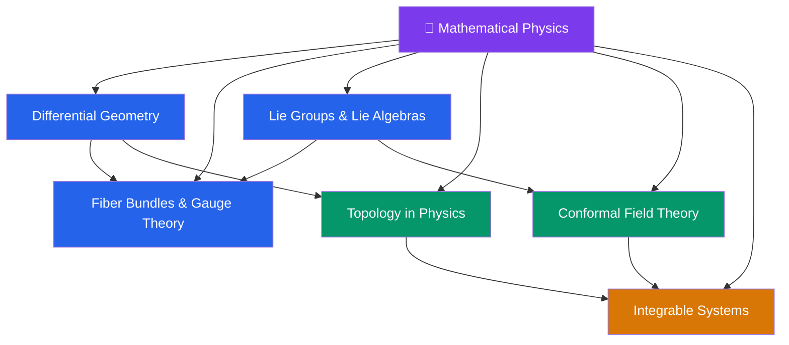

# 📐 Mathematical Physics — Section Map

> [!abstract] About This Section
> Mathematical physics provides the geometric and algebraic framework underlying modern theoretical physics. This section covers differential geometry (manifolds, connections, curvature — the language of GR), fiber bundles and gauge theory (the geometric foundation of the SM and SUSY), Lie groups and algebras (the symmetry language of particle physics), topology in physics (topological defects, insulators, and invariants), conformal field theory (CFT — exact solvability and universality in 2D and the foundation of string theory), and integrable systems (exact solutions via Lax pairs, Bethe ansatz, and the Yang-Baxter equation). Together these form the mathematical spine of the Physics vault.

## Section Architecture

## Notes in This Section

| Note | Core Topic | Level |
|------|-----------|-------|
| [[Differential_Geometry]] | Manifolds, connections, curvature, differential forms, de Rham cohomology | UG → PhD |
| [[Fiber_Bundles_and_Gauge_Theory]] | Principal bundles, connections, characteristic classes, holonomy | UG → PhD |
| [[Lie_Groups_and_Lie_Algebras]] | Lie groups, structure constants, root/weight systems, Cartan classification | UG → PhD |
| [[Topology_in_Physics]] | Homotopy groups, topological defects, Berry phase, Chern-Simons theory | UG → PhD |
| [[Conformal_Field_Theory]] | Conformal group, primary operators, OPE, Virasoro algebra, bootstrap | UG → PhD |
| [[Integrable_Systems]] | Solitons, KdV, Lax pairs, Bethe ansatz, Yang-Baxter equation | UG → PhD |

## Recommended Learning Path

1. [[Lie_Groups_and_Lie_Algebras]] — symmetry language used in all other notes
2. [[Differential_Geometry]] — manifolds and curvature: foundation of GR and gauge theory
3. [[Fiber_Bundles_and_Gauge_Theory]] — unify differential geometry + Lie groups → gauge theory
4. [[Topology_in_Physics]] — global aspects: topological defects, Berry phase, TQFTs
5. [[Conformal_Field_Theory]] — exact 2D solvability, string theory worldsheet, critical phenomena
6. [[Integrable_Systems]] — exact solutions of non-linear systems; connects to CFT and AdS/CFT

## Cross-Section Links

- [[_MOC_Relativity]] (Section 06) — differential geometry is the language of GR
- [[_MOC_Condensed_Matter_and_Advanced]] (Section 08) — topology in physics: topological insulators, Berry phase, Chern numbers
- [[_MOC_SUSY_Supergravity]] (Section 13) — Kähler geometry, Lie superalgebras, spinors
- [[_MOC_String_Theory]] (Section 14) — CFT is the worldsheet theory; Calabi-Yau geometry; Lie groups for gauge groups
- [[_MOC_Physics_Master|↑ Physics Master MOC]]

#MOC #physics #mathematical-physics #section-moc
