# ⚛️ Physics — Master Map of Content

> [!abstract] About This Vault
> A comprehensive physics reference spanning **senior secondary through PhD level** — **~120 notes across 15 sections**. Every note opens with an everyday analogy accessible to a secondary student, builds through undergraduate derivations and vector/calculus treatment, and reaches graduate formalism, research connections, and open problems. Sections cover Classical Mechanics, Electromagnetism, Thermodynamics & Statistical Mechanics, Waves & Optics, Quantum Mechanics, Special & General Relativity, Nuclear & Particle Physics, Condensed Matter & Advanced Topics, Mathematical Methods, Fluid Mechanics, Atomic/Molecular/Optical Physics, Advanced Quantum Field Theory, Supersymmetry & Supergravity, String Theory, and Mathematical Physics. Each note pairs physical intuition with rigorous mathematics, real-world applications, and review questions at multiple levels.

## Vault Architecture

```mermaid
graph TD
    Master["⚛️ Physics Master"]

    %% Foundations — Blue (01-04)
    Master --> S01["01 Classical Mechanics"]
    Master --> S02["02 Electromagnetism"]
    Master --> S03["03 Thermo & Stat Mech"]
    Master --> S04["04 Waves & Optics"]

    %% Quantum & Modern — Green (05-06)
    Master --> S05["05 Quantum Mechanics"]
    Master --> S06["06 Special & General Relativity"]

    %% Advanced Core — Orange (07-08)
    Master --> S07["07 Nuclear & Particle Physics"]
    Master --> S08["08 Condensed Matter & Advanced"]

    %% Applied & Methods — Purple (09-12)
    Master --> S09["09 Mathematical Methods"]
    Master --> S10["10 Fluid Mechanics"]
    Master --> S11["11 AMO Physics"]
    Master --> S12["12 Advanced QFT"]

    %% Frontier — Red (13-15)
    Master --> S13["13 SUSY & Supergravity"]
    Master --> S14["14 String Theory"]
    Master --> S15["15 Mathematical Physics"]

    style Master fill:#7c3aed,color:#fff
    style S01 fill:#2563eb,color:#fff
    style S02 fill:#2563eb,color:#fff
    style S03 fill:#2563eb,color:#fff
    style S04 fill:#2563eb,color:#fff
    style S05 fill:#059669,color:#fff
    style S06 fill:#059669,color:#fff
    style S07 fill:#d97706,color:#fff
    style S08 fill:#d97706,color:#fff
    style S09 fill:#7c3aed,color:#fff
    style S10 fill:#7c3aed,color:#fff
    style S11 fill:#7c3aed,color:#fff
    style S12 fill:#7c3aed,color:#fff
    style S13 fill:#dc2626,color:#fff
    style S14 fill:#dc2626,color:#fff
    style S15 fill:#dc2626,color:#fff
```

## Sections at a Glance

| # | Section | Notes | Entry Point | Level Range |
|---|---------|-------|-------------|-------------|
| 01 | Classical Mechanics | 6 | [[_MOC_Classical_Mechanics]] | Secondary → PhD |
| 02 | Electromagnetism | 6 | [[_MOC_Electromagnetism]] | Secondary → PhD |
| 03 | Thermodynamics & Statistical Mechanics | 6 | [[_MOC_Thermodynamics]] | Secondary → PhD |
| 04 | Waves & Optics | 6 | [[_MOC_Waves_and_Optics]] | Secondary → PhD |
| 05 | Quantum Mechanics | 6 | [[_MOC_Quantum_Mechanics]] | Secondary → PhD |
| 06 | Special & General Relativity | 6 | [[_MOC_Relativity]] | Secondary → PhD |
| 07 | Nuclear & Particle Physics | 6 | [[_MOC_Nuclear_Particle]] | Undergraduate → PhD |
| 08 | Condensed Matter & Advanced | 6 | [[_MOC_Condensed_Matter]] | Undergraduate → PhD |
| 09 | Mathematical Methods | 7 | [[_MOC_Mathematical_Methods]] | Undergraduate → PhD |
| 10 | Fluid Mechanics | 6 | [[_MOC_Fluid_Mechanics]] | Undergraduate → PhD |
| 11 | Atomic, Molecular & Optical Physics | 6 | [[_MOC_AMO_Physics]] | Undergraduate → PhD |
| 12 | Advanced Quantum Field Theory | 6 | [[_MOC_Advanced_QFT]] | Graduate → PhD |
| 13 | Supersymmetry & Supergravity | 6 | [[_MOC_SUSY_Supergravity]] | Graduate → PhD |
| 14 | String Theory | 6 | [[_MOC_String_Theory]] | Graduate → PhD |
| 15 | Mathematical Physics | 6 | [[_MOC_Mathematical_Physics]] | Graduate → PhD |

---

## Learning Paths

### Path 1 — Senior Secondary Student

> Best for: students in senior secondary (grades 11–12) preparing for university entrance or wanting to go beyond the curriculum.

**Classical Mechanics → Electromagnetism → Waves & Optics (secondary sections only)**

[[Newtons_Laws_and_Kinematics]] (secondary level) → [[Work_Energy_and_Conservation]] → [[Rotational_Dynamics]] → [[Electric_Fields_and_Coulombs_Law]] → [[Gauss_Law_and_Electric_Potential]] → [[Faradays_Law_and_Induction]] → [[Wave_Motion_and_Properties]] → [[Interference_and_Diffraction]] → [[Photoelectric_Effect_and_Compton]] → [[Atomic_Models_and_Spectroscopy]]

---

### Path 2 — Physics Undergraduate

> Best for: students in a BSc/BTech physics or engineering physics program working through the full curriculum.

**Full coverage of sections 01–04 at undergraduate depth, then sections 05–06**

[[_MOC_Classical_Mechanics]] → [[Lagrangian_Mechanics]] → [[Hamiltonian_Mechanics]] → [[_MOC_Electromagnetism]] → [[Maxwells_Equations]] → [[Electromagnetic_Waves_and_Radiation]] → [[_MOC_Thermodynamics]] → [[Classical_Statistical_Mechanics]] → [[Quantum_Statistical_Mechanics]] → [[_MOC_Waves_and_Optics]] → [[_MOC_Quantum_Mechanics]] → [[_MOC_Relativity]]

---

### Path 3 — Graduate Student / PhD

> Best for: students at MSc/PhD level preparing for qualifying exams or deepening research foundations.

**Focus on advanced subsections across all areas**

[[Hamiltonian_Mechanics]] (Hamilton-Jacobi, symplectic geometry) → [[Maxwells_Equations]] (covariant $F^{\mu\nu}$ formulation) → [[Classical_Statistical_Mechanics]] (fluctuations, cluster expansions) → [[Quantum_Statistical_Mechanics]] (Bose-Einstein condensation, Debye model) → [[Polarization_and_Dispersion]] (Kramers-Kronig, nonlinear optics) → [[_MOC_Quantum_Mechanics]] → [[_MOC_Relativity]] → [[_MOC_Condensed_Matter]] → [[_MOC_Nuclear_Particle]] → [[Path_Integral_Formulation]] → [[Renormalization_and_RG]] → [[Non_Abelian_Gauge_Theories]] → [[Anomalies_in_QFT]]

---

### Path 4 — Applied Physicist / Engineer

> Best for: engineers who need physical intuition and quantitative tools for applications in technology, materials, and electronics.

**Mechanics + E&M + Waves + Selected Quantum**

[[Newtons_Laws_and_Kinematics]] → [[Work_Energy_and_Conservation]] → [[Oscillations_and_SHM]] → [[Electric_Fields_and_Coulombs_Law]] → [[Magnetism_and_Biot_Savart]] → [[Maxwells_Equations]] → [[Electromagnetic_Waves_and_Radiation]] → [[Wave_Motion_and_Properties]] → [[Interference_and_Diffraction]] → [[Geometric_and_Wave_Optics]] → [[Photoelectric_Effect_and_Compton]]

---

### Path 5 — Theoretical Physics Frontier

> Best for: PhD students and researchers entering theoretical high-energy physics, string theory, or mathematical physics.

**Advanced QFT → SUSY → String Theory → Mathematical Physics**

[[Path_Integral_Formulation]] → [[Renormalization_and_RG]] → [[Non_Abelian_Gauge_Theories]] → [[Spontaneous_Symmetry_Breaking]] → [[Anomalies_in_QFT]] → [[Effective_Field_Theories]] → [[SUSY_Algebra_and_Superspace]] → [[SUSY_Lagrangians]] → [[SUSY_Breaking]] → [[MSSM_and_Phenomenology]] → [[Supergravity]] → [[BPS_States_and_Dualities]] → [[Bosonic_String_Theory]] → [[Superstring_Theory]] → [[D_Branes]] → [[M_Theory_and_Dualities]] → [[AdS_CFT_Correspondence]] → [[String_Cosmology_and_Landscape]]

---

### Path 6 — Mathematical Physics & Geometry

> Best for: graduate students interested in the mathematical structures underlying modern physics — geometry, topology, symmetry, and exact methods.

**Geometry + Symmetry + Topology + Exact Methods**

[[Lie_Groups_and_Lie_Algebras]] → [[Differential_Geometry]] → [[Fiber_Bundles_and_Gauge_Theory]] → [[Topology_in_Physics]] → [[Conformal_Field_Theory]] → [[Integrable_Systems]] → [[BPS_States_and_Dualities]] → [[AdS_CFT_Correspondence]]

---

## Cross-Vault Links

Physics underpins and connects to every quantitative field in this knowledge ecosystem:

- **AI/ML vault** — [[_MOC_AI_ML_Master]]: statistical mechanics is the conceptual foundation of energy-based models, Boltzmann machines, and the free energy principle in deep learning.
- **System Design vault** — [[_MOC_SystemDesign_Master]]: semiconductor physics (band theory from [[_MOC_Condensed_Matter]]) underpins every transistor and memory technology that system design relies on.
- **Database vault** — [[_MOC_Database_Master]]: statistical methods in [[Classical_Statistical_Mechanics]] (partition functions, fluctuations) parallel the probabilistic query optimization techniques in modern database systems.

---

## Section MOC Index

- [[_MOC_Classical_Mechanics]] — Newton to Lagrange to Hamilton: kinematics, energy, rotation, oscillations, and the variational formulation of mechanics.
- [[_MOC_Electromagnetism]] — From Coulomb's law to Maxwell's equations: electric fields, magnetic fields, induction, and electromagnetic radiation.
- [[_MOC_Thermodynamics]] — Heat, entropy, and statistical mechanics: the four laws, kinetic theory, free energies, and quantum distributions.
- [[_MOC_Waves_and_Optics]] — Wave physics end to end: mechanical waves, interference, diffraction, optics, polarization, and the quantum origins of light-matter interaction.
- [[_MOC_Quantum_Mechanics]] — The quantum revolution: wavefunctions, operators, the Schrödinger equation, spin, perturbation theory, and identical particles.
- [[_MOC_Relativity]] — Einstein's revolutions: special relativity, spacetime geometry, and an introduction to general relativity and curved spacetime.
- [[_MOC_Nuclear_Particle]] — The subatomic world: nuclear structure, radioactivity, the Standard Model, and particle physics fundamentals.
- [[_MOC_Condensed_Matter]] — Matter in bulk: band theory, semiconductors, superconductivity, magnetism, and topological phases.
- [[_MOC_Mathematical_Methods]] — Essential mathematical tools: ODEs, PDEs, complex analysis, Fourier transforms, special functions, and Green's functions.
- [[_MOC_Fluid_Mechanics]] — Fluid dynamics from first principles: Euler and Navier-Stokes equations, turbulence, acoustics, and magnetohydrodynamics.
- [[_MOC_AMO_Physics]] — Atomic, molecular, and optical physics: atomic structure, molecular bonding, spectroscopy, laser physics, laser cooling, and quantum optics.
- [[_MOC_Advanced_QFT]] — Quantum field theory at the research frontier: path integrals, renormalization group, non-abelian gauge theories, spontaneous symmetry breaking, anomalies, and effective field theories.
- [[_MOC_SUSY_Supergravity]] — Supersymmetry and supergravity: SUSY algebra, superspace, SUSY Lagrangians, SUSY breaking, the MSSM, supergravity, and BPS states with dualities.
- [[_MOC_String_Theory]] — String theory: bosonic and superstring quantization, D-branes, M-theory and the duality web, AdS/CFT, and string cosmology.
- [[_MOC_Mathematical_Physics]] — Mathematical physics: differential geometry, fiber bundles, Lie groups, topology, conformal field theory, and integrable systems.

#MOC #Physics #MasterMOC
